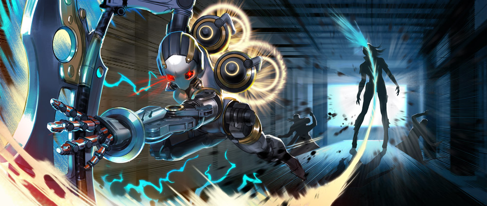

# The Stormguard Saga

## 'KESTREL'S TEST'

No one has ever rebuilt the overgrown Old Quarter, where the stink of magic lingers in the destroyed buildings. The children dare one another to touch those still-crackling buildings for the shock. That shock was Kestrel’s first memory.

She wasn’t Kestrel then, but the name her parents gave her is classified.

Kestrel knew about the war, though she hadn’t been born yet, and she knew about the Storm Queen, who lived far away in Mont Lille. She knew never to bother the border guards, who the locals called blancorojos. She learned the rolling, throaty language of Mont Lille alongside her family’s dialect. She saluted the queen’s flag every morning at school. Every child had to take the queen’s aptitude tests; teachers and parents drilled them in mathematics, languages and geography for weeks preceding the test. Taxes were light on families whose children were chosen.

At six years of age, Kestrel took the first battery of tests: analogies, number series, mirroring patterns of blocks and solving puzzles. She did well. She loved the smell of pencil shavings and her examiner’s smart white lab coat trimmed with red. She loved how numbers fell into neat patterns, and she spoke Lilliaise with an adorable accent.

For the last test, the examiner placed a combination of black and white boxes before her with a candy under one. Kestrel’s task was to guess if it was under a black or a white box. At first, there were nine white boxes and one black box. She picked white and collected her candy. The next round, there were seven black boxes and three white ones. She picked black and earned more candy. Her cheeks were stuffed with candies after a few rounds of disproportionate numbers of one color box, then: betrayal. There were six white boxes, but the candy was under one of the four black ones.

Kestrel had never before doubted herself.

The examiner set out the boxes again: five of each.

“Choose,” she said.

“No.”

“Don’t you want the candy?”

“Yes.”

“Then, choose.”

“No.”

“Why not?”

“I don’t know where it is.”

“The test requires you to choose.”

“No.”

The examiner bent double so that she’d be at eye level with the little girl. Her voice was kind. “There is no punishment for guessing wrong, and a candy if you guess right. You must choose.”

“No.”

“The queen requires you to choose.”

“No.”

“Very well.” The examiner straightened and produced a stick the length of her arm. “If you do not choose, you will be struck on your palms.”

Kestrel looked straight ahead with her palms up while the stick smacked into them, remembering the surprising pain of the magic shock she’d given herself in the Old Quarter, how it had lessened into mild tingling after a time. The stick did not hurt that much.

She did not cry, and she did not choose.

The next day, two _blancorojos_ came to her home. Kestrel escaped out the back and climbed a walnut tree, armed with a slingshot and enough underripe ammo to make a grand nuisance should her father seek to punish her for failing the test of the boxes. Instead, her parents coaxed her down with tears and kisses, for she had been called to continue her education in Mont Lille. Her parents had one hour to say goodbye.

## ‘CATHERINE’S MISSION’

The Storm Queen sat sideways on Catherine’s lounge chair, her legs slung over one arm, cloaked and hooded, a raven perched on her shoulder. With no lamps lit, the intruder was invisible in the windowless living quarters. Catherine was not a fan of extra entryways, yet the queen had made her way past the reinforced and locked front door. The queen swung her legs forward and lit the nearest lamp. The raven adjusted its feet but remained in place. “They are nearby. I assume this room is secure?”

“I thought so, yet here you are.”

The queen half-smiled. “You will assemble the Stormguard tonight.”

Catherine sheathed the sword she had been gripping with both fists since first entering her apartment. “Who is the target?”

“Targets. Twin targets, with remarkable magical abilities. You’ll remember their mother, my sister, Julia.”

“Your sister? She’s been dead for years.”

“So she would have us believe. Our spies have found her in southern Gythia.”

“That is tech territory now.”

“A hive of soulless machines and their engineers. Julia has made an alliance with them, hoping to supplant me. She’s even married one of their technologists and made some babies. Isn’t that sweet?”

“Twin babies?”

“Indeed. You will bring them to me so they can be trained.”

“Why is the traitor not a target?”

The queen stood, and the dim light seeped up into her hood, showing the stitches that crossed over the flesh where her eyes had been. They had been removed at birth, in the way of storm mages. “There are laws against royal murder, no matter how justified.” She stroked Catherine’s cheek with the back of her icy hand as she spoke, as if in lullabye. “I should execute you where you stand for suggesting it.”

It was said that evil doles out affection in tiny droplets, yet Catherine could not help her desperate thirst. In a frustrated whisper she said, “So, we take the children and leave their mother to plot your murder? Your sister will seek revenge. She will enlist the Gythians to help her if you do this thing.”

“Let us hope you are right. The Stormguard has never been stronger, and the Gythians are stretched thin fending off the technologists.”

“You wish for war again, my queen?”

“No, Catherine. I do not wish for war. I make it.” The queen’s hand dropped. “Now is the time. Now, while the technologists are a disjointed army of gadgets, while Gythia is an elderly collection of has-beens with shiny trinkets. They are a decade away from readiness and nothing without their toddling prodigies.”

Catherine stared into the raven’s eyes as she spoke. “As you will, my queen.”

“They have made their home in the farms northwest of Pompium. Vyn will accompany you.” Only then did the raven, the queen’s eyes and ears, move; with a quiet flap of its dark wings, it leapt from the queen’s shoulder to Catherine’s.

Catherine resisted the urge to shrug away the bird. “Yes, my queen.”

“I expect obedience.”

## ‘WHAT MUST BE DONE’

A single candle on the table at the back of the tavern flickered a light too weak to penetrate the heavy hood of a woman sitting alone, staring at the leaves swirling in her steaming cup of tea. She’d been sheltered all her young life from the roving bands of people whose old women wore clattering bangles up their arms and read the futures of gullible customers in tea leaves.

Despite her thorough education, Julia would have paid well, in that moment, for such a service.

Every head turned when Catherine entered. The red and white uniform was gone, but her drab hooded cloak failed to remove the disquieting sensation that a predator had stepped into the room. That heavy feeling did not waver despite the smile Catherine offered to Julia as she threaded through the tables to Julia’s booth, sweeping off her cloak to reveal a well-fitted dress true to the local style.

The serving-boy’s words stumbled like pebbles rolling downhill: “Good.. good even… how can I… would you like some… what can I…?”

Catherine stared the boy down, allowing him to stutter until he had found the end of a sentence. “Wine,” she said, a smile playing at one corner of her mouth.

“Right away… and you, ma’am? Can I get you more tea? Hey, aren’t you Jul…”

Catherine stepped close, one fingertip on the boy’s chin, turning his eyes back to her. “Red wine,” she murmured.

Julia exhaled a breath she hadn’t known she was holding as the serving-boy tripped away. “Oh great subterfuge, Cath. Let’s please be as memorable to our fellow patrons as much as possible.”

Catherine scoffed, feigning hurt. “You are so unkind. I am quite proud of my disguise. And look– buttons!” She winked, spreading her arms.

Julia laughed, but the sound was brittle, fighting not to become a sob. “Your disguise is as subtle as a hat on a tiger.”

Neither woman spoke while the wine was poured. Only after did Catherine lean forward in earnest. “She wants the twins, Lia, and you alive to make war before you can win it.”

Julia lifted her chin. “Gythia will aid me.”

Catherine shook her head. “Perhaps. Someday, if the time were right. But the Stormguard ishere today. I couldn’t send word; I had Vyn on my shoulder the whole journey. He watches your family now.” Catherine clasped Julia’s shaking hand in hers. “This mission is happening tonight. The twins will come back with me to Mont Lille.”

Julia jerked her hand away and looked up at a cobwebby corner of the tavern. “No.”

Catherine’s spine straightened. “You know I would have it any other way if it could be. But you do not have a choice in this. I give my word, Lia, I will watch overthem.”

“No!” Julia insisted. “My sister would make a tyrant of Celeste in her image, and you could not stop her.”

Catherine opened her callused palms. “So? What do you propose? You and Ardan cannot defeat the Stormguard tonight, not even with my help. Those not surrounding your farm have barricaded every road out of Pompium. Once we have completed our mission, we will disappear. Lia. Your only option is to trust me.”

“The way my sister trusts you?”

Catherine’s eyes narrowed. “You and I have been friends since we were children.”

“We were all three friends when we were children.” A long silence once again wedged itself between them. At length, Julia sighed. “I will warn Ardan that the Stormguard may be closeby. The children will go about their routine as usual; nothing will seem amiss from the outside. I will help Ardan escape with the twins when you attack.”

“There is no escape through the Stormguard.”

“There is one way. A mage is never more powerful than at the time of death. When you take my life, I will pass my gift to him. He will make it through.”

Catherine gripped her wine glass, her voice cold as frost. “I will not do this.”

“Make a show of it. Create a diversion.”

Catherine’s eyes sparkled wet, her teeth clenched. “Icannot.”

“And then, run. There is nothing more for you in Mont Lille. The Stormguard will chase Ardan; you must escape to our friends in Gythia.”

The glass in her hands exploded, shards of tinkling rain skittering across the table top. The tavern went quiet as all heads turned to Catherine as blood shimmering with halcyon dripped from her fist. “Neither you nor your sister ever consider the weight of your demands,” Catherine choked out, blinking away unshed tears.

Julia swallowed against the knot in her throat. She took Catherine’s bleeding hands with all the patience she’d learned as a mother. “I am touched by your devotion, but I am not a person. I am an empire.” She pulled glass from Catherine’s palms, her voice a sing-song whisper. “If you deliver my children to my sister, she will make a monster of my daughter, put my son at the front lines of her military, and gain territory at the mouth of Gythia.” Blood and wine dribbled onto the floor as Julia cupped Catherine’s hands inside her own. Green light glowed, Julia’s healing power drawing strength from the halcyon, the lacerations closing. “Never feel guilty for what must be done. And… and..” Julia faltered, then stopped.

“I will make it fast,” Catherine said softly.

Julia’s shoulders wilted. She released Catherine’s healed hands. They slid out of the booth and stood, regarding each other across a distance that had grown, in only a few moments, unspannable.

Catherine smiled and touched her hand to Julia’s cheek.

“Hey, Lia,” she whispered.

“Hey, Cath,” Julia whispered back, a sob and a laugh catching in her throat.

Catherine’s back straightened, her eyes cleared, and her hand returned to her side. She nodded once at Julia, grabbed her cloak, and stepped through her own spilled blood, past the silent patrons and their tracking stares, out the tavern door into the waiting night.

## 'THE RIGHT TOOL FOR THE JOB'

“It really _is_ her.”

Kestrel shot a withering glare down at the swordswoman who’d whispered it from the brush below. A soldier of the Stormguard knew better than to speak after positions were taken. Still, every woman hiding outside the indistinct farmhouse that evening had stood watch over the burial of the blonde woman who now struggled to unload a goat from a battered old cart outside the farmhouse. Julia should have been a ghost.

The goat pulled at its rope, crying like a child.

Kestrel waited in the tangled branches of an olive tree for Catherine’s signal in the same position she’d held for hours. The feeling had gone out of her legs long before. Her bow laid out sidelong in front of her, stringed with steel. She rubbed her gloved thumb and fingerpads together, savoring the spark under her skin, but she wouldn’t use energy arrows that night. Metal shattered glass, if the bow was strung heavy enough, and the detached Stormguard unit hadn’t used magic since crossing into Gythian territory. Techies didn’t trust magic, and the last thing they needed in this land of smog and machines was attention.

Poking her tongue into her cheek, she watched the queen’s sister through her scope. Mothering twins had softened Julia’s body, and there were laugh lines by her eyes, but there was no doubt. After Julia went inside, Kestrel curled her toes to get the feeling back, rolled her right shoulder, sank her thigh into a knob in the branch, fit an arrow into the nock and hooted an owl call. Catherine whistled back the command to hold.

The goat bleated louder and sadder as the sun sank. Nothing stirred in the surrounding brush and trees. Inside the window, Julia argued with her husband, some nobody from the rebel tech army. The twins flashed by in their pajamas, chasing one another to their beds. The boy gave out a shout that shook the ground and the setting sun brightened, then dimmed. Mageborn, Kestrel mused in silence. No wonder the queen wanted them unharmed. She waited until the kids were tucked in, took aim at the left edge of a front window away from the bedrooms, then repeated her signal. Catherine whistled again to hold.

Night deepened, stars poking out that never showed above the bright light of Mont Lille. The man inside gestured with a wrench. Julia slammed a door. The goat’s shrieks twisted Kestrel’s nerves into a tight bundle. She’d hold position all night if needed, but every minute she waited was a minute something could go wrong.

The man clamped a gauntlet on one arm. Animalistic hoots and whistles sounded from varied positions. Catherine’s hold command repeated again and the goat cried and something wasn’t right; they should have attacked an hour ago. “What the hell is she waiting for?” the swordswoman grumbled. Kestrel was used to lone missions, not all of this group planning. Too many other people to depend on. Too much noise. Couldn’t think.

She let an arrow fly, and the goat shut up.

The signals paused; someone in the brush snickered. Kestrel fit another arrow into its nock. The man paused, looked at his own reflection in the nearest window, then raced across the farmhouse to Julia.

“He knows,” breathed the woman aground, bellying forward in the brush sword first.

The whispers of steel unsheathing sounded all over the olive grove. Somewhere, a blue wisp of magic snapped on and off in the air. A glowing blue shield hummed to life. Hearts pounded in throats. The man inside struggled into his armor, his wife pinching her fingers on the clamps trying to help. It was “go time,” and all they needed was Catherine’s whistle.

The whistle never came.

Kestrel pulled back, knuckles resting on the place where her jaw met her skull, three fingers under the knock, shoulderblade pinching her spine, and on her exhale …

… released.

By the time the front window shattered, Kestrel had swung down from the tree. Ignoring the burning pins and needles in her legs, she ducked low and closed in on the farmhouse.

Hanging from the windowsill by one hand, her bow slung over one shoulder, she glanced back at the storm of magic and steel following behind. Catherine stood behind the attack, tears in her eyes, a raven’s neck broken in her fist, another landing on her shoulder with an enraged scream.

## ‘IMPOSSIBLE DECISION’

“I do not need your permission to buy a goat,” Julia said. “Goat milk is delicious, and we can make cheese.”

They’d been arguing all evening. Ardan was hunched over his power gauntlet, sanding down the edges of a grill he’d removed to improve air flow. Outside in the yard, a goat shrieked into the moonless dark. “Goats stink and scream like fiends,” he grumped. “It hasn’t stopped for an hour. How will the twins sleep?”

“The kids need a pet. Are you dropping metal shavings on my divan?”

“And who will make this alleged cheese? When have you ever made cheese, your highness?”

“I could make cheese!” Julia shouted. She stomped out of the room and slammed the bedroom door behind her, the goat’s cries dramatizing her exit.

Celeste toddled out of her room, rubbing sleep from her eyes. “Dadda? Is Mamma alright?”

She had her mother’s accent. Ardan plucked up the toddler in his unarmored arm and kissed her cheeks. “Mamma is being ridiculous.”

“What is ridick oo luss?”

“It means she brought a goat home without talking to me about it.”

“I like goats.” This from Vox, who wandered in after his sister. He seated himself on his father’s foot, wrapped his arms around Ardan’s leg and rode along as Ardan took Celeste back to bed, staring out the window toward the screams.

“You like the idea of goats. None of us actually know how to care for a goat.”

“There’s a baby crying outside,” said Celeste, half asleep.

“It’s the stupid goat,” said Ardan, planting her back in her bed.

Vox uncurled himself from his father’s leg. “He’s afraid,” he said. “Maybe lonely.”

“It’s a she, Vox. At least I hope it is a she, or your mother’s dreams of cheese are –”

Ardan paused, turned toward the window.

The goat had stopped screaming.

His adrenaline spiked.

“Hide, both of you. Do not open the door.”

There was no time to make sure they obeyed him. He ran to his bedroom. “Julia,” he hissed at the bedroom door. “They’re here.”

Julia opened the door. Her face had gone white. “Now?”

“Outside.”

The armor stood in pieces around the front room in various states of renovation. Tools littered the floor. “Legs first,” he grumbled, stepping into the sabatons. Julia scrambled to her knees in her nightdress, a poor but necessary replacement for a proper battle squire. She pinched her fingers on the knee clamps, struggled under the weight of the chest pieces.

The button panel whirred and crackled with static, then burped out: “System. Offline.” Ardan slammed his left fist onto it. “Worthless damn power source on this model…”

“Shh.” Julia’s hands were black with oil, her face smudged as she attached the generator to his back and connected it to the power gauntlet. She stared out the door, into the hall. There was no sound. No disturbance. No goat. “Are you sure they’re…”

“System. Online.”

Glass broke. Ardan turned sideways in time for a metal arrow to slice a scratch through his breastplate, just under his chin, and thud home in the wall opposite the front window. Ardan cursed and squared up, the wood floor creaking under his armored weight. “I’ll watch the front door.”

“But your cannon arm!”

“It’s useless, unless you want me to blow up the house. Stay behind me.”

Julia closed her eyes, turned her palms upward. “I’ll protect you,” she murmured, her voice dreamy, green light forming in her hands.

Ardan winced away from the twisted-guts feeling that magic always gave him. “I can handle myself,” he grunted.

A forearm appeared over the window, decorated in an archer’s gauntlet, and then the archer herself swung inside. Another woman followed and drew her sword. More came in behind her, magicians and assassins, all wearing the same insignia.

“Stormguard!” he yelled, but Julia was lost inside her trance, eyes rolled back.

Ardan’s armor groaned and buzzed as he moved forward, painfully slow, but he was grateful for it when the Stormguard attacked. They moved in tandem, each with a weapon they’d held since childhood. He ran forward, energy buzzing through the armor, propelling him, heating the metal to burning, steel cracking against the breastplate. When he backhanded the archer across her face, he left a burn mark. She crumpled, her bow clattering to the floor.

The others raised shields of wood, metal and magic to counter Julia’s trance and Ardan’s assault. He stomped forward and plowed into them, knocked them from their feet, sent them flying in a crunch of bones to the wall. Their blood spattered the divan. They rolled in shattered glass, discarded weapons and their own knocked-out teeth. He could not resist every attack: Blades sliced through his unprotected arm and his cheeks; magic stung and froze him with deafening whipcrack sounds. But he was a wall between the enemy and his wife, and all the while, he felt warmth coming from her, a blanket that enveloped him, closed his wounds, melted the ice and gave him strength. It churned his insides, these unnatural talents, but he’d deal with the sick when his family was safe.

Then, the blast.

All went silent and cold. His teeth clamped shut. A shock pulsed up through his legs, his arms, his throat. He couldn’t scream. He couldn’t blink. Paintings slid from the wall and the bolts fell from the front door. He could hear the static noises from his armor display, the groans from the pile of wounded Stormguard, but he could not move. He could only watch as the front door opened and the last of the Stormguard stepped inside, as if invited. She surveyed the room, then snapped her fingers at two of the guard who were scrambling to their feet even as Ardan struggled to move. She pointed to the twins’ room and the two guards sprinted that way.

The woman walked from the door, past Ardan as if he didn’t exist, to Julia, who stood frozen in her nightdress and bare feet.

“Catherine,” gasped Julia.

“Such a shame,” whispered Catherine as she pressed her sword against Julia’s chest.

Ardan’s heart pounded out one beat. Another. Air filled his lungs and he coughed. To his right, the two Stormguard emerged carrying the twins, stunned as rigid as he. The other Stormguard rose, some shakily, some bleeding, all stone-eyed and with a firm grip on their weapons.

To his left, Julia stared into Catherine’s eyes.

His heart beat a third time.

In another heartbeat, his children or his wife would be dead, depending on which way he ran.

He ran.

The general’s sword, turned sideways, slid easily between Julia’s ribs. Her last breath was his name, and with it came the last otherworldly green swirl of her magic. It hit him, Julia’s last gift becoming part of him, wrapping around his insides, giving him the burst of strength he needed. Ardan wrapped the twins up in his arms and crashed out of the window. The two Stormguard who had taken the children lay unconscious. There hadn’t been time to kill them… or to hold his wife as she died.

He fled from the house into the dark, past the poor dead goat, whose screams had been silenced by one well-placed arrow through the throat. The children remained silent, in some lucky instinct, leaving the questions to the night owls in the trees.

## 'WHAT KRUL SEEKS'

“Do it!” roars the undead monster at the round metal eye of the turret, half grown over with brambles and rattan. “Put a hole in me! Blow me apart!”

If only it would work.  
  
The turret remains silent, but he can smell recent explosions. Someone is keeping it loaded. Someone is summoning the minions that come through the choke point beyond the turret, past the shambles of what must have once been a rock fortress, in waves. And beyond that someone may be what he seeks.

So close…

Krul drags his left leg, nursing a nagging sting of magic in his thigh where some spell hit him earlier. Another _someone_, now lost to the world. The smell of summoning drifts over the rock face and he grimaces, grinds his teeth. More minions coming. Ugly bastards, no necks, no language, nothing in them but fight. He punches his leg to get the sting out and takes an unnecessary deep breath. A habit from a former existence. The air leaks out through the sucking wound in his chest, fogging up the cold steel trapped there.

Every step is pain, and he runs hard. Catches the biggest of the idiot minions by surprise, flattens him fast, _ignore_ the pain, ignore the pain, ignore the… Tearing into the minion’s belly is good, the only good thing. A distraction from the misery that threatens, in every moment, to lay him flat. The minion’s dark insides are slippery in his hands; their bellies come apart like cobwebs, their legs detach easy as fly wings. He screams into their faces, spewing spittle. His insane laughter echoes through the battleground. Their souls suck away from their dying carcasses and feed him. It is his only satiation.

There is blood, there are limbs, there are gurgling death-screams, there are pieces of once-living creatures clinging to Krul’s teeth and nails when he sees her standing atop the ruins of the fort. Human from the look of her, tall and still as morning, a sword buried between cracks in the rock, eyes impassive. His face, or what is left of it, cracks open into a grin.

“Hullo, beauty!” he calls.

Her response is the slow pulling of her weapon from the rocks, that _shing_ of steel.

“You cannot protect it from me,” he growls. “Best run now and let me at it, before I destroy your best assets.”

She leaps, falling hard onto him, sword front, magic buzzing around her like bees. She is good with her weapon, well trained. He might have respected her, once. She gets a few slashes into him, his half-dead flesh sagging apart where she aims. He swings at her, hits only air, circling, snorting like a devil, dodging as best he can until she turns the sword over her shoulder and pounds him good in the brow with the hilt. He lunges, closes the gap between them, roaring his dead breath onto her, then her valiant cry is cut short by his fist round her throat.

Replace

“Pretty thing.” He licks her cheek while she squirms; her sword clatters on the stones between them and he kicks it away. He’s had enough of swords. A squeeze, and her neck breaks in his grip. Her life flows away from her and into him and she collapses, forgotten the moment he steps over her, toward the turret.

So close…

There is no one left to man the cannon, to feed it gunpowder and magic, no one to summon the thick-necked bastards. His right foot leaves bloody footprints and his left leg drags smears of minion gut all the way through the choke point, beyond the fortress, to the well.

To the dead well.

Perhaps once, the well had charged crystal; perhaps heroes had once guarded it. Perhaps he would once have found salvation here. But there is nothing now, nothing stirring in the well, only shards of broken crystal lying about, hardly anything worth defending.

Hope lost, the world comes back to him. The rhythmic _bzzt bzzt_ of insects. Birds complaining. Cold coming on, sinking into his muscle, cramping him up all around his eternal wound, whatever is living about him trying to reject the foreign thing rammed through him. Pain and hatred.

He allows himself one agonized scream before stalking back into the bush. There is another road there, to the Halcyon Fold, that he must now take.

## 'THE SHIELD AND THE BOW'

“Who am I?”

A little girl stands opposite her master at the center of the sparring circle holding a wooden shield. The sun sets behind the foothills to the west, but she knows better than to show the long day’s fatigue inside the circle. “You are Professor Marcel …”

The flat of the master’s blunted swordblade leaves a stinging red imprint on her left cheek before she can register that he has moved.

“In battle, there are no professors. There are no names.” The master circles her, and she moves with him as he taught her, her eyes watering. “No husbands, no brothers. No sisters. No friends.” He strikes again, his blade slapping the wound anew.

“Y.. yes, Professor.” The girl sniffs up the pain, forces herself to remain light on her toes as the master switches direction.

“Who am I?”

“You are…” The sword swings between them and cracks into the girl’s shield, sending splinters flying. “…the sword.”

“And who are you?”

The sword swings again, a deadly whip in the master’s hand, smashing again into the shield. “I am the shield.”

“Again.”

“I am the sh… shield.” The strikes come faster, arcing and crashing, no mercy given for her small arms struggling to raise the shield, welts and bruises rising on her skin when she is too slow.

“Again.”

“I am the shield!” Blunted steel on wood sends shocks up the girl’s arm; sweat pours down her brow, meets with tears, rolls down her cheeks and throat and into her uniform.

“Who?”

“I am the shield!” she sobs, falling to her knees, the shield over her head. “The shield! I am the -”

“…the shield!”

Catherine sits up straight in the general’s tent, gasping out of sleep, drenched in sweat despite the cold night. A magic arrow protrudes from the chest of the man beside her, glowing blue in the dark.

“Kestrel,” she whispers.

The fur beneath her dead lover squelches with his blood when she rises. She dresses in silence, though she knows there is no need for quiet; she is alive because they want her to be.

Not so for the rest of the camp. Squinting into the dark, she steps outside, her boots soundless in the fresh snow. The smaller infantry tents are sieved with sizzling arrow-holes. The cold masks the bloody smell of death, freezing time. It is as if the sun will never rise, the dead will never decay and spring will never end the Winter War. Half inside her dream, her nose and fingers pink and numb, it is as if she is not stepping toward her own end.

In the center of camp, thirty unfamiliar women in familiar uniforms poke at the fire with sticks. They are young in the way of soldiers; war has a high turnover rate. Six Swords, two Axes, two Daggers, two Polearms, eight varied Mages, nine Shields and one Bow.

“Salut, Kestrel.” Catherine steps into the light, resting her shield in the snowdrift before her.

“Catherine!” calls The Bow with a grin that does not reach her eyes. She lopes through the snow to clasp Catherine’s hand, setting her bow in the snow beside the shield. “Kind of a demotion, isn’t it, settling other countries’ border disputes?”

“It pays well.”

Kestrel drags her fingers up the wings of Catherine’s pauldron. Bump-bump-bump. “Did you leave your Sword in bed?”

“Indeed.” Catherine peers past the fire at the Stormguard as they move into position. “You rendered it quite useless.”

Kestrel smirks. “Rumor is, you gave up your blade in a fit of guilt.”

“You will soon find that I don’t need it.”

“Understandable. Weapons, armies, even whole institutions, outstay their welcomes.”

Catherine rests one arm atop her shield. “It is not like you to be so chatty.”

“Just catching up. Been a really long time.” Kestrel plucks up her weapon in her left hand. In her right, four glowing arrows snap into existence. On the other side of the fire, the others push back their white fur hoods and draw their weapons; fire and ice and energy form in the palms of the mages. With a nod, Catherine pulls her shield from the snow, and she is Catherine no longer, and Kestrel is no longer Kestrel, and a thin gray line of dawn forms at the edge of the sky.

In the moment before the chaos, a breeze swirls light snowflakes around the tents full of dead soldiers. Sparks explode above the fire. The Shield rises. The Bow fits the glowing arrow to the bowstring and pulls it back, her fingers resting on her cheek.

Then, she spins on her back foot and looses the arrow through the flames.

## ‘THE COUP D’ÉTAT’

Sparks fly from Kestrel’s magic arrow as it sails past the fire, gliding through the narrow gap between two swordswomen and piercing straight into the Storm Queen’s raven. It lands with an undignified squawk and a floomph of powdered snow.

“You all can do what you want,” says Kestrel. “I’m not killing one of our own.”

The queen’s best killers, twitching with anticipation of battle, their trembling weapons thirsty for blood, dart their eyes from Kestrel, to Catherine, to the dead black thing in the white snow with horror. Their white-gloved grips loose and re-tighten as Kestrel steps back beside Catherine, who crouches in a defensive position behind her shield, her perplexed eyes shimmering. In that stunned silence, there is a moment when she sees beyond the white and red uniforms, beyond the weapons, to the faces of women she used to know. The closest thing she ever had to sisters, once.

The Guard’s best daggerwoman breaks the spell, darting forward, crossing the distance in a blinding blue flash, appearing a breath away from Kestrel, her blades crossed over the archer’s throat. “She is no longer one of us,” she hisses. “And now, neither are you.”

“Really, Livia?” Kestrel grins. “I put an arrow in the eye of a man at your flank at the last battle for Lionne.” There is a popping sound, and all that remains where Kestrel stood is a phosphorescent cloud. The daggerwoman jumps back from the glowing particles, her daggers in a defensive position. “I’ve saved every one of your lives at one point or another,” calls Kestrel’s voice, disembodied several steps away from the mist.

“We have_orders_,” calls a shieldbearer from the front line.

“Sure, Marelde, and we’re trained to kill, not think,” says Kestrel, reappearing with a new arrow fitted to the nock of her bow, “but it was Catherine who trained you with a shield when you were ten years old.”

“Eight,” whispers Marelde.

“And you, Amie.” Kestrel’s arrow points at the forehead of a mage holding a sputtering ball of blue light. “After the northern revolt, when you had night terrors, Catherine stayed up all night to comfort you. And you, Ivet, Catherine taught you to speak Lillaise.” Ivet nods, resting her axe over her shoulder, staring at the snow.

“I never knew her, and I don’t care what she taught Ivet to say,” scoffs Elena, the youngest of them, polearm at the ready, her stance low. “She’s a traitor. She disobeyed orders, ruined a mission and disgraced the Stormguard.”

“_Toujours fidèle_.” Catherine sighs as all eyes turn to her. “I swore loyalty, but in war, I was never loyal to the queen. I was loyal to the woman next to me. I had no thought for Mont Lille, or a unified Eventide, when the blades swung and the arrows flew. I fought because I was afraid of what the woman next to me would think if I did not.”

“Yet you abandoned us and fled like a coward,” snarls Livia.

Catherine shoots a glare at the daggerwoman. “There are no cowards in the Stormguard. I chose to disobey so that one day, you all would have another choice. But I have … I have lived with the shame of my disloyalty to you for more than a decade, Kestrel.”

“Then make it up to me now.” Kestrel lowers her bow. “We found Julia’s whole family alive and well in Taizen Gate. They escaped and disappeared with the help of Gythians.”

Catherine’s breath catches. “Then we can waste no more time. Make your choice, ladies, and make it before the queen’s ravens find you.”

## 'CROSSING THE BRIDGE'

When frozen tundra gave way to dense forest, the Stormguard traveled at night to evade the watchful eyes of nesting ravens. The country was at war, and the Storm Queen would be searching for them, but the freeze itself was their biggest enemy, and Kestrel was glad of her warm winter uniform.

On the last night of their trek, Catherine drew up near Kestrel and murmured, “I have not thanked you.”

“Don’t,” said Kestrel in her usual dry tone. She pulled her backpack around to the front and removed her night vision goggles. “I don’t care who sits on what throne, but I expect Gythia will advise their puppet monarch to free the Storm Queen’s territories.”

Catherine fell quiet, and while the moon rose there was no sound but their steps and their foggy breathing.

When she heard the rush of fast water, Kestrel climbed a tree on a steep hill and scanned the river through the goggles. The bridge below was the only border crossing that had not been destroyed in the Winter War, and their only chance to cross to friendlier territory. She whistled a signal and the others gathered below.

“Your employer’s enemies have taken the bridge, Catherine,” she said. “Twenty guards on either side and ten on bridge patrol.”

“We can take twenty at a time, if it comes to that,” murmured Catherine.

“The bridge patrol have snow beasts,” said Kestrel. She dropped to the ground, soundless except for the poofing of powdery snow, and Ivet scurried up to look. In a moment, the axewoman cursed under her breath at the ten giant, armored, white-furred beasts, their curled horns wrapped with spikes, their tusks protruding from metal helms. On their shoulders rode enemy soldiers.

“I’ve heard about snow beasts,” said Amie, shivering as she drew her mage cloak tighter around her. “They steal children and eat them.”

“Leave them to me.” Kestrel stood at the lip of the hill, the green laser light from her goggles sweeping along the border.

“We don’t have to kill them all. We just have to get across.” Catherine raised her arcshield and the hidden blades snapped out. “If we are separated, you all have your assignments.” She motioned Kestrel ahead, then followed down the dense forested hill until they could hear the rushing of the water and the grunts of the snow beasts, the other women snaking behind, pulling shields, blades and polearms from their backs and belts.

At the edge of the forest, Kestrel disappeared and the others fanned out behind rocks and trees, fighters and mages clumping close to their assigned shieldwomen. Catherine stood alone, her fur cloak waving in the frozen breeze, refusing to shiver, as the guards’ blinding searchlight swung toward her. There was a call in a language Kestrel didn’t understand, then an answer, and Catherine was surrounded by men in heavy wool coats and fur caps, their swords and rifles drawn.

Hidden inside shimmering phosphor, Kestrel slipped past the guards and onto the bridge. The snow beasts were larger than she’d thought from her high vantage point; their steps shook the wooden bridge, and their armor covered all the vital bits, but the plan was in motion and could not be changed. The Stormguard whistled their positions like nocturnal bird calls. Catherine held up her shield, and the first of the giant snow beasts stepped into the phosphorous cloud.

With all eyes on Catherine, it was a simple thing for Kestrel to put a sizzling, glowing arrow into the beast’s eye. It howled, stuck, and twisted about hard, its great hairy arms striking into the darkness, tossing its rider off the side of the bridge and into the river. By the time the nearby guards had reined their beasts around to face their aggressor, Kestrel and the arrow had disappeared, and the panicked beast clutching at its bleeding face could not be contained.

The Stormguard moved into action, shields flanking around Catherine, fighters taking out the unprepared guards, magic flashing, freezing, burning in the air. A flaming phoenix screamed, its wings spraying sparks onto the bridge; the guards leaped out of its way in terror. In the chaos, Kestrel left another cloud of phosphor in the path of the next beast and delivered two arrows under its arm. It stopped still and bellowed, but Kestrel had already disappeared again. Across the bridge she went, shooting and stunning the wild beasts, ducking and sprinting out of the way as they wavered and roared. She glanced over her shoulder to see Catherine’s bubble flash and spin, then back to the other side of the bridge, where they had no element of surprise. The guards there held positions with grim expressions and weapons drawn, eyes darting. She stood sideways and fired, releasing arrows for cover as the shields pushed onto the bridge.

Kestrel vanished and raced, avoiding the slick blood on the ice, to the other side. She reappeared in front of the highest ranking officer who blinked, his mouth open, still half-dreaming, his boots pulled on over his nightclothes. Her arrow nestled an inch from his eye, spitting blue magic onto his nose.

“You know who we are?” she asked.

The officer stuttered in his own language, then said in an accent, “Stormguard.”

“Just passing through.” Catherine’s voice was rich and slow as honey. Her hand rested on Kestrel’s back shoulder, and the rest of the women assembled in defensive positions behind them. “You’ll be a dear and let us by, won’t you?”

Something like hope flashed in Catherine’s eyes as the officer called for his troops to stand down. The Stormguard filed through the enemy’s line while the cavalry struggled to gain control of their wounded beasts. Kestrel walked backward, her bow pulled, until the last of the women had disappeared into friendly territory.

## ‘ALPHA’

The dark room rippled with an eerie, surgical-bright glow centered on a glass tank at the center. Inside, a pale woman floated in a bowed shape, belly highest, swaying, her shaved head thrown back as if in laughter. Tubes snaked inside the glass and attached to nodes in her chest and temples. Great wounds in her torso had been stitched and bound together with white bandages. There was a low hum, the sour smell of chemicals and an echoing rhythmic beep that matched the slow beat of her heart.

In one corner of the room, under a glaring light, a dwarf in thick safety goggles stood on a stool next to a headless robot in the shape of a woman. His power drill revved and died, revved and died, as he worked.

The door opened, startling him. The dwarf cursed and rubbed at a scratch on the white armor, ignoring the blind queen and the two guards who followed her. The queen pressed her fingertips to the tank. The raven on her shoulder glared through the glass.

“Ungrateful wenches,” she hissed. “What would they have been without me? Wives. Mothers. Forgotten grandmothers telling boring stories. I saved them from mediocrity. I made them dangerous. I gave them a skill, a purpose, a family … and how am I repaid?”

The two Stormguard women looked at one another, then back at the tank. “We returned -” began one, but the queen continued as if she hadn’t heard.

“Betrayal. For some romantic notion. For a child who knows nothing of building and guiding an empire. But not you, my child.” The queen rested her cheek against the glass. “You will be more powerful than any soldier. You will never tire. You will never question me. You will never betray me. Because you cannot.”

“Does that mean I have your permission to put her together?” called Frankie without turning around. “I can get her head off and have her configured by tomorrow.”

“Yes,” said the queen. She turned from the tank to smile in her terrifying, eyeless way, at the only two Stormguard who had chosen to return. “And you, my loyal girls, will help me test her strength.”

## ‘THE DESTRUCTION’

#### —— Hullo, Beauty… —— Hullo… —— Hullo Beaut-beaut-bee… \#~$ REBOOT INITIATED: STAND BY… … BUFFERING… … TARGET DETECTED –&gt;ENGAGING.

Frankie and the veiled queen stepped along the scuffs, slides and stomp-marks scattered across the packed-dirt training yard. Pools of blood hardened into dusty paste around the bodies of Livia and Elena, the two Stormguard who had chosen to return. Alpha stood at attention, still as death, her mask and armor undented.

“Harsh,” said Frankie.

“Necessary,” replied the queen, “and impressive. No one in the world could have defeated either one of them, and your creation ended them both in moments.”

“She’s unstoppable.” Frankie rapped his knuckles on Alpha’s knee. “Had some bugs to work out with her memory drive. Not easy, wiping everything except how to fight. I patched the issue with an automatic reboot…”

“Is she ready?”

“Yeah. Directive is uploaded.”_    
_

~

#### —— You cannot protect it from me. —— Protect it. From me. Best run now. Destroy. —— Now before I destroy… —— …your best assets. \#~$ REBOOT INITIATED: STAND BY … BUFFERING… –&gt; PATROL MODE ACTIVATED.

Quick as fire with wind behind it, word spread through the scattered Eventide cities that the\_blancorojos\_were not to be trusted, that a technological monster stalked the insubordinate Stormguard. The news came too late for two old families, former royalty who sought to conspire against the queen. They, and six mangled former Stormguard, were dragged out of hiding into the streets to be picked at by the ravens.

~

#### —— Pretty thing. —— Pretty… —— …thing. Pretty thing. \#~$ REBOOT INITIATED: STAND BY … BUFFERING… … STORMGUARD DETECTED… … FULFILL DIRECTIVE… –&gt; ENGAGING.

Outside the oldest tea house in Taizen Gate, masked guards with curved swords stood shoulder-to-shoulder, silent. Inside, the Three Bosses knelt by a low table facing six former Stormguard, their palms facing down on the table according to local tradition.

“The Stormguard is known for causing trouble here,” said Second Boss, a four-armed bear hybrid whose pot belly rested atop the table by his paws and teacup.

“The Stormguard now serves the successor to Mont Lille,” replied Marelde.

“We have no stake in which queen rules the Eventides. Our international politics are neutral.” First Boss’ hologram flickered at the edges of her business suit.

Marelde bent her fingers, cracking each knuckle in turn, watching the Bosses’ eyes. “The queen’s ambition extends far beyond her shores.”

“If you lie, and we give you the location of this princess you seek, you will kill her, yes?” asked Third Boss, a slight man with an unnerving smile.

Marelde ached to look sidelong at the other women, but an unsteady gaze was a sign of weakness in Taizen Gate. Besides, she ever heard Catherine’s voice:_A shieldbearer’s first line of defense is her eyes_. She turned her hands over on the table, palms up. “I will not demand your trust, but for all things, there is a price. Use your best judgment and name yours.”

Screams, and the clashing of steel from outside, interrupted. The Stormguard jumped onto the low table, kicking away the teapots and arranging themselves in defensive position around the three mages. Second Boss rose with surprising speed and dropped to all fours. First Boss flickered and disappeared. Third Boss opened his kimono, revealing a vest covered in small blade sheaths.

“So much for no weapons allowed,” grumbled one mage, blue sparks exploding from her snapping fingers.

“Not yet,” said Marelde; magic conjuration would be detected all over Taizen Gate.What if your first line of defense is all you have, Catherine? she thought, but Catherine was far away, and she had no shield.

The screams outside stopped. The outer door slid open, letting in the night’s birdsongs and thick summer air.

“Now,” ordered Marelde, and the room filled with the snap and buzz of magic as a heavy sword split apart the room’s paper wall from ceiling to floor and a machine stepped inside.

The room erupted in flashing blue magic and the roars of Second Boss. The machine moved forward without pause, slicing through its former comrades, deflecting the magic bolts, Third Boss’ blades clinking off its armor. Within minutes, Alpha stood in the post-battle silence scanning the room with glowing eyes. Six women lay broken and bleeding at her feet; two bosses shook with terror in a corner. Her sword had cleaved the table, and Marelde with it, in half.

#### \#~$ DIRECTIVE FULFILLED … RECONNAISSANCE MODE ACTIVATED. … DIRECTIVE: FIND STORMGUARD. —— Pretty thing…

##  ‘DAISY, DAISY’

Daisy squeezes into a corner of the workout room, bare feet sunk into the mat, arms bent, hiding her face behind bruised forearms and thick leather boxing gloves. Kestrel, a year older at fifteen, weaves close and strikes Daisy’s obliques, tight to cramping; when her arms drop, the strikes come at her jaw and temples. Tears slide out of Daisy’s swollen eyes, mixing with blood and snot from her nose. A hit to the belly sucks the air out of her and she crumples, arms over her head.

Kestrel raises one glove. “Hey! Daisy’s cooked!”

The instructor stalks over, glaring at the folded-up girl. “Never get hit, you fear every strike!” she says in a brusque accent. “Today fall down, cry, skin turn purple, blood come out. Tomorrow, still alive.”

Kestrel winks through her own black-and-blue shiner. “Get up. It’s your turn next.”

“I can’t,” sobs Daisy. “I can’t.”

“Take your mind out of the pain.” Kestrel wipes at her nose with one leather glove. “I count the hits.”

Daisy looks up, wincing. “That works?”

Kestrel shrugs. “Get up and try.”

~

“Did you hear that?”

Atop an airship tower, the last of the Stormguard waited for death. Kestrel and Catherine stood on the landing pad; four kept watch in the windowed control room below.

Amie made a cat’s cradle out of stringy blue magic between her fingers, looking out at the winking lights twisting around the towers of the Royal Quarter. “Like a ding?”

Ivet pressed her nose flat on the window and sighed a big foggy spot. “Taizen Gate bosses are notorious for being full of crap. We’d have known if the queen had some killing machine.”

The ding came again, louder, from the elevator at the center of the room.

The guards crouched as the elevator rose up the levels of the tower. The swordswoman flipped her broadswords and caught them. “Now ladies,” she said, “that could be anybody. Let’s not go killing a pilot or something.”

A last ding and the elevator doors opened.

“It’s true,” whispered Amie, the magic strings disintegrating. “Catherine!”

“Too late,” said a shieldbearer, racing to the elevator. The shield burst into flames, slamming into the machine, pinning it to the far wall.

“ONE,” it said.

The shieldwoman flew back out of the elevator and slid along the floor to the glass wall, her shield and torso cut open, leaving a thick trail of blood behind.

“I’ll make scrap out of that thing,” said Ivet, charging forward, axe flourishing with blinding fast speed.

The machine took the hit to its metal arm. “TWO,” it said in its mechanical voice, and pushed back. Ivet launched backward, her axe handle split in two, blood leaking from the top of her head.

The third Stormguard stumbled backward over control displays and chairs, her broadswords crossed in front of her face. The machine plucked up the woman by one arm and slammed her into the window, cracking the glass. The swords slipped to the floor.

Amie twisted her fingers, magic sputtering as she struggled to find her center in the swirling mess of panic. “Comeon!” she cried as the machine drew near. The blue light solidified, formed wings, became a giant screeching phoenix in her arms. “Go!” she commanded, and the phoenix dived, grabbed the machine with its claws and dragged it back into the elevator.

“THREE,” said the machine, then, “FOUR-FIVE-SIX” when Amie chased after it, ball after ball of explosive magic flying from her fingers. The phoenix forced the machine onto the elevator floor, pecking at its mask, screeching to wake the dead.

~

“That’s Amie’s bird.” Kestrel lunged back, four energy arrows forming in her right hand. Catherine ran to the stairs, her shield thrumming, as the landing zone exploded in an eruption of concrete. The machine leaped through the roof, snapped elevator cables wrapped round its blade, the elevator freefalling through the tower with Amie inside.

The machine’s blank mask settled on Kestrel. “SCANNING. TARGET ZERO-TWO-THREE. STORMGUARD. EXTERMINATE.”

Kestrel let loose three arrows in quick succession that pierced into the machine’s knee and neck joints. “SEVEN-EIGHT-NINE,” said the machine.

Kestrel paused, an arrow in its nock.

Catherine sped in from behind, slamming her arcshield into the machine’s back, spinning it toward herself. She held her breath and formed the shimmering magic shield around her, watched from inside the curved, pulsing bubble as the machine stuttered, “TEN-EN-EN-EN. SCAN-AN-ANNING TARGET ZERO-ZERO-ONE. STORMGUARD. EXTERMINATE-ATE-ATE.” The sword arced through the air, slamming into the bubble. The shield shattered in a rain of energy shards but not before it reflected the strike back at the machine, crumpling it. “ERROR. ERROR.”

“Catherine, wait!” screamed Kestrel.

Catherine positioned sideways, shield high, back knee bent, jaw tight as the machine took a step toward Kestrel, one leg dragging. Kestrel loosed the arrow into the eye of the machine’s mask.

“ELEVEN,” said the machine, stepping like a broken doll as the arrow disintegrated. “COUNT… count the hits.” Her mechanical tone fell away. “I… can’t. Pretty thing. Daisy’s… Daisy’s cooked. I can’t. Kestrel?” The sword dropped from her hands.

“What the hell did she do to you?” cried Kestrel.

Catherine edged forward, shield up. “It could be a trap.”

“It’sDaisy,” said Kestrel, slamming her fist into the mask until it fell away, revealing a woman’s horrified face.

“Where am I?” whispered Daisy, clenching her fists. “Hurts. It hurts. Help… Kestrel, help-ELP-ELP-ELP…” Her eyes stared into the distance, her expression blank, her fists relaxing.

“What’s happening?” cried Kestrel in a panic. “Is she dying?”

“SYSTEM REBOOT. STANDBY,” said Daisy in pleasant monotone. Her eyes closed.

“No! No rebooting!” Kestrel slapped Daisy in her cheeks. “Stay here, Daisy.”

Daisy’s eyes opened. “I killed them,” said Daisy. “I killed all of them. Why did I kill them?”

“It’s not your fault,” said Kestrel, gathering up the machine into her arms.

“I can’t stop. It’s coming… back. I can feel it. Killed them. Best run now. Run. Run. I can end it but you have to RUN-UN-UN-UN can’t stop. STANDBY. Stop it. Can end it. Run. RUN TARGET ZERO-TWO-THREE. RUN, TARGET ZERO-ZERO-ONE. Pretty thing. TERMINATION PROTOCOL INITIATED. STANDBY.”

Daisy went still. There was a click, and an energy barrier appeared around her. Catherine grabbed Kestrel by her arm.

“We have to help her,” whimpered Kestrel, but Catherine yanked her away as blinding light shot out the seams in Daisy’s armor.

“There! Go!” Catherine pointed up, yelling over the sound of the airship that hovered above. A rope ladder fell from the deck and Catherine shoved Kestrel toward it before dropping under her shield. Her eyes squeezed shut as the blast shook the tower.

Kestrel clung for her life to the rope ladder as the explosion blew the ship sideways, the city spread out below, the sea ahead, the Halcyon Fold a dark strip of land in the far distance.

Catherine rose, shaking, to her knees. The arcshield smoldered. She tossed it down and looked up to where she knew the raven would be circling, watching.

#### \#~$ SYSTEM REBOOT… … IDENTITY: ALPHA, STORMGUARD. … DIRECTIVE: ELIMINATE STORMGUARD. … LOADING COORDINATES: HALCYON FOLD…

