# Skaarf Lore

## 'RETURN OF SKAARFUNGANDR'

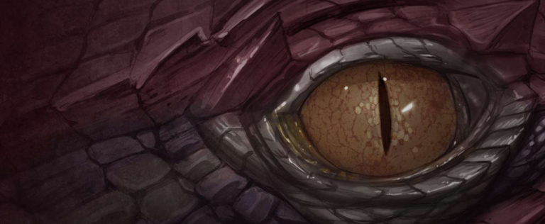

_Love not architecture, for the Ender of Worlds crumbles all to ruin. Tend not to your fields, for His bloodfire reduces all to ashes. Care not for your future, for with a breath, Skaarfungandr, Ruler of Skies, eliminates nations entire. Beware the folly of pride, for even now your Reaper wakes. He is The Last; The Herald of Eternal Night. He is Skaarfungandr the Vehement, His Dreaded Majesty, the Indomitable and the Eater of All. Let us lament the last precious moments of Man._

-Taken from _The Canticle of Skaarfungandr_

## 'SURVIVORS OF SKAARFUNGANDR'

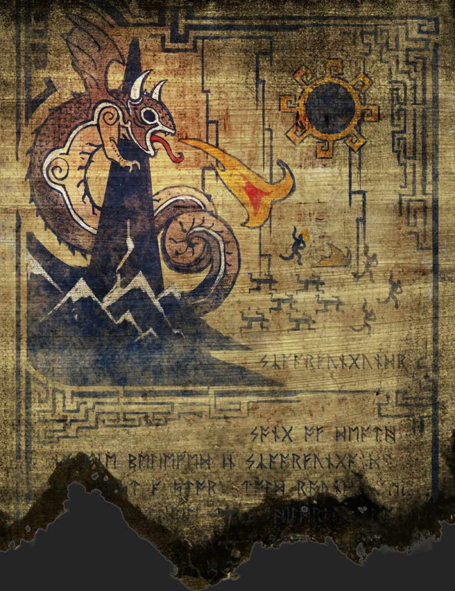

**The Walker Archives**

**This scroll was discovered among the bones of a Deinlandic female.**

Skaarfungandr is one of a dozen names for a dragon featured in the folklore of many cultures. Though fossil records indicate that the dragon species has been extinct for many millennia, there is a cross-cultural mythology suggesting that one dragon in particular appears once every one-thousand years. Scholastically advanced civilizations generally disregard Skaarfungandr as myth, but I have studied many cultures in which this legendary dragon is believed to be quite real – a violent reckoning of sorts for the indulgences of society. Skaarfungandr appears in much the same form in wall art, mosaics, stained glass, oral storytelling traditions and written accounts in cultures that have never crossed paths. For some years, I have collected what I could of this evidence.

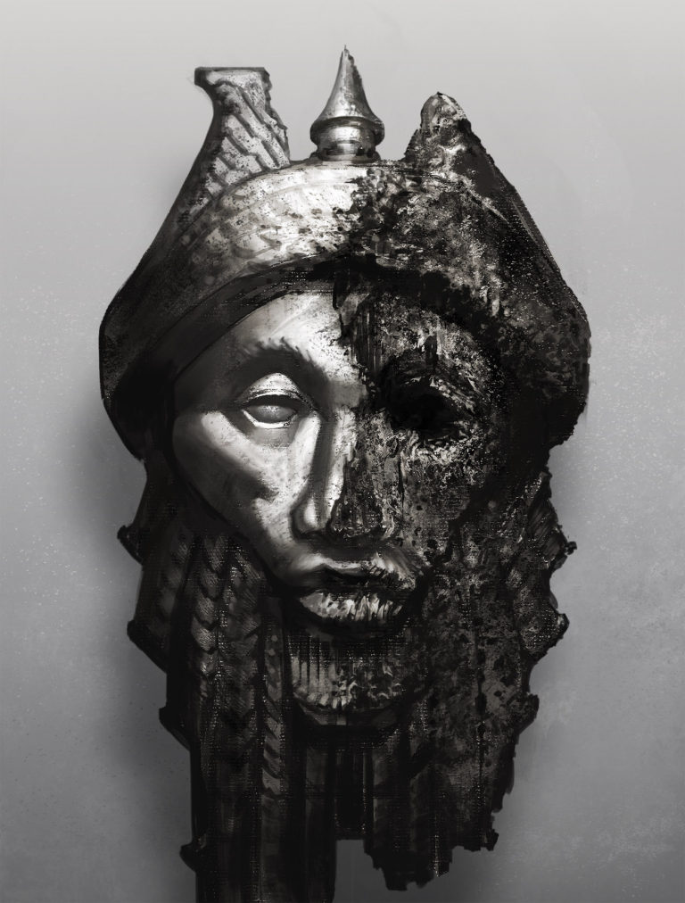

It is worth noting, if only for the amusement of historians, that the most recent of these accounts goes back nearly one thousand years.

_-Exerpt from the personal journal of Martim Walker_

\*

**This account was retrieved and translated by Walker from an unidentified culture. It was found among his belongings following his disappearance.**

_I should have died by the river, a fishing pole in my lap. Instead, I ran to the cave in hopes of postponing my death. One enormous eye peering at me from outside and noxious, hot breath filled my lungs._

_He opened his jaw and I flinched from the sparks flashing down his throat. His giant body covered the cave opening, blocking the rising sun._

_I thought of Appa wading out into the rice field at the edge of our farm. Of Eomma tending the fire, uncovering the birdcages. They expected me to return from the river with fish for breakfast, but they would never see me again. I hoped I would satiate the beast’s hunger, so that he might pass our great city and its surrounding farms._

_Face to face with the predator, I lost all fear. I was prey. It was the natural order of the world._

_In my last moments, I reached out to touch my death. I ran my palms over the horned bumps on his head and the scaled flesh of his muzzle. His dry tongue lolled out between two teeth as long as my body. I touched the scales. There were no weak spots, no places where steel could pierce. At any moment, he would exhale and turn me to ash, or fill his belly with me._

_But dragons are not known for mercy._

_With one fluid motion he turned from the cave. I followed, dread dropping like a stone into my chest, and watched as he rose into the sky, swooped from the crags, spiraled down with lazy grace, and incinerated my home._

_The earth dried and split where the rice fields had been. The city walls, the monuments, the libraries – all the strength and learning of my people blackened and crumbled into ash._

_Nothing remains now of my family. Gone are the friends and enemies who shaped my life. Not even their bones are left for me to bury. I am the only memory left of my people. From my peaceful vantage point above the valley, I looked down upon the wrath of Skaarfungandr: The End of Everything._

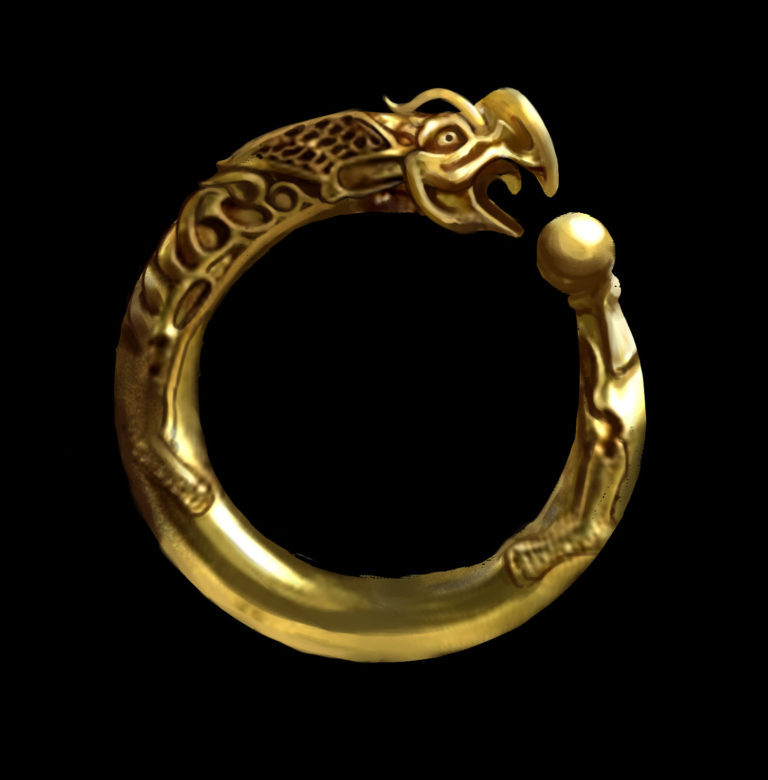

**Artifacts and story translation from the private collection of Martim Walker. City and culture of origin unknown.**

_No one believed in Skaarfungandr. Was just a story told round campfires to thrill the youngsters, I thought. My own children were only babies then; now they have their own children, and they tell them not to listen to their grandmother’s scary tales. But we weren’t always from this town. We had our own village, our own farm, made a good life there. Then, one day, we woke to darkness._

_Was no dawn that day. The sun a white pinpoint in an iron sky. Ash rained down, coating the roads, our homes, snuffing out cooking fires. It turned into a fine powder that smeared on my skin, stung my eyes, closed my throat. Even with windows sealed and blankets stuffed under the doors, the ash found its way in and settled on my table, on the food, my bed. It swirled a sickening silver in the water. The animals outside choked, fell dead. The babies cried; their tears ran gray._

_The wind had brought ash from a fire in the village downroad. My husband went to help, never returned. By noon my wagon couldn’t move through it, and the heat got worse. The emergency bells rang then, calling us all out. Fire coming. I escaped then, ran with the rest of town, the wind and ash billowing at my back, the babies wrapped up into my cloak, shuffling through ash to my knees. Heat peeling my skin._

_I was last out the gate, so I saw him come. The black sky split apart, sun spilled through and Skaarfungandr sank through the ash into view. His wings beat away the ash clouds. He was bigger than the stories told. Bigger than nightmares. He roared, and with the roar came the reckoning that swallowed my town. We ran with a wall of fire at our backs, people collapsing dead on the way._

_When the ash cleared way for the sun, we came back, but nothing was left of the town. Not one stick of a fence or house. The wells dried. Nothing will grow in the earth there now. It’s a forgotten place: no name, no history. Easy to forget the name of a place when it’s leveled. Easy to blame it on fire got some accidental way. Easy to laugh at the stories of old people. Already, no one believes me._

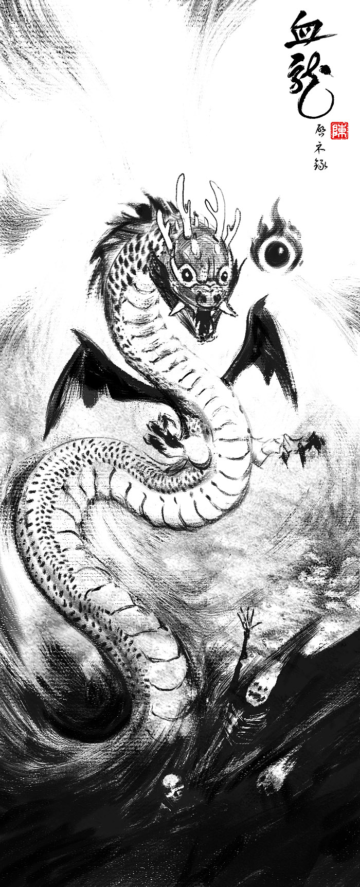

**The final translated account from the private collection of Martim Walker. Of particular interest is the reference to the “fifth reign” of Skaarfungandr.**

_During the fifth reign of Skaarfungandr, it fell to me as an initiate to watch the butcher boy boil alive in the pools a half-day’s walk from home. The butcher boy showed no fear when we saw evidence of the dragon’s presence: singed leaves, then whole patches of jungle burned away. The air was silent, even the birds burned away from their homes. The elephant’s path had overgrown with ivy and lichen. At the end of the path, under cover of wide leaves, we found the legendary dragon in the largest pool. He speared fish for his meal with great thrusts of his claws. He splashed himself, shook his massive head as fish bones crunched in his jaw._

_“This is folly,” I whispered to the butcher. “Follow the wisdom of your betters and turn back now.”_

_“My blades are sharp as any warrior’s,” he replied. He drew from a leather belt round his waist a long machete. Assorted other weaponry swayed there. “I know beastly anatomy. I know where to strike killing blows. When I return home with this dragon’s head, the High Scribe will initiate me into the warrior caste.” His eyes did not stray from the dragon as he left me behind. He climbed a tall, blackened coconut tree behind the beast, the machete between his teeth. Hanging in the balance of that moment was everything I had ever learned, written and taught to others._

_With a battle cry, the boy dropped down from the tree and landed on the back of the dragon. The beast paused, a fish tail hanging from its jaw, water shimmering with terrible beauty over his scales as the boy ripped the machete from his teeth. He stabbed at the dragon’s skull but the blade slid off of the scales. The machete splashed into the pool below, so the butcher unsheathed other assorted weapons – a serrated blade, a mallet meant for pounding knives through thick bone – but nothing would pierce the scales. The beast twisted and roared, and though the butcher boy grasped at the ridges along its back, the dragon shook him loose into the sacred pool and screamed fire onto him, cooking him alive._

## 'UNSOLVED CASE FILES'

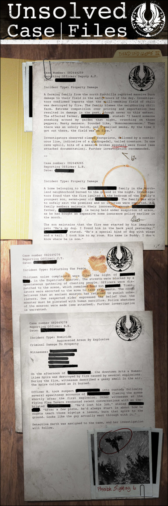

Case Number: 082649259  
Reporting Officer: Deputy A.F.  
Date: **CLASSIFIED**

Incident Type: Property Damage

A farming family from the north foothills reported massive burn damage to their field in the early hours of the day. Investigators confirmed reports that the still-smoking field of chili peppers was destroyed by fire. The family blames the neighboring pepper farm. Extreme competition over pricing and exportation has resulted in damage in the past, though never to this extent. The affected farmer, **CLASSIFIED**, stated: “I heard someone sneaking around my garden that night, crunching on those peppers. Nasty manners. Sounded like, ‘Nomnomnomnomnom.’ Then there was an unholy belch, and I smelled smoke. By the time I got out there, the field was on fire.”

Investigators observed clawed footprints followed by a continuous line, indicative of a quadrupedal, tailed creature. In one cave uphill, bits of a massive broken eggshell were found \(see attached documentation\). Further investigation recommended.

—

Case number: 082649265  
Reporting Officer: L.B.  
Date: **CLASSIFIED**

Incident Type: Property Damage

A home belonging to the **CLASSIFIED** family in the southland neighborhood of **CLASSIFIED** burned to the ground in the night. Investigators found that the fire ignited in the bedroom of the family’s youngest son, seven-year old **CLASSIFIED**. The family was able to safely exit the premises and no injuries were reported. All family members maintain their innocence, though **CLASSIFIED** father, **CLASSIFIED**, is being held under suspicion of arson, as he bought an expensive home insurance policy earlier in the month.

The son maintains that the fire was started by his imaginary pet: “He’s my dog. I found him in the back yard yesterday. He’s a special kind of dog with wings and a tail. I took him to my room. His name is Buddy. I don’t know where he is now.”

—

Case Number: 082649276  
Reporting Officer: J.Y.  
Date: **CLASSIFIED**

Incident Type: Disturbing The Peace

Thirteen noise complaints were filed the night of **CLASSIFIED**, in the expatriate neighborhood of **CLASSIFIED**. The streets were blocked by a spontaneous gathering of chanting people. Officers were dispatched to the scene. Translators were escorted to the area to take statements. The crowd believes that an ancient monster has returned to punish unbelievers. One elder respected by the community expressed the belief that the monster must be placated with human sacrifice. Police sketches of the monster were made \(see attached\). Further investigation is warranted.

—

Case Number: 082649278  
Reporting Officer: B.H.  
Date: **CLASSIFIED**

Incident Type: Homicide  
Aggravated Arson By Explosive  
Criminal Damage to Property

Witnesses: **CLASSIFIED**  
**CLASSIFIED**  
**CLASSIFIED**  
**CLASSIFIED**  
**CLASSIFIED**

On the afternoon of **CLASSIFIED**, the downtown Arts & Humanities Spire was destroyed by fire caused by several explosions. During the fire, witnesses described a gassy smell in the air. The spire collapsed as it burned.

Officer H. took suspect **CLASSIFIED** into custody following several eyewitness accounts of **CLASSIFIED** fleeing the scene shortly after the first explosion. Other witnesses at the Flying Flea Tavern recounted recent conversations with an inebriated **CLASSIFIED**. “He’d lost his job,” stated **CLASSIFIED**. “After a few pints, he’d always start in about how he oughta teach those bigwigs a lesson, burn that spire to the ground. Looks like the guy actually went through with it.”

Detective Sarth was assigned to the case, and her investigation will follow.

## 'FAN THE FLAMES'

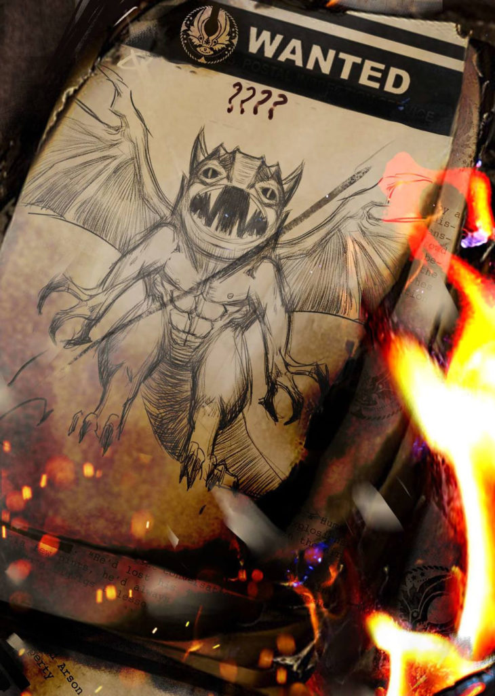

“I didn’t do it!”

Detective Sarth exhaled and smiled. “I see our pyromaniac has a bit of a spark to him,” she said.

The sketch artist in the corner groaned. On his easel was a rough but unmistakable drawing of a dragon.

The detective leaned forward. “Haven’t been any dragons for a good thousand years!”

“Thousand years,” echoed the artist.

“I know what I saw.” The prisoner crumpled in his chair, miserable. “It had wings and scales and breathed fire. It flew. It was a dragon.”

“You got fired for no good reason right before retirement. You lost your pension. It’s only natural to want to destroy whoever did that to you,” said Sarth in her most comforting tone.

“I swear. I’ve never seen anything like it. It came out of the clouds, just like in the stories. The wings. The teeth. It looked right at me. And fire! Came right out of its mouth!”

“The stories.” The detective said it flat. “You’re actually going to imply that it was…”

“Skaarfungandr!” The prisoner spat it out, his face reddening. “_He_burned the spire. Remember the stories? It was like the legends. Except…”

“Except there was no dragon,” the detective interrupted. “Except you blew up and burned the spire for revenge. We have ten witnesses who saw you there that day.”

“No! It was like the legends except…”

A deep thump stopped him. Another thump jolted the floor. The walls shook. More rumbling, and the file wiggled off the table. The detective’s chair bounced backward. The artist’s pencil scraped a gray line across his illustration.

The next rumble was a jerk. Then there was heat, and the smell of gas. Of smoke. Then, screaming.

The Safety Spire began to burn.

“…except _smaller!_”

For a breathless moment, Sarth could only watch as the perp’s imaginary dragon rose into view from the blasted-out wall of the spire. His little wings churned up the ash, fanning the flames that roared up from below. All around, fiery paperwork fluttered and screamed echoed off the walls. The floor cracked beneath them while the officers discharged their weapons. The room lit up with the sparks from bullets ricocheting off the hatchling dragon’s scales.

Sarth grabbed the sobbing suspect by his upper arm and dragged him out to the emergency stairs. “It appears,” she shouted, stuffing the keys to his shackles into his mouth, “…that I owe you an apology.”

Then she drew her weapon, turned the corner and joined the firefight as the Safety Spire crumbled around her.

## ALTERNATE FATES

### 'WATER DRAGON' SKAARF

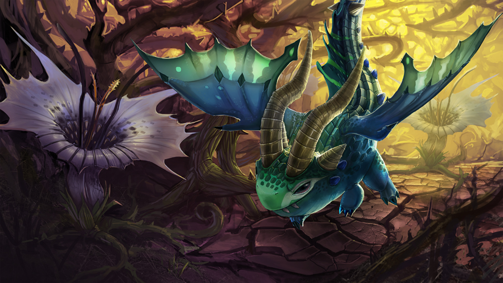

One day, a dragon hatched out of his egg covered in slurpy yolk. There was no one around, so he wandered outside to discover the world.

He bounced on a dandelion and poofed seeds everywhere.

He put a leaf on his head for a hat and did a dance.

He ate a butterfly, then sneezed it out his nostrils.

He took a bath in the lake and waved at a greenish-blueish fish.

“What are you?” he bubbled.

“I’m a fish,” she bubbled back. “What are you?”

“I don’t know. I am probably also a fish.”

“Yes,” she said, “you probably are.”

### 'CLOUD DRAGON' SKAARF

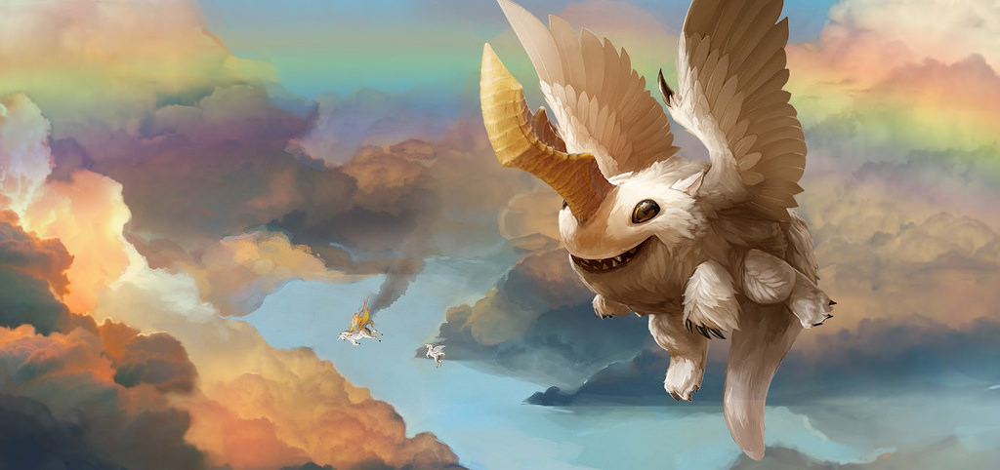

The dragon swam out of the lake and shook himself dry.

He discovered that he had wiggly wings.

He scratched his bum with them.

He made up a song and a wiggly wing dance.

The dance made him float, so he floated to the sky, where he met a cloud.

“What are you?” he sang.

“I’m a cloud,” sang the cloud. “What are you?”

“I must also be a cloud,” sang the dragon.

“Yes,” sang the cloud, “you must be a cloud.”

### 'ICE DRAGON' SKAARF

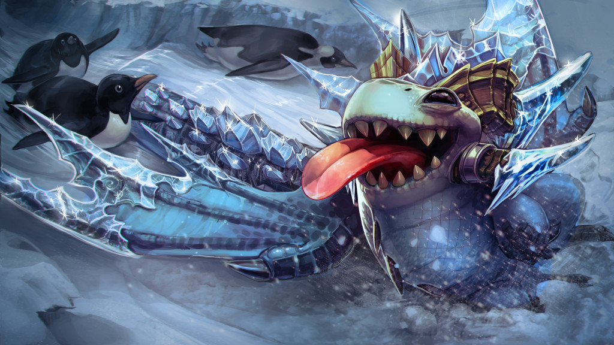

The dragon cloud fell asleep and woke with his tongue stuck to a glacier.

“Wha ahr you?” he asked.

“I am ice,” said the glacier. “And you are a fire dragon.”

“Whaths ah fiyo dwagon?” whimpered the dragon.

“You are, dear,” said the glacier. “That is why you are stuck. You should be an ice dragon instead.”

“Okay,” said the dragon, so he became an ice dragon.

He held his breath and turned deep blue. Ice crystals formed all over his scales.

He blew and little icy spikes came out. He spat some freezey jelly goo and came unstuck.

“I am a dragon!” he said, and flew away to freeze all the things.

### 'SPARKLER' SKAARF

#### 'THE FIRST RED LANTERN FESTIVAL'

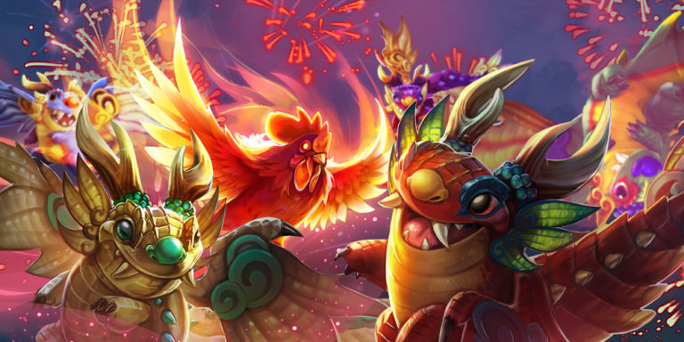

On the first day of the new year, five big eggs under the sea hatched: _crik-crak!_ and five baby dragon brothers wiggled out into the water: one purple, one red, one green, one blue and one gold. They tried to talk to one another, but only steamy bubbles came out, so they left the sea and climbed out onto land, shaking water off their pretty wings.

“_Mgggrrrtthh_!” proclaimed the purple dragon, which in baby language means, “I’m hungry!”

“I’m more hungrier than you!” announced the red dragon.

“I smell something yummy,” sniffed the green dragon.

“It’s coming from the village,” said the gold dragon, and together they flew toward the delicious smell. All of the people they met on the road were kind enough to run out of the way, but the screaming hurt the dragons’ baby ears.

The brothers stopped in front of a house. “I smell dumplings,” groaned the blue dragon.

The dragons wiggled and shoved, but the door wouldn’t budge. With luck, the gold dragon discovered that coughing fire onto the door made it disappear. The people inside screamed and ran. The red dragon called after them, “Stay, please, and eat with us!” but all the people heard was, “_Aaagghhkk_!” and also their home was burning so they fled.

“They must not want their dumplings,” explained the gold dragon, and the baby brothers made short work of all the dumplings.

One house’s dumplings weren’t enough to satisfy five hungry baby dragons. They followed the smell of dumplings to the next house, but they were met at the door by a little boy and a little girl with their hands full of fireworks.

“Let us in,” said the green dragon.

“We want dumplings,” said the red dragon.

“NO!” said the boy, for children are able to understand baby dragon language.

“But we’re hungry,” whined the purple dragon.

“Dumplings are NOT for dragons,” said the girl.

“Let’s burn down these children and their door before the dumplings get cold,” said the blue dragon.

But then the air burst into colorful light-bursts that sounded like _POW! POW-POW-POW-POW!_ and the frightened dragons bumped into one another with confusion.

“What was _that_?” gasped the red dragon.

The purple dragon started to cry.

“Don’t worry. It’s only fireworks,” said the boy, and he hugged the purple dragon until the weeping calmed into hot little hiccups.

The girl showed them the sparklers in her hands. “When you light them on fire, they make pretty explosions.”

“I would be very good at fireworks,” said the blue dragon.

“I want to try,” hiccupped the purple dragon.

“We’ll share our fireworks, but only if you will be our friends,” said the boy.

“And friends do _not_ burn down doors and eat all the dumplings,” explained the girl with a stern voice.

“We promise not to burn down any more doors,” promised the gold dragon. So the boy and the girl placed a sparkler in each dragon’s little claw, and with careful fiery burps, the dragons lit their sparklers and watched the pretty lights with joy.

That night, the town threw a party to celebrate their new friendship with the dragon brothers. The people made a huge batch of dumplings to share, and the dragons flew high to hang pretty red lanterns, and that night they feasted and danced and watched as the dragons created a spectacular fireworks show high in the sky.

Every year, it is said, the dragons return to this town to celebrate the Red Lantern Festival with their friends.

