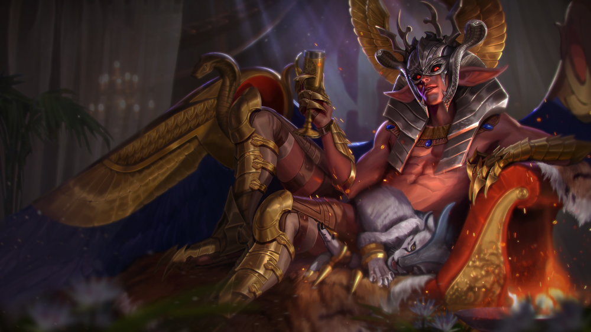
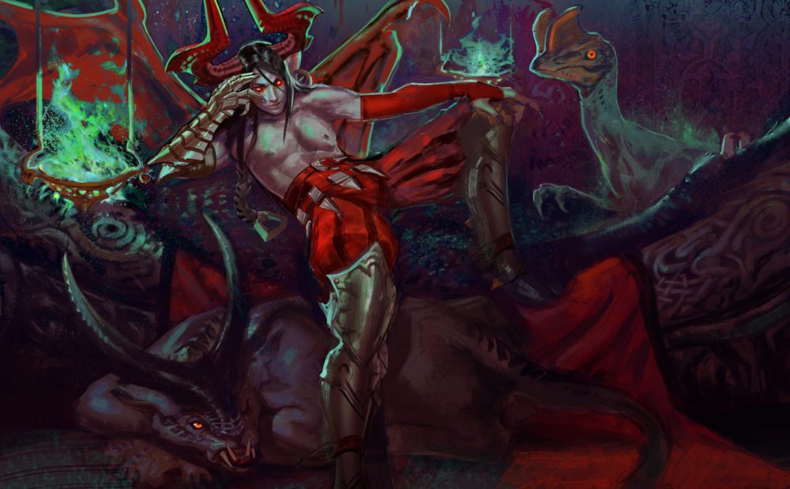
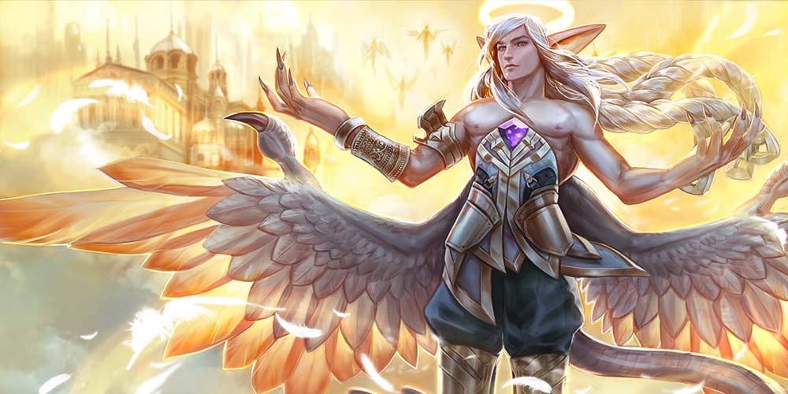

# Adagio Lore

## ‘THE ADVICE NOT GIVEN’

Ages ago, the desert people learned to heat the pink, blue and white crystal sand of the desert to make glass, and from it they created a city so strong, glittering and beautiful that even the seraphim took notice.

Adagio was not like his siblings, dabbling in the idiocies of humankind – why should he, when the silly creatures died off in a blink? – but he had taken a liking to the Glass City and was not pleased to see it destroyed. Flying over the glass ruins, he watched lightning spark in the dark, oily smoke rising from the fire breath of monsters – the humans called them so, though Adagio knew that Churnbeasts were just a natural part of the world’s endless cycle of annihilation and regrowth.

He landed a safe distance away on one of the crushed-crystal dunes that gave the desert its name: The Shimmer.

~~~~~~~~~~~~~~~~~~~~~~~~~~~~~~~~~~~~~~~~~~~~~~~~~~~~~~~~~~~~~~~~~~~~

Idris left his goat-hair tent at dawn with his weapons strapped to his back, squinting into the sunrise. He stopped short at the sight of green in the sand: Tiny leaves poked through, splitting and stretching forth as he watched. Before, spontaneous plant growth in the midst of The Shimmer would have been a wonder; now, he sighed with dread and turned to face the city. At a half-hour walk away, the choking smog and the jungle vines that tumbled away from its gates were almost beautiful. On a high dune just outside the city, he saw a\_djinn\_with blue wings.

He blinked to be rid of the illusion, then turned away. In The Shimmer, people knew well the dangers of mirage; once the mind began tricking itself, hope for reason was lost.

Moving between the tents and past the morning fires, he inhaled the scent of new bread and boiling tea. He eased down a goat kid that had leaped its way atop a cannon, then greeted the elders with rubbed noses and grim news: the growth in the sand meant they had but a few days to move back their line of defense.

In the blood-soaked no-man’s land between the camp and the city, he went to work dragging away the Churnbeasts that had wandered too close in the night; oftimes new terrors grew from the bones. The beasts came each night in waves, spitting, gnashing their teeth, whipping claws or tentacles, roaring or gurgling, ever bigger, with scant respite for the fighters. It had become daily life. Everything Idris had learned of the spear and chakram was put to good use.

Again he gazed toward the dune. The azure-winged man had not disappeared.

Idris closed his eyes, set the dune where the_djinn\_stood in his mind, then willed himself\_there_.

~~~~~~~~~~~~~~~~~~~~~~~~~~~~~~~~~~~~~~~~~~~~~~~~~~~~~~~~~~~~~~~~~~

Adagio could not remember when last he’d been startled, but his azure wings twitched in surprise when the desert warrior appeared before him.

“Welcome,_djinn_,” said Idris in a soft tone. “If you have come to join us in our war, then you are welcome at my fire.”

“Astonishing,” said Adagio, though his musical voice trilled out as if at any moment he might yawn. “I did not know magic was cultivated in The Shimmer.”

“I am not familiar with magic,” said Idris. “Mine is a skill of nature.”

“If that were so, then all men would accomplish it,” said Adagio.

“A man without fear reaches his destination the moment he chooses to depart.”

“Perhaps mankind should fear more, not less.” With a flick of his slender fingers, Adagio indicated the devastated city.

“The people live in fear now,” said Idris, his voice soft. “If the stories are true, then the emerging of horrors from the Fabled Well is the failing of your ancestors, for the seraphim and the elder dragons created the wells of power to control the release of their destructive energy.”

“Nature cannot be controlled forever. It shall destroy and outlast us all,” said Adagio.

Idris nodded. “The astronomers claimed that the lights of the heavens had aligned to create the syzygy that would wreak havoc inside the wells of power, but it had been so long that none believed them. A year ago, the Churnbeasts spilled out of the well and drove us out of the Glass City. Every day we fight, and every day we are pushed back farther. Most of these refugees have never even milked a goat, much less hefted a spear… but those who did not escape, and did not die, had it the worst.”

“Indeed, that is a horror,” sighed Adagio. “What the Churn does not kill, it swallows.”

“Tell me what can be done,” said Idris.

“There is nothing to be done except save yourselves. In another year, all you see in every direction will be predatory jungle and fearsome creatures. It is not the first time the Churn has destroyed a civilization so near to great understanding.” Adagio chuckled. “You remind me of the sisters, Rana and Ayah. They questioned me as an equal as well. I tasked them, as promising young engineers, to write a book. Perhaps some future creatures shall discover it among the city’s ruins and have a head start against their apocalypse.”

“There is a book that can save us?”

“Other civilizations have fought back the Churn, for a time, with technology.” Adagio gazed to the city again, wrinkling his sharp nose as the mists of the Churn trailed on the warm morning breeze. “But Rana and Ayah failed, as all of your kind do, when they became greedy with their knowledge, and now…” He waved a dismissive hand toward the defensive trench. “…it is irretrievable.”

“I shall retrieve it.”

Adagio’s expression, for a moment, softened. “What the Churn does not kill, it swallows,” he said again.

“Thank you for your advice,_djinn_.” Idris took a chakram into his fist and looked back no more. He inhaled to his belly and let out the air in a long, thin stream.

“I gave no…” But before Adagio could finish his thought, the ground beneath Idris crumbled and the sand rose in a spectacular swirl. Then the young man was gone from the dune, and Adagio could only look after him, his arms crossed, shaking his head. “Once an eon or so,” he murmured, “a mortal casts an interesting shadow.”

## ‘THE HOUSE OF INSIGHT’

Idris appeared inside the Glass City coughing, a painful sting in his nose when he tried to inhale, his eyes pouring water, the sharp chakram dropping from his fist. He wrapped his turban around his mouth and nose but it was no respite from the swirling green-gray smog. His skin burned even beneath his sandstorm-proof clothing. He dropped to his knees, choking, blind but aware on all sides of things waking, sniffing and growling. He tried to escape in the same way that he had come, but he was gripped by fear and could not move. So he would die like this, smothered, sniveling, helpless.

In that realization, however, there was peace. He allowed death inside, and death flowed through him. His mind settled. He breathed deep, pulling the noxious gas into his lungs, and forced his eyes open to watch death come. The strength of the old destructive force filled him – or was he being drawn into it? – and he remembered the cryptic words of the_djinn_.

_What the Churn does not kill, it swallows._

It felt like a dream of breathing underwater. His vision cleared, and he saw that he was near to a broken fountain that still poured water forth. The water streamed out in several directions onto the ground, over books strewn everywhere. Books in stacks, books torn apart, books held by the skeletons of the dead. The fountain water ran black with ink.

Idris dropped his turban and gripped his chakram again. He drew his spear, raised himself up and walked toward a door worked with colorful, geometric glass tiles, now broken and jagged. The sign above it remained:

#### GOOD CANNOT BE BROUGHT FORTH NOR EVIL AVOIDED EXCEPT BY KNOWLEDGE

He had arrived at the House of Insight, inside which the engineer sisters Rana and Ayah had written their book.

The air tasted like strong spices now, and blood, and green things growing wild. Inside the destroyed house of learning, vines grew over ornate tiles and murals. The leaves had sharp teeth and tongues; they hissed at him but he threatened with the tip of his spear and the vines shrank back from him. Other creatures scuttled away: overgrown insects with snapping claws and horn-backed reptiles the like of which he’d never seen. He moved nevertheless through room after room, determined but lost. He found shattered telescopes attached to windows and maps crowding walls and desks. Some floors were covered in the slivers of glass that had been the tools of chemists. All the rooms were filled floor-to-ceiling with books tumbled off of shelves. How would he find one book among these thousands?

Then he came upon a tidy room. On display inside were strange machines and models of inventions: watermills and chain pumps; a robotic peacock that pecked at him as he passed; clocks of all kinds ticking in unison; and a helmet. There were weapons, too, in varied states of repair, and blast marks on the walls where some had discharged. Curious, Idris placed the helmet on his head and startled when a holographic visor appeared before his eyes that gave him a view of the room behind him and to his periphery. And then he heard whispering.

“He was not choked by the smog.”

“He passed the first test.”

Idris whirled around and the display whirled too, so that what was behind him showed in the visor. He saw no one. He moved through the room until his back was against a wall and waited, spear and chakram at the ready.

In the year of nightly battles he had seen many kinds of Churnbeasts, horrific evolutions of animals and plants, but what slithered through the door was another thing altogether, a thing fashioned after a giant serpent but made of steel and the conjoined bodies of two women, their fingers mutated to resemble viper fangs, tubes and wires grafted into their flesh as if grown there, a single glowing eye separating their torsos. It was a sickening amalgam of wildlife, humanity and technology. The serpent slithered in a spiral so that one and then the other of the sisters faced up, and Idris could see that they had been beautiful once.

## ‘RANA AND AYAH’

Adagio gazed into the mists. He knew well what lay at the center of the ruined city, for he had watched the Churn overtake the desert before; the earthquakes had crumbled the crystal peaks to the dust that mankind would later name The Shimmer. He had seen to the building of the Fabled Well himself, had set it in a place so hot and desolate that he’d thought it would be safe from civilization. And yet the people had come, drawn to its power. They had created beauty within the desert. He had dared to hope that the people’s ingenuity would triumph, and in the end he had been wrong.

Hope was such a silly thing. And yet he looked into the mists, hoping that the desert warrior would return.

~~~~~~~~~~~~~~~~~~~~~~~~~~~~~~~~~~~~~~~~~~~~~~~~~~~~~~~~~~~~~~~~~~~~

“Adagio sent a man to take our work,” said one of the serpent sisters, and her eyes twitched over to a single book preserved under a glass case.

“Rana and Ayah,” Idris said, sliding his spear from his back, “The book of mechanical devices must be brought to civilization, so that the horror that has overcome you can be defeated.”

“Horror?” mocked Rana.

“Civilization is the horror,” crooned her sister.

“And if we are a horror, then so are you,” said Rana.

“The Churn is within you now, ” said Ayah, and they advanced together on him.

Idris felt the Churn streaming along with his blood, power and chaos pumping through his heart. Reflected in the visor, he saw his eyes glowing. The Churn was swallowing him… and he did not wish to resist. The Churn sang of evolution; it beckoned to him from the very center of the world. A Churnbeast sprouted within and begged to be born.

Shaking his head with violence to be rid of the evil song, he lunged for the glass case. The serpent shot forward, rising up between Idris and the book, hissing. The women reached for him with their clawed hands and fanged mouths opened wide, and Idris threw his bladed chakram, leaping away, twisting mid-air to land behind the beast. In his visor he saw the chakram returning and caught it behind his back while steel scales crashed to the ornate tiled floor.

Rana and Ayah screamed in rage and reared up again to strike; Idris threw the chakram again, set his gaze on the book and willed himself_there_. The chakram followed, slicing off one of Rana’s arms, which bled an unnatural green while she howled. The sisters whipped and coiled in their confusion. Idris did not pause; he rammed the butt end of his spear into the glass case and it shattered. The engineers attacked again, their powerful metal tail lashing with so much force that it crashed through a wall. Idris somersaulted aside with a fraction of a second to spare and landed under the women, so that Ayah’s spine loomed above him. He thrust upward with his spear and felt the engineer’s vertebrae separate and crack. Holding the spear inside her while she howled, he threw the chakram again and swung upward, using the spear as leverage, and watched the blade’s return flight through the visor as it sliced through Rana’s neck and crashed into the serpent’s eye.

The tail of the serpent thrashed without control. Idris scooped up the book and ran through the broken wall, leaped through one of the astrological rooms’ observatory windows and landed by the fountain.

For a moment he paused, wavering, hearing the song of the Churn thrum. It came from the Fabled Well at the center of the city. Stay, it whispered. You are home.

He focused the djinn in his mind as an anchor point, let all of the fumes out of his lungs, and returned.

~~~~~~~~~~~~~~~~~~~~~~~~~~~~~~~~~~~~~~~~~~~~~~~~~~~~~~~~~~~~~~~~~~~~

The man who stumbled to the shimmering sand before Adagio was not the same man who had left. Adagio caught Idris into his arms and felt the wild thrum of the Churn inside his pulse. “Has it turned you?”

“I am myself,” whispered Idris, and closed his eyes. The book fell into the sand.

Adagio sighed. How annoying it was to care for humans. From his hands burst the gift of fire; it flooded into the dying man, radiating beneath his skin. “This will revive you, but not even I can draw the poison from your blood. The Churn will always call to you.”

Idris’ shining eyes opened and he grasped for the book in the sand. “But I have this. Now we can win.”

“Oh dear, no.” Adagio laughed, but then he met Idris’ steady, glowing gaze. His tone softened. “Your people are brave, but how will they engineer the devices in this book? With spears and goats and campfires? No; this book must go to those around the world who can use it. I suppose I can take you to the Technologists.”

Idris shook his head. He tried to sit up. “I will not leave my people to this horror.”

“There is no hope for your people without help from the rest of the world.” Beneath his hands, Adagio could feel the conflicting forces fighting for dominance: the gift of the seraphim and the curse of the Churn.

Idris clenched his fists. “I will go with you, then. But I swear I will return, with warriors and technology to fight this evil horde.”

“You are… almost impressive in your naivetè,” said Adagio. He drew up the reviving warrior into his arms, spread his great wings, and took flight.

## ‘DRAGON FALL’

 Before the naga heard Adagio’s song, everything was the same always. She tended to her coral gardens; she danced with pearls for the amusement of the piranhas; she gossipped with the clams; she avoided jellies and anemones; and she tickled the belly of Archelon each year when he passed by.

 But then she heard the song, and for the first time in her long life, she was curious.

 Above the surface of the water, on a dry rock, a sky-man sat with his azure wings folded up behind him. “Hello, Lorelai,” he said, and just like that, she had a name. “I am Adagio. I have brought you a gift.” Inside his cupped hands was a bright round orange.

 Lorelai pulled from her mouth the sharp-boned seahorse she’d been chewing. “Is it the sun?” asked Lorelai.

 “It is an orange. You eat it.”

 Lorelai sniffed at the orange; the tangy sweet scent filled her whole head. Underwater there were no sweet things, only salty and bloody.

 “Bring me one of the dragon eggs buried beneath Dragon Fall,” said Adagio, pulling the orange away, “and I will give you this orange.”

 So Lorelai dove down and down and down into the deep-dark, until she had to grab an anglerfish by its glowy stalk to see at all. When her hair tangled around the great collapsed ribs of the last dragons, from the time when the sea had not been a sea at all, she knew she had reached Dragon Fall. She thrust her hand deep into the seabed and touched the scaly sides of huge eggs. The anglerfish scurried away as she swam up and up and up with one of the eggs in her arms.

 In the daylight, the egg was greenish-gold. Adagio praised her and handed her the orange, then laughed when she bit straight into it. He said she should discard the peel, but she loved its sunshiny bittersweetness.

 Adagio flew away with the egg, Lorelai returned to the sea, and a long time passed. She danced for the piranhas, tended to the corals, pried pearls loose from aching clam mouths, and avoided the jellies. She forgot Adagio, and the song, and the taste of the orange. She tickled the belly of Archelon one thousand times, and then she heard the song again.

 Again Adagio greeted her, and again she dove into the deep-dark, feeling around in the mud until she found an egg. Again she exchanged one egg, this one swirly yellow, for a bright round orange. Again she dissolved into pleasure at the crunch of its sweet seeds. And again she returned to the same-always of the sea and forgot Adagio, and the song, and the orange.

 One thousand Archelon tickles later, Adagio returned and sang. Lorelai delivered a speckled dragon egg and sat on the dry rock by Adagio while she ate her orange. “Why do you need an egg every one thousand Archelon cycles?” she asked, licking the sticky juice from her fingers.

 “That is how long it takes mankind to fall into ruin,” said Adagio.

 “Like Dragon Fall?” she asked.

 Adagio smiled and petted Lorelai’s long hair. “Somewhat. Mankind learns and adapts better than all other creatures, but then they make civilizations, and become greedy, and they fall, much like the dragons did long ago. The eggs are mankind’s salvation from itself.”

 “I don’t understand,” said Lorelai.

 “It’s better that you don’t,” said Adagio.

 After that, Lorelai returned to the sea, and forgot Adagio and the oranges and the eggs. Nine hundred and ninety-five Archelon tickles later, Lorelai again heard the song and raced to the surface, but Adagio was not there.

 “Hello, Lorelai,” said the stranger who had sung the song. She was a lady in black robes, wearing a crown that covered her eyes. Ravens circled and perched around her. The stranger held a basket full of oranges.

 Lorelai had not seen so many oranges in her whole life. Curious, she swam closer. “Are you mankind?”

 “I am a queen.”

 “And you also want an egg?”

 “I want a particular egg,” said the queen.

 And so Lorelai dove down and down and down into the deep-dark, and dug in the seabed under Dragon Fall until she found the scaly round sides of an egg, and then she swam up and up and up. In the daylight it shone purple and pink. “Is this the particular egg?” she asked.

 “You did well, Lorelai,” said the queen. She gave Lorelai an orange and passed the purple and pink egg to her guards. “But this is not the particular egg that I want. Bring me another, and I will give you another orange.”

 Lorelai froze with the orange still in her teeth. She had never had two whole oranges in one day, or even one millennium. She dove again with the orange still in her teeth, returning with a dark blue stripey egg. She collected her second orange with a delighted squeal and devoured it while the queen inspected it. “Is that the one?” she asked, hoping it wasn’t

 “No,” said the queen, though again she kept it anyway. “But I have plenty of oranges.”

 And so Lorelai dove again and brought up another egg, and another, and another, until the queen’s guards were overburdened with eggs of all colors. 

At last she brought up an egg so deep black that it made Lorelai uneasy just to look at it. She was glad to hand it over.

 “This is the one,” whispered the queen.

 “Mankind’s salvation from itself?” asked Lorelai.

 The queen paused. One of the ravens hopped close to Lorelai, staring with its head to one side. “Not from itself,” she whispered. “Not this time.” Then she and her guards walked away from the sea, the conspiracy of ravens blackening the distant sky, leaving Lorelai alone with the basket half-full of oranges.

 Lorelai sat on the rock for a long time, watching the sun set and eating oranges until her belly ached. She slipped back into the sea, prepared for the same-always and long years of forgetting

 But when she heard the song again, she had not yet forgotten. She had tickled the belly of Archelon only five times since the queen had sung the song, and her tongue still recalled the bittersweet orange peel tang. Curious, she swam to the surface and found Adagio there again, an orange in his cupped hands. Dropping her pearl, she dove down, down, down into the deep-dark, and returned with a brilliant ruby-red egg. But when Adagio held out the orange, she refused.

 “I would like to understand instead,” she said.

 Adagio’s smile was gentle and sad. “Dragons save mankind the same way that night saves the day. The way that death saves life.”

 After that he left. Lorelai hugged her pearl and watched as the sun moved across the sky, turned orange and then red and then purple, then disappeared beneath the horizon. Darkness covered the world and, shivering, she understood.

## ALTERNATE FATES

### 'RA’DAGIO'

#### THE SUN GOD AWAKENS

There was no sign of the guardian in the buried dark, only the smell of ancient magic. The Horus King’s torch cast an eerie glow over glyphs carved into the walls depicting forgotten wars and warning visitors.

Through the labyrinthine mastaba the king traversed. Again and again he turned around at the sealed door to a tomb of one or another of his ancestors, pharaohs all, until he could no longer recall the direction of the obelisk. He trained his mind away from confusion and pushed forward into the heavy silence.

At last he discovered the base of the obelisk. The Horus King placed his hand at the center of a sun glyph and the great door opened down into the floor. Sand poured down as the obelisk trembled and changed shape. The pyramidion high above turned and opened to the bright hot sky. The Horus King stepped inside the obelisk, now illuminated with sunlight, and approached the dais where the sun god laid motionless.

The Horus King waited as the sun bathed Ra’s resting form. From above, bright-colored sand blew in through the windows and swirled down.

At last, Ra awakened. He sat up, sand falling from his headdress and coating the ever-youthful skin of his chest, arms and legs. In the sunlight he was a sparkling vision. The Horus King bowed to his beauty and power, his head down, until Ra touched him on the shoulder.

“Why has the Horus King awakened the Sun God?” asked Ra. Behind his voice was ill-concealed laughter.

“The Glass City has fallen to a great power,” said the Horus King. His voice, though muted behind his mask, was grave. “Our people have fled to the desert.”

“From where came this power?” asked Ra.

“From the Fabled Well,” answered the Horus King. “Poisonous and wild things have emerged from its depths that we have never seen.”

“The Churn has come,” sighed Ra. “You should have awakened me sooner.”

“Your temple was buried in a sandstorm brought on by this Churn,” said the Horus King.

“Your only hope now lies in your children’s children,” said Ra. “When the Churn has passed, they will unearth from the wreckage of the Glass City your people’s writings, art, architecture and bones.”

“No,” said the Horus King. “We will fight this Churn, you and I.”

Ra laughed. “Such pride!”

“You built the Fabled Well long ago to fight this Churn. Since then, my people have learned much about magic, technology, and other powers. Something new can be done.”

“Very well,” said the Sun God, impressed despite himself. “I will travel with you to the Glass City and see –”

He was interrupted by a rumbling growl from the tombs.

“You have not yet defeated the guardian?” scoffed the Sun God.

The Horus King drew his spear. Without answering, he left the bright obelisk and followed the terrifying noise into the dark tomb.

### 'DARK PARADE ADAGIO'

#### **THE DARK PARADE**

Along sun-bleached bones, stoppered jars hung on silver wire, each imprisoning a single enraged fire faerie, its glowing belly providing romantic light. Chained harpies crouched at the perimeter, beating their wings to provide a breeze. Servants dressed as ravens slid silently among the guests, sweeping up errant feathers and the other unmentionable messes expected of birds, the animal totem of that year’s Dark Parade. Musicians played all manner of stringed and wind instruments as the guests danced in the shadows of the ancient elder dragon skeleton.

Adagio lounged in the eye socket of his long-dead ancestor. His fist curled under his chin as he gazed downward at his guests – or he might have been napping. Behind him, a parade of people and creatures curled down the cervical vertebrae of the dragon: supplicants, rulers, politicians and chiefs who’d come to beg for his attention or affection. Each wore feathered couture designed for the occasion; the gentlemen mirrored a bare-chested fashion inspired by Adagio himself.

“Behold! Gnottingham Catchfly the Third, Lord of Starlight, He of the Two Moons, Ruler of the Night Blossoms…” called the announcer as a Bleekos king and his contingent filed in atop their giant shining beetles. Their magic show unraveled full of spilled moonbeams and cricket song, after which the king’s best orators presented their quandary with much flourish.

“He doesn’t wish to take sides in your border dispute, but you can leave your gifts with the others,” said a psychic little girl in a sing-song voice. She played with dolls on the floor, her face hidden behind long black hair. Adagio had not yet turned his eyes toward his petitioners; instead, he projected his thoughts to the girl, who spoke for him. “Next!” she called, and the Bleekos were ushered out to join the festivities.

Adagio did not attempt to conceal his wide yawns. For millennia he had hosted these parades in hopes of discovering something new but found only the same tedious struggles over power, resources and love.

“Behold! Prince Cuthb…”

The announcer was interrupted by a woman’s voice calling up from what had been the low belly of the dragon.

“Adagio the Immortal,” she cried, “I have come to make a request!”

She snapped her fingers and everything stopped.

The dancers froze. Bows halted on strings. Whatever niceties, threats or pleas had passed between guests silenced. The little girl, too, stalled with her dolls in her hands. What had been a hot night turned chill.

The gray witch wound her way through the decadence toward Adagio. Her eyes, hair and somber dress were the ashen color of the sea sky in winter, but she appeared young. Adagio, still lazing, had not been frozen like the others.

The illustrious dragon seraphim stretched.

“Let me guess,” Adagio said, his first words of the evening. “Your land is in some peril.” As he spoke, he held up his palm, and a flickering sphere of blue fire formed above it. “Some illness threatens the life of someone I could not care less about.” The orb danced around his fingers. “You seek a bridegroom, and you think I’d be an enchanting companion.” The witch laughed at his guessing. “Or, perhaps, you wish to understand the secret behind the power I wield.”

The ball of fire flashed from Adagio’s playful fingers toward the woman. Her arm flew up, but at the last moment it stopped in the air before her, then burned itself out.

The witch righted herself, standing regal as ever. “I have no country, my lord,” she said. “I do not crave affection. And the power you wield, though fascinating, is quite the opposite of my own. All I wish, my lord, is a dance.”

Adagio shook out his wings to their full, wide span, then floated down. He landed a breath away from her. She stood her ground.

“All you wish is to dance,” he murmured.

“It has been a fancy of mine since I was young.”

“I don’t believe you,” said Adagio, but he held out his hand.

“You are wise.” The gray witch curtsied low, then took his hand.

Adagio twisted his mouth into a smile, then blue light flashed from his fingertips in the direction of the nearest frozen flautist. The poor musician, bathed in healing fire, blinked awake as if from a nightmare. “Play,” ordered Adagio, so the terrified man fitted his instrument against his lips, and a harrowing song poured from it. Adagio held his uninvited guest round her waist, and they began their eerie waltz.

The other guests could only watch in rooted terror as Adagio, who never bothered to walk, whirled the woman round the dance floor. They spun through the frills and flourishes, under the stars winking through the giant dragon’s ribs, until the song reached its haunting finale.

Heartache accompanies the end of such a dance, but the pain Adagio felt was not emotional. By the time he realized what the witch had done, she had slipped from his arms.

The Dark Parade reversed in panic. The guests, their blood coursing anew, trampled one another in flight. Fire faeries winked on and off. The harpies blew torrents of wind in efforts to escape. The witch easily disappeared in the mayhem, taking with her a memento: one of Adagio’s deep blue wing feathers.

Above the roaring chaos, Adagio’s laughter echoed into the night.

### 'SERAPHIM ADAGIO'

#### THE DEATH OF THE ELDER DRAGONS

The final battle between the seraphim and the elder dragons ended millennia before the first of the humans. For one thousand years the battle had darkened the skies; feathers and shimmering scales mixed with blood and rained down on the lands.

The last queen of the elder dragons took a mortal wound in her lower belly. With the last of her energy, she flew to her mountaintop nest. There she laid her last clutch of eggs and resolved to die, blood seeping from her wound into a spring that flowed down into the river below.

The last seraphim landed with a flutter of pure white wings next to his conquest. He stood as tall as one of the dragon’s eyes. By then, the elder dragon breathed only once every few minutes; the seraphim was startled when the eye opened.

“You have emerged the victor,” whispered the dragon.

“A meager victory. The seraphim are demolished and the ground shakes with the evil below.”

The azure dragon made a rumbling sound that may have been a cough or a laugh. “It will burst from underground and destroy all, and from the rubble new beings will rise to dominate the world.”

“And they will make war and kill one another while the evil grows, and be eradicated in turn, as has always been the cycle.”

The dragon rolled her topaz eye to the sky. “There are the volcanoes that churn out lava at a steady flow and never explode. Perhaps it could be so for the evil. We should have dug deep, created wells to allow it to escape in a controlled … a controlled…” A bout of wheezing broke the dragon’s thought.

The seraphim rested his palm on the dragon’s brow. “But we did not, because we were always at war,” he said. The blue scales surprised him with their softness. He had never come so close to his enemy. “It may have worked. But there is beauty in the loss of hope, isn’t there? The promise of death and rebirth.” He spread his left wing to show the dragon the blistered wound over his ribs.

“Your heart burns,” said the dragon. “How long?”

“It is a slow death. I have a year, perhaps, if the evil does not swallow the world first.”

“A year.” The dragon closed her eyes. “The last choices belong to you. My eggs are there — take them, or roll them down the mountain as you wish.”

The seraphim waited, stroking the fine scales, while the last queen of the dragons breathed her last. With a gasp of pain he rose and surveyed the nest, the eggs snuggled in together, the hope of the world.

