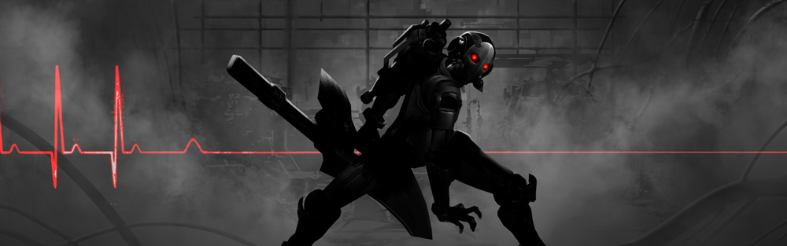
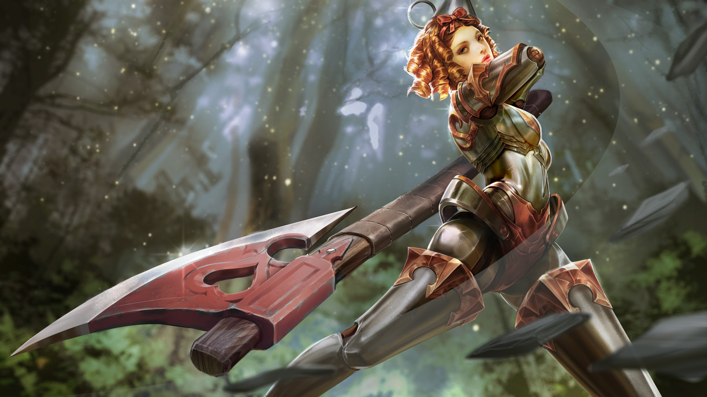
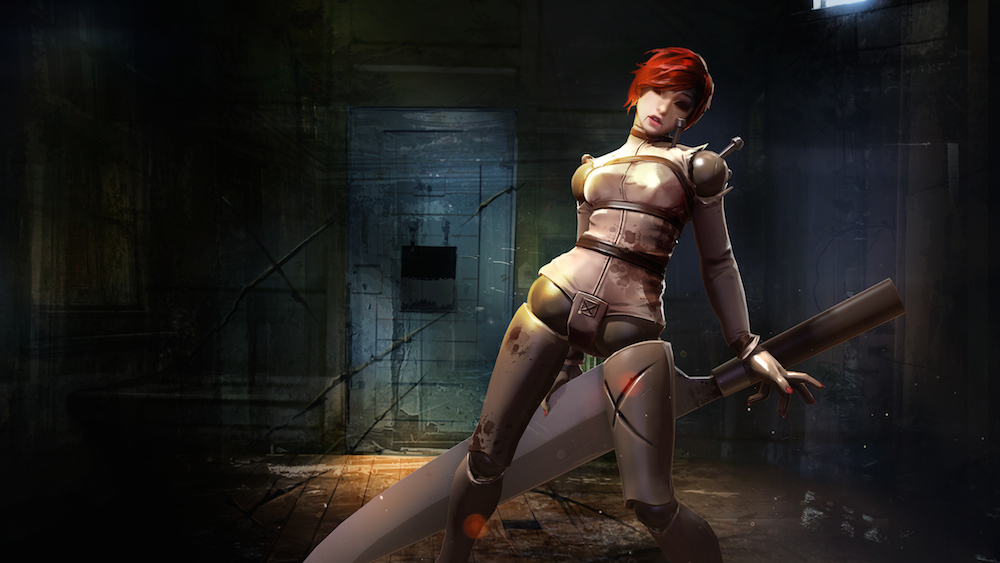

# Alpha Lore

## ‘WHAT KRUL SEEKS’

“Do it!” roars the undead monster at the round metal eye of the turret, half grown over with brambles and rattan. “Put a hole in me! Blow me apart!”

If only it would work.

The turret remains silent, but he can smell recent explosions. Someone is keeping it loaded. Someone is summoning the minions that come through the choke point beyond the turret, past the shambles of what must have once been a rock fortress, in waves. And beyond that someone may be what he seeks.

So close…

Krul drags his left leg, nursing a nagging sting of magic in his thigh where some spell hit him earlier. Another_someone_, now lost to the world. The smell of summoning drifts over the rock face and he grimaces, grinds his teeth. More minions coming. Ugly bastards, no necks, no language, nothing in them but fight. He punches his leg to get the sting out and takes an unnecessary deep breath. A habit from a former existence. The air leaks out through the sucking wound in his chest, fogging up the cold steel trapped there.

Every step is pain, and he runs hard. Catches the biggest of the idiot minions by surprise, flattens him fast,\_ignore\_the pain, ignore the pain, ignore the… Tearing into the minion’s belly is good, the only good thing. A distraction from the misery that threatens, in every moment, to lay him flat. The minion’s dark insides are slippery in his hands; their bellies come apart like cobwebs, their legs detach easy as fly wings. He screams into their faces, spewing spittle. His insane laughter echoes through the battleground. Their souls suck away from their dying carcasses and feed him. It is his only satiation.

There is blood, there are limbs, there are gurgling death-screams, there are pieces of once-living creatures clinging to Krul’s teeth and nails when he sees her standing atop the ruins of the fort. Human from the look of her, tall and still as morning, a sword buried between cracks in the rock, eyes impassive. His face, or what is left of it, cracks open into a grin.

“Hullo, beauty!” he calls.

Her response is the slow pulling of her weapon from the rocks, that shing of steel.

“You cannot protect it from me,” he growls. “Best run now and let me at it, before I destroy your best assets.”

She leaps, falling hard onto him, sword front, magic buzzing around her like bees. She is good with her weapon, well trained. He might have respected her, once. She gets a few slashes into him, his half-dead flesh sagging apart where she aims. He swings at her, hits only air, circling, snorting like a devil, dodging as best he can until she turns the sword over her shoulder and pounds him good in the brow with the hilt. He lunges, closes the gap between them, roaring his dead breath onto her, then her valiant cry is cut short by his fist round her throat.

“Pretty thing.” He licks her cheek while she squirms; her sword clatters on the stones between them and he kicks it away. He’s had enough of swords. A squeeze, and her neck breaks in his grip. Her life flows away from her and into him and she collapses, forgotten the moment he steps over her, toward the turret.

So close…

There is no one left to man the cannon, to feed it gunpowder and magic, no one to summon the thick-necked bastards. His right foot leaves bloody footprints and his left leg drags smears of minion gut all the way through the choke point, beyond the fortress, to the well.

To the dead well.

Perhaps once, the well had charged crystal; perhaps heroes had once guarded it. Perhaps he would once have found salvation here. But there is nothing now, nothing stirring in the well, only shards of broken crystal lying about, hardly anything worth defending.

Hope lost, the world comes back to him. The rhythmic\_bzzt bzzt\_of insects. Birds complaining. Cold coming on, sinking into his muscle, cramping him up all around his eternal wound, whatever is living about him trying to reject the foreign thing rammed through him. Pain and hatred.

He allows himself one agonized scream before stalking back into the bush. There is another road there, to the Halcyon Fold, that he must now take.

## ‘ALPHA’

The dark room rippled with an eerie, surgical-bright glow centered on a glass tank at the center. Inside, a pale woman floated in a bowed shape, belly highest, swaying, her shaved head thrown back as if in laughter. Tubes snaked inside the glass and attached to nodes in her chest and temples. Great wounds in her torso had been stitched and bound together with white bandages. There was a low hum, the sour smell of chemicals and an echoing rhythmic beep that matched the slow beat of her heart.

In one corner of the room, under a glaring light, a dwarf in thick safety goggles stood on a stool next to a headless robot in the shape of a woman. His power drill revved and died, revved and died, as he worked.

The door opened, startling him. The dwarf cursed and rubbed at a scratch on the white armor, ignoring the blind queen and the two guards who followed her. The queen pressed her fingertips to the tank. The raven on her shoulder glared through the glass.

“Ungrateful wenches,” she hissed. “What would they have been without me? Wives. Mothers. Forgotten grandmothers telling boring stories. I saved them from mediocrity. I made them dangerous. I gave them a skill, a purpose, a family … and how am I repaid?”

The two Stormguard women looked at one another, then back at the tank. “We returned -” began one, but the queen continued as if she hadn’t heard.

“Betrayal. For some romantic notion. For a child who knows nothing of building and guiding an empire. But not you, my child.” The queen rested her cheek against the glass. “You will be more powerful than any soldier. You will never tire. You will never question me. You will never betray me. Because you cannot.”

“Does that mean I have your permission to put her together?” called Frankie without turning around. “I can get her head off and have her configured by tomorrow.”

“Yes,” said the queen. She turned from the tank to smile in her terrifying, eyeless way, at the only two Stormguard who had chosen to return. “And you, my loyal girls, will help me test her strength.”

## ‘THE DESTRUCTION’

#### —— Hullo, Beauty… —— Hullo… —— Hullo Beaut-beaut-bee… \#~$ REBOOT INITIATED: STAND BY… … BUFFERING… … TARGET DETECTED –&gt;ENGAGING.

Frankie and the veiled queen stepped along the scuffs, slides and stomp-marks scattered across the packed-dirt training yard. Pools of blood hardened into dusty paste around the bodies of Livia and Elena, the two Stormguard who had chosen to return. Alpha stood at attention, still as death, her mask and armor undented.

“Harsh,” said Frankie.

“Necessary,” replied the queen, “and impressive. No one in the world could have defeated either one of them, and your creation ended them both in moments.”

“She’s unstoppable.” Frankie rapped his knuckles on Alpha’s knee. “Had some bugs to work out with her memory drive. Not easy, wiping everything except how to fight. I patched the issue with an automatic reboot…”

“Is she ready?”

“Yeah. Directive is uploaded.”_    
_

~

#### —— You cannot protect it from me. —— Protect it. From me. Best run now. Destroy. —— Now before I destroy… —— …your best assets. \#~$ REBOOT INITIATED: STAND BY … BUFFERING… –&gt; PATROL MODE ACTIVATED.

Quick as fire with wind behind it, word spread through the scattered Eventide cities that the\_blancorojos\_were not to be trusted, that a technological monster stalked the insubordinate Stormguard. The news came too late for two old families, former royalty who sought to conspire against the queen. They, and six mangled former Stormguard, were dragged out of hiding into the streets to be picked at by the ravens.

~

#### —— Pretty thing. —— Pretty… —— …thing. Pretty thing. \#~$ REBOOT INITIATED: STAND BY … BUFFERING… … STORMGUARD DETECTED… … FULFILL DIRECTIVE… –&gt; ENGAGING.

Outside the oldest tea house in Taizen Gate, masked guards with curved swords stood shoulder-to-shoulder, silent. Inside, the Three Bosses knelt by a low table facing six former Stormguard, their palms facing down on the table according to local tradition.

“The Stormguard is known for causing trouble here,” said Second Boss, a four-armed bear hybrid whose pot belly rested atop the table by his paws and teacup.

“The Stormguard now serves the successor to Mont Lille,” replied Marelde.

“We have no stake in which queen rules the Eventides. Our international politics are neutral.” First Boss’ hologram flickered at the edges of her business suit.

Marelde bent her fingers, cracking each knuckle in turn, watching the Bosses’ eyes. “The queen’s ambition extends far beyond her shores.”

“If you lie, and we give you the location of this princess you seek, you will kill her, yes?” asked Third Boss, a slight man with an unnerving smile.

Marelde ached to look sidelong at the other women, but an unsteady gaze was a sign of weakness in Taizen Gate. Besides, she ever heard Catherine’s voice:_A shieldbearer’s first line of defense is her eyes_. She turned her hands over on the table, palms up. “I will not demand your trust, but for all things, there is a price. Use your best judgment and name yours.”

Screams, and the clashing of steel from outside, interrupted. The Stormguard jumped onto the low table, kicking away the teapots and arranging themselves in defensive position around the three mages. Second Boss rose with surprising speed and dropped to all fours. First Boss flickered and disappeared. Third Boss opened his kimono, revealing a vest covered in small blade sheaths.

“So much for no weapons allowed,” grumbled one mage, blue sparks exploding from her snapping fingers.

“Not yet,” said Marelde; magic conjuration would be detected all over Taizen Gate.What if your first line of defense is all you have, Catherine? she thought, but Catherine was far away, and she had no shield.

The screams outside stopped. The outer door slid open, letting in the night’s birdsongs and thick summer air.

“Now,” ordered Marelde, and the room filled with the snap and buzz of magic as a heavy sword split apart the room’s paper wall from ceiling to floor and a machine stepped inside.

The room erupted in flashing blue magic and the roars of Second Boss. The machine moved forward without pause, slicing through its former comrades, deflecting the magic bolts, Third Boss’ blades clinking off its armor. Within minutes, Alpha stood in the post-battle silence scanning the room with glowing eyes. Six women lay broken and bleeding at her feet; two bosses shook with terror in a corner. Her sword had cleaved the table, and Marelde with it, in half.

#### \#~$ DIRECTIVE FULFILLED … RECONNAISSANCE MODE ACTIVATED. … DIRECTIVE: FIND STORMGUARD. —— Pretty thing…

##  ‘DAISY, DAISY’

Daisy squeezes into a corner of the workout room, bare feet sunk into the mat, arms bent, hiding her face behind bruised forearms and thick leather boxing gloves. Kestrel, a year older at fifteen, weaves close and strikes Daisy’s obliques, tight to cramping; when her arms drop, the strikes come at her jaw and temples. Tears slide out of Daisy’s swollen eyes, mixing with blood and snot from her nose. A hit to the belly sucks the air out of her and she crumples, arms over her head.

Kestrel raises one glove. “Hey! Daisy’s cooked!”

The instructor stalks over, glaring at the folded-up girl. “Never get hit, you fear every strike!” she says in a brusque accent. “Today fall down, cry, skin turn purple, blood come out. Tomorrow, still alive.”

Kestrel winks through her own black-and-blue shiner. “Get up. It’s your turn next.”

“I can’t,” sobs Daisy. “I can’t.”

“Take your mind out of the pain.” Kestrel wipes at her nose with one leather glove. “I count the hits.”

Daisy looks up, wincing. “That works?”

Kestrel shrugs. “Get up and try.”

~

“Did you hear that?”

Atop an airship tower, the last of the Stormguard waited for death. Kestrel and Catherine stood on the landing pad; four kept watch in the windowed control room below.

Amie made a cat’s cradle out of stringy blue magic between her fingers, looking out at the winking lights twisting around the towers of the Royal Quarter. “Like a ding?”

Ivet pressed her nose flat on the window and sighed a big foggy spot. “Taizen Gate bosses are notorious for being full of crap. We’d have known if the queen had some killing machine.”

The ding came again, louder, from the elevator at the center of the room.

The guards crouched as the elevator rose up the levels of the tower. The swordswoman flipped her broadswords and caught them. “Now ladies,” she said, “that could be anybody. Let’s not go killing a pilot or something.”

A last ding and the elevator doors opened.

“It’s true,” whispered Amie, the magic strings disintegrating. “Catherine!”

“Too late,” said a shieldbearer, racing to the elevator. The shield burst into flames, slamming into the machine, pinning it to the far wall.

“ONE,” it said.

The shieldwoman flew back out of the elevator and slid along the floor to the glass wall, her shield and torso cut open, leaving a thick trail of blood behind.

“I’ll make scrap out of that thing,” said Ivet, charging forward, axe flourishing with blinding fast speed.

The machine took the hit to its metal arm. “TWO,” it said in its mechanical voice, and pushed back. Ivet launched backward, her axe handle split in two, blood leaking from the top of her head.

The third Stormguard stumbled backward over control displays and chairs, her broadswords crossed in front of her face. The machine plucked up the woman by one arm and slammed her into the window, cracking the glass. The swords slipped to the floor.

Amie twisted her fingers, magic sputtering as she struggled to find her center in the swirling mess of panic. “Comeon!” she cried as the machine drew near. The blue light solidified, formed wings, became a giant screeching phoenix in her arms. “Go!” she commanded, and the phoenix dived, grabbed the machine with its claws and dragged it back into the elevator.

“THREE,” said the machine, then, “FOUR-FIVE-SIX” when Amie chased after it, ball after ball of explosive magic flying from her fingers. The phoenix forced the machine onto the elevator floor, pecking at its mask, screeching to wake the dead.

~

“That’s Amie’s bird.” Kestrel lunged back, four energy arrows forming in her right hand. Catherine ran to the stairs, her shield thrumming, as the landing zone exploded in an eruption of concrete. The machine leaped through the roof, snapped elevator cables wrapped round its blade, the elevator freefalling through the tower with Amie inside.

The machine’s blank mask settled on Kestrel. “SCANNING. TARGET ZERO-TWO-THREE. STORMGUARD. EXTERMINATE.”

Kestrel let loose three arrows in quick succession that pierced into the machine’s knee and neck joints. “SEVEN-EIGHT-NINE,” said the machine.

Kestrel paused, an arrow in its nock.

Catherine sped in from behind, slamming her arcshield into the machine’s back, spinning it toward herself. She held her breath and formed the shimmering magic shield around her, watched from inside the curved, pulsing bubble as the machine stuttered, “TEN-EN-EN-EN. SCAN-AN-ANNING TARGET ZERO-ZERO-ONE. STORMGUARD. EXTERMINATE-ATE-ATE.” The sword arced through the air, slamming into the bubble. The shield shattered in a rain of energy shards but not before it reflected the strike back at the machine, crumpling it. “ERROR. ERROR.”

“Catherine, wait!” screamed Kestrel.

Catherine positioned sideways, shield high, back knee bent, jaw tight as the machine took a step toward Kestrel, one leg dragging. Kestrel loosed the arrow into the eye of the machine’s mask.

“ELEVEN,” said the machine, stepping like a broken doll as the arrow disintegrated. “COUNT… count the hits.” Her mechanical tone fell away. “I… can’t. Pretty thing. Daisy’s… Daisy’s cooked. I can’t. Kestrel?” The sword dropped from her hands.

“What the hell did she do to you?” cried Kestrel.

Catherine edged forward, shield up. “It could be a trap.”

“It’sDaisy,” said Kestrel, slamming her fist into the mask until it fell away, revealing a woman’s horrified face.

“Where am I?” whispered Daisy, clenching her fists. “Hurts. It hurts. Help… Kestrel, help-ELP-ELP-ELP…” Her eyes stared into the distance, her expression blank, her fists relaxing.

“What’s happening?” cried Kestrel in a panic. “Is she dying?”

“SYSTEM REBOOT. STANDBY,” said Daisy in pleasant monotone. Her eyes closed.

“No! No rebooting!” Kestrel slapped Daisy in her cheeks. “Stay here, Daisy.”

Daisy’s eyes opened. “I killed them,” said Daisy. “I killed all of them. Why did I kill them?”

“It’s not your fault,” said Kestrel, gathering up the machine into her arms.

“I can’t stop. It’s coming… back. I can feel it. Killed them. Best run now. Run. Run. I can end it but you have to RUN-UN-UN-UN can’t stop. STANDBY. Stop it. Can end it. Run. RUN TARGET ZERO-TWO-THREE. RUN, TARGET ZERO-ZERO-ONE. Pretty thing. TERMINATION PROTOCOL INITIATED. STANDBY.”

Daisy went still. There was a click, and an energy barrier appeared around her. Catherine grabbed Kestrel by her arm.

“We have to help her,” whimpered Kestrel, but Catherine yanked her away as blinding light shot out the seams in Daisy’s armor.

“There! Go!” Catherine pointed up, yelling over the sound of the airship that hovered above. A rope ladder fell from the deck and Catherine shoved Kestrel toward it before dropping under her shield. Her eyes squeezed shut as the blast shook the tower.

Kestrel clung for her life to the rope ladder as the explosion blew the ship sideways, the city spread out below, the sea ahead, the Halcyon Fold a dark strip of land in the far distance.

Catherine rose, shaking, to her knees. The arcshield smoldered. She tossed it down and looked up to where she knew the raven would be circling, watching.

#### \#~$ SYSTEM REBOOT… … IDENTITY: ALPHA, STORMGUARD. … DIRECTIVE: ELIMINATE STORMGUARD. … LOADING COORDINATES: HALCYON FOLD…

## ALTERNATE FATES

### ‘HEARTLESS’ ALPHA 

#### 'MELTING DAY'

The lion and the scarecrow followed a line of marching minions, each carrying a bowl of ice cream, to the tin castle’s tin courtyard. Tin flowers bloomed all around a tin fountain from which steaming coffee bubbled. At the top of the fountain stood the Tin Queen of the West.

“Look! It is our old friend, and the fountain of wizard’s brew, just like you promised,” said the lion, feeling relieved for the first time in days.

“_Oui_,” said the scarecrow. “It is Melting Day, when everyone in the West celebrates the melting of the Wicked Witch by eating ice cream melted with coff… wizard’s brew. But what is this?”

The crowd stopped abruptly, minions knocking into one another, as three powerful magicians blocked the fountain.

“When the witch ruled the West, minions had a purpose!” cried one magician.  
The startled minions clutched their little bowls with both hands, looking to their queen whose painted tin face showed, as always, no expression. Her voice rang out: “My darling minions-uns-uns, the Wicked Witch created you to fight. Now you are free to serve your own purpose.”

Another magician sneered. “Without the witch, you have no enemies. Without enemies, you fight one another!”

The minions squabbled over whether to believe the magicians or the queen. Handfuls of ice cream flew as the argument intensified.

“Naughty minions. How quickly you forget your bondage under the rule of the Wicked Witch!” called the queen, but the magicians countered.

“Minions deserve a great leader!” yelled the malicious magician. “You must embrace the principles that made the West great.”

“Build a fire!” cried another magician. “Melt the Tin Queen!”

The minions cheered and built a roaring fire in the tin courtyard. “Melt! Melt! Melt!” cried the minions as one. The queen gripped her axe atop the fountain, tears flooding down her tin face.

“Why does she do nothing?” cried the lion.

“Now that she has a heart, the tin queen has too much compassion to fight the magicians,” sighed the scarecrow.“

“If only I could reach the fountain, I could drink up some courage,” whined the lion, “but the magicians have it surrounded.”

“Oh well,” shrugged the scarecrow. “I suppose the tin queen must be melted.”  
The queen flicked away her tears:_clink clink clink_, then opened a compartment in her chest. From inside of herself she removed the sawdust-stuffed silk heart that she had received from the wizard. In horror, her friends watched as she dropped her heart into the fire and took up her axe.

“Target: magician one-un-un,” said the queen, and leaped down upon the closest of the magicians.

“Let us help her,” said the scarecrow, taking up his scythe.

Bolts of magic light flew, zapping the queen as she cried out in electric pain.

“I can’t do it,” whimpered the lion. “My heart is beating too fast.”

“Do it for our friend, who has no heart,” said the scarecrow in a gentle way.

The lion’s lip curled up, his teeth bared, and he leaped into the crowd. With a wry smile, the scarecrow followed, careful to avoid sparks. The lion’s commanding roar terrified the minions away and his axe split one surprised magician in two. The scarecrow’s vials exploded, turning a second magician into a poof of black ash. Glinting in the morning sun, the tin queen’s axe whooshed through the third magician. All watched in horror as his head landed in a bed of tin roses.

There was a short silence, then the minions leaped in the air. “Hooray!” they cried, triumphant, for they were a simpleminded lot. They went about extinguishing the fire and collecting up their discarded ice cream bowls while the three monarchs reunited.

“Thank you-oo-oo,” said the tin queen, “but as long as the minions are not given a purpose, they will be swayed by anyone.”

“Then a purpose you shall give them,” said the scarecrow, who had always been the cleverest of them.

Now, people come from the North and South and East to watch the Annual Minion Water Balloon Tournament. The Tin Queen rules with compassion, the Forest King with courage, and the Scarecrow King with intelligence, all of their lands at peace.

### ‘BROKEN DOLL’ ALPHA 

#### THE LOUD VOICE & THE QUIET VOICE’

She’s going to come back. She always comes back, and at first her mind is fuzzy and she doesn’t remember our names, but then she remembers and she plays with us again. Her mama put us all up in the attic in a box so I set up the teacups here. I took the chipped one like always, the one she threw the first time she had to go away. She never likes to go away but her mama cries and her daddy carries her and we all watch, very still like she taught us until she comes back. When she comes back, she dresses me up like she dressed when she was away, and she plays like the grownups and in a deep-deep voice she asks me questions like

_Why do you think that you can read minds?_

and then she pulls my strings to make me dance and I am her and in her own voice she says

_You have two voices, loud and quiet, and the loud one asks questions and the quiet one says it’s past your break time and your rent is due._

Then in her deep-deep voice she asks

_Do you ever think about hurting people?_

and then she sings

_It’s not my fault the carving knife is so shaaaarp! It’s not my fault the carving knife is so shaaaarp!_

And in her deep-deep voice she says

_Eat the candy; it tastes like cherry and makes the thoughts go away. That’s a good girl, eat it all up._

and she smashes red-hots into my face.

It’s been a long time since she went away, but she’s going to come back because she loves us and there’s no tea where she goes, and there are grownups with loud voices and quiet voices, and we only have quiet voices, very very quiet.

### ‘TOY BOX’ ALPHA 

#### ‘PRETTY-PRETTY’

You think she’ll come back to us? You’re dumb. She\_can’t\_come back know why? Because she can hear the quiet inside voices of the grownups and grownups are afraid, so they make her stay in a little room with a little window.

You have just that ugly jacket but I have the pretty-pretty dress and the pretty-pretty hair so I’m the prettiest so I’m in charge and we aren’t going to wait any more. You take your knife and I’ll take this sharp thing I found in Mama’s sewing room and we will go to the Bad Place and save her from the Bad People and if they try to stop us we will put our sharp things into their soft-soft eyes, and she will never have to eat the candy again, and we will play house just her and us dollies forever and ever and…

### ‘CLOCKWORK HEART’ ALPHA 

#### ‘REAL GIRL’

We poked out the eyes of the Bad Doctors with our sharp scissor points, and we took their keys, and then I colored my shoes pretty red in the mess we made in the hallways. “Look at me; look what I can do!” I said, twirling in the slippy-slidey, but the other dollies said “Come_on_, we have to find her.”

We climbed on one another to peek through the keyholes until there she was, all alone in the white room with the white hug-jacket. We tried keys until one turned, creaky-squeaky, and then we were all four together again. We let her out of her jacket and she squeezed us all in a bunch.

“Look at me; look what I can do!” I said, and I showed her my _jeté and my plié_, and she hugged me and told me I was the best dancer she’d ever seen.

“Let’s go home,” whined the other dollies.

“I don’t wanna go back to the attic and the Mama and the Daddy and the memories,” I said, and I stomped my foot.

“Then you shall have an adventure instead,” said our girl, and she put the key into my back and turned it, and my heart started going ticky-tocky. “You’re a Real Girl now, so you can find a new home for us.”

“Find a home with parties,” said a dolly.

“Find a home with cake,” said another dolly.

“And lots of dancing,” said our girl.

So we ran through the slippy-slidey away from the Bad Place forever, and I went by myself to find a home with parties and dancing and cake where we could all be together again.

