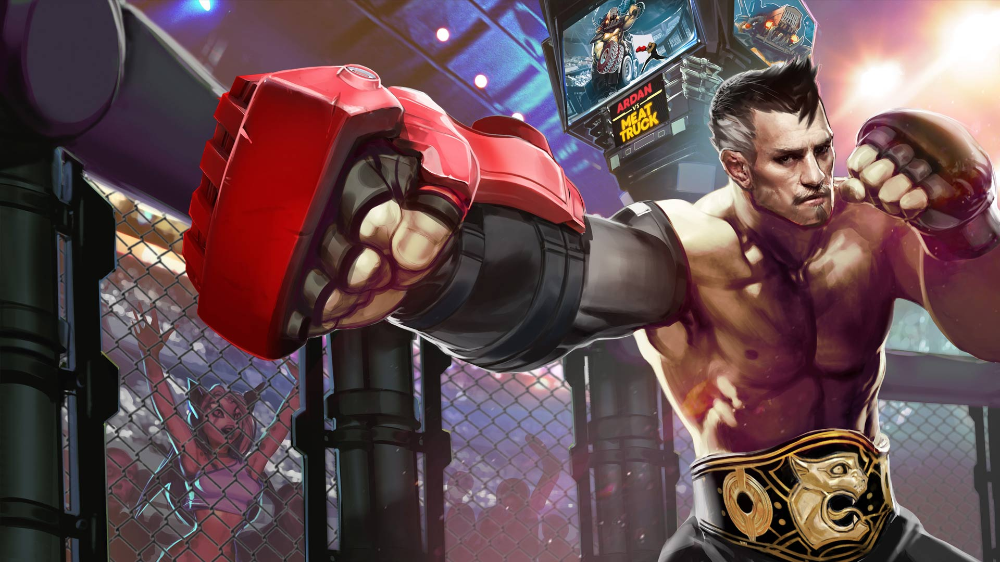
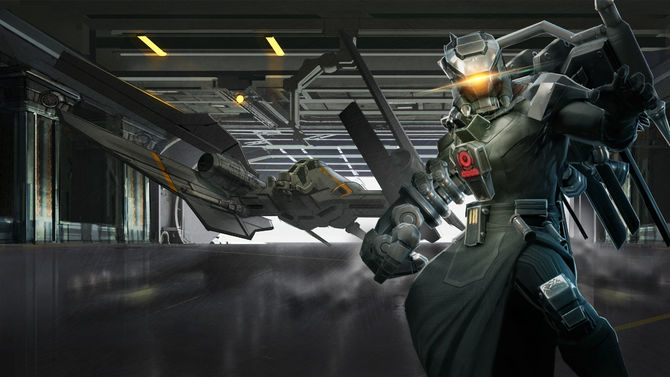

# Ardan Lore

## ‘IMPOSSIBLE DECISION’

“I do not need your permission to buy a goat,” Julia said. “Goat milk is delicious, and we can make cheese.”

They’d been arguing all evening. Ardan was hunched over his power gauntlet, sanding down the edges of a grill he’d removed to improve air flow. Outside in the yard, a goat shrieked into the moonless dark. “Goats stink and scream like fiends,” he grumped. “It hasn’t stopped for an hour. How will the twins sleep?”

“The kids need a pet. Are you dropping metal shavings on my divan?”

“And who will make this alleged cheese? When have you ever made cheese, your highness?”

“I could make cheese!” Julia shouted. She stomped out of the room and slammed the bedroom door behind her, the goat’s cries dramatizing her exit.

Celeste toddled out of her room, rubbing sleep from her eyes. “Dadda? Is Mamma alright?”

She had her mother’s accent. Ardan plucked up the toddler in his unarmored arm and kissed her cheeks. “Mamma is being ridiculous.”

“What is ridick oo luss?”

“It means she brought a goat home without talking to me about it.”

“I like goats.” This from Vox, who wandered in after his sister. He seated himself on his father’s foot, wrapped his arms around Ardan’s leg and rode along as Ardan took Celeste back to bed, staring out the window toward the screams.

“You like the idea of goats. None of us actually know how to care for a goat.”

“There’s a baby crying outside,” said Celeste, half asleep.

“It’s the stupid goat,” said Ardan, planting her back in her bed.

Vox uncurled himself from his father’s leg. “He’s afraid,” he said. “Maybe lonely.”

“It’s a she, Vox. At least I hope it is a she, or your mother’s dreams of cheese are –”

Ardan paused, turned toward the window.

The goat had stopped screaming.

His adrenaline spiked.

“Hide, both of you. Do not open the door.”

There was no time to make sure they obeyed him. He ran to his bedroom. “Julia,” he hissed at the bedroom door. “They’re here.”

Julia opened the door. Her face had gone white. “Now?”

“Outside.”

The armor stood in pieces around the front room in various states of renovation. Tools littered the floor. “Legs first,” he grumbled, stepping into the sabatons. Julia scrambled to her knees in her nightdress, a poor but necessary replacement for a proper battle squire. She pinched her fingers on the knee clamps, struggled under the weight of the chest pieces.

The button panel whirred and crackled with static, then burped out: “System. Offline.” Ardan slammed his left fist onto it. “Worthless damn power source on this model…”

“Shh.” Julia’s hands were black with oil, her face smudged as she attached the generator to his back and connected it to the power gauntlet. She stared out the door, into the hall. There was no sound. No disturbance. No goat. “Are you sure they’re…”

“System. Online.”

Glass broke. Ardan turned sideways in time for a metal arrow to slice a scratch through his breastplate, just under his chin, and thud home in the wall opposite the front window. Ardan cursed and squared up, the wood floor creaking under his armored weight. “I’ll watch the front door.”

“But your cannon arm!”

“It’s useless, unless you want me to blow up the house. Stay behind me.”

Julia closed her eyes, turned her palms upward. “I’ll protect you,” she murmured, her voice dreamy, green light forming in her hands.

Ardan winced away from the twisted-guts feeling that magic always gave him. “I can handle myself,” he grunted.

A forearm appeared over the window, decorated in an archer’s gauntlet, and then the archer herself swung inside. Another woman followed and drew her sword. More came in behind her, magicians and assassins, all wearing the same insignia.

“Stormguard!” he yelled, but Julia was lost inside her trance, eyes rolled back.

Ardan’s armor groaned and buzzed as he moved forward, painfully slow, but he was grateful for it when the Stormguard attacked. They moved in tandem, each with a weapon they’d held since childhood. He ran forward, energy buzzing through the armor, propelling him, heating the metal to burning, steel cracking against the breastplate. When he backhanded the archer across her face, he left a burn mark. She crumpled, her bow clattering to the floor.

The others raised shields of wood, metal and magic to counter Julia’s trance and Ardan’s assault. He stomped forward and plowed into them, knocked them from their feet, sent them flying in a crunch of bones to the wall. Their blood spattered the divan. They rolled in shattered glass, discarded weapons and their own knocked-out teeth. He could not resist every attack: Blades sliced through his unprotected arm and his cheeks; magic stung and froze him with deafening whipcrack sounds. But he was a wall between the enemy and his wife, and all the while, he felt warmth coming from her, a blanket that enveloped him, closed his wounds, melted the ice and gave him strength. It churned his insides, these unnatural talents, but he’d deal with the sick when his family was safe.

Then, the blast.

All went silent and cold. His teeth clamped shut. A shock pulsed up through his legs, his arms, his throat. He couldn’t scream. He couldn’t blink. Paintings slid from the wall and the bolts fell from the front door. He could hear the static noises from his armor display, the groans from the pile of wounded Stormguard, but he could not move. He could only watch as the front door opened and the last of the Stormguard stepped inside, as if invited. She surveyed the room, then snapped her fingers at two of the guard who were scrambling to their feet even as Ardan struggled to move. She pointed to the twins’ room and the two guards sprinted that way.

The woman walked from the door, past Ardan as if he didn’t exist, to Julia, who stood frozen in her nightdress and bare feet.

“Catherine,” gasped Julia.

“Such a shame,” whispered Catherine as she pressed her sword against Julia’s chest.

Ardan’s heart pounded out one beat. Another. Air filled his lungs and he coughed. To his right, the two Stormguard emerged carrying the twins, stunned as rigid as he. The other Stormguard rose, some shakily, some bleeding, all stone-eyed and with a firm grip on their weapons.

To his left, Julia stared into Catherine’s eyes.

His heart beat a third time.

In another heartbeat, his children or his wife would be dead, depending on which way he ran.

He ran.

The general’s sword, turned sideways, slid easily between Julia’s ribs. Her last breath was his name, and with it came the last otherworldly green swirl of her magic. It hit him, Julia’s last gift becoming part of him, wrapping around his insides, giving him the burst of strength he needed. Ardan wrapped the twins up in his arms and crashed out of the window. The two Stormguard who had taken the children lay unconscious. There hadn’t been time to kill them… or to hold his wife as she died.

He fled from the house into the dark, past the poor dead goat, whose screams had been silenced by one well-placed arrow through the throat. The children remained silent, in some lucky instinct, leaving the questions to the night owls in the trees.

## ‘ABOVE BOILING BAY’

“Stop swinging.”

From the top car of the rusted-out Carnie Wheel in the abandoned amusement park, Celeste gazes down at the mismatched buildings and colorful blinking lights of Taizen Gate. Up there, she can almost forget what it’s like to bump through the crowds, her fingers curled up tight in her brother’s so as not to lose him. How the merchants shove dead fish and live chickens and beeping gadgets in her face in the markets. How she never sleeps well thanks to the MECHANIC sign over her father’s garage that pulses red through her curtains. How the few stars that appear above the bright city call to her.

Vox grins, not even holding on, shifting his weight back and forth hard. “What? Like_this_? Is this what’s scaring you?”

“I’m not scared.”

“Because if you’re scared, I’ll stop.”

“Shush.”

During the day, she keeps one hand buried in her pocket, a warm sphere of light like a marble clenched in her fist. Just to feel right.

“Admit you’re scared and I’ll stop.”

“When you fall, I’ll laugh.”

Above the noxious halcyon smog that burps its way out of Boiling Bay, the sun sets in dirty oranges and reds. Through the haze that roils a mile inland, giant churn cranes wander, their heads poking up above it to breathe, making swirling valleys that fold in on themselves and disappear. By nightfall, the ground will be packed with the Taizen teenaged underground, shoulder to shoulder, cheering through gas masks. Atop the Carnie Wheel, though, the twins breathe easy.

The amusement car creaks and moans as it swings. “Do you think they’ve found us?” asks Celeste. Everyone in the Taizen underground knows when “tourists” arrive. They try to be stealthy, but no matter how well they imitate the fashion, no matter how good their accent, when they start asking questions, locals spread the word. And when they have rune tattoos, or the sulphur-smelling snap of magic about them, the back tables of the tea rooms buzz with talk, none of it friendly.

“I hope so.” Vox shrugs. “Tired of hiding anyway. Let them come. I want to look in their eyes.”

“You want revenge for Mamma.”

“Don’t you?”

“I want us safe, same as Dad.”

“Safe is no fun.” Vox takes up the swinging with renewed violence. Celeste’s annoyed protests resound below the smog.

## ‘THE MASKER RAGE’

00:00.05

_It takes five seconds to fall from the top of the Carnie Wheel._

_At first Celeste flails, her hands pinwheeling through empty air, the deafening squeal of metal rods shearing apart drown out the hammering beat of her heart._

_But then, falling through the bright burning magic of her own design, her eyes close. Her arms relax. In five seconds, every bone in her body will splinter and she will die. Her overprotective father has been right all along, and there’s nothing she can do. Time slows, loses meaning._

_Five seconds._

_Celeste’s mind wanders._

00:00:04

For years they braved the noxious-aired abandoned carnival to climb up the Carnie Wheel where they could be alone and play with magic. “Do the thing,” Vox said, then watched as a little swirl appeared in the air over Celeste’s outstretched palm. The air there became not-air, and her hand under it became not-a-hand, and what they stared at became not-a-thing, an absence of a thing, the end of a thing, the last dying breath of a tiny star, collapsing in on itself.

“My turn,” he said, and closed his eyes, raised up his hands. For a few seconds, nothing. Then, Celeste heard it. Sparrows that had been calling out of sync sang together, this little melody, and Vox hummed along. He sang little lyrics with it to crack Celeste up. “This is the Celeste song, I made up a Celeste song, everybody sing the Celeste song…”

00:00:03

_Stars slide between her fingers as she falls and falls and below, their eighteenth birthday rave churns with chaos, the desperate screams muted inside gas masks._

The Masker Rage began at nightfall, the smog layer blinking with the raver kids’ glimmering crystal necklaces and the glowing designs they’d painted on their skin. Carnies had cut open the security fences and charged admission; they snaked through the crowd selling drinks spiked with who-knows-what, their pickpocket kids cleaning up.

“Wait,” whispered Vox. Celeste’s hands radiated with heat. Vox nodded to a beat coming from inside of him, then inside her, then inside of everyone on the ground, their heartbeats pounding in tandem. His fingers snapped and the sound was a crack that scared the cranes. Their wide wings stirred up the smog, pulled it back like a stage curtain, revealing the twins’ faraway silhouettes to the crowd. “Okay. Do the thing,” sang Vox, so Celeste held out her palms and

let

go.

The stars above coiled, then their hot light fell, bursting into spirals. Vox sped up the beat, and from nowhere and everywhere there was music, and the ravers danced, wild with elation and anticipation and whatever was spiked into the Carnie drinks.

Stars shot through her and exploded from her hands into fountains and geometric patterns that danced along to the music, and inside of that blaze of light and sound the twins were free.

00:00:02

_The ground flies up to meet her, littered with the scattered bodies of ravers who’d gotten in the way_. They fell in clumps, trampled under swords and shields and blasts of blue magic. The tourists threw off their cloaks, revealing uniforms in Gythian gold and Stormguard white. The singing turned into panicked shrieks and Vox’s song became a march, music for unifying armies and terrifying enemies.

As the music mutated, the starlight moving through Celeste’s hands turned into searing drops that incinerated whatever they touched. Showers of pain. On the ground, puddles of starlight exploded. The fighters lunged out of the way of the spraying light. Sparks burst on one another, lighting up terrified people running toward the city.

“What’s happening?” Vox screamed, and the sound came out in song, another layer to the music.

Celeste tried to answer, but her tongue crackled with light, like popping candy sparklers, and below them, the ground under the Carnie Wheel became not-ground, the absence of ground, the death of the falling stars, just like the baby black holes she had always made to delight Vox, but big and churning, swallowing.

Vox clapped his hands once. “Celeste!” he cried,

“STOP!”

The world rumbled with Vox’s sonic boom, and an explosion of starlight blasted from below. Cracks splintered underground and the Carnie Wheel tilted hard, jerked out from under their feet.

00:00:01

_Celeste searches among the faces of the Stormguard for the one who killed her mother, but finds instead the red shapes of her father’s armor, scorched black in places, surrounded by charred, crumpled people. His hand reaches out. There’s a look on his face she’s seen before only once._

00:00:00

## ‘VANGUARD UP!’

Ardan slammed his fist into the armor’s control panel.

“Command?” responded the computer voice.

“Vanguard up!” he screamed.

\*

It hadn’t been enough, Ardan thought, running with sidewalk-splitting clomps toward the cracked, tilting Carnie Wheel, clutching the tattered Masker-Rage poster in his free fist. It hadn’t been enough to escape the Stormguard by the dead of night. It hadn’t been enough to use assumed names and hide every day for more than a decade. It hadn’t been enough for the kids to watch their mother die.

Had his rules been so impossible? Don’t draw attention to yourselves. Don’t let anyone see you playing with that magic stuff. Don’t tell anyone where you’re from. Don’t show anyone the curtained-off part of the garage where he modified the power armor after hours, adding generators and liquid coolants and boosters. He’d always known that his rules wouldn’t be enough.

And now, his children were falling.

_Don’t draw attention to yourselves.\_And they’d put up\_posters_.

\*

Breathing hard through his respirator, Ardan raced through piles of trash and wild churn cranes, knocked over a few fleeing raver kids and carnies and winced at the battle sounds he’d hoped never to hear again – pained screams, weapons clashing, explosions – but louder than that, the reverberation of a sonic boom that had cracked the wheel at its base. The boom echoed off every surrounding surface. They’d probably heard it at the other end of Taizen Gate.

_Damn it, Vox._

Getting close to the wheel meant dodging the sparking, falling stars that burned and exploded together. One flew past Ardan’s face, struck a burn mark onto his cheek.

_Celeste!_

Ardan roared, bursting through the soldiers gripping Gythian steel, men and women who wanted what Julia had wanted: Celeste on the throne of the Storm Queen.

_Over my dead…_

White-clothed Stormguard swarmed up the Carnie Wheel to escape a sickening nothing into which anything closeby sank. It had been more than ten years, and still the Storm Queen would risk her best soldiers to end his family.

Ardan squinted up through the falling starlight at the shadows plummeting toward him.

“Vanguard confirmed,” the control panel responded.

“Please, be enough,” whispered Ardan, as the holographic barriers crackled to life a few feet from the ground.

The barriers bent but held fast as the twins slammed into them.

Gythians closed in tight as the barriers dissipated and the twins rolled safely onto the pavement.

“We have to fall back, your highness!” cried a Gythian battle mage, blue electric currents moving up his arms. “Retreat!”

“Stay away from my children,” grunted Ardan, swallowing down the sob in his throat, grabbing Celeste’s elbow as the soldiers fled.

Celeste pulled away from him, trembling. “We can’t hide anymore, Dadda,” she said, and ran.

Ardan cursed, but Vox was running after his sister. Close behind, the Stormguard regrouped. Ardan followed, and together they dashed toward the bay, surrounded by what was left of the allied Gythians. Behind them, the Carnie Wheel continued to fall, rusted metal screeching, collapsing on itself, slow as a dream.

A single raven circled above them, camouflaged against the now-dark sky, watching.

## ‘ESCAPE TO THE FOLD’

So we’re headed out of Boiling Bay at top speed, right? Carnie Wheel cars are coming unbolted and like

_BAM-CRUSH_

smashing to the left and right of us, and the Stormguard chase after us with these shields that make this

_ZAP-BZZT-ZAP-BZZT_

sound, and we’re taking fire over those shields, like magic bolts are slamming into people, and a fireball goes

_WHOOMSHHHHH_

through us and creates this freaking puddle of flame that we have to jump over. Dad’s armor is overheating, and this old Gythian war mage who’s doing all the talking is like, “We must escape to the barge!” and Dad’s like, “My daughter will have nothing to do with your old-world politics!” and I’m like, “Can we discuss this later when we aren’t, you know, about to

_die_?”

We race down this old creaking dock toward the_RAAAAAHHHHHRRR\_of these titanbacks that pull the barges. While the soldiers yank on the ropes to float a beast close enough for us to board, the Stormguard march closer, singing a creepy war song. An arrow goes\_SHTOOMP\_into the spine of the guy next to me. What’s left of the first line of Gythian defense stabs at the shields like\_zzzppttt_–_zzppptt_, and Celeste holds my elbow and leans in.

“Do the thing,” she says. Then she smiles at me like everything isn’t chaos, like it’s just us on top of the world again.

So I gather up all the sound I feel. The titanback’s mouth yawns without a sound. The water doesn’t lap-lap-lap against the dock. This energy I’m gathering, it sucks up the Stormguard’s song. The flying arrows don’t whistle. The fireballs don’t crack. The Gythians yelling orders and instructions, they’re silenced. I grab it all, every sound I can find, and ball it all up into my hands. It feels like a beating heart.

I aim it, then I let it go.

It blasts in waves like\_WUB-WUB-WUB-WUB\_right at the line of Stormguard. Then the Gythians go to town on those dangerous dames, slice-n-dicing, and the Stormguard retreat, Gythians chasing after them.

I’m expecting accolades, like at\_least\_someone could act impressed? But the titanback burps out this big noise and the war mage is already trying to get Celeste onto the barge. Dad isn’t having it. He grabs Celeste back by her wrist. “She isn’t going,” he says.

The war mage goes on about how Celeste has to fulfill her destiny and take the throne blah blah blah, but Dad is having none of it. He even fakes a punch at the Gythian mage to make him flinch. Dad says the Storm Queen is threatening their dying civilization and they think throwing Sis at the problem will fix it. Celeste and I are like_whoa_. We learned about the tyrant queen in school, how her armies mow down and pillage other cities, killing dissenters and kidnapping talented kids to be raised as Stormguard soldiers.

It gets crazy-tense, and everyone’s talking about what’s best for Celeste. But it feels like my future’s being decided too. And I got a decision to make…

~~~~~~~~~~~~~~~~~~~~~~~~~~~~~~~~~~~~~~~~~~~~~~~~~~~~~~~~~~~~~~~~~~~~

“If there is a way to end her tyranny, shouldn’t I do it?” Celeste says in that calm way that always winds Dad up even worse.

“Your mother thought she could supplant the Storm Queen with technologist help, and look what happened to her.”

Wrong thing to say to Celeste. The girl is hella stubborn on the subject of Mom. “I love you, Dadda, but I won’t ask permission. They’re my people.”

“And you are going to save them, your highness?” Dad scoffs.

“Dad.” I put my hand on his arm. He shakes me off, so I put it back. “Listen.” And I let him hear.

An echo comes from all around us, a voice from a long time ago. It says,

_“The kids need a pet.”_

Dad spins around, staring all wild-eyed around the dock. “Where…”

_“Are you dropping metal shavings on my divan?”_

“Julia?” he whispers. It’s the first time I’ve heard him say her name since that night.

Then I play Dad’s voice from that night, the part where he’s yelling at Mom.

Dad freezes, his mouth a little open.

“Dad,” I say again. “Celeste is gonna go. This could be the last time you see her. You really want this to be the last conversation you two have?”

There’s this long awkward silent moment where it would be cool of him to say,_You’re right, Vox_, but no. He just gathers Celeste up into a big metal hug. “You’ll always have me,” he says. He’s the first on the barge, then he helps Celeste get on.

“You’ll always have me, too,” I say while hopping onto the barge, though no one hears me, it being such a weepy father-daughter moment, but whatevs.

I’m the only one who hears the last echo, just a whisper, as I’m following my family out of Boiling Bay:

_“Such a shame…”_

\*

There’s all these rumors and tales about how Celeste is gonna challenge the throne of the Storm Queen \(which is still weird for me\), and they’re all epic, about how the Gythians and the Stormguard found out where Dad was hiding her, and they battled it out, and the Gythians took us here to the Halcyon Fold to recruit heroes to her cause, and now she’s dropping stars and taking names. But they leave out all the cool stuff I did. At least now you know the full story… and it’s not the last you’ll hear from me.

## ALTERNATE FATES

### ‘CAGEFIGHTER ARDAN' 

#### ‘FIGHT NIGHT’

SUGARVENOM: Hello and welcome to Fight Night on the Halcyon Fold! I’m here with Playoffbeard live at the final matchup of the evening, the one you’ve all been waiting for: ‘One Punch’ Ardan is all set to defend his title from Meat Truck, the up-and-comer who’s been running over his opponents.

PLAYOFFBEARD: The smack talk has been brutal over the last several weeks. Meat Truck is notorious for getting into opponents’ heads on social media, but Ardan maintained that he respects all of his opponents and just wanted a good clean fight …

SUGARVENOM: … that is, until Meat Truck posted, and I quote: “MAYBE IF ARDAN BETTER FIGHTER, JULIA STILL BE ALIVE.”

PLAYOFFBEARD:_Yikes_.

SUGARVENOM: That’s when the drama started. Now there’s no love lost between these two.

PLAYOFFBEARD: Ardan is pacing the cage, maintaining eye contact with Meat Truck while the ref gives instructions. SugarVenom, do you think Ardan is feeling the pressure?

SUGARVENOM: If he is, he isn’t showing it. Ardan is the most focused fighter to have competed in this cage, but he’ll still have to use every advantage to secure a K.O. tonight.

PLAYOFFBEARD: Meat Truck will be looking for one big hit to end the fight early, but we’re going to see a clear dexterity advantage from Ardan.

SUGARVENOM: Dexterity won’t help when Meat Truck decides to charge – but he might eat Ardan’s power gauntlet on contact.

PLAYOFFBEARD: Of course, we all know what the fans are excited to see …

SUGARVENOM: … Ardan’s flying elbow drop.

PLAYOFFBEARD: It’s such a deadly finisher. If Ardan can pull it off early, I’d bet that Meat Truck won’t leave many tire tracks in this cage.

SUGARVENOM: And there’s the bell. Round one has begun!

### ‘STORM LORD ARDAN' 

#### 'THE GLASS CHAMBER’

White-uniformed guards melted into shadows without so much as a cry to halt as Ardan stomped toward the queen’s chambers. The door gave way to his armored kick too easily; it hadn’t been bolted.

“I am glad you have come.”

The Storm Queen stood at the far end of the stark white room, a raven perched on her shoulder, drawing a fingertip along a glass case. The room, unlike the rest of her palace, was freezing cold; Ardan’s breath fogged as he took a heavy, cautious step forward. “Because you want to die?”

“I want what you want.” The Storm Queen stepped aside in a swirl of obsidian robes, turning her scarred, sightless face toward Ardan, revealing the glass chamber in which the body of Julia laid. “Revenge.”

The raven’s eyes twitched as Ardan’s power fist dropped. He crossed the distance and glared through the glass into his wife’s frozen face. The fingers of his bare hand spread over the glass.

“I did not give the order. Catherine acted on her own,” the queen whispered. “Join me. Punish the deserter who murdered my sister.”

### ‘STORM VIGIL ARDAN'

#### ‘THE KEY’

The Stormlords held high office and presided over proceedings at court; they made laws and bickered with one another over the Storm Queen’s small favors, and they were discarded at the first sign of dissent or disloyalty. Only one Stormlord differed from the others. Rather than wear the lavish robes and jewels indicative of the Stormlords, Ardan wore power armor. He refused the offered apartment in the queen’s palace and instead kept a constant vigil outside of the queen’s chamber. For his devotion he was given some magic to keep him always awake, and the queen strung the key to her door around his neck with a silver chain. After that, he was called The Key, and the court forgot that he had been called anything else.

He had been a normal man, some whispered, a soldier, a father even. The magic twisted his mind, some said. Aged him from the core outward. There was gossip that the battery connected to his breastplate jolted power into his heart to keep him alive. He spoke to no one and cared for nothing, but they said he had once been capable of humanity. Capable of love. Handsome, the Queen’s Shield once said, her knuckles grazing his withered cheek. He knocked her to the ground for it and had to be restrained. His gray mouth opened to scream, but the effort produced only gasps and choking. That night he was fitted with a helmet to force breath into his decaying lungs, so if he despised the queen for forgiving the woman who had killed his wife, his expression gave away nothing. From that day until the end, the Queen’s Shield allowed him a wide berth.

For love he remained, for the few moments the queen granted him with Julia, frozen as he’d known her behind glass. It was Julia, and not the queen, whom he guarded without slumber. For those brief moments, The Key kept his grim vigil in silence.

### 'REDEMPTION ARDAN'  

#### 'STAY WITH ME’

On the night of revolution, The Key stood on the Storm Queen’s balcony watching the crowd escort the royal party up the mountain. He had managed to keep the looters from the queen’s chamber, but he would not be able to stop a rebel party of soldiers and mages.

When the masses reached the palace gate, The Key returned to the queen’s chamber. Unlike the rest of the palace, it was plain, white and cold, like a hospital room. In the cryogenic coffin, his wife wore white too, a beaded and embroidered gown that made her look like a strange, perfect doll. He removed his helmet along with its breathing apparatus, yanked out the battery over his heart. He slammed his fist into the coffin’s lock, then again, again and again until the glass splintered and the coffin’s lid sprang open and the frozen air flooded out in a harsh blast that made him cough, gasp, and cough again.

Julia was lighter than he remembered, the way a leaf is lighter after it has fallen and dried. She rested in his arms as she had so many nights, her face in his neck.

He spent the next hours dying, his feeble breaths fogging. He thought he should say something more. Remind her about how they’d met, or apologize, but he’d only be comforting himself, and he didn’t deserve comfort. He had abandoned his daughter in the hot rage of revenge; he had broken his promises. His eyes closed and he let go.

_“He is a Stormlord, your highness.”_

_“Is he dead?”_

_“Lemme listen. … He’s breathing, but he’s checking out.”_

_“Who is this woman?”_

_“It looks like…”_

_“It’s her, Vox. It’s Mother. Is she …”_

_“I don’t hear her heartbeat.”_

_“Preserved in death all these years in her sister’s own room? This is sickening.”_

_“Celeste, look. It’s Dad. Dad! Dad, talk to me.”_

_“Dad?”_

“Dad!”

Torchlight flashed before his eyes as he opened them a sliver and groaned.

“Hey Dad! Talk to me! Wake up!”

Ardan forced his eyes open. “Ju…” he muttered. “Jul…”

“It’s me, Dad. It’s Celeste. Hold on, we’re going to help you.” She wrapped her arms around him, kissed his gray cheek. “Our mother’s gift is keeping him alive. Quick, get that apparatus. That mask, there, get it over his mouth.”

“He will not last the night, your highness. The battery in his armor that kept his heart beating is dead.” The War Mage held up the battery Ardan had removed, its broken wires dangling.

“Look, Dad.” She held up her hand and smiled as a purple orb appeared on her palm, small as a marble and glowing. “You saved me. Now I can save you. Watch this.” She placed it over the hole where his battery had been and his insides jolted to life. Blood rushed through his heart; his head cleared as air flooded his lungs. “She’s gone, Dad, but we are here, and we still need you. We are together again, Dad. Stay with me. Stay …”

### ‘GLADIATOR ARDAN' 

#### ‘**THE REUNION**’

Thunder rumbled outside the pitch dark holding cell, shaking the bench. He tried to remember how to fight in the mud. Just outside the heavy steel door he heard the wagering of guards and attendants tending to his kilt and armor and most of all to the powerful gem that jolted power to his dragon-tooth caestus. In the nearby cells he heard the other fighters weeping, praying, pacing, growling, and the slapping sounds of a lunatic toughening up his own flesh. From other cells came the whimpering and roaring of animals.

The thunder began to sing, and he thought he must be a lunatic as well until he realized the thunder was the fans stomping to their places in the stands, and the song was for him:

_Armed Wolf!_  
_We are marching!_  
_Wolf! Wolf! Wolf!_

The heavy steel door opened and light flooded into the cell, blinding him. Another fighter was shoved in with him and the door clanged shut again.  
“Who is it?” he hissed.

“No one,” whispered the other.

_Sanguis! Violentia!  
We are the pack of wolves!_

“A woman,” he stated, his voice flat. “One of the queen’s guard?”

“No one,” she repeated.

“Why did they put you here?”

“We are going to fight.”

“Together or against one another?”

“Who can know?”

There was silence between them, two doomed fighters wearing simple under-armor shifts in a cell made of rock and steel, surrounded by the thundering song that bled through the rock and carried for miles: Sanguis! Violentia! The son of Gythia! He felt the woman beside him shaking, from cold or anger or fright he could not tell. He should perhaps have feared her; only the fiercest warriors amused this crowd. But he had not been so close to a woman in many years, and in the claustrophobic dark he could not help but think of his wife, so long dead, and his daughter, out in the world without him since he’d been captured and forced to fight.

Soon he would curse himself for gathering the other gladiator into his arm, for patting her shoulder. “Your first time? No use worrying,” he said. “In the sand, it comes down to luck. Are you lucky?”

_Ardan! Ardan! Ardan!_

She gasped, then choked on a laugh. “Never.”

“Then I hope we are opponents.”

“Ardan -”

Light flooded in again as the door opened. Ardan blinked, looked past the guard to the men turning the capstan, the elevator rising with something hungry inside pacing and turning circles.

“Time to armor up,” said the guard.

“Good fortune to you, Ardan,” said the woman, and the guard yanked her away, and their eyes met for the first time in over ten years. Her long dark hair hung in tangles over her face, and without her uniform she seemed small, but it was she: the woman who had slid a blade into his wife’s heart.

It took five guards to hold Ardan down while he struggled and howled. “Save it for the sands,” they grunted, forcing him to his knees as his ancestor’s mask was forced over his face.

