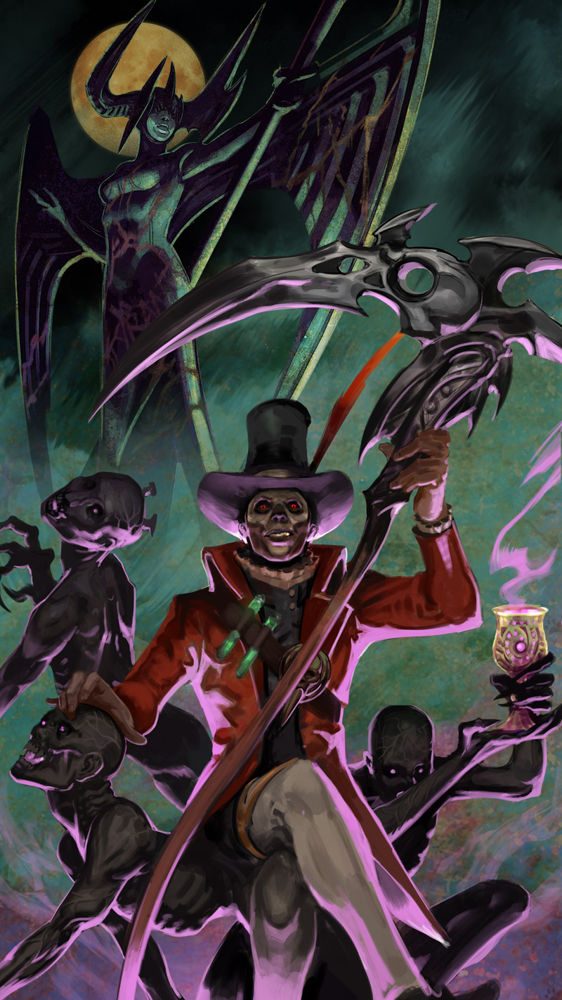

# Baptiste Lore

## ‘THE PASSING OF THE GENDARME’

The gendarme whistled through his teeth as he patrolled the Crescent City on the shortest night of the year, enjoying the scent of sweet olive and jasmine flowers as he traveled the well-maintained streets of the wealthy neighborhoods. The lights dimmed and yellowed as the crescent curved toward the port, dripping at last into murky lapping seawater. The fresh-faced young soldier felt impervious to harm in his smart uniform and cap, on his well-bred horse with its echoing clips and clops, but most of all with the smart, sharp sword strapped to his belt. The sword glowed with imbued blue magic energy, a rare sight in Crescent City. He enjoyed the way the locals melted into the alleyways in fear as he rode deeper into Islander territory. His nose wrinkled with distaste at the stink of old wood, coffee and fried meat there.

Near the end of his patrol, not far from the back of town, he heard singing. He sighed, clucked his tongue and dismounted. He’d arrived none too soon: A band of Islanders in bright holiday dress crowded the neighborhood square. A batterie drummed and rattled out an increasing tempo as the Islanders sang and danced.

At the center of the reverie danced the widow, a troublemaker who had been arrested a dozen times or more. She swayed out of time with the batterie, her eyes rolled up so that only the whites showed, unnatural noises spilling from her tongue. Between her bare feet sat a steaming, bubbling stew pot.

_Papa Baptiste! Rejoins nous!_  
_Papa Baptiste! Rejoins nous!_

The gendarme shuddered and led his mount back to the darkness of Islanders’ Alley to observe from the shadows. The law allowed for some frivolity among the native people, in particular this far from the capital of Mont Lille, but the gendarme’s belly twisted with anxiety.

“Are you frightened?”

The gendarme startled and turned toward the deep voice, but behind him the Islanders’ Alley was dark and empty.

“Who’s there?” demanded the gendarme, his voice stern. Only echoing laughter answered him.

_Rejoins nous, Papa Baptiste!_  
_Rejoins nous, Papa Baptiste!_

The gendarme turned back to the festivities in time to see the widow thrust both her hands into the boiling pot. She did not cry out in pain, and when she brought out fistfuls of rice and black-eyed peas, her skin did not appear burned. The rest of the Islanders crowded around to eat from her palms.

“Ils sont tarés,” whispered the gendarme, shaking his head. “Crazy people!”

“Their queen feeds her children,” whispered the voice, except this time it was right over the gendarme’s shoulder. He spun again, releasing his glowing sword from its sheath. Again there was no one.

“Your queen feeds no one.”

This time, the voice came from the direction of the square. Beads of sweat spilled into one another down the young gendarme’s spine. He gathered up his courage and sauntered out into the open square, glowing sword at the ready. “I will have order!” he cried.

He was pleased when the chaos silenced all at once. The batterie stopped, and with it the dancing and chanting and the whirl of bright-colored robes and skirts. The Islanders turned to stare at him as he moved through the milieu. “The party is over. It is time to go home.”

“We are home.”

The gendarme pointed his sword toward the voice and saw only the queen’s statue at the center of the square. It had been erected the year prior and, despite the graffiti defacing it, looked strange and new in comparison to the centuries-old square.

“It is you who has found himself too far from home.”

The ground at the base of the statue rumbled and broke apart. Monstrous hands clawed their way out from the earth, and then the arms and skulls and wide-open horrifying mouths of_the shade_.

The gendarme’s sword shook and spat blue magic. “This… this is unlawful,” he stammered, but his voice carried no authority. “You shall all be arrested for the un… unlawful use of magic and… and disturbance of the peace!”

“Peace, you say?”

With these words Papa Baptiste appeared, dapper in his top hat and waistcoat, an extravagant scythe resting in his hand, sitting at ease on the base of the statue, the dead settling at his feet.

“We are uninterested in peace,” said Baptiste. His lip curled up into a terrifying smile at the poor young gendarme who backed away in horror.

“What are you?” whispered the gendarme.

“A story,” said Baptiste, taking a goblet of wine from one of the spectres. “A story made real by a thousand tellings.”

The gendarme stumbled, spun, and ran for the alley, but there was a blast of sound and light and pain flooded through him, and he felt as though he were plodding through mud. “Please,” whimpered the gendarme. “I… I…”

“…do not wish to die?” said Baptiste, and then he laughed, a sickening echo of a sound. “Whyever not? Life is a bore. It is death that all await with delicious fear. Death is the great drama, the tragedy, the mystery, the_show_! Life is pain. Death is relief.”

The gendarme wept and tried to crawl, dirtying his beloved uniform, but found he could not move. He called to his horse but it had run away. The Islanders surrounded him, chanting in low tones.

“Your soul is pinned down and your body’s stuck to it, alas,” murmured Baptiste, sweet as a father calming a babe. “No more struggling now. It is not so terrible to belong to me. Together we will end the reign of the queens,_mon cher_.”

The shade fled from the feet of Baptiste, and the young gendarme could do nothing as the dead tore the sword away from his hands. At their touch the blue glow diminished, and they set upon him, clawing at him until he gasped his last breaths.

At last, Baptiste deigned to stand over him. “Shhh,” he said, and with a last swing of his scythe, he clipped away the gendarme’s soul. With death came, as Papa Baptiste had promised, relief.

## ALTERNATE FATES

### ‘SCARECROW’ BAPTISTE - ‘THE TRUE CONSPIRACY’

In a grand green courtyard at the center of the City of Emeralds, the Scarecrow King played croquet with the blade of a scythe. His advisor, a little woman of striking beauty, read off that day’s conspiracies.

“The Stargazers have decreed that the world is flat, and the stars are pinpricks in a giant black curtain,” she said.

“Ridiculous,” mused the scarecrow as the blade smacked a ball through a hoop. “You may proclaim that one false.”

The advisor drew an “F” next to the Stargazer’s conspiracy on her tablet. “The Magicians have decreed that the Witch did nothing wrong, and was executed without due process,” she continued. “They have used their magic to turn the minions against the new Queen of the West.”

The scarecrow shook his head, so that his pin-and-needle brain tinkled. “The Magicians forget the Witch’s reign of terror, but I do not. She once called upon her minions to tear me to pieces, and I had to be stitched back together again. The Magicians will be stopped.”

The advisor scribbled this note next to the Magician’s conspiracy, then said, “The Felinologists have decreed that the King of the Forest has traveled to the City of Emeralds.”

The scarecrow paused his play. “The King of the Forest is my friend. This conspiracy may be true. Send for the Felinologists and have the king brought to me at once.”

The little woman scuttled away and soon returned with the King of the Forest, his mane still fairy-braided with ribbons, his ears twitching with fright at every sound.

“My old friend,” said the scarecrow, petting the lion’s nose. “It has been years since we last met.“

“Your people did not believe me when I told them who I am,” said the lion.

“My people lived for a generation under the Wizard, who forced everyone to wear green-glassed spectacles so they would believe that they lived in a city of emeralds,” said the Scarecrow. “I removed their spectacles and showed them that their city is like any other, and so they made me their king. Now they believe nothing, and my duty as the wisest in the land is to proclaim their conspiracies true or false.”

“Your people are wise for crowning you. The animals of the forest were unwise to choose me as their king, for without the wizard’s brew I am a coward, and the fairies drank my entire supply. Tell me that within the wizard’s old quarters there is some of that brew left over!”

The scarecrow knew that, even if there were some drops left of the wizard’s brew, it was a temporary solution to the lion’s lifelong problem. So he devised a wise plan that would solve two problems in one.

“There is a fountain of wizard’s brew in the West,” the scarecrow lied, pulling the ribbons from the lion’s mane. “Let us go together to visit our friend, the Queen of the West, and collect that brew for you.”

And so the pair set off toward the West.

