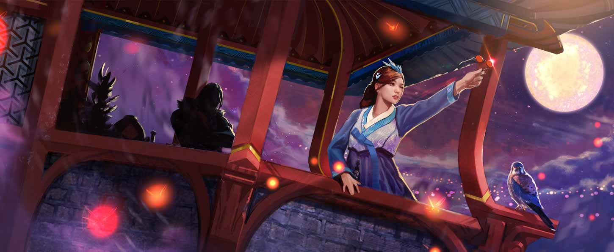
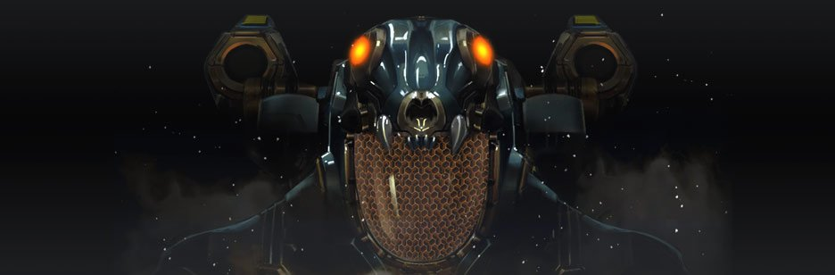
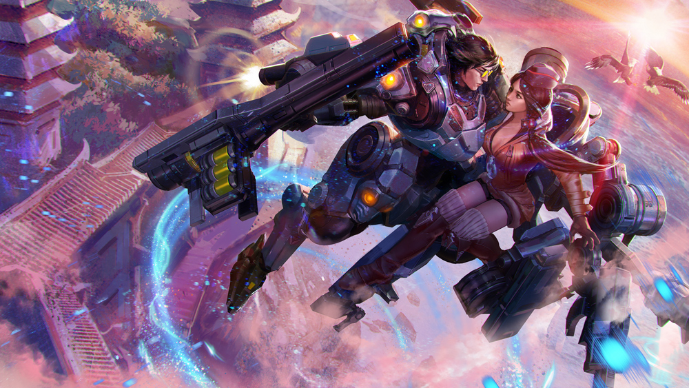
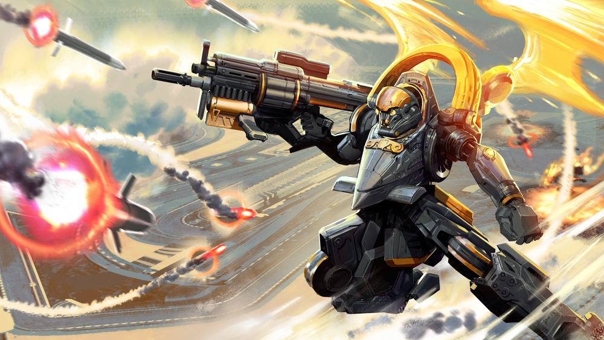
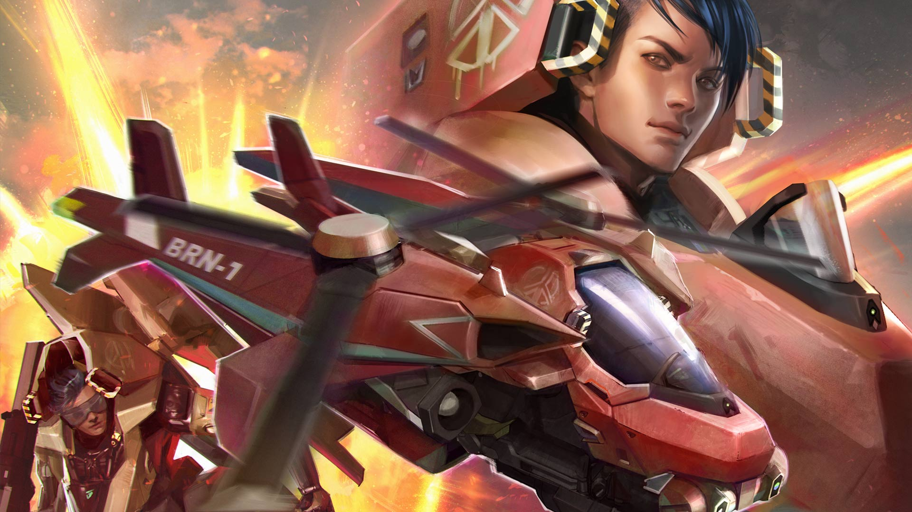

# Baron Lore

## ‘THE CHOOSING’

Skye strafed her way through the dense crowd of nervous girls surrounding the choosing table where the silver tiles laid, each engraved with a name. The marriageable young men crowded in corners playing Yunnori and howling at the results, seeming to care little for the outcome of the Choosing, but the young ladies ran their fingers over their own names and gossipped about which girl the house mothers would choose for their sons in the ceremony. Skye closed one eye and targeted the smug first daughter of Tiger House, a pretty girl named Nari. Around one delicate wrist, Nari held the velvet leash of a drugged and declawed tiger that blinked with confusion at the guests.

“I hope you are chosen by a good house, Skye,” she said. “It would disrupt the tedium of these things if a house mother cooked up a surprise.” It was well known that a daughter of Tiger House was a wise diplomatic choice for Baron Silver. Tiger House had been at all-out war with Silver House that year; destroying much of the Silvers’ cavalry of mechs …

… but with Skye’s renovations …

A finger jabbing into her spine straightened Skye’s posture. Her mother had shadowed her all night, correcting with bruising pokes and hissed instructions. Skye plastered a disingenuous monster of a smile on her face and neglected to answer, choosing instead to hold Nari’s lazy gaze until the high-born girl looked away.

“I need air,” Skye said to no one in particular. She hid two honey pastries in the sleeve of her overcoat on her way outside to the dark balcony. In the far distance, down the great hill upon which the Silver House stood, past the outlying village, past the farmland and minion camps, the crystal mines glowed a calm, eerie blue in the night sky. She stuffed a pastry whole in her mouth.

“You smell of grease.”

Baron stepped close behind her, his words tickling the skin on her neck. He plucked the other pastry from her hand and popped it into his mouth. He wore the silver-embroidered robes of his house and his knuckles were crowded with silver rings. He wore his wealth as was fitting; after all, it was his great-grandfather’s mining that had unearthed the powerful crystal. Other houses had vied for it, battled for it and died for it, but Silver House had held it.

“You’re mistaken,” Skye said, crossing her arms in an act of defiance meant to calm her shaking. “It is the latest perfume. All the ladies are wearing it this season.”

“I do like your hair.”

“I plan on doing it up like this every morning from now on.”

Baron rested his forearms on the balcony wall. “It seems not so long ago that you and I were children together, playing while our fathers pored over maps, or planned jungle battles …”

“And soon your father’s battles will be yours.”

“It is absurd that so many have died for those glowing blue stones.”

Skye peered out at the mines in the distance. “What happens when the mine is depleted?”

“We will own nothing but a pile of empty crystals, their power drained long ago in our war machines. We will dig farther into the farmland, feeding fewer people every year.”

Skye could not look at his eyes. She stared instead at his hands, at the scars from fighting that crosshaired his knuckles. “My father is collecting information about powerful energy wells where crystals may be recharged,” she offered, but Baron shook his head.

“The wells are too far to be of use to us. There are times I wish that the mines would disappear. Then, we would have no need of mechs and tanks, nor the filthy minions, nor this ridiculous choosing ceremony.”

“The choice would be ours,” whispered Skye. She covered Baron’s hand with one of hers and jolted with the electricity of it.

“Yes.” Baron turned his hand under hers and opened it. In his palm, a shining silver tile nestled. Skye inhaled the honey from his breath as she drew her fingertips over the tile, over the deep groove of her own name on it. “One day, the army will be mine, and I will need you to be my general.” He curled his fingers around the tile, gripping it, as Skye shivered. “Sometimes, despite everything, a man must choose for himself.”

## ‘FOR BARON’

“The Silver family is honored to choose…”

Skye stepped forward, trying to catch Baron’s eye, as his mother reached toward the tile table.

“… Nari Tiger.”

There was only one astonished gasp in the crowd when Nari’s tile was plucked up. Baron’s eyes did not waver from his newly chosen bride-to-be. Skye’s own tile was still encased inside Baron’s fist, to be chosen that night by no one. Realization gathered like rocks in her throat.

I will need you to be my general.

He hadn’t said wife.

Skye dissolved backward into the crowd, then sprinted out the door and down the hill alone, into the deep night, yanking the rings from her hair. She ran to run, something primal within her chest demanding escape.

At the giant rolling door of the hangar she stopped, her hair wild around her face. Another girl might have gone home to weep into her mother’s arms, but Skye had always felt more at home in the garage with her father, fixing things or, when she was little, breaking them.

It felt good … No. Nothing felt good, but it felt right to get out of the hanbok, to tie her hair up the way she liked it, to rub off the makeup. The familiar grease and gunpowder smell of her jacket soothed her. She climbed up into the mech she’d reappropriated to figure out how she’d ever show her face among the other pilots. How she’d apologize to umma for running out like a minion on fire.

But she could only think about what Baron had said.

There are times I wish that the mines would disappear.

In the quiet, dark hangar, encased in the machine, Skye heard his voice as if he were still close by.

…we would have no need of mechs and tanks, nor the filthy minions, nor this ridiculous choosing ceremony…

“The choice would be ours,” whispered Skye.

Baron no longer had a choice, but there was a way she could choose for him.

She powered up the mech, pulled on her gloves, and gripped the handles. Before anyone could stop her, before she thought long enough to stop herself, she walked the mech outside.

Despite the humiliation of the night, despite the gravity of what she was going to do, driving the lighter mech was a thrill. So agile, so fast. She avoided the main gate — unauthorized use of a mech was still a crime, general’s daughter or no — and tip-toed the mech through the minion camp. The beasts slept in haphazard piles, their snores warbling; they were known for brute toughness and obeying orders, not thinking fast, so they gave her no trouble. She shot over the security gate, zig-zagged through a mandarin orchard, hovered over rice paddies and cabbage fields. Here and there laid the rusted and broken remains of rice transplanters and plows, the first machines that had evolved into blasthole drills and frontloaders when Baron’s ancestors had struck silver. When they’d hit crystal, and the other houses discovered the power of the halcyon within the crystals, the mining machines had been repurposed for war. Farmland gave way to trampled dead battleground, brown with bloody mud.

The mech glided over coiled barbed wire and then landed, strong as an eagle perching, on the reinforced wall. Ball-shaped security bots buzzed around her, scanning the mech code, then her retinas.

“Pilot seven-zero-five, you are not authorized for the use of decommissioned mech one-eight-six-four. Please return to headquarters immed-”

With a squeeze of the trigger, Skye strafed to the left and fired. One by one, the bots burst apart and fell, crackling, to the mud.

Staring down into the glowing blue, she flicked a switch to arm the missiles.

“Okay.” She patted an autocannon. “Let’s end this war.” The jet nozzles activated. The mech rose, then hovered over the mine.

The first missile shot deep inside.

The explosion rocked the ground and blasted out millions of tiny crystal shards. Skye ducked behind her arms as the shards pinned themselves into her jacket, poked her legs.

There was no time to lose. She had to complete her mission before anyone could stop her. She strafed and fired, let loose salvo after salvo of missiles, rained death from above into the mines, destroying the crystals that had powered a civilization for generations. The halcyon power that so many had fought and died to possess bloomed into the night sky, then dispersed into the night air.

## ‘SIERRA KILO YANKEE ECHO’

Baron rolled up the door to the hangar’s private garage. The glowing blue of his skin illuminated the Heavy Armor Rapid Deployment armor parked inside. It had been commissioned for his family’s new alliance, with helmet and joints sculpted into roaring tiger heads, power amplification haptic controls and reinforced plating built to withstand heavy kinetic rounds. He pressed his thumb to the lockpad and the exoframe opened with a quiet hum.

He realized then that he was still holding the silver cage. He lowered it down and swung open the door. The goose lectured him with furious honks before escaping out of the hangar.

~

At the Choosing, a servant had handed the large silver cage to him and guided him with deep backward-walking bows to the line of betrothed young men. Inside the cage, an angry goose flapped and hissed. The other grooms held wooden geese, representing the bird’s tendency to mate for life, but Baron’s mother had insisted that her eldest son have a live goose to present to his future in-laws.

It seemed to bother no one that the goose had been taken from her lifelong mate for the purposes of the ceremony.

Some of the betrothed young women forced their gracious smiles, their sad eyes darting across the room to the men they’d hoped to marry. Nari Tiger’s expression gave away nothing as she bowed before his parents with her two cupped hands full of chestnuts and dates, symbolizing the many children she would bear for him. Baron supposed he’d never know whether he’d been her first choice. It didn’t matter.

“The fireworks are early!” cried Baron’s mother in dismay, pointing at the windows, and a greedy murmur sounded among the guests as they crowded to get outside. Baron’s father chuckled, taking his son by the shoulders and guiding him along with the crowd.

“Your mother will have the pyrotechnicians beheaded,” he murmured.

“As well she should,” said Baron. “The other mothers watch for any mistake.”

They were met at the door by the general. “Sir,” he said, leaning in close to Baron’s father, “it is not fireworks.”

The three men stepped outside together, watching the night sky light up over the distant crystal mines.

“Who would attack the mines?” whispered Baron’s father.

“No one on the peninsula,” said the general. “but the Tigers…”

“They are united with us now.”

“And they do not have this kind of firepower.”

The sky burst with blue fire and smoke billowed up from the source of the land’s only power, its only wealth. “No,” said Baron as understanding sank down his spine. “But we do.”

The general locked eyes with Baron and he turned around, scanning the room for someone he would not find.

Out of the house Baron went, into the smoke roiling with tiny crystal splinters that slid under his skin and glowed blue. Behind him, the families gathered, their growing panic a low murmur. He followed the trail of wilted orchids, loose screws and gold rings to Skye’s repair lift. The blue overcoat Skye had worn to the Choosing lay crumpled there.

_There are times I wish that the mines would disappear._

~

He placed his rings and silver-threaded overcoat aside and settled into his exosuit. It locked into place around him, helmet last, the HUD blinking awake as the skydoor whirred open. The jump jets activated with a vibrating rumble that chattered his teeth. He bent his knees and the exoframe bent with him, a powerful extension of his every move; he jumped, launching through the skydoor, high over the hangar, high enough for his visor to register in infrared the scramble of minions in their pens, the burning mines, and all the way at the shoreline of the peninsula, one lone heat signature where he’d known she would be waiting for him.

As always there was a moment when he wished he did not have to come back down.

“Sierra Kilo Yankee Echo,” he said, “do you copy?”

## ‘BARON’S CHOICE’

Baron sailed over the orange groves and landed hard on the jagged cliff that overlooked islets surrounded with docked fishing boats. The stone ground split under the weight of his exoframe, sending loose stones tumbling down to the sea. Skye waited there in her renovated mech, guns aimed at the tiger’s mouth framing his helmet.

He lowered the barrel of his grenade launcher. The HUD on his visor targeted around Skye’s face and identified her by name and rank; the serial number of her decommissioned exosuit threaded along the bottom.

“You humiliated me,” whispered Skye; her canned voice echoed from his radio through his helmet.

“Any woman can be a wife.” Baron’s tone was angrier than he’d meant. “I thought you wanted to be a_pilot_.”

“I thought you wanted to end the war.” Skye glared at her own reflection in his visor, then jammed her elbow back into the throttle; the airjets switched on and lifted her off the ground.

“You have three seconds to exit the vehicle with your hands up,” grunted Baron. “Three.”

“You always said you were afraid you’d never leave the peninsula.” She set the target and the rockets locked into position.

“Two.”

“You told me that war has kept our people ignorant of the outside world. I thought you wanted to change that. I thought you wanted to change it with_me_.”

“One.”

A mortar shot from Baron’s launcher and the night erupted in blinding light. From inside his helmet the muted explosion was a deep bass roar. The place where Skye had stood was a black blasted hole in the ground.

As the smoke cleared, he took heavy steps to the jagged edge of the cliff and opened his visor. He unclenched his armored fist and looked at the tile there, the one with her name. “I wanted you,” he said to no one. He couldn’t look down. Instead, he turned his wrist to drop the tile over the edge.

“Then you should’ve chosen me.”

With a whoosh, Skye’s mech darted out from behind him and hovered in the air just over the cliff’s edge. Balancing on one foot and holding on with one hand, Skye reached out and snatched the tile out of the air, then dashed back to land at his flank before his HUD could register her movement. He turned, clunky and slow compared to her sleek, open-faced exosuit, lowering his visor just in time to catch a bullet in the glass. A jagged crack formed through her name in the HUD as she let loose with a forward barrage of bullets that pinged off his armor. One embedded in his power panel and set off alarms; his HUD wavered and blinked as she swung around to his back and shot off one of his energy packs; the crystal batteries leaked blue down his leg armor.

“What did you do to that exosuit?” he transmitted.

Her crackling laughter echoed in his helmet. His jump jets activated just in time to escape a rocket artillery strike; the missiles exploded into one another below him. Through the heavy smoke he lobbed down mortar after mortar but he’d lost too much energy to maintain the jump; he crash-landed, rolled onto his side and punched at the pressure-sealed neckring until his helmet came loose. A hundred yards off, Skye’s mech stumbled and shot without aiming into the smoke; her stabilizers were cooked.

Baron overrode the emergency shutdown and triggered the ion cannon, aimed it to where Skye’s mech wobbled. From his helmet, where the HUD blinked with the target coordinates, he heard her voice through the radio. “Baron,” she whimpered. “I’ll fix it. I’ll search for the energy wells. Let me go and I’ll find the tech. I’ll fix it …”

Baron slammed into her and the two careened off the cliff’s edge, his jets on full blast, the ion cannon projecting its devastating beam back to the target location, detonating everything between the cliffs and the groves.

Holding on to one another, their crystal-splintered faces grubby with smoke, their mechs leaking and broken, they coughed and laughed.

“We’ll find the wells together,” he said, watching the ground’s slow approach. “But the mechs are wrecked.”

“I’ll fix that too,” said Skye, and pressed her tile back into his hand.

## ALTERNATE FATES

### ‘ELITE FORCE’ BARON 

#### ‘DISARM!’

Twenty meters down the Halcyon Well, Baron’s navigation and communication systems malfunctioned. He watched the HUD on his visor flash with readouts as he descended, his thrusters burning, into the glowing blue crystal cave. “Manual override,” he said, and the rocket launchers, porcupine mortars and ion cannon blinked online.

“Surface scan,” he said.

The HUD flashed warnings, revealing movement everywhere. “Locate scout,” said Baron.

“Go back!”

The HUD pinpointed Idris’ location in the center of a mass of what looked like glowing, spiked worms the size of his arm, their heads all mouth. His spear swung and his chakram flew in a whirl of hot glowing blood. “Idris!” Baron called. “Hang on, we’ll get you out!”

“No.” The chakram flew and returned again, but Idris sank into the sand, the Churn worms’ mouths locked onto his armor. “I should not have tempted the Churn. You must leave me and abort the mission.”

“I don’t leave men behind.” Baron’s jets lowered him onto the soft ground. Churn worms wriggled and writhed, bursting through the sand and slithering out of the hole at the center of the cave. They snapped their jaws and latched onto his exo-armor, spiraling their long spiked bodies up his legs as he trudged toward Idris.

“It is too late,” Idris said, his calm voice eerie and alien through his mask. He sheathed his spear and chakram and allowed himself to be pulled down.

A Churn worm snapped at Baron’s visor, its mouth stretched wide, so that his vision was blocked by the beast’s glistening maw. He peeled the worm off and threw it.

Idris mumbled to himself as the Churn worms encircled him.

Baron dug through the sand and found the rope secured to Idris’ waist. In the reflection of his visor his mouth was set in a grim line, marred by glistening worm mucus. “Listen to me, buddy. You with me?” He leaned back and pulled. “I can obliterate everything in here, but you need to get behind me. I can’t pull you out unless you fight your way up.”

Idris shook his head with violence, as if waking from a dream.

“Arm Ion Cannon,” said Baron. The HUD flashed:

CANNON ARMED.

“Lock target,” he said, and a countdown blinked on the HUD.

Baron pulled the rope fist over fist, but Idris was too deep. “Fifteen seconds!” Worms wrapped around his armored hands and the rope fell. “Don’t give up on me!”

“I cannot fight.” Idris unclipped the rope from his waist and tossed it aside. He unwound a worm from his neck, stared at it face to face, then pulled it apart with a spray of shimmering blue blood.

“Disarm Ion Cannon!” called Baron. The HUD flashed, scrambled, turned to static.

The countdown continued.

“Disarm all weapons!”

The HUD flashed:

CANNON ARMED.

MULTI-ORDINANCE LAUNCHER ARMED.

“Disarm!_Disarm!_” But the countdown continued to blink down.

3… 2… 1…

The cannon’s recoil knocked Baron back. The sand where Idris had been lit up with the power of the orbital strike. Rockets launched and porcupine mortars arced high, falling with deafening power. Crystal stalagmites burst into shards; stalactites cracked and fell from the ceiling. Worms, blasted to death, rained down from the cave walls with sickening splats.

Baron found his feet and cursed, scanning the killzone for life. Smoke escaped down the hole in the cave’s center as if inhaled.

“That was close.”

Baron whirled around as Idris jumped off his back. The desert warrior surveyed the damage, kicking away a pile of dead worms, unearthing a Shatterglass.

“I thought… how did you…?” Baron stuttered.

“We should not linger here. I will take however many of these I can carry.”

“The Churn is creating an electromagnetic field that is disrupting my armor functions.” Baron stomped into a gruesome mess of dead Churn worms. “If my jets function, I can -”

From deep down, far below them, came a roar full of smoke and mist, a sound that froze them both in place.

### ‘FLY OR DIE’ BARON 

#### ‘Winning is Winning’

