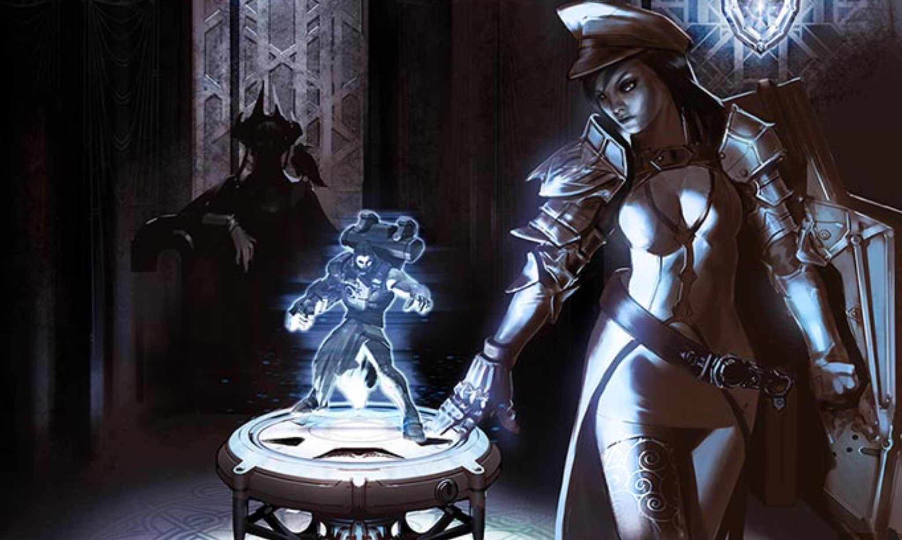
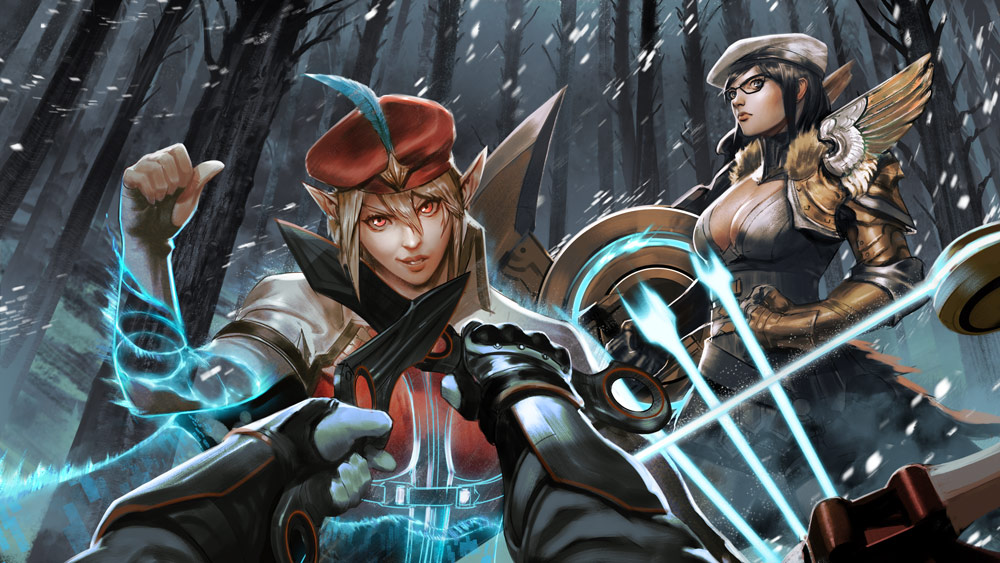
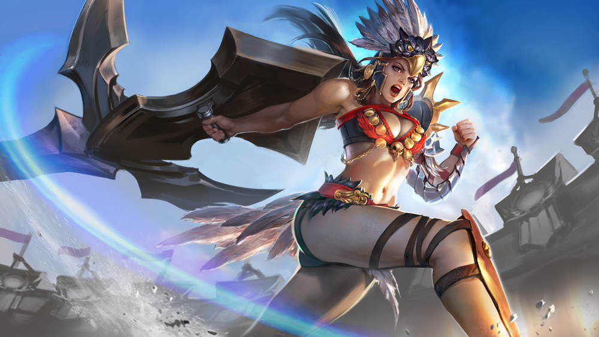
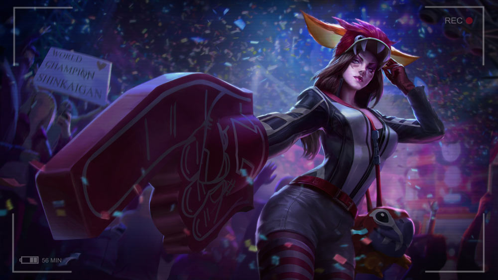

# Catherine Lore

## ‘CATHERINE’S MISSION’

The Storm Queen sat sideways on Catherine’s lounge chair, her legs slung over one arm, cloaked and hooded, a raven perched on her shoulder. With no lamps lit, the intruder was invisible in the windowless living quarters. Catherine was not a fan of extra entryways, yet the queen had made her way past the reinforced and locked front door. The queen swung her legs forward and lit the nearest lamp. The raven adjusted its feet but remained in place. “They are nearby. I assume this room is secure?”

“I thought so, yet here you are.”

The queen half-smiled. “You will assemble the Stormguard tonight.”

Catherine sheathed the sword she had been gripping with both fists since first entering her apartment. “Who is the target?”

“Targets. Twin targets, with remarkable magical abilities. You’ll remember their mother, my sister, Julia.”

“Your sister? She’s been dead for years.”

“So she would have us believe. Our spies have found her in southern Gythia.”

“That is tech territory now.”

“A hive of soulless machines and their engineers. Julia has made an alliance with them, hoping to supplant me. She’s even married one of their technologists and made some babies. Isn’t that sweet?”

“Twin babies?”

“Indeed. You will bring them to me so they can be trained.”

“Why is the traitor not a target?”

The queen stood, and the dim light seeped up into her hood, showing the stitches that crossed over the flesh where her eyes had been. They had been removed at birth, in the way of storm mages. “There are laws against royal murder, no matter how justified.” She stroked Catherine’s cheek with the back of her icy hand as she spoke, as if in lullabye. “I should execute you where you stand for suggesting it.”

It was said that evil doles out affection in tiny droplets, yet Catherine could not help her desperate thirst. In a frustrated whisper she said, “So, we take the children and leave their mother to plot your murder? Your sister will seek revenge. She will enlist the Gythians to help her if you do this thing.”

“Let us hope you are right. The Stormguard has never been stronger, and the Gythians are stretched thin fending off the technologists.”

“You wish for war again, my queen?”

“No, Catherine. I do not wish for war. I make it.” The queen’s hand dropped. “Now is the time. Now, while the technologists are a disjointed army of gadgets, while Gythia is an elderly collection of has-beens with shiny trinkets. They are a decade away from readiness and nothing without their toddling prodigies.”

Catherine stared into the raven’s eyes as she spoke. “As you will, my queen.”

“They have made their home in the farms northwest of Pompium. Vyn will accompany you.” Only then did the raven, the queen’s eyes and ears, move; with a quiet flap of its dark wings, it leapt from the queen’s shoulder to Catherine’s.

Catherine resisted the urge to shrug away the bird. “Yes, my queen.”

“I expect obedience.”

## ‘WHAT MUST BE DONE’

A single candle on the table at the back of the tavern flickered a light too weak to penetrate the heavy hood of a woman sitting alone, staring at the leaves swirling in her steaming cup of tea. She’d been sheltered all her young life from the roving bands of people whose old women wore clattering bangles up their arms and read the futures of gullible customers in tea leaves.

Despite her thorough education, Julia would have paid well, in that moment, for such a service.

Every head turned when Catherine entered. The red and white uniform was gone, but her drab hooded cloak failed to remove the disquieting sensation that a predator had stepped into the room. That heavy feeling did not waver despite the smile Catherine offered to Julia as she threaded through the tables to Julia’s booth, sweeping off her cloak to reveal a well-fitted dress true to the local style.

The serving-boy’s words stumbled like pebbles rolling downhill: “Good.. good even… how can I… would you like some… what can I…?”

Catherine stared the boy down, allowing him to stutter until he had found the end of a sentence. “Wine,” she said, a smile playing at one corner of her mouth.

“Right away… and you, ma’am? Can I get you more tea? Hey, aren’t you Jul…”

Catherine stepped close, one fingertip on the boy’s chin, turning his eyes back to her. “Red wine,” she murmured.

Julia exhaled a breath she hadn’t known she was holding as the serving-boy tripped away. “Oh great subterfuge, Cath. Let’s please be as memorable to our fellow patrons as much as possible.”

Catherine scoffed, feigning hurt. “You are so unkind. I am quite proud of my disguise. And look– buttons!” She winked, spreading her arms.

Julia laughed, but the sound was brittle, fighting not to become a sob. “Your disguise is as subtle as a hat on a tiger.”

Neither woman spoke while the wine was poured. Only after did Catherine lean forward in earnest. “She wants the twins, Lia, and you alive to make war before you can win it.”

Julia lifted her chin. “Gythia will aid me.”

Catherine shook her head. “Perhaps. Someday, if the time were right. But the Stormguard ishere today. I couldn’t send word; I had Vyn on my shoulder the whole journey. He watches your family now.” Catherine clasped Julia’s shaking hand in hers. “This mission is happening tonight. The twins will come back with me to Mont Lille.”

Julia jerked her hand away and looked up at a cobwebby corner of the tavern. “No.”

Catherine’s spine straightened. “You know I would have it any other way if it could be. But you do not have a choice in this. I give my word, Lia, I will watch overthem.”

“No!” Julia insisted. “My sister would make a tyrant of Celeste in her image, and you could not stop her.”

Catherine opened her callused palms. “So? What do you propose? You and Ardan cannot defeat the Stormguard tonight, not even with my help. Those not surrounding your farm have barricaded every road out of Pompium. Once we have completed our mission, we will disappear. Lia. Your only option is to trust me.”

“The way my sister trusts you?”

Catherine’s eyes narrowed. “You and I have been friends since we were children.”

“We were all three friends when we were children.” A long silence once again wedged itself between them. At length, Julia sighed. “I will warn Ardan that the Stormguard may be closeby. The children will go about their routine as usual; nothing will seem amiss from the outside. I will help Ardan escape with the twins when you attack.”

“There is no escape through the Stormguard.”

“There is one way. A mage is never more powerful than at the time of death. When you take my life, I will pass my gift to him. He will make it through.”

Catherine gripped her wine glass, her voice cold as frost. “I will not do this.”

“Make a show of it. Create a diversion.”

Catherine’s eyes sparkled wet, her teeth clenched. “Icannot.”

“And then, run. There is nothing more for you in Mont Lille. The Stormguard will chase Ardan; you must escape to our friends in Gythia.”

The glass in her hands exploded, shards of tinkling rain skittering across the table top. The tavern went quiet as all heads turned to Catherine as blood shimmering with halcyon dripped from her fist. “Neither you nor your sister ever consider the weight of your demands,” Catherine choked out, blinking away unshed tears.

Julia swallowed against the knot in her throat. She took Catherine’s bleeding hands with all the patience she’d learned as a mother. “I am touched by your devotion, but I am not a person. I am an empire.” She pulled glass from Catherine’s palms, her voice a sing-song whisper. “If you deliver my children to my sister, she will make a monster of my daughter, put my son at the front lines of her military, and gain territory at the mouth of Gythia.” Blood and wine dribbled onto the floor as Julia cupped Catherine’s hands inside her own. Green light glowed, Julia’s healing power drawing strength from the halcyon, the lacerations closing. “Never feel guilty for what must be done. And… and..” Julia faltered, then stopped.

“I will make it fast,” Catherine said softly.

Julia’s shoulders wilted. She released Catherine’s healed hands. They slid out of the booth and stood, regarding each other across a distance that had grown, in only a few moments, unspannable.

Catherine smiled and touched her hand to Julia’s cheek.

“Hey, Lia,” she whispered.

“Hey, Cath,” Julia whispered back, a sob and a laugh catching in her throat.

Catherine’s back straightened, her eyes cleared, and her hand returned to her side. She nodded once at Julia, grabbed her cloak, and stepped through her own spilled blood, past the silent patrons and their tracking stares, out the tavern door into the waiting night.

## ‘THE SHIELD AND THE BOW’

Who am I?”

A little girl stands opposite her master at the center of the sparring circle holding a wooden shield. The sun sets behind the foothills to the west, but she knows better than to show the long day’s fatigue inside the circle. “You are Professor Marcel …”

The flat of the master’s blunted swordblade leaves a stinging red imprint on her left cheek before she can register that he has moved.

“In battle, there are no professors. There are no names.” The master circles her, and she moves with him as he taught her, her eyes watering. “No husbands, no brothers. No sisters. No friends.” He strikes again, his blade slapping the wound anew.

“Y.. yes, Professor.” The girl sniffs up the pain, forces herself to remain light on her toes as the master switches direction.

“Who am I?”

“You are…” The sword swings between them and cracks into the girl’s shield, sending splinters flying. “…the sword.”

“And who are you?”

The sword swings again, a deadly whip in the master’s hand, smashing again into the shield. “I am the shield.”

“Again.”

“I am the sh… shield.” The strikes come faster, arcing and crashing, no mercy given for her small arms struggling to raise the shield, welts and bruises rising on her skin when she is too slow.

“Again.”

“I am the shield!” Blunted steel on wood sends shocks up the girl’s arm; sweat pours down her brow, meets with tears, rolls down her cheeks and throat and into her uniform.

“Who?”

“I am the shield!” she sobs, falling to her knees, the shield over her head. “The shield! I am the -”

“…the shield!”

Catherine sits up straight in the general’s tent, gasping out of sleep, drenched in sweat despite the cold night. A magic arrow protrudes from the chest of the man beside her, glowing blue in the dark.

“Kestrel,” she whispers.

The fur beneath her dead lover squelches with his blood when she rises. She dresses in silence, though she knows there is no need for quiet; she is alive because they want her to be.

Not so for the rest of the camp. Squinting into the dark, she steps outside, her boots soundless in the fresh snow. The smaller infantry tents are sieved with sizzling arrow-holes. The cold masks the bloody smell of death, freezing time. It is as if the sun will never rise, the dead will never decay and spring will never end the Winter War. Half inside her dream, her nose and fingers pink and numb, it is as if she is not stepping toward her own end.

In the center of camp, thirty unfamiliar women in familiar uniforms poke at the fire with sticks. They are young in the way of soldiers; war has a high turnover rate. Six Swords, two Axes, two Daggers, two Polearms, eight varied Mages, nine Shields and one Bow.

“Salut, Kestrel.” Catherine steps into the light, resting her shield in the snowdrift before her.

“Catherine!” calls The Bow with a grin that does not reach her eyes. She lopes through the snow to clasp Catherine’s hand, setting her bow in the snow beside the shield. “Kind of a demotion, isn’t it, settling other countries’ border disputes?”

“It pays well.”

Kestrel drags her fingers up the wings of Catherine’s pauldron.Bump-bump-bump. “Did you leave your Sword in bed?”

“Indeed.” Catherine peers past the fire at the Stormguard as they move into position. “You rendered it quite useless.”

Kestrel smirks. “Rumor is, you gave up your blade in a fit of guilt.”

“You will soon find that I don’t need it.”

“Understandable. Weapons, armies, even whole institutions, outstay their welcomes.”

Catherine rests one arm atop her shield. “It is not like you to be so chatty.”

“Just catching up. Been a really long time.” Kestrel plucks up her weapon in her left hand. In her right, four glowing arrows snap into existence. On the other side of the fire, the others push back their white fur hoods and draw their weapons; fire and ice and energy form in the palms of the mages. With a nod, Catherine pulls her shield from the snow, and she is Catherine no longer, and Kestrel is no longer Kestrel, and a thin gray line of dawn forms at the edge of the sky.

In the moment before the chaos, a breeze swirls light snowflakes around the tents full of dead soldiers. Sparks explode above the fire. The Shield rises. The Bow fits the glowing arrow to the bowstring and pulls it back, her fingers resting on her cheek.

Then, she spins on her back foot and looses the arrow through the flames.

## ‘THE COUP D’ÉTAT’

Sparks fly from Kestrel’s magic arrow as it sails past the fire, gliding through the narrow gap between two swordswomen and piercing straight into the Storm Queen’s raven. It lands with an undignified squawk and a floomph of powdered snow.

“You all can do what you want,” says Kestrel. “I’m not killing one of our own.”

The queen’s best killers, twitching with anticipation of battle, their trembling weapons thirsty for blood, dart their eyes from Kestrel, to Catherine, to the dead black thing in the white snow with horror. Their white-gloved grips loose and re-tighten as Kestrel steps back beside Catherine, who crouches in a defensive position behind her shield, her perplexed eyes shimmering. In that stunned silence, there is a moment when she sees beyond the white and red uniforms, beyond the weapons, to the faces of women she used to know. The closest thing she ever had to sisters, once.

The Guard’s best daggerwoman breaks the spell, darting forward, crossing the distance in a blinding blue flash, appearing a breath away from Kestrel, her blades crossed over the archer’s throat. “She is no longer one of us,” she hisses. “And now, neither are you.”

“Really, Livia?” Kestrel grins. “I put an arrow in the eye of a man at your flank at the last battle for Lionne.” There is a popping sound, and all that remains where Kestrel stood is a phosphorescent cloud. The daggerwoman jumps back from the glowing particles, her daggers in a defensive position. “I’ve saved every one of your lives at one point or another,” calls Kestrel’s voice, disembodied several steps away from the mist.

“We have_orders_,” calls a shieldbearer from the front line.

“Sure, Marelde, and we’re trained to kill, not think,” says Kestrel, reappearing with a new arrow fitted to the nock of her bow, “but it was Catherine who trained you with a shield when you were ten years old.”

“Eight,” whispers Marelde.

“And you, Amie.” Kestrel’s arrow points at the forehead of a mage holding a sputtering ball of blue light. “After the northern revolt, when you had night terrors, Catherine stayed up all night to comfort you. And you, Ivet, Catherine taught you to speak Lillaise.” Ivet nods, resting her axe over her shoulder, staring at the snow.

“I never knew her, and I don’t care what she taught Ivet to say,” scoffs Elena, the youngest of them, polearm at the ready, her stance low. “She’s a traitor. She disobeyed orders, ruined a mission and disgraced the Stormguard.”

“_Toujours fidèle_.” Catherine sighs as all eyes turn to her. “I swore loyalty, but in war, I was never loyal to the queen. I was loyal to the woman next to me. I had no thought for Mont Lille, or a unified Eventide, when the blades swung and the arrows flew. I fought because I was afraid of what the woman next to me would think if I did not.”

“Yet you abandoned us and fled like a coward,” snarls Livia.

Catherine shoots a glare at the daggerwoman. “There are no cowards in the Stormguard. I chose to disobey so that one day, you all would have another choice. But I have … I have lived with the shame of my disloyalty to you for more than a decade, Kestrel.”

“Then make it up to me now.” Kestrel lowers her bow. “We found Julia’s whole family alive and well in Taizen Gate. They escaped and disappeared with the help of Gythians.”

Catherine’s breath catches. “Then we can waste no more time. Make your choice, ladies, and make it before the queen’s ravens find you.”

## ALTERNATE FATES

### ‘QUEEN'S KNIGHT’ CATHERINE 

#### 'MERCY IS GRANTED’

One at a time they knelt before the queen, each wearing a pure white subarmalis, and swore their fealty. The queen named the new knight as she tapped the flat of the ceremonial sword blade on each of the knight’s shoulders, the golden armor and weapons bearing the insignia of the queen were presented to the knight, the crowd cheered and the ceremony repeated.

As the last knight basked in the applause, her squire trailing behind with arms full of heavy plate armor, the door opened. Sunlight poured in, so that the cloaked and hooded figure in the doorway stood in shadow. The room went silent as the figure stepped down the aisle, past the knight and her squire, past the audience with their finery, to the dais where the queen stood, dressed and veiled in black, sword in hand, Vyn perched on her shoulder.

The hooded figure dropped to the floor, palms down, head bowed as if for execution.

“I swear fealty to the queen,” vowed the penitent figure. “I swear to honor and defend my queen against all enemies. I will enshrine in my heart my love of my queen. I will dedicate my life to the greater glory of her crown.”

Whispers sounded in the crowd. The new knights gripped their weapons, eyeing one another. But the queen neither moved nor spoke. Only Vyn turned his head to cock an eye at the figure on the floor.

The voice of the hooded figure broke. “I beg the mercy of the queen.”

All held their breath in the following silence. But then, from the windows and skylights above, from the open door, from behind the dais, ravens flew into the room. One, then another, then more, perched upon the figure on the ground, digging their talons into the cloak, then spread their wings and lifted it away, revealing Catherine on her knees, wearing the white subarmalis.

Gasps of rage sounded from the crowd. Such impudence! Swords and daggers sang, released from their scabbards. The subordinate traitor!

But the queen silenced them with a wave of her hand. She bent, taking Catherine’s chin in her palm. “You broke the law,” she said.

Catherine dropped her eyes, unable to meet Vyn’s glare. “My queen, you are the law.”

The queen lifted her veil, revealing her scars and her wicked smile. “So I am,” she said, then slapped Catherine’s right cheek with the back of her hand. “Mercy is granted,” she said, and kissed Catherine’s left cheek even as the right bloomed red. “Rise, Lady Catherine, and receive the shield and armor of your knighthood.”

Chaos erupted in the crowd as a squire approached with a golden shield bearing the insignia of the Storm Queen. Catherine turned to face the audience with her signature dispassionate gaze, and the queen’s hand closed on her shoulder, her mouth close to her ear. “I forgive you,” she whispered, “but you will never again leave my side.”

### ‘PARAGON’ CATHERINE 

#### 'THE PACIFICATION OF LIONNE’

“I’ve always loved Lionne. I wintered here as a child. My sister and I used to sled down that hill when it snowed.”

Catherine led the Storm Queen past the grand park toward the city’s main square, her crimson plate armor reflecting blood red on the cobbled promenade. It was a lovely city — or it had been, before the uprising. Small family shops stood dark and empty at midday. Glass shards littered the street. Ash from burning homes dusted every surface. Ravens circled overhead or picked at the bodies strewn everywhere. The gray sky crackled with magic. In the distance were the enraged and pained shouts of battle.

“I will see this city’s beauty restored, once it is pacified,” said the queen.

“Pacified?”

The queen turned toward Catherine’s voice. “Would you use a different word?”

Catherine gripped her shield tighter. “Destroyed,” she said. “Burned, leveled, annihilated.”

“Pacification is a prettier word. The new governors will call it so.”

“And the old governors will be removed. Lionne’s ships will become royal ships, their trade royal trade. Heavily taxed, of course.”

“And why not?” mused the queen. The screams from the city square, the last vestiges of the rebellion, became louder as they approached. The queen enjoyed being present at the finales of revolutions. “Once the army surrenders, there will be peace here as long as I live. It is a tax well deserved.”

They came upon the edge of the town square. Catherine moved in front of the queen, whose scarred face showed no anxiety. The townspeople closed in around them. The queen’s archers sniped anything in a Lionne army uniform from the tall buildings; most of the rebels left were shaking citizens gripping farm tools and rusted swords. Only their insults held an edge, so the shouts followed the queen and her first knight as they walked, serene as if on a morning stroll, to the center of the square.

“People of Lionne!” called Catherine. “Lay down your arms and be at peace. Long live the Storm Queen!”

The shouting intensified. A tomato splatted against Catherine’s shield. The queen sighed as the crowd moved closer, pointing their pitchforks and kitchen scissors. “A man’s last breath is ever his most insistent.”

Catherine inhaled, her eyes closed, and called the thunder. Felt it pushing through her limbs, pressing against the tips of her fingers, imbuing her shield until it shook. Then she opened her eyes and slammed her shield into the ground.

The tremor pulsed through the street; cobbles broke apart and rolled under the unsure feet of the rebels who fell, frozen, their terrified eyes looking toward the paragon of the queen’s personal guard. The screams silenced, frozen in the throats of the crowd.

In the quiet that followed the thunderous blast, the\_kraa, kraa, kraa\_of the ravens echoed off of the ruins.

“Long live the Storm Queen,” Catherine said again, this time without raising her voice.

A woman’s voice from the crowd sounded out. She stood, shaking, holding a child in her arms. “Long live the Storm Queen!”

More followed, led by the mothers who would prefer taxes and peace to dissent and death, until even the proud farmers sang along.

“Long live the Storm Queen!”

The queen bowed her head in a political show of humility, but her smile was wry. The archers picked off the last of the Lionne army.

_While the queen slept, her first knight transcribed a coded message from Gythia by candlelight. “The successor gathers allies. Rebellion comes to Mont Lille.” Catherine fed the letter to the candle, her eyes unreadable. A revolution to be crushed … or supported._

### ‘SERPENT MASK’ CATHERINE 

#### 'CONSPIRACY OF RAVENS’

Dawn erupted from behind the Nerudian hills. It was a good day for the conspiracy of ravens that ever followed the Storm Queen; they picked at the buffet of the dead as the queen and her shield looked out over the carnage from the former lord’s castle wall.

“Now that this cavalry belongs to me, we can reach ever farther,” mused the queen.

“It is unfortunate that we killed off half of it along with their riders.” Catherine’s voice was muffled and low behind her mask.

The queen never replied, for an upset stirred up the ravens. Vyn came screaming from the direction of Mont Lille and lit upon the queen’s shoulder. The queen listened to Vyn’s complaining, then clenched her fists.

“Rebels have taken Mont Lille,” she whispered, and Catherine’s war mask nodded. The birds became a well-fed cloud blackening the sky.

The Storm Queen and her company sat their horses on the trade road outside the fortified wall of Mont Lille, at the embarrassing disadvantage of having been locked out of her own capital city.

The rebels had invaded by airship while the Storm Queen was a week’s ride away, gloating over her latest conquest. Now, archers lined the battlements, wearing the mismatched and tattered uniforms of a dozen defeated territories. Despite their advantage, the archers trembled at the sight of the Storm Queen of legend and the Queen’s Shield beside her, a woman whose name had been forgotten during the long years of peace. None even remembered her face. She aged, or didn’t, behind the ceremonial mask of war. Stories of the Queen’s Shield had grown into fantastical legends. The serpents on her mask, it was said, came to life and snapped poisoned fangs into enemies; songs were sung of foes turning to stone after looking into the mask’s blank eyes.

The mask’s face was impassive as ever as the iron gate rose and three riders emerged flying the flag of parley. The Storm Queen rode forward with only her Shield. The rebel parley consisted of a Gythian war mage, an elderly general of Lionne and a golden-haired young lady carrying a staff.

“Today, you answer for your war crimes,” announced the war mage. “The true queen has taken the throne of Mont Lille.”

A raven shifted on the Storm Queen’s shoulder and cocked its head. “Ah,” sighed the queen, “she is the image of her mother at that age. And just as short-sighted. Years of Gythian spying and politicking has resulted in … this? A motherless girl-mage and a rag-tag band of rebels?” The ravens overhead circled and cried out their rage as dark clouds rolled like waves across the sun.

“A girl-mage who has taken Mont Lille,” said the lady. The horses whinnied and stamped in fear of the stormclouds; the wind whipped away the queen’s black veil.

“You may inherit my throne, as is your right by law, when I am dead. It is a pity that you will not outlive me!” cried the Storm Queen, and a crack of thunder punctuated her threat as the lightning blasted down, ravens diving down with it like living spears. A hundred bolts, a hundred murderous birds.

The Queen’s Shield seized the young lady ’round her waist, lifted her away from her horse and held her close as she summoned a Stormguard force field around them both. Tongues of electricity stabbed at the bubble and reflected, striking back at the queen who had summoned them. Arrows, too, rained down in the chaos of the storm, striking the force field only to return and pierce into the archers. Ravens smashed into the crimson surface, squawking, feathers exploding in all directions.

The Storm Queen tumbled from her horse and lay on the road, shivering with electric jolts. She could not even scream her pain, held rigid by the charge.

The Queen’s Shield released the rebel mage and dismounted, standing over the moaning queen. The younger woman’s eyes narrowed at the Shield’s mask. “I was right to trust you, Catherine. Your crimes … are forgiven.”

“I have one more to commit,” said the voice behind the mask.

“But you are my Shield,” gasped the electrocuted woman.

“No,” said Catherine. “I am the Shield of theQueen.” The blade shot out from the arc shield, cleaving bone, rending in two the ruler’s cold heart.

“Long live the queen,” she whispered, and if she wept, no one knew.

Flames licked away the morning mist above the pyre. Catherine stood at the center in black robes, a veil over her face. She had delivered the Storm Queen to her death and, against the advice of the Gythians, to her funeral; she had made sure that the dead queen was laid to rest in full regalia as was proper for her station.

“I would have preferred that this be done quietly,” mused the new queen, who stood to Catherine’s left. Behind them, and all the way back to the gates of the mountainside city, the people of Mont Lille crowded to see the Storm Queen burn.

“You will have to get used to grand gestures, your highness.”

“Like the murder of my mother?”

“That was statecraft. You will get used to that, too.”

“That does not sound like an apology, Catherine.” The queen’s voice was even as always, her emotions well hidden behind its pleasant lilt.

“Because it is not.”

There were no more words between them that day. They turned as one and stepped together through the path lined with guards that led back to the city gates.

### ‘GLADIATOR’ CATHERINE 

#### ‘THE SECOND AND THE THIRD’

_There was a rumbling, and the floor split apart. The crowd went quiet, so that the great metal wheels cranking to pull away the arena floor could be heard. The gladiators had to jump to one side or another, their eyes darting left and right, crouched in defensive postures. Dark water appeared from under the floor; the sand fell in and sank. The fans who had fallen into the arena scrambled and grasped for handholds wherever they could. One fell in with a splash, and the floor continued to roll away, separating the fighters farther and farther while the man in the water screamed for help. And then he disappeared, fast as if pulled under, and screamed no more._

_Three small boats were lowered down from the stands and pushed through the dark water toward the gladiators…_

Out of the water rose a long-tailed sea beast, its jagged curved teeth overlapping, its fat head as wide as a man was tall. An appendage grown from its forehead dangled a single glowing orb. The gladiators stepped into their boats, no larger than canoes, and struggled for balance as the beast slithered through the water toward The Champion’s boat.

The massive jaw opened and water rushed inside, pulling the boat close. The Champion leaned back, shield high, shoulder back, and sank his weapon into the beast’s horrid face. He yanked it out with one eye attached; the beast screamed and dove and the people’s stomps and shouts shook the arena. The Champion raised the dead eye toward the podium where the young emperor, Samuel, stood to cheer his favorite fighter.

While the beast hid underwater, Catherine scanned the crowd under an eagle-faced helm, her eyes narrowing on the podium. The public death of the Stormguard captain would be the emperor’s wedding gift to his bride. But the empress’ passionless expression betrayed the farce: she was as much a captive as her father, whose murderous eyes Catherine was glad she could not see beyond his ancestor’s mask.

Celeste was the very image of her mother. For one dangerous moment, Catherine’s eyes filled with tears.

The impatient crowd booed, so that guards rushed to thrust long pikes into the depths to antagonize the beast. With a grand splash that soaked the lower seats the beast surfaced, whipping its wide head side to side. The crowd screamed with horror and pleasure when three of the guards were snapped up, torn apart and swallowed.

The Champion marked his opportunity and took it, shaking the detached eye free of his weapon and aiming toward Ardan’s boat.

“Help me keep my promise, Julia,” Catherine whispered. “It is all I have left.”

She rode the wave that the beast made, gripping her shield with her bare arm, leaning forward for speed, and collided with The Champion’s boat, bashing her shield into his chest. The stun froze him in place, the bloody point of his weapon an arm’s length away from Ardan’s exposed back. Knocked off balance, The Champion fell, rigid, into the murky water.

Catherine twisted to turn the boat toward the sea beast; it loomed over Ardan, the crowd’s streamers plastering to its glistening black scales. The teeth clamped together a hair to the right of Ardan’s shoulder as he wound up and punched his caestus through the top row of the beast’s curved teeth, leaving them dangling and spraying oily black blood.

The crowd erupted with appreciation, the entire arena singing as the beast screeched and arched away.

_Sanguis!_

Ardan pointed his caestus at Catherine. “May pain follow you into the Nether!” he cried.

_Violentia!_

“Blood for blood!” he screamed, his voice breaking.

And he jumped, caestus first.

Catherine caught the strike on her shield. Her shield arm went numb, her neck snapped back, and the two enemies fell together into the water, sinking under the weight of their heavy armor.

Her feet hit the floor of the arena. She felt around in the dark and caught Ardan by the hair; he struggled and she flanked, forcing her eyes open, refusing to panic from the pressure tightening her chest and throat. He struck again and she took the hit in her belly, forcing the last of the air out of her lungs.

In the distance, she saw the light. It grew larger, and it was beautiful, glowing, mesmerizing in the deep dark, ever larger, and she thought it must be light from the last door through which all must step, and beyond it, Julia would be there, or it would be as Ardan had cursed her: full of pain, and she thought even that would be better than life as she had known it…

And then, with the last of her wits, she recognized the light.

Her eyes rolled up and the power flowed downward from the sky, through the cursed water, into her, making her shiver, into her shield, and in slow motion she raised her shield and slammed it into the arena floor.

The tremor blasted the water away, and with one breath Catherine crouched and leaped, planting her feet on Ardan’s shoulders, burying the blade of her shield into the sea beast’s brain as it glided up behind him.

The waves hit the edges of the arena and rolled back, hard and fast, tumbling Catherine and Ardan back under, and for many endless seconds they spun in water and blood without knowing which way was up.

It was The Champion who pulled them onto the arena floor as it closed. Dripping, coughing, they struggled to their feet. Ardan lurched toward Catherine, but Lance held him still.

“Do not dishonor yourself,” he growled. “She saved your life two times.”

“Three times,” whispered Catherine, but no one heard.

All eyes in the arena turned to the podium where the emperor stood, fuming, as the roaring crowd awaited his decision.

### ‘CHAMPIONSHIP’ CATHERINE

To celebrate the 2017 Vainglory World Championship, you’ll have a limited-time opportunity to get a brand-new Catherine skin free! You don’t have to attend the event in Singapore, and you don’t have to spend any ICE or Glory. Just follow the directions below, and be sure to watch the biggest esports event in Vainglory history Dec. 14-17 as we crown a new world champion and give away the new “Championship Catherine” skin!

 Scooping up Championship Catherine is easy: Watch Finals Day of the Vainglory World Championship on Sunday, Dec. 17, as the best teams on the planet battle for the highest honor in Vainglory esports.

