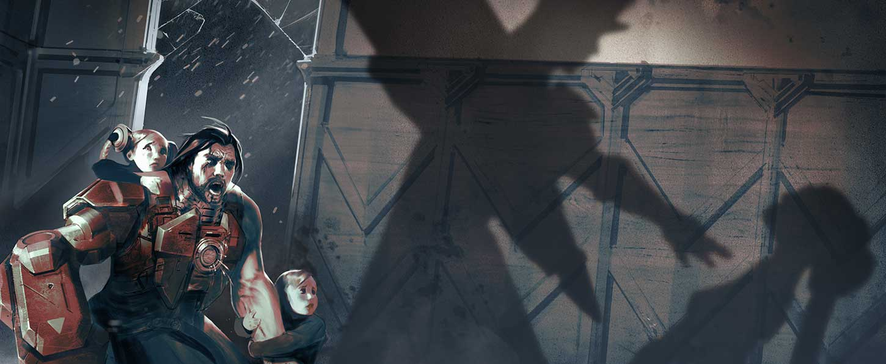
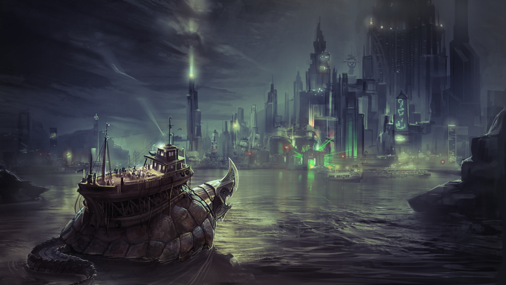

# Celeste Lore

## ‘IMPOSSIBLE DECISION’

“I do not need your permission to buy a goat,” Julia said. “Goat milk is delicious, and we can make cheese.”

They’d been arguing all evening. Ardan was hunched over his power gauntlet, sanding down the edges of a grill he’d removed to improve air flow. Outside in the yard, a goat shrieked into the moonless dark. “Goats stink and scream like fiends,” he grumped. “It hasn’t stopped for an hour. How will the twins sleep?”

“The kids need a pet. Are you dropping metal shavings on my divan?”

“And who will make this alleged cheese? When have you ever made cheese, your highness?”

“I could make cheese!” Julia shouted. She stomped out of the room and slammed the bedroom door behind her, the goat’s cries dramatizing her exit.

Celeste toddled out of her room, rubbing sleep from her eyes. “Dadda? Is Mamma alright?”

She had her mother’s accent. Ardan plucked up the toddler in his unarmored arm and kissed her cheeks. “Mamma is being ridiculous.”

“What is ridick oo luss?”

“It means she brought a goat home without talking to me about it.”

“I like goats.” This from Vox, who wandered in after his sister. He seated himself on his father’s foot, wrapped his arms around Ardan’s leg and rode along as Ardan took Celeste back to bed, staring out the window toward the screams.

“You like the idea of goats. None of us actually know how to care for a goat.”

“There’s a baby crying outside,” said Celeste, half asleep.

“It’s the stupid goat,” said Ardan, planting her back in her bed.

Vox uncurled himself from his father’s leg. “He’s afraid,” he said. “Maybe lonely.”

“It’s a she, Vox. At least I hope it is a she, or your mother’s dreams of cheese are –”

Ardan paused, turned toward the window.

The goat had stopped screaming.

His adrenaline spiked.

“Hide, both of you. Do not open the door.”

There was no time to make sure they obeyed him. He ran to his bedroom. “Julia,” he hissed at the bedroom door. “They’re here.”

Julia opened the door. Her face had gone white. “Now?”

“Outside.”

The armor stood in pieces around the front room in various states of renovation. Tools littered the floor. “Legs first,” he grumbled, stepping into the sabatons. Julia scrambled to her knees in her nightdress, a poor but necessary replacement for a proper battle squire. She pinched her fingers on the knee clamps, struggled under the weight of the chest pieces.

The button panel whirred and crackled with static, then burped out: “System. Offline.” Ardan slammed his left fist onto it. “Worthless damn power source on this model…”

“Shh.” Julia’s hands were black with oil, her face smudged as she attached the generator to his back and connected it to the power gauntlet. She stared out the door, into the hall. There was no sound. No disturbance. No goat. “Are you sure they’re…”

“System. Online.”

Glass broke. Ardan turned sideways in time for a metal arrow to slice a scratch through his breastplate, just under his chin, and thud home in the wall opposite the front window. Ardan cursed and squared up, the wood floor creaking under his armored weight. “I’ll watch the front door.”

“But your cannon arm!”

“It’s useless, unless you want me to blow up the house. Stay behind me.”

Julia closed her eyes, turned her palms upward. “I’ll protect you,” she murmured, her voice dreamy, green light forming in her hands.

Ardan winced away from the twisted-guts feeling that magic always gave him. “I can handle myself,” he grunted.

A forearm appeared over the window, decorated in an archer’s gauntlet, and then the archer herself swung inside. Another woman followed and drew her sword. More came in behind her, magicians and assassins, all wearing the same insignia.

“Stormguard!” he yelled, but Julia was lost inside her trance, eyes rolled back.

Ardan’s armor groaned and buzzed as he moved forward, painfully slow, but he was grateful for it when the Stormguard attacked. They moved in tandem, each with a weapon they’d held since childhood. He ran forward, energy buzzing through the armor, propelling him, heating the metal to burning, steel cracking against the breastplate. When he backhanded the archer across her face, he left a burn mark. She crumpled, her bow clattering to the floor.

The others raised shields of wood, metal and magic to counter Julia’s trance and Ardan’s assault. He stomped forward and plowed into them, knocked them from their feet, sent them flying in a crunch of bones to the wall. Their blood spattered the divan. They rolled in shattered glass, discarded weapons and their own knocked-out teeth. He could not resist every attack: Blades sliced through his unprotected arm and his cheeks; magic stung and froze him with deafening whipcrack sounds. But he was a wall between the enemy and his wife, and all the while, he felt warmth coming from her, a blanket that enveloped him, closed his wounds, melted the ice and gave him strength. It churned his insides, these unnatural talents, but he’d deal with the sick when his family was safe.

Then, the blast.

All went silent and cold. His teeth clamped shut. A shock pulsed up through his legs, his arms, his throat. He couldn’t scream. He couldn’t blink. Paintings slid from the wall and the bolts fell from the front door. He could hear the static noises from his armor display, the groans from the pile of wounded Stormguard, but he could not move. He could only watch as the front door opened and the last of the Stormguard stepped inside, as if invited. She surveyed the room, then snapped her fingers at two of the guard who were scrambling to their feet even as Ardan struggled to move. She pointed to the twins’ room and the two guards sprinted that way.

The woman walked from the door, past Ardan as if he didn’t exist, to Julia, who stood frozen in her nightdress and bare feet.

“Catherine,” gasped Julia.

“Such a shame,” whispered Catherine as she pressed her sword against Julia’s chest.

Ardan’s heart pounded out one beat. Another. Air filled his lungs and he coughed. To his right, the two Stormguard emerged carrying the twins, stunned as rigid as he. The other Stormguard rose, some shakily, some bleeding, all stone-eyed and with a firm grip on their weapons.

To his left, Julia stared into Catherine’s eyes.

His heart beat a third time.

In another heartbeat, his children or his wife would be dead, depending on which way he ran.

He ran.

The general’s sword, turned sideways, slid easily between Julia’s ribs. Her last breath was his name, and with it came the last otherworldly green swirl of her magic. It hit him, Julia’s last gift becoming part of him, wrapping around his insides, giving him the burst of strength he needed. Ardan wrapped the twins up in his arms and crashed out of the window. The two Stormguard who had taken the children lay unconscious. There hadn’t been time to kill them… or to hold his wife as she died.

He fled from the house into the dark, past the poor dead goat, whose screams had been silenced by one well-placed arrow through the throat. The children remained silent, in some lucky instinct, leaving the questions to the night owls in the trees.

## ‘ABOVE BOILING BAY’

“Stop swinging.”

From the top car of the rusted-out Carnie Wheel in the abandoned amusement park, Celeste gazes down at the mismatched buildings and colorful blinking lights of Taizen Gate. Up there, she can almost forget what it’s like to bump through the crowds, her fingers curled up tight in her brother’s so as not to lose him. How the merchants shove dead fish and live chickens and beeping gadgets in her face in the markets. How she never sleeps well thanks to the MECHANIC sign over her father’s garage that pulses red through her curtains. How the few stars that appear above the bright city call to her.

Vox grins, not even holding on, shifting his weight back and forth hard. “What? Like_this_? Is this what’s scaring you?”

“I’m not scared.”

“Because if you’re scared, I’ll stop.”

“Shush.”

During the day, she keeps one hand buried in her pocket, a warm sphere of light like a marble clenched in her fist. Just to feel right.

“Admit you’re scared and I’ll stop.”

“When you fall, I’ll laugh.”

Above the noxious halcyon smog that burps its way out of Boiling Bay, the sun sets in dirty oranges and reds. Through the haze that roils a mile inland, giant churn cranes wander, their heads poking up above it to breathe, making swirling valleys that fold in on themselves and disappear. By nightfall, the ground will be packed with the Taizen teenaged underground, shoulder to shoulder, cheering through gas masks. Atop the Carnie Wheel, though, the twins breathe easy.

The amusement car creaks and moans as it swings. “Do you think they’ve found us?” asks Celeste. Everyone in the Taizen underground knows when “tourists” arrive. They try to be stealthy, but no matter how well they imitate the fashion, no matter how good their accent, when they start asking questions, locals spread the word. And when they have rune tattoos, or the sulphur-smelling snap of magic about them, the back tables of the tea rooms buzz with talk, none of it friendly.

“I hope so.” Vox shrugs. “Tired of hiding anyway. Let them come. I want to look in their eyes.”

“You want revenge for Mamma.”

“Don’t you?”

“I want us safe, same as Dad.”

“Safe is no fun.” Vox takes up the swinging with renewed violence. Celeste’s annoyed protests resound below the smog.

## ‘THE MASKER RAGE’

00:00.05

_It takes five seconds to fall from the top of the Carnie Wheel._

_At first Celeste flails, her hands pinwheeling through empty air, the deafening squeal of metal rods shearing apart drown out the hammering beat of her heart._

_But then, falling through the bright burning magic of her own design, her eyes close. Her arms relax. In five seconds, every bone in her body will splinter and she will die. Her overprotective father has been right all along, and there’s nothing she can do. Time slows, loses meaning._

_Five seconds._

_Celeste’s mind wanders._

00:00:04

For years they braved the noxious-aired abandoned carnival to climb up the Carnie Wheel where they could be alone and play with magic. “Do the thing,” Vox said, then watched as a little swirl appeared in the air over Celeste’s outstretched palm. The air there became not-air, and her hand under it became not-a-hand, and what they stared at became not-a-thing, an absence of a thing, the end of a thing, the last dying breath of a tiny star, collapsing in on itself.

“My turn,” he said, and closed his eyes, raised up his hands. For a few seconds, nothing. Then, Celeste heard it. Sparrows that had been calling out of sync sang together, this little melody, and Vox hummed along. He sang little lyrics with it to crack Celeste up. “This is the Celeste song, I made up a Celeste song, everybody sing the Celeste song…”

00:00:03

_Stars slide between her fingers as she falls and falls and below, their eighteenth birthday rave churns with chaos, the desperate screams muted inside gas masks._

The Masker Rage began at nightfall, the smog layer blinking with the raver kids’ glimmering crystal necklaces and the glowing designs they’d painted on their skin. Carnies had cut open the security fences and charged admission; they snaked through the crowd selling drinks spiked with who-knows-what, their pickpocket kids cleaning up.

“Wait,” whispered Vox. Celeste’s hands radiated with heat. Vox nodded to a beat coming from inside of him, then inside her, then inside of everyone on the ground, their heartbeats pounding in tandem. His fingers snapped and the sound was a crack that scared the cranes. Their wide wings stirred up the smog, pulled it back like a stage curtain, revealing the twins’ faraway silhouettes to the crowd. “Okay. Do the thing,” sang Vox, so Celeste held out her palms and

let

go.

The stars above coiled, then their hot light fell, bursting into spirals. Vox sped up the beat, and from nowhere and everywhere there was music, and the ravers danced, wild with elation and anticipation and whatever was spiked into the Carnie drinks.

Stars shot through her and exploded from her hands into fountains and geometric patterns that danced along to the music, and inside of that blaze of light and sound the twins were free.

00:00:02

_The ground flies up to meet her, littered with the scattered bodies of ravers who’d gotten in the way_. They fell in clumps, trampled under swords and shields and blasts of blue magic. The tourists threw off their cloaks, revealing uniforms in Gythian gold and Stormguard white. The singing turned into panicked shrieks and Vox’s song became a march, music for unifying armies and terrifying enemies.

As the music mutated, the starlight moving through Celeste’s hands turned into searing drops that incinerated whatever they touched. Showers of pain. On the ground, puddles of starlight exploded. The fighters lunged out of the way of the spraying light. Sparks burst on one another, lighting up terrified people running toward the city.

“What’s happening?” Vox screamed, and the sound came out in song, another layer to the music.

Celeste tried to answer, but her tongue crackled with light, like popping candy sparklers, and below them, the ground under the Carnie Wheel became not-ground, the absence of ground, the death of the falling stars, just like the baby black holes she had always made to delight Vox, but big and churning, swallowing.

Vox clapped his hands once. “Celeste!” he cried,

“STOP!”

The world rumbled with Vox’s sonic boom, and an explosion of starlight blasted from below. Cracks splintered underground and the Carnie Wheel tilted hard, jerked out from under their feet.

00:00:01

_Celeste searches among the faces of the Stormguard for the one who killed her mother, but finds instead the red shapes of her father’s armor, scorched black in places, surrounded by charred, crumpled people. His hand reaches out. There’s a look on his face she’s seen before only once._

00:00:00

## ‘VANGUARD UP!’

Ardan slammed his fist into the armor’s control panel.

“Command?” responded the computer voice.

“Vanguard up!” he screamed.

\*

It hadn’t been enough, Ardan thought, running with sidewalk-splitting clomps toward the cracked, tilting Carnie Wheel, clutching the tattered Masker-Rage poster in his free fist. It hadn’t been enough to escape the Stormguard by the dead of night. It hadn’t been enough to use assumed names and hide every day for more than a decade. It hadn’t been enough for the kids to watch their mother die.

Had his rules been so impossible? Don’t draw attention to yourselves. Don’t let anyone see you playing with that magic stuff. Don’t tell anyone where you’re from. Don’t show anyone the curtained-off part of the garage where he modified the power armor after hours, adding generators and liquid coolants and boosters. He’d always known that his rules wouldn’t be enough.

And now, his children were falling.

_Don’t draw attention to yourselves. And they’d put up posters_.

\*

Breathing hard through his respirator, Ardan raced through piles of trash and wild churn cranes, knocked over a few fleeing raver kids and carnies and winced at the battle sounds he’d hoped never to hear again – pained screams, weapons clashing, explosions – but louder than that, the reverberation of a sonic boom that had cracked the wheel at its base. The boom echoed off every surrounding surface. They’d probably heard it at the other end of Taizen Gate.

_Damn it, Vox._

Getting close to the wheel meant dodging the sparking, falling stars that burned and exploded together. One flew past Ardan’s face, struck a burn mark onto his cheek.

_Celeste!_

Ardan roared, bursting through the soldiers gripping Gythian steel, men and women who wanted what Julia had wanted: Celeste on the throne of the Storm Queen.

_Over my dead…_

White-clothed Stormguard swarmed up the Carnie Wheel to escape a sickening nothing into which anything closeby sank. It had been more than ten years, and still the Storm Queen would risk her best soldiers to end his family.

Ardan squinted up through the falling starlight at the shadows plummeting toward him.

“Vanguard confirmed,” the control panel responded.

“Please, be enough,” whispered Ardan, as the holographic barriers crackled to life a few feet from the ground.

The barriers bent but held fast as the twins slammed into them.

Gythians closed in tight as the barriers dissipated and the twins rolled safely onto the pavement.

“We have to fall back, your highness!” cried a Gythian battle mage, blue electric currents moving up his arms. “Retreat!”

“Stay away from my children,” grunted Ardan, swallowing down the sob in his throat, grabbing Celeste’s elbow as the soldiers fled.

Celeste pulled away from him, trembling. “We can’t hide anymore, Dadda,” she said, and ran.

Ardan cursed, but Vox was running after his sister. Close behind, the Stormguard regrouped. Ardan followed, and together they dashed toward the bay, surrounded by what was left of the allied Gythians. Behind them, the Carnie Wheel continued to fall, rusted metal screeching, collapsing on itself, slow as a dream.

A single raven circled above them, camouflaged against the now-dark sky, watching.

## ‘ESCAPE TO THE FOLD’

So we’re headed out of Boiling Bay at top speed, right? Carnie Wheel cars are coming unbolted and like

_BAM-CRUSH_

smashing to the left and right of us, and the Stormguard chase after us with these shields that make this

_ZAP-BZZT-ZAP-BZZT_

sound, and we’re taking fire over those shields, like magic bolts are slamming into people, and a fireball goes

_WHOOMSHHHHH_

through us and creates this freaking puddle of flame that we have to jump over. Dad’s armor is overheating, and this old Gythian war mage who’s doing all the talking is like, “We must escape to the barge!” and Dad’s like, “My daughter will have nothing to do with your old-world politics!” and I’m like, “Can we discuss this later when we aren’t, you know, about to

_die_?”

We race down this old creaking dock toward the_RAAAAAHHHHHRRR\_of these titanbacks that pull the barges. While the soldiers yank on the ropes to float a beast close enough for us to board, the Stormguard march closer, singing a creepy war song. An arrow goes\_SHTOOMP\_into the spine of the guy next to me. What’s left of the first line of Gythian defense stabs at the shields like\_zzzppttt_–_zzppptt_, and Celeste holds my elbow and leans in.

“Do the thing,” she says. Then she smiles at me like everything isn’t chaos, like it’s just us on top of the world again.

So I gather up all the sound I feel. The titanback’s mouth yawns without a sound. The water doesn’t lap-lap-lap against the dock. This energy I’m gathering, it sucks up the Stormguard’s song. The flying arrows don’t whistle. The fireballs don’t crack. The Gythians yelling orders and instructions, they’re silenced. I grab it all, every sound I can find, and ball it all up into my hands. It feels like a beating heart.

I aim it, then I let it go.

It blasts in waves like\_WUB-WUB-WUB-WUB\_right at the line of Stormguard. Then the Gythians go to town on those dangerous dames, slice-n-dicing, and the Stormguard retreat, Gythians chasing after them.

I’m expecting accolades, like at\_least\_someone could act impressed? But the titanback burps out this big noise and the war mage is already trying to get Celeste onto the barge. Dad isn’t having it. He grabs Celeste back by her wrist. “She isn’t going,” he says.

The war mage goes on about how Celeste has to fulfill her destiny and take the throne blah blah blah, but Dad is having none of it. He even fakes a punch at the Gythian mage to make him flinch. Dad says the Storm Queen is threatening their dying civilization and they think throwing Sis at the problem will fix it. Celeste and I are like_whoa_. We learned about the tyrant queen in school, how her armies mow down and pillage other cities, killing dissenters and kidnapping talented kids to be raised as Stormguard soldiers.

It gets crazy-tense, and everyone’s talking about what’s best for Celeste. But it feels like my future’s being decided too. And I got a decision to make…

~~~~~~~~~~~~~~~~~~~~~~~~~~~~~~~~~~~~~~~~~~~~~~~~~~~~~~~~~~~~~~~~~~~~

“If there is a way to end her tyranny, shouldn’t I do it?” Celeste says in that calm way that always winds Dad up even worse.

“Your mother thought she could supplant the Storm Queen with technologist help, and look what happened to her.”

Wrong thing to say to Celeste. The girl is hella stubborn on the subject of Mom. “I love you, Dadda, but I won’t ask permission. They’re my people.”

“And you are going to save them, your highness?” Dad scoffs.

“Dad.” I put my hand on his arm. He shakes me off, so I put it back. “Listen.” And I let him hear.

An echo comes from all around us, a voice from a long time ago. It says,

_“The kids need a pet.”_

Dad spins around, staring all wild-eyed around the dock. “Where…”

_“Are you dropping metal shavings on my divan?”_

“Julia?” he whispers. It’s the first time I’ve heard him say her name since that night.

Then I play Dad’s voice from that night, the part where he’s yelling at Mom.

Dad freezes, his mouth a little open.

“Dad,” I say again. “Celeste is gonna go. This could be the last time you see her. You really want this to be the last conversation you two have?”

There’s this long awkward silent moment where it would be cool of him to say,_You’re right, Vox_, but no. He just gathers Celeste up into a big metal hug. “You’ll always have me,” he says. He’s the first on the barge, then he helps Celeste get on.

“You’ll always have me, too,” I say while hopping onto the barge, though no one hears me, it being such a weepy father-daughter moment, but whatevs.

I’m the only one who hears the last echo, just a whisper, as I’m following my family out of Boiling Bay:

_“Such a shame…”_

\*

There’s all these rumors and tales about how Celeste is gonna challenge the throne of the Storm Queen \(which is still weird for me\), and they’re all epic, about how the Gythians and the Stormguard found out where Dad was hiding her, and they battled it out, and the Gythians took us here to the Halcyon Fold to recruit heroes to her cause, and now she’s dropping stars and taking names. But they leave out all the cool stuff I did. At least now you know the full story… and it’s not the last you’ll hear from me.

## ALTERNATE FATES

### ‘BUTTERFLY’ CELESTE  

#### ‘THE SWEETHEARTS’

“Celeste! Yo, where’d you go?”

“I’m up here, taking care of the sweethearts.”

Vox poked his head out of the window and looked up. Celeste’s long black hair spilled down as she waved at her brother from the roof.

Vox climbed out and swung up to join her. “Sweethearts? Whaddya mean …_whoa_.” On the roof, Celeste was busy watering a crowded garden full of butterflies. Bright orange and pink zinnias shared sunlight with golden sunflowers and purple verbenae. Butterflies socialized on firecracker vines, sipped from milkweeds and dangled from nectar-filled feeders hanging from wooden house-shaped boxes. All different colors and patterns zoomed together in pairs. A Blue Pansy landed on Vox’s nose and combed his eyelashes with its antennae.

“The sweethearts like to drink from the flowers,” said Celeste. “The caterpillars need the dill and violets and clovers.” She pointed to herby-smelling boxes where caterpillars munched and larvae hung out. “I take care of their host plants and nectar plants, and I keep the spiders and ants away.”

“Uh, Sis,” said Vox, swiping away the butterfly on his nose, “this is pretty and everything, but sweethearts are_people_. Bugs aren’t people.”

Celeste set down her watering can and smiled at her twin. “Butterflies are people who were in love but couldn’t be together. Didn’t you know that?”

Vox’s eyes widened at a pair of Red Lacewings spiraling through the air together. “Butterflies … used to be people?”

“And now they can be together.” She held out her finger and a big orange butterfly landed on it. “This kind is called an Orange Julia.”

Vox stepped close, peering at the basking butterfly. “Does … does this one have a sweetheart?”

“Not yet.” Celeste whispered to the Julia, and it fluttered over to rest on Vox’s ear. “But I’ll take care of her until her sweetheart comes.”

### ‘REBELLION’ CELESTE  

#### 'NO MORE FEAR!

_A holographic image burst out of the top of a small gift box that sat before the rebel future queen and her Gythian advisor. There was no sound, only the image of a battle. There sat the Storm Queen atop her horse; beyond was the queen’s army and her Stormguard flooding a green farmland with the blood of the locals, whose cavalry fell under the magical onslaught. The last image was that of Catherine, her war mask disguising her features._

_“The queen’s army is in Neruda,” whispered the Gythian._

_“They are a week’s ride from Mont Lille,” said the rebel queen. “Now is our chance to attack.”_

“Tell me we didn’t throw this party for nothing,” said Vox, tapping his foot.

Celeste leaned over the spar deck of_The Audacity_, peering down through Vox’s brass telescope at the Storm Queen’s uniformed soldiers positioned behind the fortified gate of Mont Lille. Celeste’s airship navy hovered in formation around them. Her hodgepodge army, made up of the unified fighting people of a half dozen of the Storm Queen’s occupied cities, waited on the road outside the gate.

A handful of Gythians, heavy in their polished armor, blades sharpened, eyes grim, made a half-circle behind Celeste. “It is time, your highness. You must give the command to fire,” said the war mage in his grand, old world accent.

“Look at the front lines,” she said, handing the telescope to Vox.

He held it to his eye and adjusted the focus. His shoulders slumped. “Kids,” he said.

“The Storm Queen’s child army.”

The Gythian struggled to control his tone. “You knew that the Storm Queen takes children at young ages to be trained for war.”

“That was to be our fate,” said Celeste. “I did not know she would go so far as to put them in the front lines of battle.”

“The queen is a pragmatist. She thinks you will not attack children.”

“That’s messed up,” said Vox.

“She is right,” murmured Celeste.

“We have come too far to turn back,” pleaded the war mage. “This plan has been in place since you were born. If you do not take Mont Lille while the queen is away…”

“I am the queen. Mont Lille is my city. These are my people. Shall I begin my reign by killing my own soldiers? By incinerating children? Does Gythia’s stake in this plan fall away at sunrise?” Celeste held the Gythian’s gaze until he backed away, then took the telescope back and squinted through it. “Vox? How loud can you make my voice?”

Vox laughed. “You wanna know if I can make noise?” He made a microphone with his fist and held it in front of her mouth.

Celeste’s mouth opened, then closed. She pushed down Vox’s hand and whispered, “Do good queens know the right thing to say?”

Vox grinned and put his hands back. “Good queens tell the truth.”

She looked over the mountainside city, every twinkling light representing a soul frightened by the enemy at its gate. The Storm Queen’s army buzzed and sparked with magic.

“My loving people!” she cried, and her voice carried over the gate, over the ground troops and the airships, over the city where her mother was born. “To fill the coffers of a dictator, you have engaged in a generation of war. You have sacrificed your liberty. You have surrendered your children to die in battle. I challenge you tonight to end this oppression. I have come to Mont Lille not to conquer, but to live and die as the rightful descendent to the throne, the Star Queen. My honor and my blood belongs to this land and to you all. I am here to fight, not against you, but alongside you against fear! No more fear!”

In the silence that followed, Vox draped an arm around his sister’s shoulder and they both stared down.

Then, there was a solitary shout from behind the gate. The voice of an adolescent boy.

“No more fear!”

“No more fear!” called another voice, and then another, and more, all of them the voices of child soldiers.

“No more fear!” The adults picked up the chant, and then the ragtag army on the ground with nothing in common but a hatred of the Storm Queen took it up, and then even Vox’s goblin crew burbled the words the best they could just to fit in. The handful of Gythians who had prepared for a bloody battle looked at one another, bewildered.

“The woman will overtake a capital city without a drop of blood spilled,” said the war mage, but the propellers picked up speed so that no one heard him. Vox steered\_The Audacity\_over the gate and landed in the city square, and the throngs surrounded the airship to welcome the Star Queen home.

### ‘RISING STAR’ CELESTE 

#### 'THE MIRRORED COURT'

The royal party traveled up the winding streets of Mont Lille, torches lighting their way. The going was slow; the crowds pressed into their new monarch, reaching to touch her hair and gown, chanting No more fear! and Liberté, égalité! At the summit of Mont Lille, past grottos and fountains and manicured topiary, they climbed a marble staircase to find the gem-encrusted gate of the Storm Queen’s palace wide open. There, Celeste bade her people to return home and remain vigilant, and the gate closed behind her.

Inside the heavy palace doors all was still; the rumors of révolution had spread through the mountain and those who supported the Storm Queen had made a swift exit along with all they could carry. Celeste, Vox, the Gythians and a ragtag assortment of pirates spilled into the Mirrored Court and stared.

“This was nothing more than a hunting lodge when I was here as a young man,” whispered Elizar the War Mage, turning in place to gape at the carved gilded windows, the black and white marble tile, the chandeliers blazing with hundreds of candles. Paintings portraying violent depictions of the Storm Queen’s triumphant battles spread over the ceiling. Bronze sculptures of faceless Stormguard posed throughout with their weapons. The mirrored walls jutted out at odd angles to give the disconcerting effect of hundreds of fractured reflections, giving the court its famous name.

“This is freaking me out,” said Vox, flinching as his echoed image leaped out and retreated in his periphery.

“It is meant to,” said Celeste, her staff clicking on the marble as she walked through the court. “She is the only one who does not see herself in her court.”

“Dignitaries, knights and nobles staring back at their own guilty eyes while the Storm Queen sits, pure in her blindness, upon the throne,” said Elizar.

Celeste stopped before the monolithic throne, carved from black stone, feeling all at once quite young. Its simplicity was stark in the ornate room; the only decoration on it was a high perch for the Queen’s ravens. “I don’t want to sit on that,” she said.

“Another shall be commissioned for you,” said Elizar, “but sit on one you shall.”

In contrast to the sobriety of the royal twins and the Gythians, Vox’s entourage amused themselves at the mirrors. Loo, the sprite, admired herself by all angles, brushing her hair with her fingers. The pirates pulled at their eyes and lips and giggled at the results. Behind the throne, one goblin argued with his reflection, thinking it a rival, and poked at his enemy’s eyes, activating a hidden switch in the wall that opened a cabinet. Vox investigated, yanking back the goblin by the fluff in its ear.

“Hey, Sis,” he called in his sing-song tone, “you should come look at this.”

Celeste joined him and her eyes grew wide, for displayed in the cabinet was a mage queen’s regalia: a star-shaped breastplate and gauntlets, a crown, and a staff capped with a crescent moon that bore the inscription: “Préserver la Paix.” Celeste ached from the magic pulling at her from the staff.

“Not the Storm Queen’s style, this,” muttered Elizar.

“No,” said Celeste, her fingers caressing the staff’s sharp tip. “This was made for me.”

Vox grabbed a gauntlet and inspected it. “She knew you were coming?”

“She couldn’t have known. We were cautious,” said the Gythian.

“She knew I would succeed her,” said Celeste.

“Under her tutelage,” said Elizar in a dry tone.

“Instead I am under yours,” replied Celeste with equal dryness. She took the staff in her fist and the crescent glowed, illuminating the old War Mage’s frown. “Let’s continue on. But I think …” Her eyes rose to the ceiling paintings. “… I think I shall have a skylight installed.”

### ‘STAR QUEEN’ CELESTE 

#### 'THE RISE OF THE STAR QUEEN'

Outside the palace and all along the continent, the independent kingdoms that had once all been the purview of the Storm Queen raged at war. Nobles took up arms against one another; commonfolk rose up against the nobles whose battles burned their farms. The Captain of the Navy laid in convalescence and the Star Queen remained palace-bound for her safety.

One night, as she pored alone over war maps for the thousandth time, she heard whispers echoing her name. She followed the sounds through twisting hallways to an ornate locked door.

_Try your key_, she heard from the other side of the door, and so she slid the key to the queen’s chambers into the lock, and the door swung open wide.

The aviary was a narrow, tall courtyard around which the rest of the palace had been built. It was open to the sky, and perches covered in ravens’ nests protruded from the walls. She walked out into a garden, her bare feet sinking in wild grass and flowers, her neck craned up as the ravens glided down in wide circles to light on stone fountains and benches and on her shoulders too, and when she held out her fingers one of them curled his talons around them. She should have been afraid but she smiled, delighted at the hefty weight of them, at their majestic size.

_The queen is dead_, came a whisper from one shoulder.

_Long live the queen_, whispered the one on her hand.

“Why can I hear you?” she asked, turning to look at the hundreds of dark birds gathered to greet her.

_The queen can hear us_, said one behind her.

_You are the queen_, reminded another.

“And who are you?” she asked.

_I am Vyn_, said one.

_I am Vyn_, said another.

_We are Vyn_, said a chorus of them.

“Very well, Vyn” she said, running a thumb over the head of the raven on her fingers, soothing his eyes closed. “You beauties are free now.”

_We belong to the queen_, whispered one.

_You are the queen_, repeated another.

_If you wish, you may have our eyes_, came a whisper from her hand._I will show you_. And Celeste’s vision blurred, then went black, and she felt herself flying high over a golden Gythian tower. She saw the glint of it, then the wear in the ancient construction. She circled, her wings spread, weightless atop the warm breeze; it was a dream of flying but better, for she had never seen the world in such vivid, bright color. Into a high window she flew, perching high on the molding near a ceiling fresco. She poked her beak at an itch under her wing until she heard voices far below. A group of people in pretty robes gathered over a map and argued.

“Ah, it is my advisor,” she said in her trance. “Elizar!” But her voice came out in a raspy caw that the people below did not hear.

“… successor has been found in Taizen Gate, and we are sending you, Elizar,” said a woman.

“I’m too old for this, and so is Gythia,” said Elizar. “Let the Storm Queen, or whatever it is Louisa is calling herself these days, deal with her lands as she sees fit.”

“Her ravens’ eyes turn toward us and her army has never been stronger. There is none better than you at raising people to power with Gythia’s best interests at the fore. Advise her to give independence to her neighboring kingdoms. They will turn on one another and collapse, and we shall have a necessary foothold on the continent.”

Celeste snapped herself away from the ravens’ dream. Her lips pursed and the ravens cackled. “Is this vision true?” she asked in a measured tone.

It is a memory, said one.

A story we can tell of what we saw, said another.

“I trusted him,” she said, her jaw tight. “He lied.”

_Everybody lies._

_But you can know when they lie._

_You can see our colors._

_There is nowhere you cannot fly._

Pay the price, hissed one.

_Let us take them, and we will be your eyes._

_Give us your eyes._

“So the queen before me was not so blind after all.” Celeste petted the head of the raven, one long stroke after another. She nodded up at the stars, the last thing she saw with her own eyes. “I must know the truth if I am to rule,” she said. “Take them.”

The ravens descended, screaming.

### ‘BAEWITCHED’ CELESTE‘ 

#### 'BUT I QUITE LIKE PEANUT BUTTER’

Celeste wandered upon Petal on the Halcyon Fold one night, pulling eyes out of newts and dropping them into a cauldron.

“You look strange,” said Celeste. She was eating a peanut butter and honey sandwich with the crusts cut off. “Did you do something with your hair?”

Petal stirred up the stuff in the cauldron with a long spoon, then added three frog legs. The brew inside glowed green and farted. “I don’t have hair,” said Petal. “I look weird because you usually see me with Murgle.”

“Oh. Whereisyour fancy bouncy vehicle?”

One of the frog legs leaped out of the cauldron and tried to hop away. Petal grabbed it and tossed it back in. “Closed up, like the rest of the flowers. Haven’t you noticed anything different about the sky?”

Celeste looked up. “All the stars are where I left them.”

“It’s noon. Don’t you don’t find it kind of strange that you canseethe stars right now?”

After a thoughtful bite of her sandwich, Celeste said in a sticky way. “I guess I don’t usually eat my lunch at night.”

“It’s been night forthree days.We’re calling it The Great Eclipse.” Petal unwrapped an itty bitty pouch and upended it over the yawning mouth of the cauldron. Nothing visible came out, but baby laughs echoed from inside the bubbly goop. “The Bleekos did it.”

Celeste peered over the lip of the cauldron and leaped back with a squeak when something inside erupted. She was okay, but her sandwich got toasted. “Bleekos?”

“The Meekos’ mortal enemies. Their king, Gnottingham Catchfly the Third, stopped the world’s spin. Now half of it is always dark.”

“How did he manage that?”

“Magnets. Magic. Or maybe he dug down to the squirrel in the middle of the world who runs on the wheel and fed him a poisoned biscuit. I don’tknowhow, just that he did it, and the Bleekos invaded my home with their moonlight power. My garden is full of dung beetles and mosquitos and super-annoying cricket songs. The flowers are all closed, including Murgle. The munions are hiding underground. And I can’t fight, ’cause all my power comes from the sun.”

“I like when the stars are out, though.”

“You also like honey. Andpeanuts.” Petal pointed at Celeste’s sandwich. “There’s no flowers for the bees to dance in, and they’re all napping in their hives. No flowers, no honey. No sun, no peanut plants. No peanuts, no peanutbutter.”

“But I quite like peanut butter.”

“So make yourself useful.” Petal tossed a turkey baster over at Celeste, then poured in one grinning clam, one angel feather, a spider with nine legs, a first kiss and a can of orange juice concentrate. “Put a drop of that on this.” She set a watermelon down on the ground before Celeste, then fit a protective pumpkin over her own head.

“Um… okay?” Celeste poked the baster into the burpy fizzy concoction and delivered one drop onto the innocent little melon.

B O O M!

The melon exploded outward. When the green smoke cleared, the watermelon had spooky sharp teeth, googly eyes and bounced around all on its own.

“Perfect,” mused Petal, and hopped onto her new ride.

“Exploding stuff could be useful,” mused Celeste. “Let’s make some more.”

### ‘MOON PRINCESS’ CELESTE 

#### ‘CELESTE SAVES THE MOON BUNNY’

Celeste was walking home after studying late at the Taizen High School library one night when she heard a snivel-y weepy sound coming from the park. She followed the bawling to the swing set, where she found a brown-spotted bunny. The bunny was swinging super high, so high that Celeste was afraid he would go all the way around, then he jumped out of the seat with his four legs and floppy ears spread wide only to faceplant in the grass. With slumped shoulders and hiccup-y sobs he climbed back up into the swing and began again.

“Excuse me, bunny,” said Celeste, “but why are you crying?”

“I fell off the moo-oo-oon,” wailed the bunny, swinging higher and higher.

Celeste looked up and sure enough, there was the moon, big and fat and full and bright. “And you’re trying to jump back up?”

“Ye-e-e-es,” the bunny stutter-whimpered. Again the bunny leaped from the swing, its soft spotted belly open to the moon, but it fell again with a fluffy oof. With its whiskers in the grass he said, “I’m in charge of making all the peanut butter mooncakes for the world, and if I don’t get back soon, there won’t be any peanut butter mooncakes ever again.”

“Bunnies make mooncakes on the moon?”

“All mooncakes are made by bunnies on the moon,” wept the bunny.

“Then I need to get you back up to the moon,” said Celeste. She picked up the bunny and craned her neck to look up, squinted one eye shut to gauge the distance. Sometimes stars came down from the sky to play with her; it made sense that she could go up to play with the moon. It wasn’t so far away as a star, after all. So she stared up at the moon and spun in a circle, spun and spun, faster and faster, her long braids whipping into a whirlwind, and soon her feet weren’t on the ground anymore, and then if she’d looked down she’d have seen the swing set far below, and the tops of roofs, and then Taizen Gate turned into a sprinkling of pretty lights in the distance past the clouds, and then it became very quiet, and then they were on the moon.

They landed at the edge of the sparkling moondust falls where the bunny had tumbled off and were surrounded all at once by rabbits of all colors, even some striped like peppermint sticks, others polka-dotted like party dresses. The spotted bunny leaped from Celeste’s arms into his mother’s paws and the rest led Celeste off to the mooncake village, where all of the buildings were made of different flavors of mooncakes. The bunnies gave her super-tech moonwalking boots and a magical moon staff and made her the princess of the moon. Her most important princess duty was to taste all of the mooncake flavors, and she took to the task with great seriousness.

After a whole night of mooncake eating, she told the rabbits that she had to return home. The rabbits were sad and tried to make her stay. Celeste explained that her brother Vox would get into trouble without her there to care for him, but to show her dedication to her duties, she returned every week thereafter to be Moon Princess, and to teach the rabbits a little magic, and for the official mooncake taste-testing \(even though peanut butter was always her favorite\).

