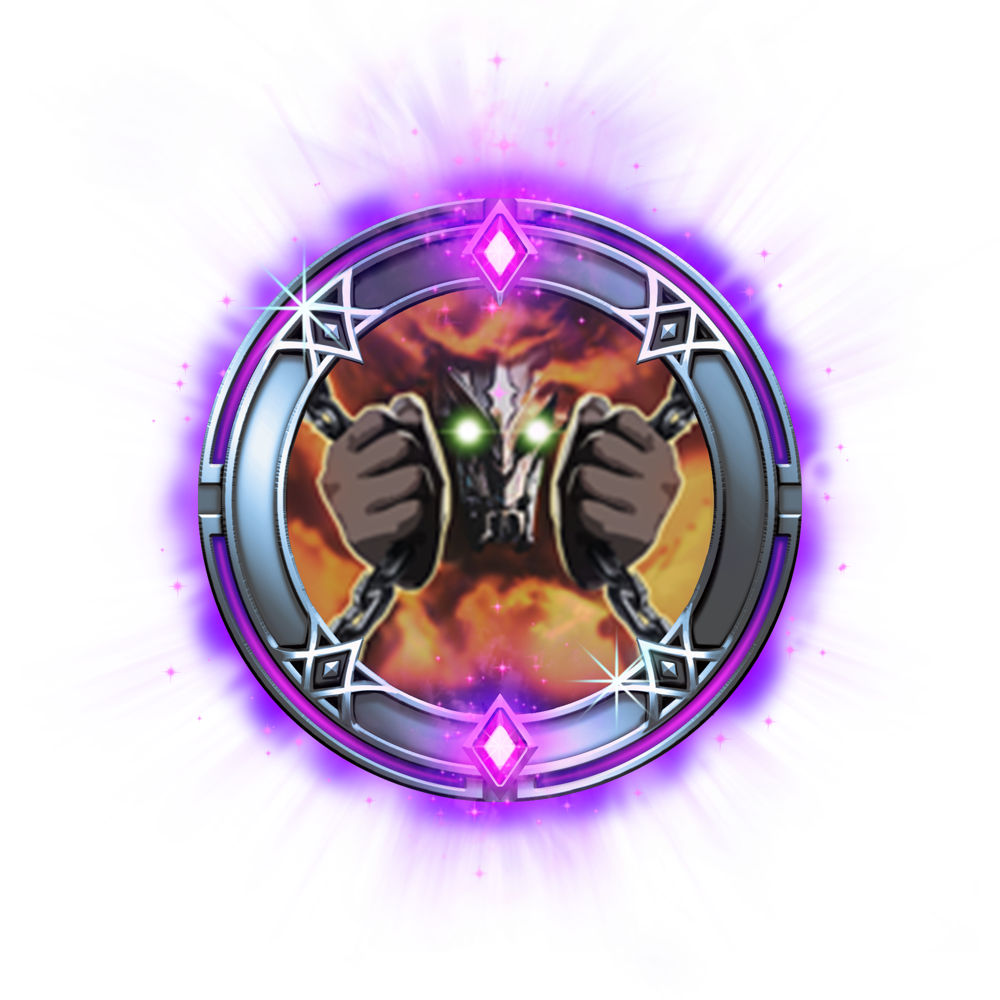

# Churnwalker Talent

## Rare Talent

### Churn Tank

Futility of Life \(Heroic Perk\) has significantly increased healing but decreased damage share.

| Heal | 210% |
| --- | --- |
| Damage | 50% |

## Epic Talent

### Cloud of Torment

Activating Torment \(B\) releases a powerful Churn Cloud that damages enemies over time, making Churnwalker a dangerous threat at close range. Cooldown Increased.

| Duration | 3s |
| --- | --- | --- | --- |
| Damage / Second | 50 |
| Radius | 4 |
| Cooldown | 3s |

## Legendary Talent

### Grappling Hook

Churnwalker's Hooks & Chain \(A\) gains a grappling hook. This ability has dramatically increased range and can grapple to targets, pulling Churnwalker to the hooked location.

| Bonus Range | 20 |
| --- | --- |
| Range | 2 |

