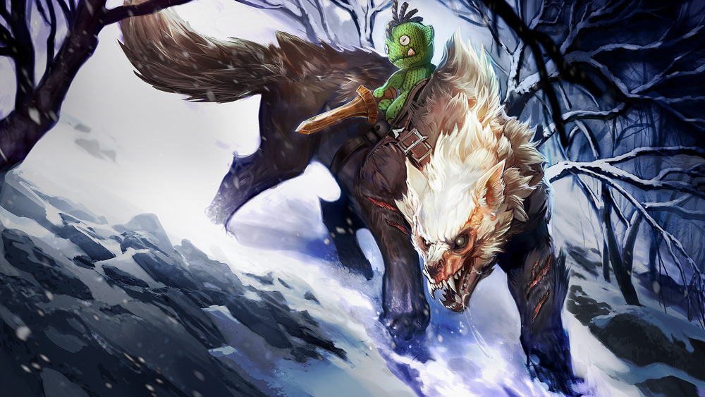
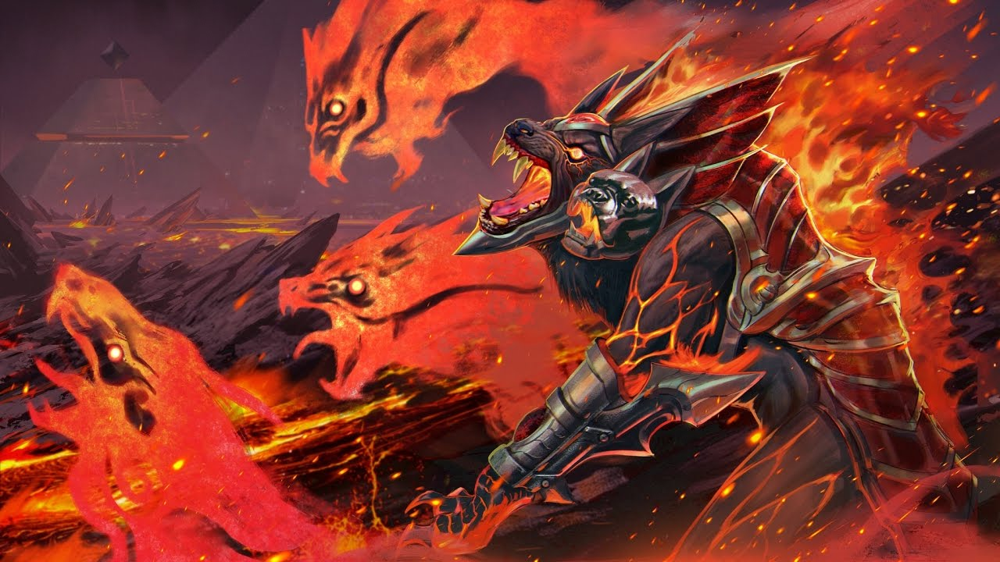

# Fortress Lore

## ‘THE DESTRUCTION OF THE TEMPLE’ {#destruction}

A dire wolf raced out of the temple’s fourth circle, tongue lolled out to one side, panting, exhausted terror in his eyes, his thick fur matted with dried blood. His back legs were caked up to the stifles in red loamy mud; he’d kicked free in time to get bit in the muzzle by something venomous. He skidded to a stop where mud met ice, into the forelegs of the alpha, his eyes down, unsure whether to be more frightened of what he’d run from or what he’d run into. The ground rumbled, the ice cracking outward in long lines. The alpha’s hackles rose, ears twitching at the sound of his pack howling, whining and yipping in pain. He could name every one of those sounds: son, daughter, mate, packmate, friend.

After the first quake, the alpha had inspected the inner circles of the ancient temple, his nails tapping on the ice, his breath fogging in the frozen air. A foreign scent bothered at his nose. The tremors intensified, the scent grew stronger and the pack’s restless whines and tail-chasing had to be contained with barked orders. Within hours, the ice in the first circle melted into pools of water that the ground drank up with greedy thirst. The second and third circles, once ice and brick, became mud. The scent choked every inhale, and the constant shaking set the wolves to howling.

Then, the vines appeared.

They were like nothing the wolves had seen. They whipped out from the mud, piercing blind in all directions. They wrapped around the temple pillars, crumbling them to gravel. The pack tore them apart, but within minutes the thick stems grew anew. The well itself, once richly decorated with sculpture and carvings, became nothing but a dark hole in the ground leaking putrid air. The inner sanctums turned to rubble.

Eggs frozen for untold millennia bubbled up from the mud and broke open, spilling out long-toothed reptiles. The wolves went to battle, ears flat, snarling, leaping in fast and retreating in the way of the hunt until the blood of their prey dribbled out in thick clots that fed the carnivorous mud. But the creatures could not be contained – and the surviving reptile hatchlings grew larger than the wolves. Everything birthed in the fertile mud was bloodthirsty and more dangerous than anything the wolves had hunted before. The mud itself was an enemy, drinking the wolves into itself, forcing them farther and farther back from the well.

They might have fought back the horde if not for the insects. Clouds of bloodsucking mosquitoes and hives of venomous wasps burst upward. Crimson ants burrowed into the wolves’ fur and chomped into their belles. The pack snapped their teeth into the stinging swarms to no avail, bit into their own itchy hindquarters, limped on poisoned limbs.

The guarding of the Halcyon Well had been the alpha’s vocation since the temple had been built, from materials found nowhere near the frozen tundra, by a people whose lineage had died out before their story could be told. It was unthinkable to abandon it. Yet without a pack, an alpha commands nothing.

“Get the others out,” he snarled at the beaten-down wolf, who turned without protest and ran again into the doom. The alpha turned snout to the moon.

“Old friend,” he growled into the empty air, “I have need of you.”

Then, Fortress let loose a wild howl that carried for miles.

## ‘THE GREAT OAK’_ _

The old druid cut a formidable figure, antlers bursting from his headdress, ceremonial furs draping from shoulders to boots. Before him stood the enormous tree, her branches concealing the soupy-gray sky for one-hundred steps, her trunk so wide around that it took 10 men gripping hands to encircle it, the face of the Mother carved into it at eye-level with the druid.

“My pack has pulled your old bones on the sled through snowdrift these many days,” grumbled Fortress. “Why have you not yet opened the door in the tree? Have you forgotten how?”

“Patience, old dog. She is perplexing and must be appeased.”

“It has been far too many seasons since you appeased any woman,” growled Fortress.

The druid’s face wrinkled into a smile. “There is a saying among the people. The maiden requires a strong gaze, but the mother, a hungry stomach.” He dug through the snow at the base of the tree, producing a handful of green acorns. He rapped the shells off with his staff, then gnawed at the bitter nut meat. “Let us see what nourishment the Mother has for us,” he said, feeding one also to Fortress.

They waited in silence, side by side. Although he expected it, the ensuing stomach cramps bent the druid double. he leaned against the tree trunk, his head swimming. His vision blurred. The world darkened and peeled away. Fortress, too, fought the sick that threatened to overtake him. Sensation drained from him like water drops from an icicle until his spirit floated above, watching.

“Why has a child come so far from his home?”

The voice came from the tree. The druid looked for the Mother’s face and found it far above him, her stern eyes looking down.

“I have come to beg passage to the other side of the world, Mother,” he said, and his voice was high and breaking. He looked absurd in his ceremonial furs, which had grown to tent him. His beard vanished. Even the stag horns on his headdress shortened until they were the nubs of a fawn. Where the formidable druid had stood, Fortress saw a boy.

Branches stretched out from the trunk to touch the boy’s face. “It has been so long since I held a son,” crooned the voice within the tree. “Your companions may pass, but you will stay with me.”

“No!” Fortress tried to lunge forward but felt as if he were moving through mud.

The boy held out his arms to embrace the dire wolf, burying his face in Fortress’ furry neck, petting his nose and ears. “Go on, old dog. This is the only way.” Then, his body collapsed into the embrace of the branches.

A wolf whined, then another. Fortress backed away from his old friend. “Call out to the spirit of our fallen packmate,” he commanded, then craned his neck to the moon and let loose a mournful howl. The others followed, one after another wolf song ringing out as the Mother hugged the druid, wrapping her branches round and around him until he was pinned against the trunk.

The pack watched as the face of the Mother turned into a wide hollow. A thick, humid scent leaked from it, steaming the freezing air. Fortress moved closer, tentative, sniffing. Inside, a wooden staircase spiraled down into the dark.

## ‘NORTH IS ALWAYS FORWARD’

Rona sniffed the air, searched the empty sled, dug into the fresh tracks, then peered into the tangles of The Great Oak. Buried in the winding branches, she caught the old druid’s eye.

She startled and skidded backward. Without the vision of the poisoned acorns, the druid appeared old as he’d been, but his eyes and complexion were empty and mealy gray.

“Oh, no.” Realization smacked into her. “No, no.” She dropped her pack and drew out her axes, War Screech and Whistle. She chopped at a branch that held the druid’s throat fast, then another, splitting through branch after branch while her eyes welled up. “No!” But green shoots burst out and turned into new hard branches that wrapped the old druid up all the tighter. “Stupid tree!” she shouted, tears freezing into icicles on her cheeks.

Rona glared at the tree, wiped her nose on her cloak and huffed out a resolute breath. “Welp,” she said to no one, “north is always forward.” She hooked her axes back on her belt and stuck her head into a gaping hollow in the tree. The spiraling dark yawned up.

“Hallo?” she called, and her greeting echoed back. There was nothing left to do but climb inside.

Down and down and down she went into the enveloping black, slipping on moss and jutting roots, butt-bumping down. Down into the heat, so that she threw away her cloak. Down into the thin air that made her drowsy, though she napped only a nightmarish hour at a time, stairs jutting into her sides and knees, before continuing down and down and down, until, somehow, she found she was going up. As bad as down had been, up was worse. She sweated and grumbled and drank the last of her waterskin. Up and up and up, she counted the steps to keep her mind on something.

Just before she would have gone mad, she saw a thin light high above. With a last great effort, she climbed toward it. The light came from another hollow, and she tumbled out of it into the other half of the world.

The jungle air felt like drowning to breathe. The sunlight was orange instead of the white-gray she had always known; the trees burst with colorful leaves and flowers. She climbed a set of stone steps, axes at the ready, her tongue sticking to the dry roof of her mouth, past crumbling stone statues and ancient architecture no longer loved. Echoing from somewhere unseen, a merchant called out his wares. At the top of the stairs, the stone path widened into a courtyard. In the middle, a great crystal hung suspended in the air over a glowing well. Her mouth opened and closed like a fish; she was so stunned that she almost missed the wolf pack that surrounded the well.

The alpha was almost as tall on all fours as she on two. She gripped her axes, glaring, but the alpha’s hackles didn’t rise. “Ah, good,” growled the alpha. “The druid hoped you would follow.”

War Screech and Whistle dropped loose in her fingers. “And who are you?”

“I am Fortress,” he replied.

“Youare the fortress?”

“And you are Rona the Berserker.”

“I am,” she said, and as if he had reminded her of herself, she squared her shoulders.

“Then come with me,” said Fortress. “There is fighting to be done.”

## ALTERNATE FATES

### ‘DIRE' FORTRESS

The Old World was cared for by druids until the northmen brought war. As a last compromise, the land was given to the northmen except for the temple, guarded by Fortress’ pack. Read on to get a glimpse of the war-torn alpha, his family, and Corb, his magic green war doll.

#### THE INVASION OF THE NORTHMEN

“Humans were few on this land in the days before the northmen.”

The young druid sat at the mouth of the cave by a cracking, spitting campfire, whittling a little wooden sword. The dark world outside was muted by falling snow. A war-torn dire wolf alpha rested with his head on the druid’s leg, his blind eyes closed, his breathing ragged. Scars striped down his body; mange had thinned his winter coat.

“The Old World had not seen war since the battles of the Elder brothers,” continued the young druid. He blew splinters away from the sword and sewed it to the hand of a little green war doll with yarn hair and button eyes. “We druids who braved these winters concerned ourselves with astronomy, engineering and philosophy. We befriended the wolf, the bear, the owl, the lemming, the stoat, the fox, the reindeer, the stink ox and the skvader. We built the temple that enclosed Elder Gudmund’s well of power.”

Inside the cave, the rest of the injured wolfpack rested, legs twitching with nightmares, stinking of the healing salve glistening on their wounds.

“But the northmen were warmakers.” The young druid fit a red button shield onto the war doll’s hand and sewed it on tight. “They cut down the sacred oak and yew to build their homes. They feared the bear, the wolf and the skvader, and hunted them to prove their strength. They killed the druids for their protests, and much learning was lost.”

He snapped the thread with his teeth. “Much learning was lost,” he whispered, staring at the doll he’d made. “The animals, who were friends of the druid and the oak and yew, went to war against the northmen. Even the reindeer and the stink oxen, who had never tasted flesh, drank the blood of war. But against the axes and fires of the northmen, the druids with their learning and the animals with their teeth and claws and hooves could not win.”

The young druid ran his fingertips down the wolf’s furry snout.

“The druids made an uneasy peace. The villages of the northmen now rise, built of compromise and blood, and we druids live among them, passing on what knowledge we can. But there is one thing on this land that the northmen must not touch: the well of power.”

The young druid petted the places on the alpha wolf not ripped and scarred, and the wolf’s blind eyes opened.

“Northmen axes imbued with the breath of Gudmund would destroy us all,” whispered the wolf.

The young druid paused with his fingers curled in the thick winter fur. “Only your family can protect the temple from the northmen.”

“For you, my friend, we shall.” The wolf stretched; a whine escaped his throat when he yawned.

“When you have healed, my friend.” The young druid offered the doll to the alpha. “Into this war doll, I have sewn a piece of the spirit of Corb, the green warrior of the undersea; he will strengthen you.”

The alpha took the doll from the young druid between his front paws and and settled into anxious sleep.

### ‘NETHERWORLD' FORTRESS

“Explorer, he’s called,” grumbled one worker on the high scaffold, sweating down the M-shape of his balding forehead. He pointed his hand axe over his opposite shoulder. “All he’s done today is sit in the shade.”

“And pay,” said the other, dusting wood dust away from the split they’d created near the top of the tree, just above the symbols that had been carved into it since a time before memory.

“This tree is cursed,” said the first.

“Nonsense!” The Explorer emerged from the open tent and climbed the scaffold. His fingers traced the letters carved into the stone around the lock.“It is ever true: The life above and the death below are one, and made by the other.”

“Sounds like a curse to… ahh!” cried the first as his axe broke through to the hollow center of the tree. A thick breath of hot air escaped upward.

“It is the Nether Gate of legend!” cried the Explorer. In horror, the workers watched as he climbed inside the tree.

“Don’t go, sir!” wailed the second worker, wringing his hands. “What if there are monsters beneath?”

“There are no such things as monsters,” echoed the Explorer’s voice as he lowered himself into the tree. “Only beasts of the Netherworld!”

The Explorer lost his grip and fell, tumbling, for far longer than the tree was tall. In that void he could not tell down from up, nor whether he had landed. In the distance was a whisper of firelight that, rather than illuminating, made the darkness even more so. The darkness pressed into him; he tasted and breathed the darkness until he thought he would choke. A longing loneliness bade him cry for lover or mother.

The blazing light grew and morphed into the shape of a beast. At first, it was a mass of spitting and burning rage, incomprehensible, a terror that scorched the Explorer’s throat. As it drew close, it formed into an enormous, volcanic, burning dire wolf.

“Name yourself, trespasser,” said the wolf.

“I am Walker of the Cartographers. And you… you are Fortress, the Guardian of the Nether Well.”

“What you know, and what you think you know, are leagues apart.” The churning volcanic fire solidified into armor, and the beast growled.

“I have come to see the well,” said the Explorer, drawing up his confidence though his teeth chattered.

“As you wish,” said the wolf, and the blackness echoed with the sounds of howling. “Only those who defeat me may glimpse the Nether Well. Draw your weapons, Walker.” From the wolf’s shoulders, two more vicious heads sprouted into being, growling and snapping, and the rest of the ignited pack emerged from the darkness.

The Explorer turned and ran, ran in no direction, swallowed into the void, begging forgiveness with pathetic sobs. The wolf’s deep laughter echoed from all around him until he woke, gasping for breath, at the base of the sacred tree.

### ‘GIFT-WRAPPED' FORTRESS

“Can I? Please?” Little Rona danced around a juniper garland-wrapped crate. “I wanna open them now!”

“Patience is the companion of wisdom.” The druid nailed long stockings to the wall of the longhouse.

“But it’s almost midnight.” The fire crackled in the center of the room. Minty smells drifted from the winter holiday candles. It was the eve of the Joy Festival, and the children had all long gone to sleep in hopes of a quick morrow – all except Rona, who at three winters old could not bear to leave her festival gifts unattended.

“One acquires a chicken by hatching the egg, not by smashing it.”

“This one’s moving!” Rona dropped to her knees and pressed her ear to a crate several times her size. “It’s whining!”

“You have had too much maple holiday candy. You are hearing things.”

“I’m not!” The crate rumbled and huffed, then sneezed. “Hear that?”

The druid crouched down beside her and pressed his own ear to the side of the crate. “Ah, so it is. One of your Joy Festival gifts is alive. I suppose opening_just one_ a night early is…”

Before the druid could finish, little Rona had torn away at the garlands that wrapped the crate. She’d lifted the lid just enough to peek inside when a giant four-legged fluffball bounded from inside and shook itself out.

“IT’S A PUPPY!” cried Rona, flinging her arms around its neck.

“Now, Rona, a pet is a big responsib…”

“A PUPPY! JUST LIKE I ASKED!”

“You will have to feed him, and give him water, and take him outside when he needs to…”

“PICKLES!”

“…Pickles?” The druid scratched his head.

“HIS NAME IS PICKLES!”

“Ah. He is a dire wolf, you know, his name could be something far more…”

“Ehhmbuehhh beh,” responsed Rona with her face buried in the puppy’s fluffy side.

“…I was thinking something like Fortress. That’s a good strong name.”

“Pickles,” sighed Rona. The puppy rolled onto its back and Rona rubbed its belly.

The druid shrugged. “Pickles it is, then.”

