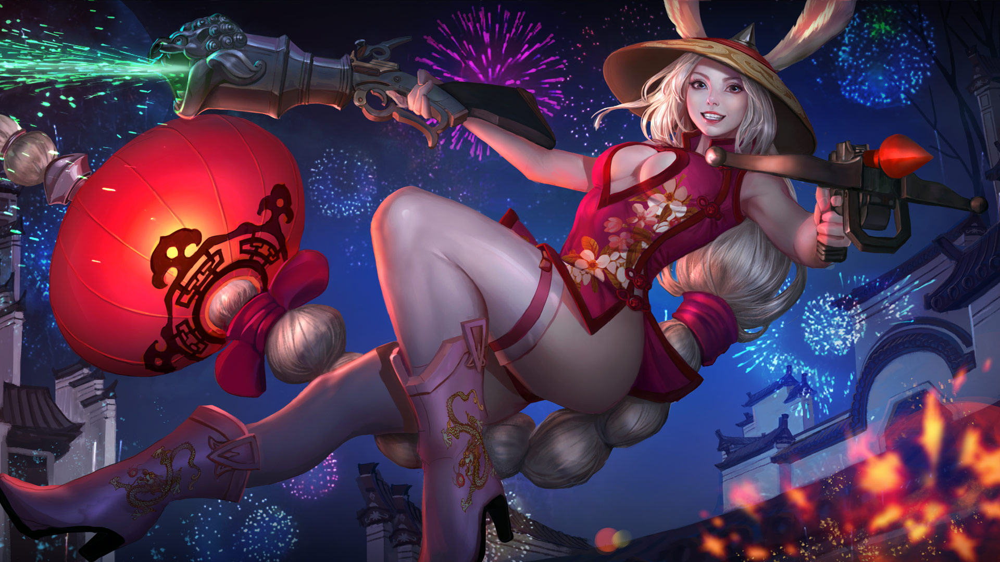

# Gwen Lore

## ALTERNATE FATES

### ‘GANGSTER’ GWEN

#### 'OUT OF AMMO'

“I got a story for ya,” says Tiny, stalking into the room where he’s gonna die.

The dark room is full of woody cigar smoke; poker chips litter the ground \(along with a scattering of gold cufflinks and wedding rings\); and wiseguys in good suits slump over in awkward, bloody poses. The dame sits on the edge of a billiard table, legs crossed, shuffling a deck of cards with one hand. Tiny, the mob boss, is worth three of the dame, size-wise.

Tiny closes the door behind him. “A farmgirl came to the big city with grit under her fingernails, nothing but table luck and good aim,” says Tiny. He stops to nudge one of the dead wiseguys with the toe of his two-toned wingtips. “She thought she’d leverage that into a high-rise apartment so high that her view would be the other half of the world.”

The dame swings one foot to no particular rhythm. Her suppressed semiautomatic pistol rests on the felt alongside her leg. Her sawed-off shotgun’s in her other hand, its one eye staring Tiny down. The cards split, turn, shuffle, stack, split, turn, shuffle, stack, in her other palm.

“She caught the attention of the wiseguys,” says Tiny. “Made a name for herself. Worked her way up. And when she’d proven her smarts, the boss put her in charge of the game rooms, because he trusted her. That boss being me.”

Tiny is worth half of the dame, smarts-wise, but he doesn’t know it. Dumb people all think they’re smart.

“That farmgirl spent all her time in dark basements, taking pool hustlers out by their collars, threatening gamblers who couldn’t pony up, breaking up fights. She did all the bean counting and distributing. She made a lot of money for a farmgirl, but it was never enough. That high rise apartment was always a floor above hers, until she was right under the penthouse. The penthouse belonging to the boss, the boss being me.”

The dame smiles. Her eyes are dark under the brim of her fedora, so that smile is all that shows through the smoke. One of the dead wiseguys is sprawled out on the billiard table beside her, an 8 Ball shoved between his broken teeth.

“So that silly farmgirl took out all the boss’ best guys, and now she thinks she’s gonna take out the boss too, and move into his penthouse. That boss being me. That penthouse being mine.” Tiny moves through the mess of money and blood and broken bodies toward the dame, whose shotgun aim stays true.

“But the farmgirl underestimated the boss – and I should warn you that this story ends sad – and used up all her ammo on the wiseguys. Which I know, because she’d have put a slug in me at the door already if she could’ve.”

The cards split, turn, shuffle, stack. Split, turn, shuffle, stack.

“So the boss, that boss being me, is gonna choke that poor farmgirl to death, and throw her useless body into the river with concrete shoes, and no one’s ever gonna think about her again.”

The dame raises the shotgun as Tiny approaches, squeezes one eye shut, pokes her tongue out of one corner of her mouth.

Tiny stops an arm’s length away, close enough that the dame can see his jaw tightening, his teeth grinding down on his jowly grin. His fist pries open.

“What makes you think I’m outta ammo, Boss?” drawls the dame. Split, turn, shuffle, stack, and…

_click. click. click._

An ace flies from the hand Tiny isn’t watching, slices through the air leaving smoky curls, and embeds itself nice and deep into the middle of Tiny’s forehead.

His eyes cross trying to look at it as he falls backward.

“It was a good story,” says the dame. She hops down from the billiard table and roots through his pockets, pulls out the silver key to the penthouse. “But I prefer happy endings.”

### ‘RED LANTERN’ GWEN

#### 'THE DOOR GUARDIANS'

On the night of his death, the thief found himself on the street where he’d always lived, but it was gray and empty except for a nightclub he’d never seen before.

The club had two doors, one red and one blue. Outside of the doors stood two\_menshen\_security guards: a hybrid rabbit-woman in a red silk dress twirling a dragon-head revolver around her trigger finger; and a dapper man with ice-blue horns and a blue silk suit swinging chains by his sides. Red lanterns cast a warm glow in the eerie death-gray.

“Look, a thief,” said the man. “A perfect recruit for the Infernal Dragons.”

“Don’t be hasty,” said the woman. “Let’s take a look.”

The thief watched, astonished, as a scene played out on the street before him: the ghostly figure of himself as a young boy, stealing a dumpling out of a cart when no one was looking, then handing it to a hungry beggar girl. “Some people misbehave for darn good reasons. He’s Lucky Aces material.”

“That was just the first thing he stole,” said the man, and his chains swung through the scene, breaking it into mist. Ghostly figures formed again, but this time it was the thief as an adult, taking the pearl necklace from a lady’s throat while distracting her with a dance. The horned man laughed. “He belongs to the Dragons.”

Let’s see how he died,” said the woman, “then we’ll decide.”

The burglar watched in horror as the night of his death played out before him in the mist. He saw himself scale the wall of the wealthy man’s home, slip the cursed Jade Goose into his jacket and race away…

Away from the city the thief fled, into the cold forest night. He hiked until dawn, the ice-cold Jade Goose against his chest, until he came upon the Jade Goose Temple.

An ancient monk met him at the\_paifang\_gate. His old eyes widened with surprised tears when the thief handed over the Jade Goose.

“Oh no! You have taken the thief-curse,” said the monk. “Now you will die!”

“I am happy to pay for my wrongdoings,” said the thief, smiling his last before crumpling to the snowy ground. The scene in the mist disappeared.

“How boring,” said the Infernal Dragons’ security guard.

“Right this way, dear,” said the Lucky Aces’ guard, opening the red door into the nightclub.

