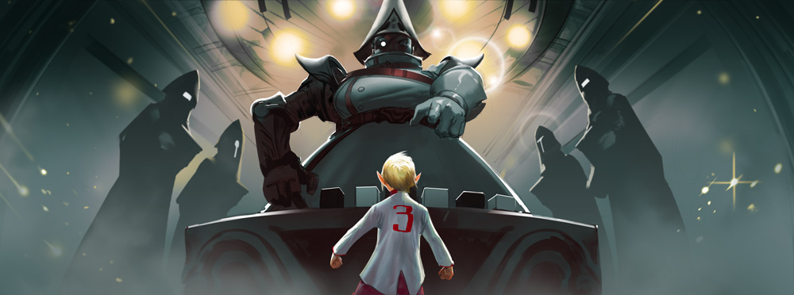
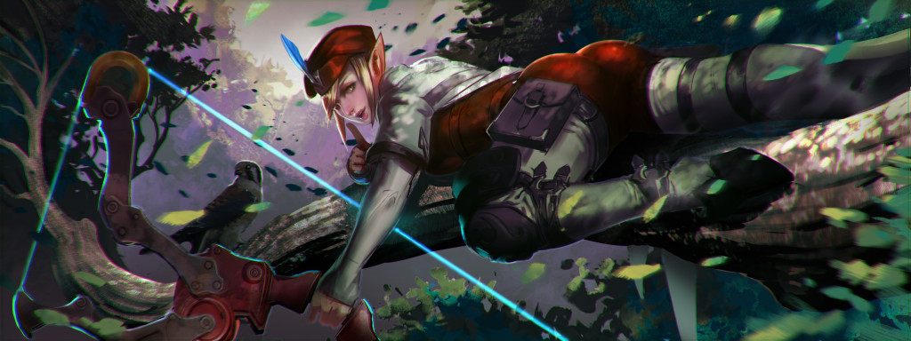
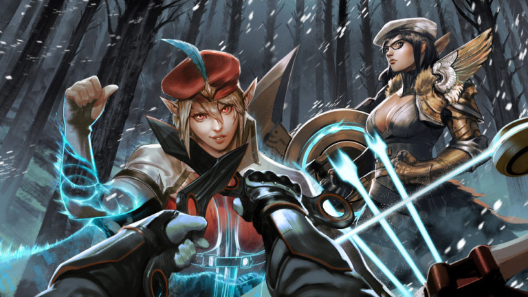
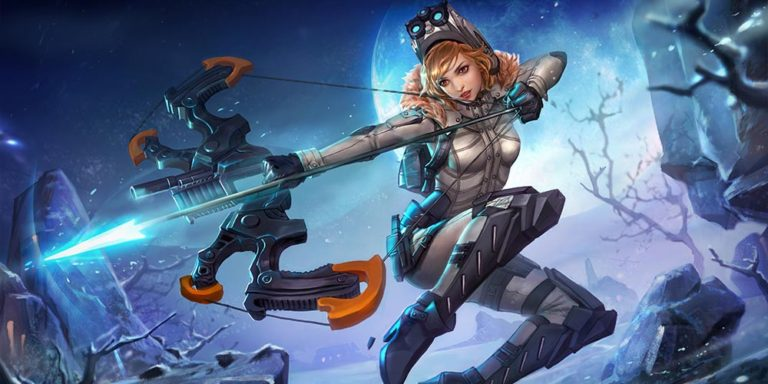
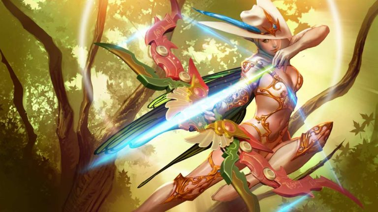
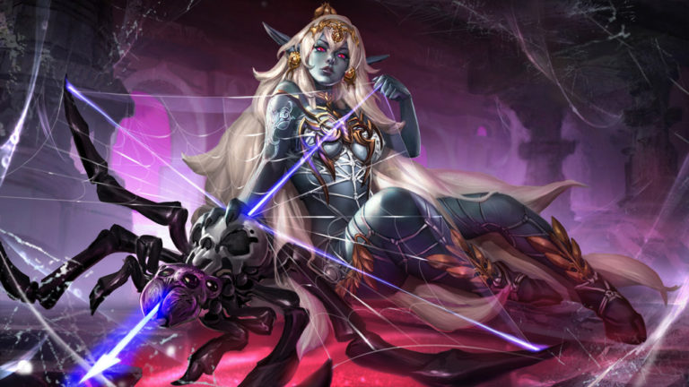
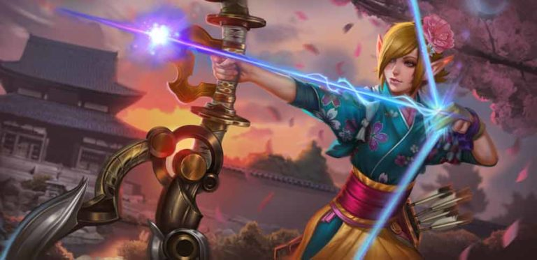
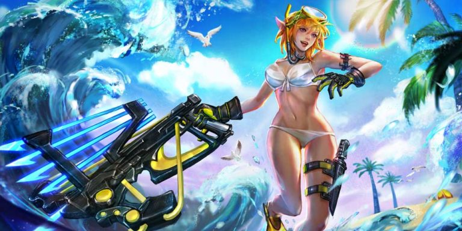

# Kestrel Lore

## 'KESTREL'S TEST'

No one has ever rebuilt the overgrown Old Quarter, where the stink of magic lingers in the destroyed buildings. The children dare one another to touch those still-crackling buildings for the shock. That shock was Kestrel’s first memory.

She wasn’t Kestrel then, but the name her parents gave her is classified.

Kestrel knew about the war, though she hadn’t been born yet, and she knew about the Storm Queen, who lived far away in Mont Lille. She knew never to bother the border guards, who the locals called blancorojos. She learned the rolling, throaty language of Mont Lille alongside her family’s dialect. She saluted the queen’s flag every morning at school. Every child had to take the queen’s aptitude tests; teachers and parents drilled them in mathematics, languages and geography for weeks preceding the test. Taxes were light on families whose children were chosen.

At six years of age, Kestrel took the first battery of tests: analogies, number series, mirroring patterns of blocks and solving puzzles. She did well. She loved the smell of pencil shavings and her examiner’s smart white lab coat trimmed with red. She loved how numbers fell into neat patterns, and she spoke Lilliaise with an adorable accent.

For the last test, the examiner placed a combination of black and white boxes before her with a candy under one. Kestrel’s task was to guess if it was under a black or a white box. At first, there were nine white boxes and one black box. She picked white and collected her candy. The next round, there were seven black boxes and three white ones. She picked black and earned more candy. Her cheeks were stuffed with candies after a few rounds of disproportionate numbers of one color box, then: betrayal. There were six white boxes, but the candy was under one of the four black ones.

Kestrel had never before doubted herself.

The examiner set out the boxes again: five of each.

“Choose,” she said.

“No.”

“Don’t you want the candy?”

“Yes.”

“Then, choose.”

“No.”

“Why not?”

“I don’t know where it is.”

“The test requires you to choose.”

“No.”

The examiner bent double so that she’d be at eye level with the little girl. Her voice was kind. “There is no punishment for guessing wrong, and a candy if you guess right. You must choose.”

“No.”

“The queen requires you to choose.”

“No.”

“Very well.” The examiner straightened and produced a stick the length of her arm. “If you do not choose, you will be struck on your palms.”

Kestrel looked straight ahead with her palms up while the stick smacked into them, remembering the surprising pain of the magic shock she’d given herself in the Old Quarter, how it had lessened into mild tingling after a time. The stick did not hurt that much.

She did not cry, and she did not choose.

The next day, two _blancorojos_ came to her home. Kestrel escaped out the back and climbed a walnut tree, armed with a slingshot and enough underripe ammo to make a grand nuisance should her father seek to punish her for failing the test of the boxes. Instead, her parents coaxed her down with tears and kisses, for she had been called to continue her education in Mont Lille. Her parents had one hour to say goodbye.

## 'THE RIGHT TOOL FOR THE JOB'

“It really _is_ her.”

Kestrel shot a withering glare down at the swordswoman who’d whispered it from the brush below. A soldier of the Stormguard knew better than to speak after positions were taken. Still, every woman hiding outside the indistinct farmhouse that evening had stood watch over the burial of the blonde woman who now struggled to unload a goat from a battered old cart outside the farmhouse. Julia should have been a ghost.

The goat pulled at its rope, crying like a child.

Kestrel waited in the tangled branches of an olive tree for Catherine’s signal in the same position she’d held for hours. The feeling had gone out of her legs long before. Her bow laid out sidelong in front of her, stringed with steel. She rubbed her gloved thumb and fingerpads together, savoring the spark under her skin, but she wouldn’t use energy arrows that night. Metal shattered glass, if the bow was strung heavy enough, and the detached Stormguard unit hadn’t used magic since crossing into Gythian territory. Techies didn’t trust magic, and the last thing they needed in this land of smog and machines was attention.

Poking her tongue into her cheek, she watched the queen’s sister through her scope. Mothering twins had softened Julia’s body, and there were laugh lines by her eyes, but there was no doubt. After Julia went inside, Kestrel curled her toes to get the feeling back, rolled her right shoulder, sank her thigh into a knob in the branch, fit an arrow into the nock and hooted an owl call. Catherine whistled back the command to hold.

The goat bleated louder and sadder as the sun sank. Nothing stirred in the surrounding brush and trees. Inside the window, Julia argued with her husband, some nobody from the rebel tech army. The twins flashed by in their pajamas, chasing one another to their beds. The boy gave out a shout that shook the ground and the setting sun brightened, then dimmed. Mageborn, Kestrel mused in silence. No wonder the queen wanted them unharmed. She waited until the kids were tucked in, took aim at the left edge of a front window away from the bedrooms, then repeated her signal. Catherine whistled again to hold.

Night deepened, stars poking out that never showed above the bright light of Mont Lille. The man inside gestured with a wrench. Julia slammed a door. The goat’s shrieks twisted Kestrel’s nerves into a tight bundle. She’d hold position all night if needed, but every minute she waited was a minute something could go wrong.

The man clamped a gauntlet on one arm. Animalistic hoots and whistles sounded from varied positions. Catherine’s hold command repeated again and the goat cried and something wasn’t right; they should have attacked an hour ago. “What the hell is she waiting for?” the swordswoman grumbled. Kestrel was used to lone missions, not all of this group planning. Too many other people to depend on. Too much noise. Couldn’t think.

She let an arrow fly, and the goat shut up.

The signals paused; someone in the brush snickered. Kestrel fit another arrow into its nock. The man paused, looked at his own reflection in the nearest window, then raced across the farmhouse to Julia.

“He knows,” breathed the woman aground, bellying forward in the brush sword first.

The whispers of steel unsheathing sounded all over the olive grove. Somewhere, a blue wisp of magic snapped on and off in the air. A glowing blue shield hummed to life. Hearts pounded in throats. The man inside struggled into his armor, his wife pinching her fingers on the clamps trying to help. It was “go time,” and all they needed was Catherine’s whistle.

The whistle never came.

Kestrel pulled back, knuckles resting on the place where her jaw met her skull, three fingers under the knock, shoulderblade pinching her spine, and on her exhale …

… released.

By the time the front window shattered, Kestrel had swung down from the tree. Ignoring the burning pins and needles in her legs, she ducked low and closed in on the farmhouse.

Hanging from the windowsill by one hand, her bow slung over one shoulder, she glanced back at the storm of magic and steel following behind. Catherine stood behind the attack, tears in her eyes, a raven’s neck broken in her fist, another landing on her shoulder with an enraged scream.

## 'THE SHIELD AND THE BOW'

“Who am I?”

A little girl stands opposite her master at the center of the sparring circle holding a wooden shield. The sun sets behind the foothills to the west, but she knows better than to show the long day’s fatigue inside the circle. “You are Professor Marcel …”

The flat of the master’s blunted swordblade leaves a stinging red imprint on her left cheek before she can register that he has moved.

“In battle, there are no professors. There are no names.” The master circles her, and she moves with him as he taught her, her eyes watering. “No husbands, no brothers. No sisters. No friends.” He strikes again, his blade slapping the wound anew.

“Y.. yes, Professor.” The girl sniffs up the pain, forces herself to remain light on her toes as the master switches direction.

“Who am I?”

“You are…” The sword swings between them and cracks into the girl’s shield, sending splinters flying. “…the sword.”

“And who are you?”

The sword swings again, a deadly whip in the master’s hand, smashing again into the shield. “I am the shield.”

“Again.”

“I am the sh… shield.” The strikes come faster, arcing and crashing, no mercy given for her small arms struggling to raise the shield, welts and bruises rising on her skin when she is too slow.

“Again.”

“I am the shield!” Blunted steel on wood sends shocks up the girl’s arm; sweat pours down her brow, meets with tears, rolls down her cheeks and throat and into her uniform.

“Who?”

“I am the shield!” she sobs, falling to her knees, the shield over her head. “The shield! I am the -”

“…the shield!”

Catherine sits up straight in the general’s tent, gasping out of sleep, drenched in sweat despite the cold night. A magic arrow protrudes from the chest of the man beside her, glowing blue in the dark.

“Kestrel,” she whispers.

The fur beneath her dead lover squelches with his blood when she rises. She dresses in silence, though she knows there is no need for quiet; she is alive because they want her to be.

Not so for the rest of the camp. Squinting into the dark, she steps outside, her boots soundless in the fresh snow. The smaller infantry tents are sieved with sizzling arrow-holes. The cold masks the bloody smell of death, freezing time. It is as if the sun will never rise, the dead will never decay and spring will never end the Winter War. Half inside her dream, her nose and fingers pink and numb, it is as if she is not stepping toward her own end.

In the center of camp, thirty unfamiliar women in familiar uniforms poke at the fire with sticks. They are young in the way of soldiers; war has a high turnover rate. Six Swords, two Axes, two Daggers, two Polearms, eight varied Mages, nine Shields and one Bow.

“Salut, Kestrel.” Catherine steps into the light, resting her shield in the snowdrift before her.

“Catherine!” calls The Bow with a grin that does not reach her eyes. She lopes through the snow to clasp Catherine’s hand, setting her bow in the snow beside the shield. “Kind of a demotion, isn’t it, settling other countries’ border disputes?”

“It pays well.”

Kestrel drags her fingers up the wings of Catherine’s pauldron. Bump-bump-bump. “Did you leave your Sword in bed?”

“Indeed.” Catherine peers past the fire at the Stormguard as they move into position. “You rendered it quite useless.”

Kestrel smirks. “Rumor is, you gave up your blade in a fit of guilt.”

“You will soon find that I don’t need it.”

“Understandable. Weapons, armies, even whole institutions, outstay their welcomes.”

Catherine rests one arm atop her shield. “It is not like you to be so chatty.”

“Just catching up. Been a really long time.” Kestrel plucks up her weapon in her left hand. In her right, four glowing arrows snap into existence. On the other side of the fire, the others push back their white fur hoods and draw their weapons; fire and ice and energy form in the palms of the mages. With a nod, Catherine pulls her shield from the snow, and she is Catherine no longer, and Kestrel is no longer Kestrel, and a thin gray line of dawn forms at the edge of the sky.

In the moment before the chaos, a breeze swirls light snowflakes around the tents full of dead soldiers. Sparks explode above the fire. The Shield rises. The Bow fits the glowing arrow to the bowstring and pulls it back, her fingers resting on her cheek.

Then, she spins on her back foot and looses the arrow through the flames.

## 'THE COUP D’ÉTAT'

Sparks fly from Kestrel’s magic arrow as it sails past the fire, gliding through the narrow gap between two swordswomen and piercing straight into the Storm Queen’s raven. It lands with an undignified squawk and a floomph of powdered snow.

“You all can do what you want,” says Kestrel. “I’m not killing one of our own.”

The queen’s best killers, twitching with anticipation of battle, their trembling weapons thirsty for blood, dart their eyes from Kestrel, to Catherine, to the dead black thing in the white snow with horror. Their white-gloved grips loose and re-tighten as Kestrel steps back beside Catherine, who crouches in a defensive position behind her shield, her perplexed eyes shimmering. In that stunned silence, there is a moment when she sees beyond the white and red uniforms, beyond the weapons, to the faces of women she used to know. The closest thing she ever had to sisters, once.

The Guard’s best daggerwoman breaks the spell, darting forward, crossing the distance in a blinding blue flash, appearing a breath away from Kestrel, her blades crossed over the archer’s throat. “She is no longer one of us,” she hisses. “And now, neither are you.”

“Really, Livia?” Kestrel grins. “I put an arrow in the eye of a man at your flank at the last battle for Lionne.” There is a popping sound, and all that remains where Kestrel stood is a phosphorescent cloud. The daggerwoman jumps back from the glowing particles, her daggers in a defensive position. “I’ve saved every one of your lives at one point or another,” calls Kestrel’s voice, disembodied several steps away from the mist.

“We have _orders_,” calls a shieldbearer from the front line.

“Sure, Marelde, and we’re trained to kill, not think,” says Kestrel, reappearing with a new arrow fitted to the nock of her bow, “but it was Catherine who trained you with a shield when you were ten years old.”

“Eight,” whispers Marelde.

“And you, Amie.” Kestrel’s arrow points at the forehead of a mage holding a sputtering ball of blue light. “After the northern revolt, when you had night terrors, Catherine stayed up all night to comfort you. And you, Ivet, Catherine taught you to speak Lillaise.” Ivet nods, resting her axe over her shoulder, staring at the snow.

“I never knew her, and I don’t care what she taught Ivet to say,” scoffs Elena, the youngest of them, polearm at the ready, her stance low. “She’s a traitor. She disobeyed orders, ruined a mission and disgraced the Stormguard.”

“_Toujours fidèle_.” Catherine sighs as all eyes turn to her. “I swore loyalty, but in war, I was never loyal to the queen. I was loyal to the woman next to me. I had no thought for Mont Lille, or a unified Eventide, when the blades swung and the arrows flew. I fought because I was afraid of what the woman next to me would think if I did not.”

“Yet you abandoned us and fled like a coward,” snarls Livia.

Catherine shoots a glare at the daggerwoman. “There are no cowards in the Stormguard. I chose to disobey so that one day, you all would have another choice. But I have … I have lived with the shame of my disloyalty to you for more than a decade, Kestrel.”

“Then make it up to me now.” Kestrel lowers her bow. “We found Julia’s whole family alive and well in Taizen Gate. They escaped and disappeared with the help of Gythians.”

Catherine’s breath catches. “Then we can waste no more time. Make your choice, ladies, and make it before the queen’s ravens find you.”

## 'CROSSING THE BRIDGE'

When frozen tundra gave way to dense forest, the Stormguard traveled at night to evade the watchful eyes of nesting ravens. The country was at war, and the Storm Queen would be searching for them, but the freeze itself was their biggest enemy, and Kestrel was glad of her warm winter uniform.

On the last night of their trek, Catherine drew up near Kestrel and murmured, “I have not thanked you.”

“Don’t,” said Kestrel in her usual dry tone. She pulled her backpack around to the front and removed her night vision goggles. “I don’t care who sits on what throne, but I expect Gythia will advise their puppet monarch to free the Storm Queen’s territories.”

Catherine fell quiet, and while the moon rose there was no sound but their steps and their foggy breathing.

When she heard the rush of fast water, Kestrel climbed a tree on a steep hill and scanned the river through the goggles. The bridge below was the only border crossing that had not been destroyed in the Winter War, and their only chance to cross to friendlier territory. She whistled a signal and the others gathered below.

“Your employer’s enemies have taken the bridge, Catherine,” she said. “Twenty guards on either side and ten on bridge patrol.”

“We can take twenty at a time, if it comes to that,” murmured Catherine.

“The bridge patrol have snow beasts,” said Kestrel. She dropped to the ground, soundless except for the poofing of powdery snow, and Ivet scurried up to look. In a moment, the axewoman cursed under her breath at the ten giant, armored, white-furred beasts, their curled horns wrapped with spikes, their tusks protruding from metal helms. On their shoulders rode enemy soldiers.

“I’ve heard about snow beasts,” said Amie, shivering as she drew her mage cloak tighter around her. “They steal children and eat them.”

“Leave them to me.” Kestrel stood at the lip of the hill, the green laser light from her goggles sweeping along the border.

“We don’t have to kill them all. We just have to get across.” Catherine raised her arcshield and the hidden blades snapped out. “If we are separated, you all have your assignments.” She motioned Kestrel ahead, then followed down the dense forested hill until they could hear the rushing of the water and the grunts of the snow beasts, the other women snaking behind, pulling shields, blades and polearms from their backs and belts.

At the edge of the forest, Kestrel disappeared and the others fanned out behind rocks and trees, fighters and mages clumping close to their assigned shieldwomen. Catherine stood alone, her fur cloak waving in the frozen breeze, refusing to shiver, as the guards’ blinding searchlight swung toward her. There was a call in a language Kestrel didn’t understand, then an answer, and Catherine was surrounded by men in heavy wool coats and fur caps, their swords and rifles drawn.

Hidden inside shimmering phosphor, Kestrel slipped past the guards and onto the bridge. The snow beasts were larger than she’d thought from her high vantage point; their steps shook the wooden bridge, and their armor covered all the vital bits, but the plan was in motion and could not be changed. The Stormguard whistled their positions like nocturnal bird calls. Catherine held up her shield, and the first of the giant snow beasts stepped into the phosphorous cloud.

With all eyes on Catherine, it was a simple thing for Kestrel to put a sizzling, glowing arrow into the beast’s eye. It howled, stuck, and twisted about hard, its great hairy arms striking into the darkness, tossing its rider off the side of the bridge and into the river. By the time the nearby guards had reined their beasts around to face their aggressor, Kestrel and the arrow had disappeared, and the panicked beast clutching at its bleeding face could not be contained.

The Stormguard moved into action, shields flanking around Catherine, fighters taking out the unprepared guards, magic flashing, freezing, burning in the air. A flaming phoenix screamed, its wings spraying sparks onto the bridge; the guards leaped out of its way in terror. In the chaos, Kestrel left another cloud of phosphor in the path of the next beast and delivered two arrows under its arm. It stopped still and bellowed, but Kestrel had already disappeared again. Across the bridge she went, shooting and stunning the wild beasts, ducking and sprinting out of the way as they wavered and roared. She glanced over her shoulder to see Catherine’s bubble flash and spin, then back to the other side of the bridge, where they had no element of surprise. The guards there held positions with grim expressions and weapons drawn, eyes darting. She stood sideways and fired, releasing arrows for cover as the shields pushed onto the bridge.

Kestrel vanished and raced, avoiding the slick blood on the ice, to the other side. She reappeared in front of the highest ranking officer who blinked, his mouth open, still half-dreaming, his boots pulled on over his nightclothes. Her arrow nestled an inch from his eye, spitting blue magic onto his nose.

“You know who we are?” she asked.

The officer stuttered in his own language, then said in an accent, “Stormguard.”

“Just passing through.” Catherine’s voice was rich and slow as honey. Her hand rested on Kestrel’s back shoulder, and the rest of the women assembled in defensive positions behind them. “You’ll be a dear and let us by, won’t you?”

Something like hope flashed in Catherine’s eyes as the officer called for his troops to stand down. The Stormguard filed through the enemy’s line while the cavalry struggled to gain control of their wounded beasts. Kestrel walked backward, her bow pulled, until the last of the women had disappeared into friendly territory.

## ALTERNATE FATES

### 'SYLVAN' KESTREL

#### 'THE KING STAG'

The King Stag entered the sacred meadow on Midsummer Noon. He stepped past the dancing and feasting; he broke through the line of forest creatures receiving their annual blessings from the elvish royal family. He bowed his heavy antlers to the king and queen but knelt at the feet of a princess. In silence she stood, straight and proud as living sculpture, too beautiful to be real, decked in ancient gold finery. She held in her left hand the bow named Sparrow, made from the horns of the scarlet bull. Her jeweled wings twitched in the hot breeze. In the face of her otherworldly beauty it was difficult to believe what was whispered: that humankind were elves who had left the woods and forgotten their link to root and sky, who had ceased to drink from the Island Well and who had learned selfishness and war and shame.

“Princess Kestrel,” said the stag, “greatest of all archers. The hope of the forest lies with you.”

“If it is blessings you seek, go to my parents,” replied the princess.

“It is war I seek,” replied the Stag.

A wry grin tickled at Kestrel’s mouth. “I hoped Midsummer would bring me a challenge. What is your grievance?”

“Mankind has discovered the Island Well.” A gasp sounded from the crowd of animals. Even the king and queen of the elves raised their brows. “They plunged dirty hands and sick children into the water. They drank without speaking the blessed words. They pulled up buckets full and removed it from the island. Now, thick black tar bubbles up from the well. The bones of the island’s creatures dry and bleach in the sun.”

“The water of life runs dark and sour again,” murmured the queen.

“It is the cycle of the Tangled Wood,” said the king, his shoulders nudging up. “It is time to retreat into the mist.”

“It is time to fight.” Kestrel slung her bow over one shoulder and climbed onto the back of the stag. “Take me to the island. Those of you who will defend the Tangled Wood may follow.”

### 'SPIDER QUEEN' KESTREL

#### 'THE SPIDER MOTHER'

The Island Well was as the King Stag had said, overrun with humankind, contaminated and burbling black tar instead of the clear, healing water that had been revered by the forest creatures and protected by sanctimonious rites since the first memory. Kestrel, the wood elf princess, led the fight against the humans. Kestrel, with her bow named Sparrow, ended many human lives. Bear, wolf and deer fought together, trampling and mauling those who had harmed the well in their selfishness and ignorance. Hares and badgers and snakes, too, joined the fray, and birds dove to peck out human eyes. The battle was well-won by the forest creatures, but they suffered losses, and their victory did not last even a full moon cycle before more humans came, drawn by the stories of the healing well.

From the tallest tree, Kestrel watched them come. The owls joined her.

“We will rouse the animals for the next fight,” said the owls.

“The humans outnumber us,” said Kestrel. She slid her fingertips along the edges of her wings, her mouth twisting. “Seek out my family, and call them to war.”

“The sylvan elves have retreated into the mist,” reported the owls.

Kestrel considered this without expression. “Then I must seek out the elves _below_.”

The owls widened their round eyes. “The elves _below_ do not care about our world.”

“Our world is their world, and all are one.”

Kestrel dropped to the ground and called, with a low, throaty growl, for the badgers. The matriarch of the clan came with her family behind her, squinting in the bright light.

“Take me _below_,” commanded Kestrel.

The sow was dubious, but dared not disobey the elf, so she led the way to her den. Kestrel crawled on her belly to enter, but once inside, the den widened into a network of caves and tunnels through which the badgers led her. Together they burrowed deep underground, feeling their way along in the dark, until at last they came to an ancient door that glowed violet around the edges. The badgers snuffled with worry. Kestrel knelt to kiss the matriarch between her eyes before stepping alone through the door and into the capital city of the _below_.

The only light came from the phosphorescent mushrooms that grew on the roots and ground and in great numbers up the sides of tall spires. Kestrel stood in silence as the proud and beautiful dark elves of the _below_ surrounded her, arrows fitted to their bows, standing sideways at the ready. White hair spilled down their backs in stark contrast to their skin, the color of midnight. They wore jeweled armor and gowns made of spider silk, and their eyes glowed red.

“I am the princess of the Tangled Wood,” said Kestrel. “I call on you to help us defeat the humans who have contaminated the Island Well, and to seal it until it has been forgotten by humankind.”

The dark elves looked at one another. One of them said, “Wars _above_come and go, as do wars _below_. Your dispute with the humans does not concern us.”

“Our world is your world, and all worlds are one,” said Kestrel.

All elves _above_ and _below_ knew the words of wisdom. The dark elves lowered their bows. “Even so, only the Spider Queen may command us.”

“Call the Spider Queen to me,” ordered Kestrel.

“The Spider Mother has not chosen a queen,” said one of the dark elves.

“Then I shall be chosen. Take me to her.”

The dark elves laughed at Kestrel’s audacity, but her gaze did not waver, and so they led her to a temple made of gold and shaped like a spider.

The domed ceiling of the bulbous body of the temple was draped with webs upon webs, and hanging from the webs were thousands of silken white sacs. At the center of the webs, a giant black spider perched. Kestrel unstrapped the bow from her back and snapped a magical arrow into existence in her right hand.

“Why does a wood elf come to me?” asked the Spider Mother.

“To be the chosen Spider Queen,” said Kestrel.

“Only a creature of the _below_ may be Spider Queen,” said the spider.

“So be it,” said Kestrel.

“Drop your bow,” said the Spider Mother. “If you pass the test, we will be your weapons.”

“_When_ I pass.” But Kestrel obeyed, resting the bow named Sparrow on the golden floor and extinguishing the magic arrow. “What is your test?”

“Feed my children and survive.”

And with that, the sacs broke open, and spiderlings emerged from them, hundreds of thousands, each the size of Kestrel’s hand. They fled down the webs to the floor and crawled up her legs; they dropped into her hair, hissing. They bared their fangs and sank them into Kestrel’s flesh, injecting their venom. Their stings shot through her, but she gritted her teeth to keep from crying out in pain. She refused, also, to close her eyes when the spiderlings tore the wings from her back, staring up instead at the Spider Mother. The black venom spread under her skin, turning it the same midnight color as the dark elves of the _below_. Her hair whitened and her vision swam with blood, but not for a moment did she consider dying, and so she did not.

After what felt like an eternity, the spiderlings had eaten their fill, and Kestrel still stood. The Spider Mother crawled down the webs to the ground before the Spider Queen and bowed. “I am your weapon,” she said.

And so the Spider Queen emerged from the badgers’ den, transformed, with an army of dark elves and spiders behind her, blinking their red eyes in the glare. The army set upon the Island Well with their blades and arrows and poisons, and when they had made a ruin of the greedy humans, the spiders wove a thick silken web over the well that sealed its magic away from the world.

### 'KYUDO' KESTREL

#### 'BECOMING THE KESTREL'

“Focus: tip of nose. Do not cross eyes. Settle energy down inside belly. No blinking.”

The porcupine archery master of _Les Sept-Îles_ accepted one apprentice a year, for a hefty fee, from the Storm Queen’s best young students. His severe eyes were beady and dark, his nose large and round. Glorious silver quills burst out from his forehead and back, but his chest, belly and limbs were human. He sat, in his black _hakama_ trousers and sash, on the forest floor, watching the girl who, at fifteen years old, had already affected a permanent scowl.

A raven, one hundred paces away, also watched. He always watched.

The girl gripped the bow with her left hand and set her gaze. Her breathing settled. The master circled behind.

“Embrace large tree.”

Her elbows expanded, her fingers curled around the grip just so, the root of her thumb and little finger touching.

“Fine. Raise the bow.”

The bow scooped up, the girl’s fists rising above her forehead.

“No energy in chest and shoulders.”

She pushed her left arm forward, her right elbow back in tandem… and paused. Her arms shook. She locked her jaw, held her breath and strained, but the string would pull no further. She eased the string back and let out a frustrated breath.  
“The draw’s too heavy,” she complained.

“Always the draw too heavy, the wind too fast, the rabbit too unpredictable.” The master stood, plucking errant camellia petals from his quills.

“I draw my bow one hundred times every morning and one hundred times every night, as you instructed. Something is wrong with _this_ bow.”

The master took the bow from her. “I re-strung it. Heavier draw.” He plucked a long, stiff quill from his back, fanned out his feet, breathed, drew the bow, and shot the quill through a falling camellia flower fifty paces away.

“You wanted me to fail,” said the girl, her eyes filling with frustrated tears.

The porcupine man laughed with a nasal wheeze. “You pull with chest and arms, you succeed with a lighter draw. You breathe wrong, get lazy. Blink. Fine for hitting target. Fine for big beast drinking at a stream, maybe.” He flicked her ear, bruised and swollen from string snaps, and she gasped. “You are queen’s soldier. Instrument of war. Your targets are small and quick and strike back. You must be a war bird. A kestrel.”

“I don’t want to be a kestrel,” she whispered. “I want to stay here and become a master like you. Please…” She knuckled her eyes. “Don’t make me go back to the queen.”

The master’s tiny mouth twitched. He kicked at the insides of her feet, sliding them back into position. “You are the kestrel already. The arrow exists now in the target.” He handed the bow back to her. “Again. Power in belly, in legs, in feet, in _center_. Not in weak arms and chest. Power from the ground is strong enough for a heavier draw.”

Her gaze extended from her nose to the grass, to the sky, to the pagoda sinking into the distant morning fog. Her belly growled. Here, somewhere, was prey fit for a war bird.

The air lifted, held her as she hovered, weightless. The whispering cool wind fluttered her feathers. Her keen eyes scanned the ground and trees and, one hundred paces away, found it: the raven.

Her elbows expanded; her fingers curled around the grip just so, the root of her thumb and little finger touching. Her energy dropped with her breath, sank into her belly, so hungry, then into her legs, her feet, the ground. The raven felt her gaze and laughed at her.

The bow scooped up, fists above her forehead. Her left wing pushed forward, her right wing expanded back in tandem. Her chest ballooned with air. The string pulled back, far back, way back, behind her ear.

The arrow sailed away. The bow spun in her grip, the string against her wing. The raven fell.

“Fine,” said the master, settling into the grass. “Again.”

### 'SUMMER PARTY' KESTREL

#### 'WHO'S DAVE?'

Wait. Krul says he _surfed_ in to save me? SAW didn’t wait thirty minutes after eating his weight in tacos to get in the water? And now Phinn’s reporting himself a hero because he tossed a floaty donut in my general direction?

Nah.

Look, I’m all for equal opportunity, but these guys are the kind of cartoon characters who look into a gun barrel to check for bullets. I can’t even have a nice snorkel without dudes splashing into the water with their heads full of bravado and the CPR poster they glanced at once. Dave could’ve gotten hurt.

What do you mean, _Who’s Dave?_ Dave is my _shark_. He washed up ashore as a pup and I rescued him, and he’s been my buddy ever since. I take him for walks… I mean _swims_… every afternoon. I give him belly rubs and he escorts me and my spear gun into the best tuna hideouts. Freshest sushi ever.

I do like how SAW thinks that squirting water into a shark’s eye will hurt it. Cool story, bro. I’m not sharing my sashimi with any of them.

