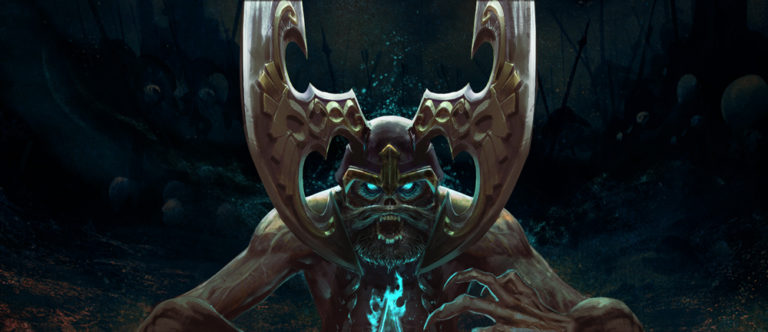
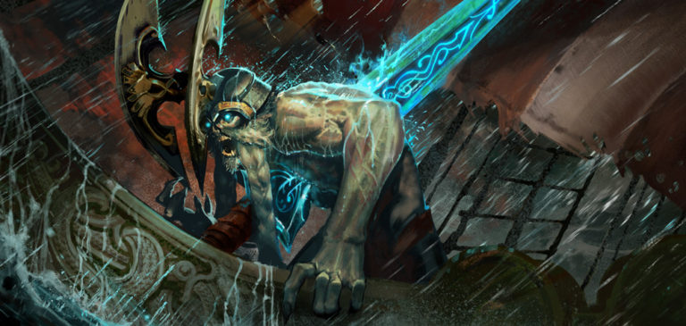
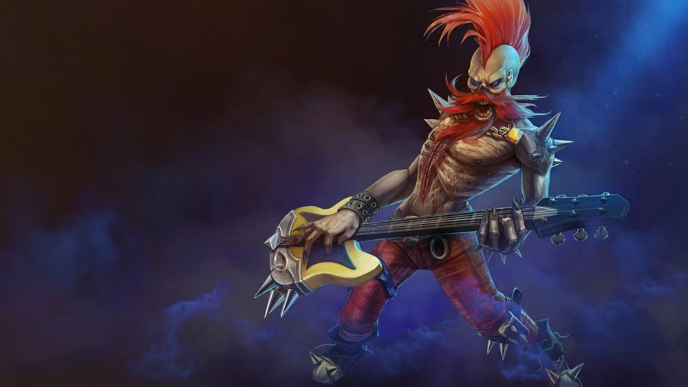
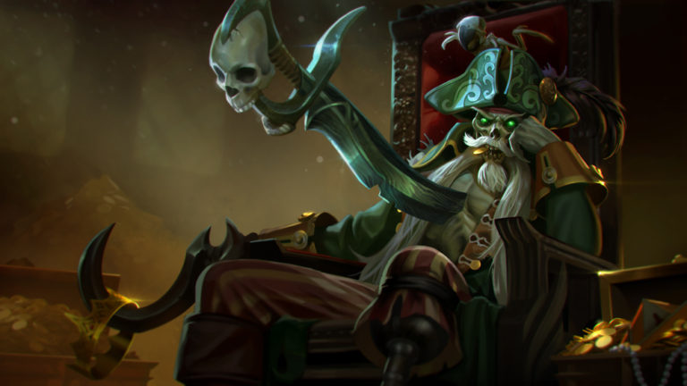
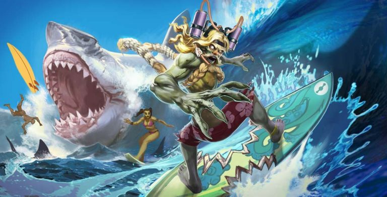
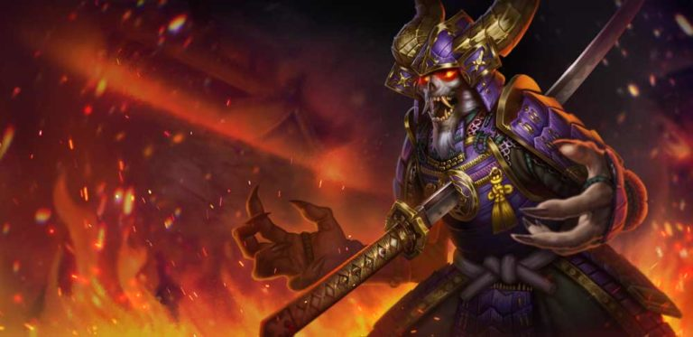

# Krul Lore

## 'KRUL, THE TORTURED UNDEAD'

Don’t go out there! I saw it… him… with my own eyes. An impossible creature. A man no longer a man, with a colossal sword through his chest. The glowing blade went clear through him and out the other side. Just imagine the gaping hole of a wound. An unthinkable sight. And then he reached for me. I got away with only a scratch, but…

The pain crept upward. It went deep into my bones, rose up my legs, churned my belly, gripped my throat. I crawled to the bushes to hide and watched as the minions died, writhing. I watched seasoned warriors twist in agony and collapse without ceremony. I didn’t dare move; I curled up and prayed.

I will never forget: He came out of the shadows, his jaw opened wide in a battle scream, eyes glowing with hate. He is some cursed dead _thing_ that cannot be stopped. You don’t believe me, but it’s true; nothing should be able to survive that wound!

He ripped apart the minions. There were only pieces of things left on the ground when he was done. He clambered away and I crawled here on my belly like a coward. Believe me, he will come for you, too. You’ve been warned.

Now, let me die.

## 'WHAT KRUL SEEKS'

“Do it!” roars the undead monster at the round metal eye of the turret, half grown over with brambles and rattan. “Put a hole in me! Blow me apart!”

If only it would work.  
  
The turret remains silent, but he can smell recent explosions. Someone is keeping it loaded. Someone is summoning the minions that come through the choke point beyond the turret, past the shambles of what must have once been a rock fortress, in waves. And beyond that someone may be what he seeks.

So close…

Krul drags his left leg, nursing a nagging sting of magic in his thigh where some spell hit him earlier. Another _someone_, now lost to the world. The smell of summoning drifts over the rock face and he grimaces, grinds his teeth. More minions coming. Ugly bastards, no necks, no language, nothing in them but fight. He punches his leg to get the sting out and takes an unnecessary deep breath. A habit from a former existence. The air leaks out through the sucking wound in his chest, fogging up the cold steel trapped there.

Every step is pain, and he runs hard. Catches the biggest of the idiot minions by surprise, flattens him fast, _ignore_ the pain, ignore the pain, ignore the… Tearing into the minion’s belly is good, the only good thing. A distraction from the misery that threatens, in every moment, to lay him flat. The minion’s dark insides are slippery in his hands; their bellies come apart like cobwebs, their legs detach easy as fly wings. He screams into their faces, spewing spittle. His insane laughter echoes through the battleground. Their souls suck away from their dying carcasses and feed him. It is his only satiation.

There is blood, there are limbs, there are gurgling death-screams, there are pieces of once-living creatures clinging to Krul’s teeth and nails when he sees her standing atop the ruins of the fort. Human from the look of her, tall and still as morning, a sword buried between cracks in the rock, eyes impassive. His face, or what is left of it, cracks open into a grin.

“Hullo, beauty!” he calls.

Her response is the slow pulling of her weapon from the rocks, that _shing_ of steel.

“You cannot protect it from me,” he growls. “Best run now and let me at it, before I destroy your best assets.”

She leaps, falling hard onto him, sword front, magic buzzing around her like bees. She is good with her weapon, well trained. He might have respected her, once. She gets a few slashes into him, his half-dead flesh sagging apart where she aims. He swings at her, hits only air, circling, snorting like a devil, dodging as best he can until she turns the sword over her shoulder and pounds him good in the brow with the hilt. He lunges, closes the gap between them, roaring his dead breath onto her, then her valiant cry is cut short by his fist round her throat.

Replace

“Pretty thing.” He licks her cheek while she squirms; her sword clatters on the stones between them and he kicks it away. He’s had enough of swords. A squeeze, and her neck breaks in his grip. Her life flows away from her and into him and she collapses, forgotten the moment he steps over her, toward the turret.

So close…

There is no one left to man the cannon, to feed it gunpowder and magic, no one to summon the thick-necked bastards. His right foot leaves bloody footprints and his left leg drags smears of minion gut all the way through the choke point, beyond the fortress, to the well.

To the dead well.

Perhaps once, the well had charged crystal; perhaps heroes had once guarded it. Perhaps he would once have found salvation here. But there is nothing now, nothing stirring in the well, only shards of broken crystal lying about, hardly anything worth defending.

Hope lost, the world comes back to him. The rhythmic _bzzt bzzt_ of insects. Birds complaining. Cold coming on, sinking into his muscle, cramping him up all around his eternal wound, whatever is living about him trying to reject the foreign thing rammed through him. Pain and hatred.

He allows himself one agonized scream before stalking back into the bush. There is another road there, to the Halcyon Fold, that he must now take.

## 'KRUL SAILS FOR THE FOLD'

Once, there was warmth. I remember fires, the way I’d leap and curse when a spark popped out to land on my arm. Meat and apples on my tongue. The soundless beat of my own heart. Flashes of those feelings return when I’ve forgotten too long. My suffering would not be complete without the occasional haunting memory.

There are things my body remembers, deep to the bones, things my father must have taught me, though I do not remember him now: how to row, sail and navigate. How to wield a blade and command men. How to disarm an enemy and snap his neck. There are other memories, so detached from me now that I am never certain if they are real… or just parts of songs I’ve heard sung belowdecks.

It seems impossible that once I breathed. That I feasted with brothers. That I ever held a woman, my nose buried in her hair, while she slept.

Now, there is only the pain.

I have carried this torment since the time of your grandfathers’ grandfathers, and if what I seek is not in the Halcyon Fold, I may well carry it generations longer.

I hunger. I desire. But fulfillment never comes. There is no peace in this cursed life, if this can still be called life.

One hope remains. One more chance to be rid of my soul and the steel that binds it – and find my final rest. Every pull of the oar, every splash of sea spray, draws me closer to salvation.

## ALTERNATE FATES

### 'DEATH METAL' KRUL

#### 'THE CHEATER OF DEATH'

_Deadly iron transforming  
To a cruel instrument performing  
For the legion of ghosts in my wake. //  
I embrace my wicked fate  
For death I no longer wait  
Mine is the curse most desired. //  
Battle me, my enemy  
For life’s disease I am the remedy  
I am the cheater of death._

### 'CORSAIR' KRUL

#### 'TOMMY'

On that night, us on the queen’s galleon all woke screaming from nightmares. The navymen shrugged it off but the islanders said it was death come hunting. Me and my lowlife rigging brothers climbed the ratlines and told tall tales to make each other brave: I’d punched the nose of a shark, I said, and another had slept through a hurricane in a crow’s nest, and another claimed he’d out-argued the prosecution at his thieving trail.

That’s when the wind died. The sea went smooth as glass, like nothing we’d ever seen. We swung the bracers around trying to catch any breeze at all, dread pooling up behind our tongues.

Then the water rippled and a corsair ship rose from the sea, a ghost itself, outlined in transparent green, fish flapping away from the churning water.

We watched in terror as the dead spilled off the deck of the ship and walked on the water toward us. They moaned with inhuman suffering, hundreds of bent and twisted horrors on the wrong side of the Netherworld.

“Run out the guns!” cried the captain. He was a seasoned seaman who’d faced pirates before, even wasted one and took his parrot as a prize, but there was terror in his eyes while the navymen manned and loaded the cannons. The blasts split apart the quiet, but the balls sailed straight through the corsair ship, splashing in the water behind.

The dead clawed their way up the side of the galleon and spilled over onto the deck. The navymen drew their swords and the islanders wielded sharp sailing knives, but they were no match for the ghost pirates; against them, gunpowder and blades were useless.

My lowlife brothers and me all went hiding. We’d none of us seen a real fight before, no matter our bragging, and didn’t know the right from wrong end of a pistol. Me, I got to the captain’s cabin and hid, trembling, in a wardrobe, unaware of the damned captain’s parrot beside me until it ruffled its feathers and squawked.

“Never rest! Always restless!”

“Shh!” I hissed at it.

My legs cramped up while I listened to the battle above. Didn’t take long before the gunpowder runners’ steps stopped, and then the pistol and cannon fire died, and then there were only the moans and sighs of the dead, and for sure I was done for the living world.

The parrot climbed the bars of its little cage and poked its head through. “No peace for you! No peace for you!” it squawked.

Then _he_ came. His footsteps were different, one being booted and the other wood striking wood, and me being the shark puncher started to cry as the cursed pirate, him they call Corsair Krul, burst into the captain’s cabin.

### 'SUMMER PARTY' KRUL

#### 'THE SURFBOARD OF DOOM'

In the hour after the patrol of dawn, when the sun rose and the groms and the kooks crowded the whitewater, as the wind chopped and sprayed the waves, I paddled the surfboard of doom toward shore in a rush for crunchy sustenance. In the deep sandy trench I saw it: a gliding fin rising off the surface, a carnivorous monster hunting its prey: a snorkeling damsel just under the surface.

My last heartbeats pounded in terror as I, without a thought for my life, dropped into the next wave and snaked in between the beast and distressed lady. I carved the face and caught air, landing the board square between the bladed jaws of my horror. Thanks to my shredding expertise, that lady lives to this day.

I was not graced thus by fate. In my tangle with the great shark, my bitten board was thrust into my heart and my life damned ever after.

Not for thanks did I this heroic deed, but for my lost honor.

### 'SAMURAI' KRUL

#### 'THE WOUND IN THE HEART AND THE WOUND IN THE SPINE'

The emperor’s army flooded through the broken gate while the Lord of the Walled City, a ten-year old boy, watched his dead father burn atop a pyre. In his hands he gripped Hellrazor, the cursed _katana_. “If… If I surrender…”

His _samurai_ general bowed before him. “The emperor does not care for your surrender. He wants your family and your people to die.”

“Better that, perhaps, than Hellrazor’s curse,” said the boy. The _katana_looked enormous in his small hands.

“Do it,” said the general. He unstrapped his armor, bared his chest and knelt. “Fulfill my destiny. Save your people.”

Within the choking smoke, the alarm bells, and the screams of his people, the boy lifted the _katana_ and plunged it through his general’s heart.

The undead general met the army alone, his flesh ashen, his hands grown into claws, his eyes glowing, Hellrazor embedded in his chest. He tore through his enemies, leaving them slashed and mangled in the streets without mercy. At the gate he spied the emperor, defeated, terrified, running for his life. The general’s otherworldly laugh echoed as Hellrazor flew, end over end, burying itself in the cowardly emperor’s spine, and the emperor’s reign was ended.

The brave _samurai_ savior of the Walled City was never seen again, but legend says that death has never found him.

