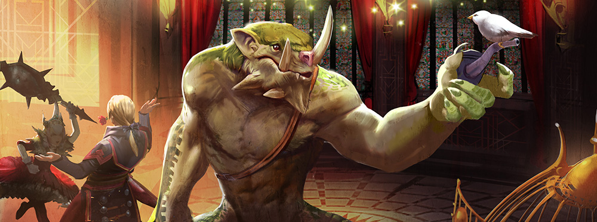
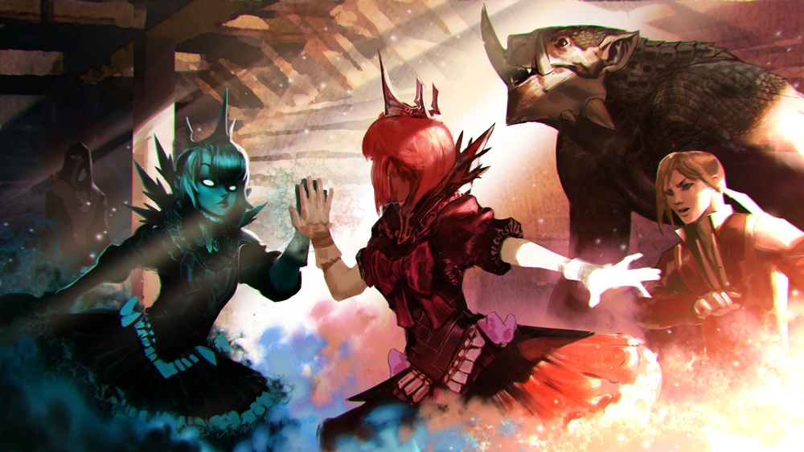

# Malene Lore

## ‘PRINCESS KIDNAPPED!’

## ‘SOCIAL CLIMBERS’

The moon, full as a fat white fruit, dangled just out of reach, just like everything Blackfeather craved. “Ah, Phinneas,” he murmured, whistling through his teeth as he gazed up at the moon beyond the castle balcony, “the best songs are written on nights such as these.”

“Can’t dance to a song about kidnapping,” replied Phinn. He scratched deep into his ear with a single long claw. The two ne’er-do-wells huddled in a dead end of the thorned Hardy Orange maze under the balcony. Phinn towered over the tallest thorny bush.

“Danger is our dance partner!” Black clothes camouflaged Blackfeather in the night, but he refused to hide his gleaming golden hair in any circumstance. Beauty, he said always, was its own weapon. “One can’t be a proper adventurer without abducting a princess. It’s what’s done.”

“Isn’t polite to pluck a poor girl from her home.”

“There’s nothing poor about this lady. Far and wide they’ll laud us …”

“… and hunt us.”

“With my steel and charm, and your … brawn … nothing can stop us. The very sight of you inspires fear in this kingdom, there not being many river trolls about.”

“I hear her parents are nice people, far as royalty goes.” Phinn cared little for matters of adventure, having been alive a good long time and seen a good many things. He thought it healthiest to avoid drama.

Blackfeather clasped his hand onto his friend’s giant, meaty shoulder. “My noble friend. Don’t you like money?”

“Better to have money than not.”

“There, then, is your reason. For in the hostelry where last night we lodged, I heard there is a considerable bounty out for the princess whose chamber turret I took the responsibility of scouting this afternoon during your second nap.” Blackfeather pointed up.

“What’s considerable?”

“Is there to be no thanks for my labor? No apology for your incessant slumber?”

Phinn slid two claws through the thorns to pluck out a bitter orange. “I get tired after lunch.”

“In this case, ten thousand gold bits is considerable. Half and half we’ll split it, a good three thousand each, and we’ll live a grand life.”

Phinn bit into the fruit, rind and all. “Until we can’t afford it anymore.”

“And then we shall set out on our next adventure.”

“What’ll we do with her?”

“With whom?”

“The princess. The one from the kidnapping.”

“Well. We’ll turn her over to whomever set the bounty for her.”

“And how will we …”

“Trivialties! We’ll be rid of her by your second nap on the morrow, and ten thousand gold bits richer. We’ll live as good as that king yonder for as long as we can and tell a great story after.”

“Right, then,” agreed Phinn. Though he could add better than Blackfeather supposed, a loyal friend was on occasion a better thing than a fair one, and he hadn’t the care to argue further. “How will we get up there?”

“We shall scale the wall, naturally.” Blackfeather rested his fists on his waist and stared up at the balcony, as if the way to manage this would appear by magic. “What I wouldn’t give for a grappling hook.”

“Would this do?” And with that, Phinn pulled from his back an anchor.

“How did you get that?”

“At the ship we took here. It fit me so nice, I decided to keep it.”

“Well done, Phinneas! The princess awaits us. Tie a rope to that anchor and hook it to the balcony. Then we shall climb…”

“You have rope?”

“Of course I have rope. I’m an adventurer.”

“Well, then I suppose I’ll discard this chain.”

Blackfeather added an exaggerated head tilt to his eye roll so that it would be apparent in the darkness, and within minutes, the chained anchor sailed from Phinn’s hand to the balcony, locking into place with a great, satisfying, safety-inspiring ch-ch-CHOCK.

Phinn and Blackfeather began their ascent.

## ‘NO USE RESISTING!’

The balcony gave a disconcerting creak under Phinn’s clawed bulk. Blackfeather drew his sword before bursting through the door to Princess Malene’s silken-pillowed, antique-furnished, monogrammed-everything room. The princess sat on a mahogany curule chair, her gown poofed over its sides, peering at her pretty young face in a silver mirror. The mirror reflected no shock when her abductor entered, though one of her eyebrows rose to a judgmental point when Blackfeather tore the rose from his teeth.

“Resistance is useless, Princess. I have come to …”

“Kidnap me, yes. For the bounty.” The princess stood, smoothed her dress and kicked over the curule chair. “It took you long enough.”

Blackfeather’s rose dropped to the plush carpet. “Aren’t you even going to scream? What kind of princess doesn’t scream?”

The princess swished ’round the room, mussing up bedcovers and papers. “_Obviously\_I’ll scream. I’m no amateur. But if I scream too soon, the guards will…AAAHHmmmmff_!”

With a grand leap, Blackfeather slapped his palm over Princess Malene’s mouth as Phinn bent double to fit himself through the balcony door. “Are we having a giggle or a kidnapping, then?” Phinn grumbled.

The princess wrenched her face away from Blackfeather’s grasp. “What is_that_?”

“_That_, your defenseless highness, is a river troll, the second of your captors.”

“And the handsomer,” muttered the princess, who tried to swish away from Blackfeather and was deterred by his blade at her throat.

“I’ll ignore that, seeing as how you are suffering such great trauma.”

Phinn stomped in his slow way to a gilded birdcage, inside of which perched a small white bird. “That’s a rare bird. Is it a Trostanian White?” he said, then whistled through the fork in his tongue.

Princess Malene bopped Blackfeather over the head with her mirror and, while he wailed, sashayed over to a ring box by her bed. “Obviously. One of fifty left in the world.”

“Pretty thing. Shouldn’t be in a cage. What’s its name?” Phinn unlatched the cage door with surprising dexterity and the bird hopped onto his head.

Blackfeather struck a daring, adventurous, lunging pose and began again. “It’s no use resisting! Away we go and no more delay!”

The princess whisked past Phinn and his newfound pet to rifle through another drawer. “Coocoo D’Etat.”

Blackfeather’s lunge drooped. “Ah … what?”

“It’s the bird’s name.”

Phinn shook his great scaley head. “I don’t like that. I’ll name it Susie, after my old uncle.”

“No use resisting!” Blackfeather tried a third time. “Away we…”

“I won’t go anywhere without my signet ring,” snapped Princess Malene. “How will you prove you have me if your ransom note doesn’t bear my insignia?”

“Ransom note?” asked Phinn.

“Ransom note?” asked Blackfeather.

The princess sighed. “Do either of you know anything about kidnapping, at all?”

The boys looked at one another, then back at her.

“No use resisting,” said Blackfeather, quieter this time.

“Ah! There it is.” Princess Malene slid the ring on her finger, threw back her head, and let loose a terrorized shriek. Phinn winced. Blackfeather jumped. The bird pooped on Phinn’s head. “No! Please! Do not take me! I’ll give you anything!” She swung out one arm and knocked down a blown-glass lamp; it shattered into a million shards on the floor below. “You filthy rogue! You beast! Unhand me!”

Guards pounded at the door and the three made a dash for the balcony, Princess Malene screaming her protests even as she rode down the chain, holding onto Phinn’s neck. Once they landed in the thorny maze, though, she smoothed out her dress and peered into the dark. “Which way to your hideout?”

“It’s almost as if you have ordered this enterprise done yourself,” complained Blackfeather.

“Of course I did,” huffed Princess Malene. “One can’t be a proper princess without being kidnapped for ransom.All the best ones are.”

“Seems fair,” said Phinn as he jerked on the chain, pulling the anchor loose along with much of the balcony railing.

The roar of engines and barking dogs in the near distance sent the three running through the maze without further conversation.

## ‘RUFFIANS!’

“Beware, Princess! Ruffians are about!” Blackfeather posed in a deep lunge, his hand on his sword hilt, as a trio of cagey foes in tattered black cloaks emerged from the dead-end shadows of the thorny maze.

“Thanks for doing the climbing and grabbing part,” said the largest of the hooligan trio with a gap-toothed smile. He gestured toward the princess with a spiked mace. “We’ll take it from here.”

“I guess they’ll get the bounty, then,” said Phinn.

“Ludicrous!” cried Blackfeather. “I will make ribbons of these scruffy barbarians.”

“Outnumbered, aren’t we?” mused Phinn, though no fear edged his voice.

“They are no match for me.Lookat them. It is as if they have never heard of a tailor,” scoffed Blackfeather.

The princess crossed her arms and drummed her fingers. “Could whoever is kidnapping me please put a rush on it? The maze guards should be on their way.”

“Yer guards aren’t feeling well.” The second-largest enemy spat on the ground, then jabbed a thumb over his shoulder. “We bopped their heads together and now they’re napping. We’ll do the same to you if you can’t otherwise keep quiet.”

“I shall acquaint you with my blade for threatening royalty in that fashion, you boor.” Blackfeather drew his sword with a satisfying shhhiinnnggg. “Uncouth louts, meet my sword, Blackfeather.”

The Princess paused her dramatic despair. “You named your sword afteryourself? Of all the egomaniacal …”

“I have much in common with my sword,” smouldered Blackfeather.

“I don’t even want to know.”

“Not sure which of these fussy chickens is the princess,” quipped the smallest of the thieves, cutting short the quarrel. He yanked a sabre free of his belt.

“Shame to muss the boy’s hair,” hooted the largest.

“You s’pose he’ll be offended if the blade that kills him ain’t clean?” The second-largest produced two knives from his vest.

“Leave these imbeciles to me, Phinneas,” commanded Blackfeather. “I will take them all together!”

“Alright,” said Phinn, who amused himself by catching fireflies for Susie’s supper.

The mace had not completed its first arc before Blackfeather dashed straight into the foes, his blade leaving a blooming crimson kiss in the torso, arm and face of each in turn. Quick lunges kept him out of reach; his flashing sword seemed to extend to twice its length. The slice of the sabre, the flash of knives, the swings of the mace caught only air and earned the hoodlums stinging lacerations. Down the dangerous pathways Blackfeather dueled, blocking, feinting, ducking and slashing with grace and pithy insults. “You strike with the speed of a tortoise! Tell me the name of your blademaster so that I may blame him for your untimely demise! I will plant a rosebush on your grave, fiend!”

But while Blackfeather chased the bigger two down a blind dead-end, the smallest tough guy ducked round the fray and grabbed the princess.

“He’s made off with your bounty,” called Phinn.

Blackfeather sprinted after the abductor, but lost him in the dark labyrinthine passageways. He returned to find the other two had squirreled off as well.

“Help, Phinneas!” cried Blackfeather.

“Thought I was to leave the imbeciles to you.”

“We cannot allow these ingrates to steal what we have rightfully seized!”

“Fair enough.” Phinn hoisted up the anchor by its chain and threw it forward into the darkness. When he yanked it back, its hooks had dug into the jackets, belts, and thighs of the three blubbering, thorn-raked goons, not to mention a tumbleweed of prickly thorns. Princess Malene toppled off the shoulder of her captor and into Blackfeather’s embrace, a single thorn scratch weeping blood onto her pale cheek.

“Welldone, Phinneas!” whooped Blackfeather.

“Youfools,” whimpered the princess. “Don’t you know … the Hardy Orange thorn… is poisonous… to princesses?”

Her eyes closed as she went limp in Blackfeather’s arms.

Royal guards rushed out in a absurd tumble to the balcony above. “They escaped this way!” cried one.

Blackfeather whirled in a panic. “Never fear! I memorized the way… left, left, right… no, it’s backward on the way out…”

“No time for puzzles, I’d say,” said Phinn, and he lumbered straight into the Hardy Orange maze wall, stomping it down into a crumble-squish of finger-long thorns and half-ripe fruits.

## ‘LOVE’S FAILED KISS’

Phinn chewed on his pipe while a bobber floated on the still water of a pond. He sat on a rock, half snoozing, jerking awake whenever his fishing pole slipped out of his claws.

On the grass beside him, Blackfeather had surrounded the unconscious princess with plucked flowers. “Look at her,” whispered Blackfeather in awe. “Is she not the most captivating thing you have ever seen? Her hair. Her pale skin. Her delicate fingers, how they clutch her prized mirror! Her eyebrows, arched as if to say… as if to say…”

“…let me sleep,” said Phinn.

“No, that’s not it. There is a… a dare in her expression. ‘Do you dare to do what must be done?’ Yes, your highness, I…”

“I meant, let me sleep,” said Phinn with a sharp-toothed yawn. “You kept me up all night with your princess-stealing.”

“How can you think of slumber when such an adventure is about?” Blackfeather dropped with great drama to his knees beside the princess and tucked her hair behind her ears. “When such a beauty needs aid? Never fear, my lady. Blackfeather is here.” With that, he bent and brushed his lips against hers.

Phinn snored.

Susie, perched comfortably on Phinn’s nose, tweeted a morning song.

A red-whiskered carp poked its head out of the pond to peer with suspicion at the bobber.

Princess Malene did not stir.

“That’s bizarre,” said Blackfeather, startling Phinn awake. “Something went wrong with the kiss.”

“Like as not, it’s your technique,” said Phinn, making eye contact with the carp. “Kissing is an art. It’s all in the incisors.”

“I weep for troll women.”

“I haven’t yet had a complaint,” said Phinn as he casted again, landing the bait closer to the curious carp. “Come on, now. Heeeere my little breakfast. Take the juicy worm, now.”

“Your provinciality would drain the romance out of any but this exquisite moment,” said Blackfeather, and again he lowered himself to press his lips to Princess Malene’s, lingering longer this time.

Susie ate a fly out of Phinn’s ear.

The carp nibbled the bait.

Phinn snorted awake and yanked up his pole, piercing the carp through its coquelicot-mustachioed lip.

Princess Malene did not stir.

“Preposterous!” cried Blackfeather. He pouted with crossed arms while Phinn reeled in the carp. “Something is wrong with her, because I am the best kisser in this land.”

Phinn raised up his wriggling catch, but Blackfeather was too despondent to admire it. “Maybe she needs to be awake to enjoy it,” offered Phinn.

“That is the point of the kiss,” cried Blackfeather, startling Susie. “To wake her up.”

The carp died.

“Kisses don’t wake up princesses. Who told you that nonsense?” Phinn bit the head off his breakfast and chewed while shaking his head at his friend.

“They don’t?”

“Of course not. Only the tickle of a seraphim’s feather will wake a sleeping princess. Blue feathers work best.”

Susie nodded in agreement.

“That … that makes so much sense!” Blackfeather sighed with relief. “Why else would my kisses be ineffective? Now, where do we get this famed azure plume?”

“Beats me. Not as many seraphim about as there used to be. Why do you care anyway? I thought we were her kidnappers, not her heroes.”

“We can’t very well collect a bounty on a princess in a coma.”

“Seems you rather like her.”

“Like her? Dear, sweet Phinneas. The crevasse between heroism and villainy is not wide, but it is deep.”

“Take care not to fall in when you jump over, then.” Phinn swallowed the remainder of the carp and, as was his habit after eating anyway, fell again to napping. Once he was sure that Phinn wasn’t watching, Blackfeather took Princess Malene’s hand.

“I shall be the one to tickle you awake, your highness,” he whispered. “I care not where the adventure takes me.”

## **‘THE FOREST WITCH’**

 Through the forest Blackfeather, Susie and Phinn journeyed, the slumbering Princess Malene draped over the troll’s shoulders, until they reached a cottage, roundish and squat, with vines overtaking the stones and pleasant-smelling smoke coming from the chimney.

 Blackfeather flourished one arm. “At last! We have found the old witch’s cottage!”

 “Which witch?” asked Phinn.

 “Whichever witch witches in this forest.”

 Phinn flung one of the princess’ flopped arms, the mirror clutched in her grasp, back over his shoulder. “Maybe we should leave a forest witch alone.”

 “Normally I would, Phinneas, but witches collect magic items. Unless _you_ have the address of a generous seraphim?”

 Phinn shrugged, toppling Malene into Blackfeather’s arms. Blackfeather oofed, then rang the doorbell with his nose.

 A gray-haired woman dressed in gray answered, drying her hands on her skirt.

 “Greetings, old witch!” cried Blackfeather. “I am in dire need of -”

 “No,” she said.

 “But, dear old witch, I have not yet made my enquiry.”

 “Go on then,” she said.

 “I am in dire need of an azure plume from the wing of a seraphim,” said Blackfeather.

 “No,” she said.

 Blackfeather, who had not been told no often enough in his life, wavered. “But I… I have carried this princess across all of the forest…”

 “_I_ carried her mostly,” muttered Phinn.

 “I figured,” said the witch.

 “What reason could you possibly have for refusing us?” asked Blackfeather, flabbergasted.

 “You called me old.”

 "I didn’t mean _old_ so much as _ugly_,” whined Blackfeather. “Of course you understand.”

 “I do,” said the witch. “Handsome men like you only keep company with beauties.”

 “Precisely,” said Blackfeather.

 “Like the dead one there,” said the woman.

 "Yes… I mean no!” cried Blackfeather. “She is only _partly_ dead. She was poisoned by…”

 “…a Hardy Orange thorn,” sighed the witch. “Those moronic mazes.”

 “You must help me.” Blackfeather’s eyes filled with tears. “I have never loved as deeply as this.”

 “Then don’t wake her up,” said the witch. “Nothing kills a good love story like a conscious woman.”

 “You know _nothing_ about love,” said Blackfeather.

 “You know nothing of _women_.” The witch bent to sniff at the princess’ thin exhales, then lifted one limp royal wrist to peer into the mirror. “Within every beautiful princess sleeps a powerful shadow.”

 “There is no shadow inside _this_ girl,” said Blackfeather.

 “You’re right, but you don’t know why,” said the witch with a wry smile. “Give me the mirror, and I’ll give you the feather.”

 “The mirror isn’t ours to give,” said Phinn.

 Susie agreed.

 Malene snored.

 “Done!” oofed Blackfeather with the desperation of a man whose arms are buckling under the dead weight of a princess.

 “Come in,” said the witch.

## ‘HAPPILY EVER AFTER’

 Malene felt a feather-soft tickle on her nose and opened her eyes.

 “Phinn! She’s awake!”

She laid on a kitchen counter in a witch’s cottage, made evident by the shelves of stoppered jars, the dried herbs hung on the walls, and the witch sitting by the fire.

A golden-haired man holding a shining seraphim’s feather bowed. After a blink or two, Malene recognized him, fuzzily, as her recent captor. “My lady,” he crooned, “I have carried you across a vast forest to find the feather that would tickle you awake.”

_“I_ carried you mostly,” said a troll at the door. He was too big to fit inside, so only his head was stuck through. Coocoo D’Etat preened herself on his head.

Malene, satisfied at having been awakened in suitable fashion, rounded out the adventure by falling in love. “My hero,” she gasped, touching her rescuer’s cheek with the back of her hand while trying to remember his name. “How can I ever thank you?”

The feather floated to the floor as the man gathered her into his arms. “I ask only for a kiss, my love.”

The princess melted into his arms and they kissed. It was a fantastic kiss, pulled off with nary a tooth bump and minimal halitosis, the kind of kiss that kicks off a proper happily ever after.

“Be sure to invite me to the wedding,” said the witch.

“The what?” asked Malene’s true love with his mouth still full of kiss.

“The wedding,” repeated Phinn helpfully.

“The _wedding!”_ squealed Malene.

“Now now…” The lover boy backed up a step, his palms outward. “Marriage is… it is such a big _leap_ from the first kiss, is it not?”

“Not in these stories,” said the witch.

“Oh, we shall have a _huge_ royal wedding, much bigger than my sister’s, and the train on my dress will be a mile long,” cried Malene.

“However,” mused the witch, “you do need _two_ royals to have a royal wedding.”

“Indeed,” said the man. “Though I am courageous and fierce and the best kisser on the continent, I am not of royal blood, and so our love must always be the forbidden kind… which is anyway my favorite.”

Malene wept. “But I _want_ a royal wedding.”

“A queen can promote a rogue to a royal,” suggested the witch.

“A pauper to a prince,” said Phinn.

“A bandit to a baron,” said Coocoo in bird language.

“A degenerate to a duke?” said Malene, sniffing away tears.

“A loser to…”

“That’s enough,” said the man.

“Then again,” mused the witch, _“you_ are just petty royalty. If only you were, say, Queen of the Eventides.”

_“Then_ I could marry whomever I please!” cried Malene. “So all we must do is defeat the Storm Queen.”

“Unlikely,” said the witch.

“We have a troll, and my lover’s blade,” said Malene.

“You’ll need a powerful mage,” mused the witch, gazing into her new mirror. “And a dragon or two.”

Malene shrugged. “Then I shall have a dragon or two.”

“Can’t just pick up a dragon from the market,” said Phinn.

“A mage, though, is very near,” said the witch.

“Wait.” Malene pointed at the witch. “Is that _my_ mirror?”

“A price had to be paid for the feather,” said Malene’s nervous fiancé.

The witch twirled the mirror in her hand. “He didn’t know the mirror’s purpose, I assume.”

Malene leaped to her feet – then stumbled from the painful poking-pin sensation of her limbs waking. “You _will_ return it.”

“No,” said the witch. “But I will return _this_.” She rapped her knuckles on the mirror’s back, and out of the glass swirled a dark shadow that collected itself into the shape of Malene.

The rescuer clamped his fist around the hilt of his sword, but Malene stopped him with one raised finger. The shadowy mirror-Malene’s finger raised, too. Their fingertips touched.

“Once upon a time,” said the witch, “a king and a queen had a baby.”

The two Malenes pressed their palms together, and their hands became one.

“The princess was beautiful, but if she didn’t get her way, she became a tantruming horror. And this princess, having been born with some… not insignificant magical ability, made an obvious mess when angry. And obvious Mageborn children go straight to the Storm Queen’s army.”

The shadow and Malene moved closer until they stood nose-to-nose.

“I would tell most parents to deal with their own brats, but the king and queen were quite generous. So I trapped their daughter’s shadow in this mirror, and ever after, she behaved like a useless, spoiled princess. But now…”

The two princesses enveloped one another, the shadow hidden completely away. “Now,” said Malene, “it is time to be queen.”

“I don’t think it’ll work,” said Phinn.

Malene spun to face the troll and the swordsman, and in a flash of long-dormant magic transformed into the shadow once trapped within the mirror. “I _will_ have a dragon!” she announced. “I will have a dragon in every color! And I _will_ be Queen of the Eventides, and we will live happily ever after, and that is final!”

As quickly as it had appeared, the shadow faded, and the lovely princess remained. With a flouncing of skirts and a charming smile, Malene squeezed through the door past Phinn.

The adventurers stumbled from the cottage in shock. “So, Blackfeather,” said Phinn, “We’ll be going the other way, right?”

“That’s it! _Blackfeather!”_ cried Malene from the garden. “I had _completely_ forgotten his name.” And with that, she skipped away down the forest path.

_“Look_ at her, Phinneas,” sighed Blackfeather. “Such pluck. Such moxie!”

“So we’re going _with_ her, then,” said Phinn. “Toward dragons.”

The witch scooped up the feather from the floor. “Have fun storming the Storm Queen,” she called, then slammed the door behind them.

