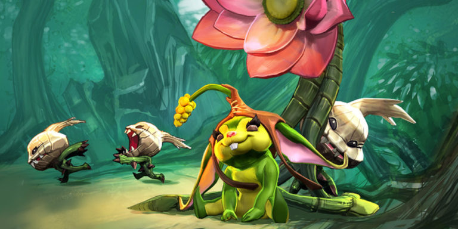
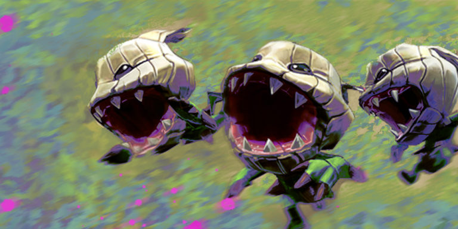
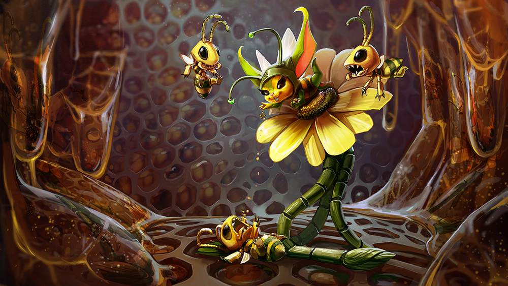
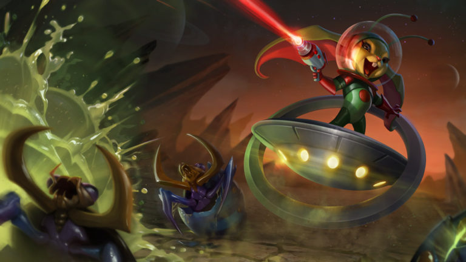
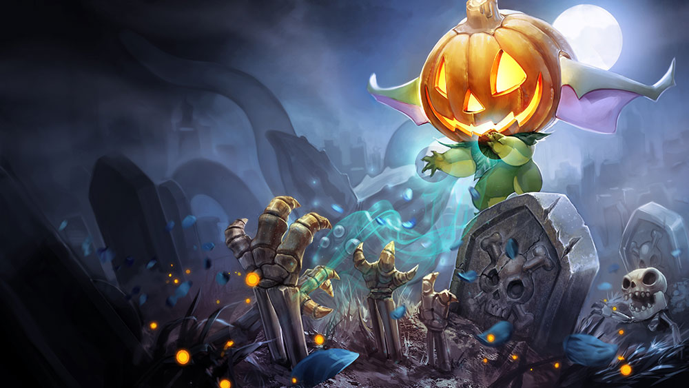
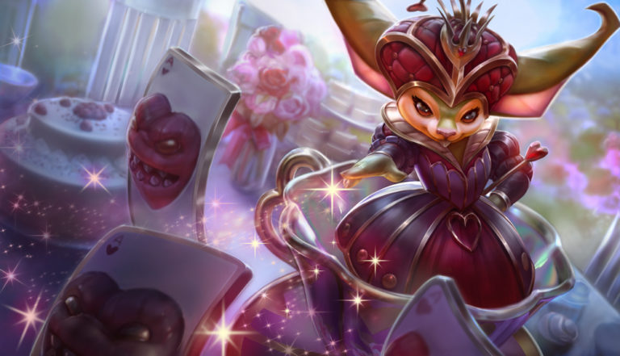

# Petal Lore

## 'PETAL'S POWER'

“And then I went like, _Pow! Pow! Pow!_ with sunbeams, and the baddies were running around in circles – all blind – and they bonked their heads together, and fell down kicking their stubby little legs and whining like babies!”

Petal’s little fists smash together, mimicking the monster heads. The munions watch with wide eyes, mouths gaping, as her fingers wiggle like monster legs.

Petal plucks at the wayward tendril of a rattan plant so tall that they call them Ent’s Walking sticks. She winds it around a nearby smilax vine, so it will get more sun. “The monsters out there are big. Bigger than all of you on toppa one another. Can’t kill ‘em with just a few sun blasts.”

The arsenal is abloom. Bugs sing in the shadows; fat palms unfold atop the rattan. Super poisonous bleeding heart flowers burst out of thorny stems. Stinging Bushes, their leaves hairy with glass-like spikes, bump up next to the Sleepies and the Sneeze Weed and Wait-a-Whiles. This is Petal’s favorite garden, a free-for-all of spines, spikes, and prickles. In the distance is the rhythmic sound of a guardian ent circling the Meekos village. Three munions follow Petal about, bouncing and orbiting her, as always.

“We will eat them up if you take us! You could enchant us up out of the bramblethorn seeds!”

“You know what happened last time.” Petal sighs and looks at her feet, her sprout drooping in shame. “Nothing.”

“Maybe if you try harder!”

“Yes, just concentrate super-duper hard!”

She plops down and closes her eyes. Her forehead bunches up. She gathers all the sunbeams, just like before. Heat builds up in her hands, and the munions cheer and spin in frantic circles. Finally, it’s too hot to bear; she lets it go with a shriek. Purple Solanum petals explode into the air, and then…

_Boom!_  
_Boom!_  
_Boom!_

When all is calm, she is standing alone in a rain of purple blooms and dew bubbles, three little bramblethorn seeds where the munions had once been.

“Oh no! I’m so sorry!” Then she wonders…

Maybe if she has explosives, she can beat up any of those jungle baddies. They’ll send her to scout all the wells! She’ll be a hero!

With a shout, she blasts a sunbeam into the still-smoking bramblethorn seeds, and:

_Pop!_  
_Pop!_  
_Pop!_

Out comes the three munions, good as new. “What happened!” “You farted!” “I did not, I went kablooie!” “That’s what I meant!” “That’s stupid!” “No, you’re stupid!”

Petal whistles, and her lotus flower bounds back to her. “Come on, munnies,” she says in a brand-new, commanding voice. “We are going _outside_.”

## 'THE MUNION'S TALE'

Out! Out! Petal takes us to the outside places today! You don’t get to come. You’re just a dumb giant ent. You have to stay here and guard the hatchery… but we three get to go out when Petal scouts! Ha!

You never saw the far outside place. There are not so many seeds and sprouts. Things don’t all grow from the ground. There are creatures that make shiny magic and there are glow-glow crystals that we bring back and plant in the earth. It helps grow new brothers for you!

And there are baddies! Baddies are favorite.

Yes! Favorite! Petal says we can eat the baddies. Chomp! Chomp! We take big bites from the baddies. We eat and they fall down and then when we are very full we get to nap in the bramblethorn. Also Petal throws the sun at the baddies. _Sparkle, pow!_

What’s that? You say Petal can’t throw the sun?! …that the sun is way up high, maybe three ents higher than you? She does throw the sun, and then the baddies run. Don’t call me stupid! You’re stupid! Ents are stupid! Yes, ents are the stupidest.

Sometimes we go boom. Can you go boom, mister ent? Didn’t think so.

All three of us. Boom! Boom! Boom! Even more roasted baddies. Then Petal grows us back again.

She is the best Meekos scout _ever_. One day she will grow more things. Maybe big, dumb ents.

You stay here, big dumb ent. You protect the village, and we will go chomp!

## ALTERNATE FATES

### 'BUG' PETAL

#### 'WATCH OUT'

_Underestimate me, huh? Well, I hope you’re not allergic! I’m tired of these raiders wrecking the jungle with their bullets and magic and soundwaves! Nature has lots of tricks up her sleeve. You think onions made you cry? Try stingers! That’s right; I’m the queen around here. With my swarm and upgraded ride, we’re bringing some raw-pollen justice to anyone who gets in our way. You ever hear of killer bees? Better watch out which bushes you hide in, that’s all I’m saying._

### 'SPACE BUG' PETAL

#### 'BUGS FROM SPACE!'

{% embed data="{\"url\":\"https://youtu.be/iSHusCqrzMU\",\"type\":\"video\",\"title\":\"Legendary Bug Petal\",\"icon\":{\"type\":\"icon\",\"url\":\"https://www.youtube.com/yts/img/favicon\_144-vfliLAfaB.png\",\"width\":144,\"height\":144,\"aspectRatio\":1},\"thumbnail\":{\"type\":\"thumbnail\",\"url\":\"https://i.ytimg.com/vi/iSHusCqrzMU/maxresdefault.jpg\",\"width\":1280,\"height\":720,\"aspectRatio\":0.5625},\"embed\":{\"type\":\"player\",\"url\":\"https://www.youtube.com/embed/iSHusCqrzMU?rel=0&showinfo=0\",\"html\":\"
<iframe src=\\"https://www.youtube.com/embed/iSHusCqrzMU?rel=0&amp;showinfo=0\\" style=\\"border: 0; top: 0; left: 0; width: 100%; height: 100%; position: absolute;\\" allowfullscreen scrolling=\\"no\\"></iframe>
\",\"aspectRatio\":1.7778}}" %}

### 'PUMPKIN SPICE' PETAL

#### 'THE GREAT ECLIPSE'

Celeste wandered upon Petal on the Halcyon Fold one night, pulling eyes out of newts and dropping them into a cauldron.

“You look strange,” said Celeste. She was eating a peanut butter and honey sandwich with the crusts cut off. “Did you do something with your hair?”

Petal stirred up the stuff in the cauldron with a long spoon, then added three frog legs. The brew inside glowed green and farted. “I don’t have hair,” said Petal. “I look weird because you usually see me with Murgle.”

“Oh. Where is your fancy bouncy vehicle?”

One of the frog legs leaped out of the cauldron and tried to hop away. Petal grabbed it and tossed it back in. “Closed up, like the rest of the flowers. Haven’t you noticed anything different about the sky?”

Celeste looked up. “All the stars are where I left them.”

“It’s noon. Don’t you don’t find it kind of strange that you can see the stars right now?”

After a thoughtful bite of her sandwich, Celeste said in a sticky way. “I guess I don’t usually eat my lunch at night.”

“It’s been night for three days. We’re calling it The Great Eclipse.” Petal unwrapped an itty bitty pouch and upended it over the yawning mouth of the cauldron. Nothing visible came out, but baby laughs echoed from inside the bubbly goop. “The Bleekos did it.”

Celeste peered over the lip of the cauldron and leaped back with a squeak when something inside erupted. She was okay, but her sandwich got toasted. “Bleekos?”

“The Meekos’ mortal enemies. Their king, Gnottingham Catchfly the Third, stopped the world’s spin. Now half of it is always dark.”

“How did he manage that?”

“Magnets. Magic. Or maybe he dug down to the squirrel in the middle of the world who runs on the wheel and fed him a poisoned biscuit. I don’t know how, just that he did it, and the Bleekos invaded my home with their moonlight power. My garden is full of dung beetles and mosquitos and super-annoying cricket songs. The flowers are all closed, including Murgle. The munions are hiding underground. And I can’t fight, ’cause all my power comes from the sun.”

“I like when the stars are out, though.”

“You also like honey. And peanuts.” Petal pointed at Celeste’s sandwich. “There’s no flowers for the bees to dance in, and they’re all napping in their hives. No flowers, no honey. No sun, no peanut plants. No peanuts, no peanut butter.”

“But I quite like peanut butter.”

“So make yourself useful.” Petal tossed a turkey baster over at Celeste, then poured in one grinning clam, one angel feather, a spider with nine legs, a first kiss and a can of orange juice concentrate. “Put a drop of that on this.” She set a watermelon down on the ground before Celeste, then fit a protective pumpkin over her own head.

“Um… okay?” Celeste poked the baster into the burpy fizzy concoction and delivered one drop onto the innocent little melon.

B O O M!

The melon exploded outward. When the green smoke cleared, the watermelon had spooky sharp teeth, googly eyes and bounced around all on its own.

“Perfect,” mused Petal, and hopped onto her new ride.

“Exploding stuff could be useful,” mused Celeste. “Let’s make some more.”

### 'TEA PARTY' PETAL

#### 'THE QUEEN'S TEA PARTY'

Not to be outdone, the Queen of Hearts went about planning her own lavish tea party. But when she discovered what tea _was_ \(leaves ripped from unsuspecting plants, then dried in the sun and boiled!\), she was aghast. Tea, she proclaimed, would be made from there on with bugs. And so insects were collected in droves from under rocks and inside dark cabinets, then flavored with salts and honey and bagged up. In the palace courtyard, a long table was set with a white cloth and clean dishes and piled with cake and biscuits and steaming teapots. The queen herself proceeded, with great fanfare, down her freshly mowed croquet court to the long white table, only to discover that no guests had arrived…

