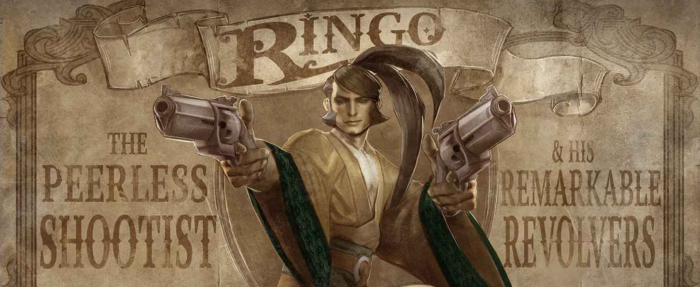
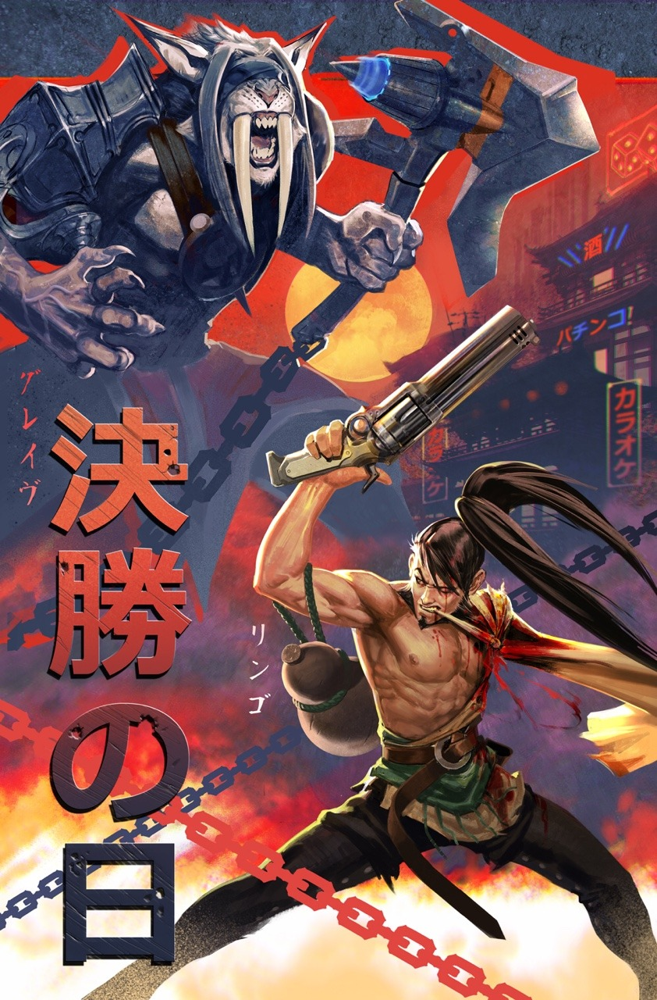
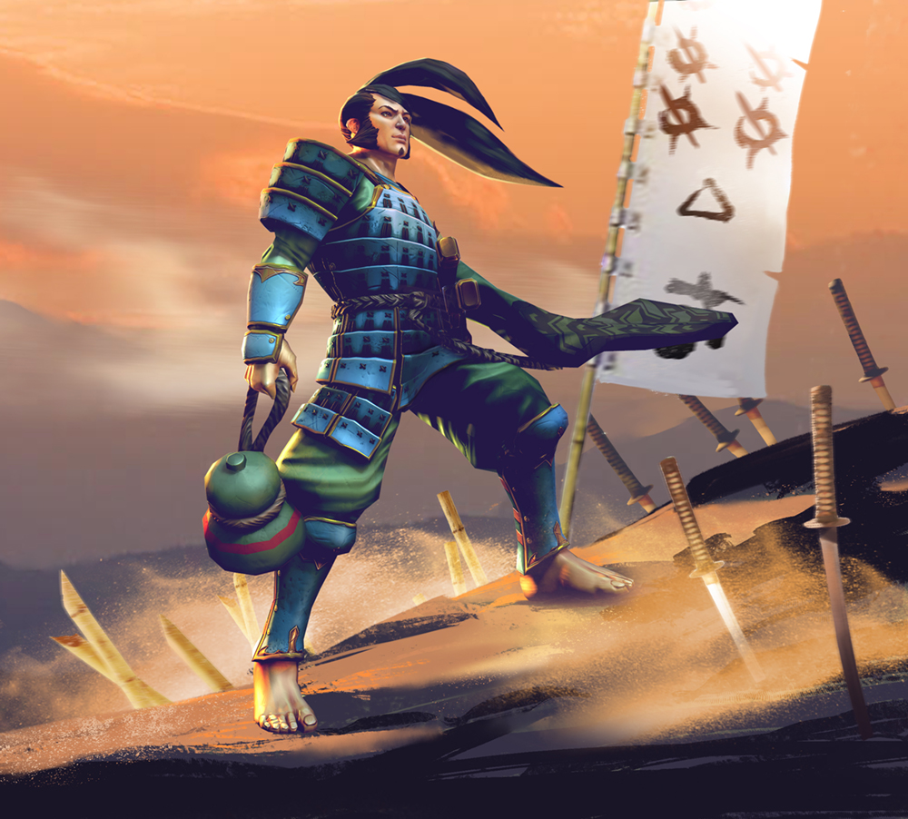
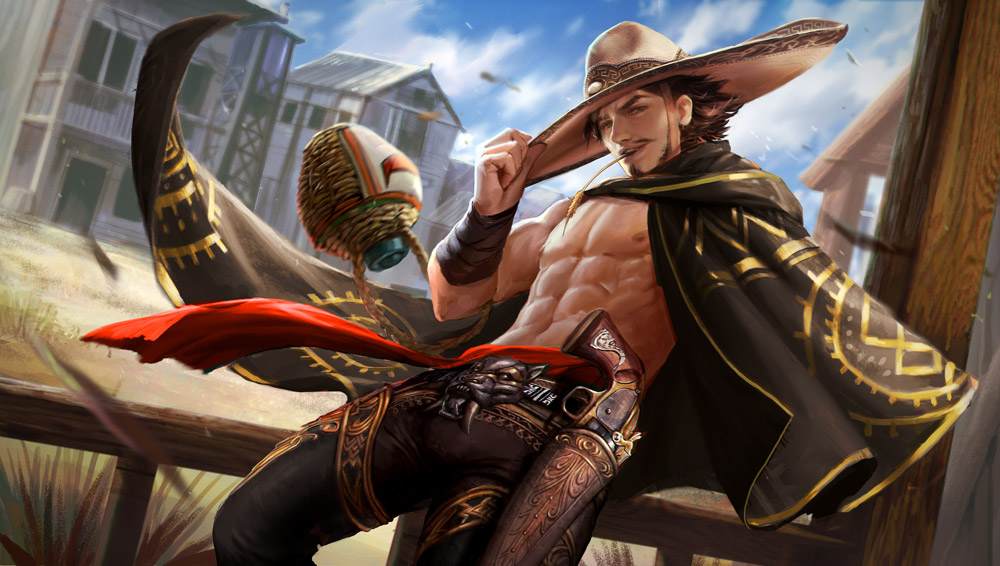
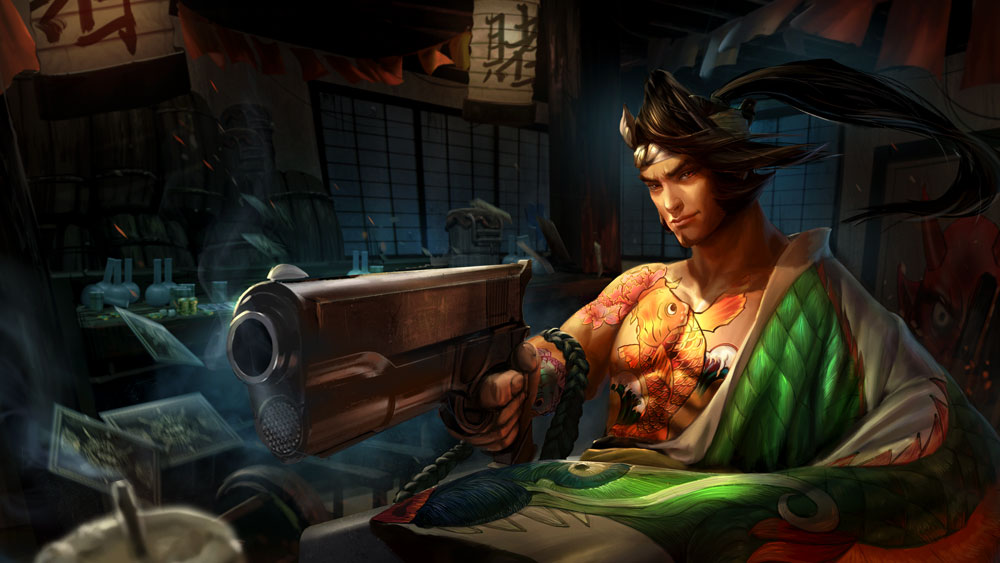

# Ringo Lore

## 'THE COIN TOSS'

The big tent was a smorgasbord of boondogglery. Mechanically winged men fought mid-air with flashing swords. Collared fire and ice elementals danced, trying not to kill one another, to the tune of instruments that appeared to play themselves. The mermaid that townies had gawked all evening in the geek tent rose out of her aquarium prison in a globule of water that floated, intact, over the crowd. Acrobats made a bridge, gripping one another’s shoulders, muscles twitching, for the sabertooth that walked across, pursuing her nightly dripping ration of meat, on a platform at the other side.

 Ringo swaggered on stage, carrying twin single-action revolvers named Faith and Reason. His thrower, a long-legged juggler dressed in top hat and a short flouncy clown skirt, strutted to the center after him. She set plates spinning on batons, then tossed them up high. Ringo, twirling the revolvers ‘round his trigger fingers, wasn’t much of a show in comparison to the thrower until the first plate exploded mid-air into tiny ceramic shards.

 Tightrope walkers quivered above; the strongman lifted benches full of giggling, terrified minions overhead. If the thrower tossed too high or too low, it’d all go to hell, and that was part of the appeal. Ringo stumbled about like he’d been sauced for hours, swaying, one eye closed for focus, leering at his thrower’s gams, but when the plate flew, his guns paused cold at his hips and BANG: Whatever the thrower launched was destroyed.

 Children crowded up front, holding out coins they’d pilfered from generous parents: “Me! Me! Mister Ringo, please, me!” The thrower made a big show of plucking up coins from their sticky fingers, then she twirled, tossed… BANG, and then she caught that same coin out of the sky, returning it to the lucky child with a perfect bullet hole through its center. Two at a time she threw – BANG-BANG – then caught one in each palm.

 For the finale, she tied a blindfold around Ringo’s head and spun him some. The terrified crowd went silent. Some ducked behind their seats; some ran out. The thrower girl tossed three coins. Arms crossed, aiming over his shoulders, sightless Ringo fired: BANG-BANG-BANG. The thrower whirled, danced, then returned three coins \(with faces blasted through\) to their rightful owners.

 The crowd exploded into standing applause.

 How? they bellowed to one another. Impossible!

 All the while, the carnie kiddos slipped purses from townie pockets, invisible as ghosts.

## 'THE BULLET CATCH'

 After the town was good and curious about the carnival tents going up, Pavel and I would go to whatever hole served brew. We’d play Queen’s War with my trap deck, him losing and cursing, ’til the crowd was thick and sauced. Pavel and I, best friends since age 3, had grown up feeling out crowds of drunk people. You go wrong, they turn on you. Go right, you make out with the contents of their pockets.

 I was a better bad guy than Pavel. He was our strong man, but he had big baby eyes. I’d make an ugly show of winning, buying pints with his money without sharing. Then, when the crowd was ripe, Pavel would demand a chance to make his money back.

 “Fastest bullet in the world? I bet 10 gold I can catch your bullet in my teeth.”

 “You’re drunk, Pavey,” I’d say big-n-loud. “Ain’t no one can catch a bullet in his teeth.”

Then, Pavel’d claim I cheated, and people started crowding around. Pavel’d put on his big tent voice and say, “Who has a gold piece that says I can catch this puny cheater’s bullet?”

 Most people didn’t believe but wanted to see a guy get shot in the mouth, that being the kind of towns we stopped in.

 The more I protested, the more gold the crowd put down. When we’d got a half-circle round us, I’d take aim and then drop my piece, say I couldn’t shoot at my oldest friend. But the crowd was frothed up, so I’d take my first shot, let it go wide and straight through the wall behind Pavel. Ha!

 If the crowd hated me before, they hated me worse then. I’d try to run off but if we worked them right, the crowd would haul me back. I’d put up my gun, wrist shaking and fire wide the other direction, make another perfect hole in the wall. That’s when Pavel’d squawk chicken at me, making me good-n-mad. I’d aim with my tongue out and one eye closed for effect and blast a blank right at Pavel’s chubby sweet face.

 We had it practiced so he turned his head hard at the sound, fall down with a floor-cracking slam and the crowd would gather all over him. Then he’d flutter his big baby eyes open and give a big grin to the crowd, a bullet between his front teeth

 I made a show of handing over all the gold he’d lost to me in Queen’s War and the crowd had such a good time watching the show that they didn’t mind handing over what they’d bet plus a couple rounds besides, and then we made a show of being good friends again, which people always love to see. It was a great bit. I miss that big boy Pavel. I bet he’s still lifting up chairs of ladies with his pinky fingers in the big tent somewhere. “Lousy at life; amazing at shooting,” he’d always said to me. How right he was.

## 'GLAIVE MEETS RINGO'

 You thought you could call me beast from across the cantina. If you whispered it, you thought I wouldn’t hear. You thought that distance would give you a running start. And now you are at my feet, drunk little carnie fool. That’s why you lose at the dice tables, and why you return to lose again: You are only good from range.

 But now my axe has knocked you close, so while you’re at my feet clutching at that nasty bruise, why don’t you insult me again? Ah, good, good. There’s some courage in you. I can respect a man who spits in the face of a beast.

 Perhaps, though, you should think on what you consider beastly. True, my kind lives in the treetops and mountain caves. The patterns in our fur hide us in the vines, brush and thorns. Weaker creatures feed us. But you pockmark our mountains with your mines, draw out the crystal and the gold, then fight over the wells while the mountains crumble. The avalanches draw the beasts, as you call us, closer and closer. Which path is truly less civilized?

 Shh, stop shaking, little carnie. This is not the end. There’s still a trophy to claim.

 Get up off the ground, you cowardly shivering leaf, and let’s have a roll of dice to prove we can play nice. You can have all my gold if you win. But if you lose, I’m taking that side arm. Oh, it’s special to you, little Ringo? Then you’d best not lose.

 And you’d best not cheat. I can smell every move.

## ALTERNATE FATES

### 'SHOGUN RINGO'

_It is said there was once a shogun named Ringo who hunted the golden jungle dragon. He spied it in the distance, took careful aim and shot the dragon straight through its heart. However, when he crept forward to confirm his kill, gun drawn, he discovered that what he had shot was not a dragon, but a golden rock._

_Carnies near and far spoke of his legendary shooting — for Ringo’s bullets could pierce solid stone. But when he tried to repeat his feat, Ringo’s bullets bounced off the golden rock again and again. Ringo’s beliefs shaped his reality, and once he knew a new “truth,” the golden target became impenetrable._

### 'VAQUERO RINGO'

**THE HORNSWOGGLE**

One late autumn, Rowdy Ringo surfaced in town after years away. We’d figured him for dead, limb removal injuries being the fatal kind, and those who hoped he was alive were sure he’d never show his face again. But he wandered into the tavern one day just as casual as you please, what he’d lost hidden up under his poncho, winking at the ladies like he wasn’t three-quarters of a man.

 Took about thirty seconds for Rowdy Ringo to have three different gun barrels against his head.

 “Whoa whoa whoa there, boys,” said Ringo, his one hand up nice and peaceful. “Your bullets are going to go straight through my skull and catch one another. Wouldn’t want you upstanding gentlemen to die over a dumb mistake like that.”

 “Lemme take the shot,” whined Bookie Barry. “This man walked out on a hundred-gold debt.”

 “I’m a vaquero now. Only thing I hustle are cattle,” said Ringo. “I’ll set you up with one of my good dairy cows; should be worth a hundred plus interest.”

 “I should get ‘im,” said the Lawman Larry. “He’s been jailed for robbery three times and his friends always broke him out!”

 “I never did stand trial in front of a jury of my peers,” said Ringo.

 “Justice is mine, says me,” cried Reverend Ronald. “This man has committed the sin of drunkenness and, most important, he ran off with my daughter!”

 “I don’t drink anymore. This is just agave juice,” said Ringo. He wiggled his elbow and his wicker jug sloshed. “And to be fair, reverend, your daughter ran off with _me_.”

 For a few awkward seconds the gunmen eyed one another, then the bookie holstered his weapon. “I always wanted a cow,” he said.

 “Barry’s a smart man,” said Ringo. “Anyone else want to be smart like him?”

 “No,” said Lawman Larry.

 “No,” said Reverend Ronald.

 “Let’s be fair, then. Barry, you got a coin over there?”

 “I ain’t giving you no –”

 “No, Barry, I don’t want your coin. Focus, now, or you’re gonna make one of these two trigger fingers nervous. You got a coin?”

 “Yeah I gotta coin,” said Barry, digging in his pockets.

 “Alright now, here’s what you do: you flip that coin and catch it. If it lands heads-up, the lawman gets to shoot me. If it lands tails-up, the reverend gets the honor. That sound fair?”

 The lawman and the reverend shifted their weight from foot to foot. “Feels like a hornswoggling,” muttered Larry.

 “Nothing’s more fair than a coin flip,” urged Ringo.

 “Alright,” said Larry.

 “No funny business,” said Ronald.

 All eyes turned to Barry’s shiny coin as it flipped through the air, so no one saw Ringo draw his .50 caliber rimfire revolver. They only heard the shots – _BAM-BAM!_ and the sound of the lawman crumpling to the ground. The bookie scrambled for his gun while the gold coin hit the floor, a smoking hole through its center.

 “Don’t be doing that,” said Ringo, pointing his weapon at the bookie.

 Barry held up both hands with a manly pout. “But I want a cow,” he muttered.

 “You’ll get your cow. I am a gentleman of my word,” said Ringo.

 Barry smiled and backed off, mumbling something about cheese.

 “Now you and I,” said Ringo, aiming at the reverend, “we are gonna come to an understanding. You’re gonna put your gun away and you’re gonna forgive your daughter for running off.”

 “Hi Daddy!” A girl behind the bar waved with one hand as she scooped coins out of the cash register with the other. No one had seen her come in, what with the hullabaloo.

 “I’m not gonna be able to sleep tonight if I don’t make a little peace here,” said Ringo, his aim true. “So go on; put that away and say you forgive her.”

 Reverend Ronald shoved his piece back in its holster and grimaced at the sack full of cash jingling over his daughter’s shoulder.

 “Evil setup you have going,” the reverend grumbled. “But of course I forgive her.”

 “Thanks, Daddy.” The girl gave her father a peck on the cheek on her way out of the tavern. Ringo followed close behind, keeping his revolver leveled on the reverend.

 “Isn’t this nice? All this familial tranquility. It warms my heart.” Ringo tipped his sombrero with the muzzle of his revolver and disappeared out the door.

 The bookie stepped over the bleeding lawman and stuck his head out the door, purple with rage. “I want my cow, Ringo!” he yelled after the horses galloping away.

### 'BAKUTO RINGO'

Twelve of Second Boss’ guards escorted the gambler from the docks to a silk-covered litter, then through the multi-leveled streets to a glass-walled skyscraper. The guards took up positions around the lobby. The elevator stood open. A lady with white gloves and a smart hat bowed low and gestured him inside, then pushed the button for the penthouse. As the doors closed, she snuck a glance at the bright koi and chrysanthemums tattooed on the skin that showed under the gambler’s jade dragon-emblazoned kimono, her eyes darting back to the floor when she saw his provocative smirk.

 The elevator doors opened to an elegant room lit by two large wood scented candles. The gambler passed by the shoe rack and stepped onto the _tatami_ mats with his _tabi_ boots; the elevator lady gasped at his insolence as the doors closed.

 Around the room the gambler walked, admiring the paintings on the walls and ceilings, past the silk screens and the low table upon which rested a dice bowl. He paused at a lacquered cabinet to help himself to glug from a silver flask of sake. He peeked past a sliding paper wall only to catch a face full of downy feline chest fur. The gambler gazed up, up, up at the blind Grangor, took one giant step back, and raised the flask. “You look familiar,” he said.

 The Grangor growled.

 From behind the ferocious guard emerged the notorious pot-bellied, four-armed bear hybrid known as Second Boss in Taizen Gate, wearing an ornate golden kimono. His eyes flicked to the sake flask but he said nothing, only glanced at his Grangor guard before settling on a large cushion in front of the alcove.

 “Ringo,” said Second Boss, gesturing to the cushion across from him, “The luckiest bakuto in the world, they say.”

 “Every dog has his day in luck.” Ringo bowed and stepped back, settled into the indicated cushion.

 “This bear has not had his day,” said Second Boss. He shrugged off his kimono, revealing his furry chest. “Perhaps it is time I took a dog as a pet.”

 “What luck is mine will be yours,” said the gambler. He, too, stripped down to his hakama, displaying the red monster mask tattooed on his back.

 “I make my own luck,” replied Second Boss. He plucked up the dice bowl and the dice inside, held them up to the gambler. “Objections?”

 “None.”

 The Grangor at the sliding door turned his unseeing face toward the table.

 Second Boss deposited the dice into the bowl, shook it and slammed it down onto the table. “What is your bet?”

 The gambler stared into Second Boss’s fierce eyes. “I bet the dice are weighted.”

 “I do not take chances with my money,” replied Second Boss.

 “And I,” said the gambler, “do not cheat.”

 Before Second Boss could reply, the gambler had pulled his automatic pistol and fired two shots, one through each candle flame. In the pitch dark there was the sound of thick paper tearing, the crash of the table breaking and the deep bellows of furry beasts locked in combat – then: silence.

 A thin line of light fled from the opening elevator doors. The attendant’s curious eyes crossed to stare at the pistol that rested against her brow. The gambler walked forward, forcing her to stumble back into the elevator, his kimono hanging loose from his shoulders, the sake flask tied into his hakama. The Grangor followed and stood against the far wall.

 “Down, love,” murmured the gambler as he holstered his pistol.

 “You didn’t wait for the signal,” growled the Grangor.

 “I never do, old friend,” said the gambler.

 The attendant’s gloved hands shook as she pressed the button. Before the elevator doors closed, she caught sight of Second Boss, tied motionless with his own golden kimono, the dice cup resting on his head like a jaunty cap.

