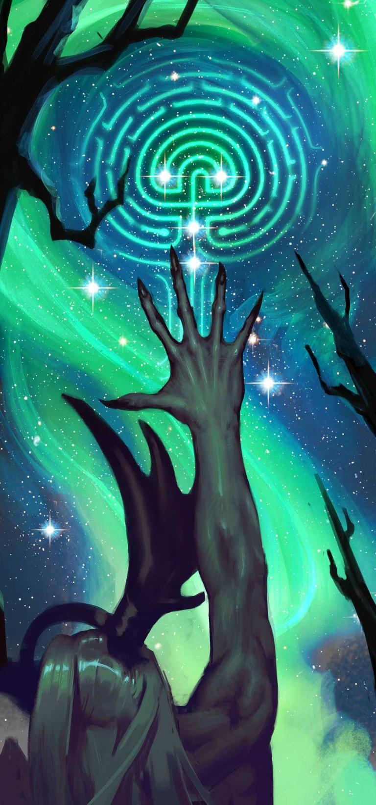
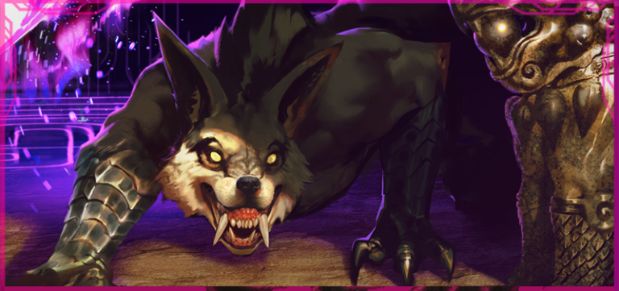
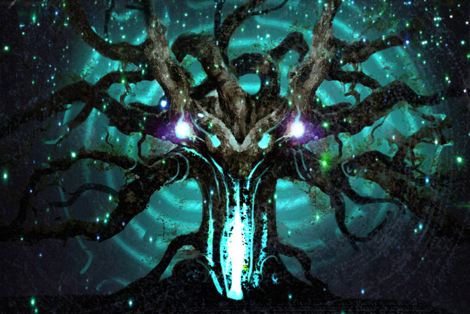
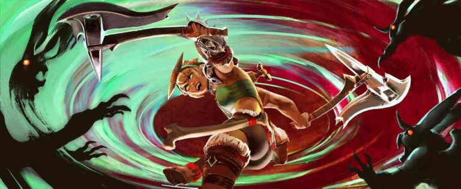
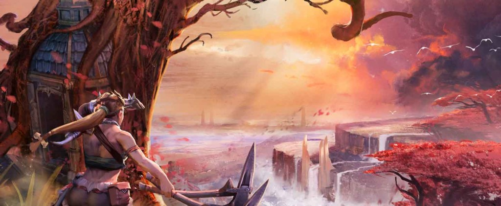
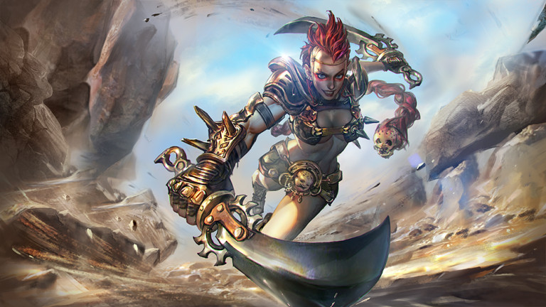
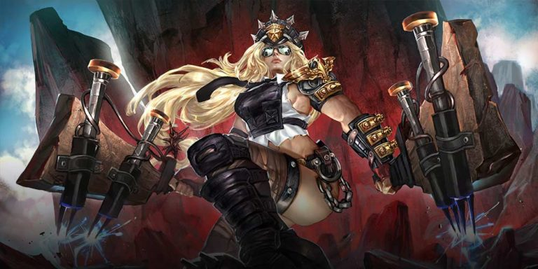
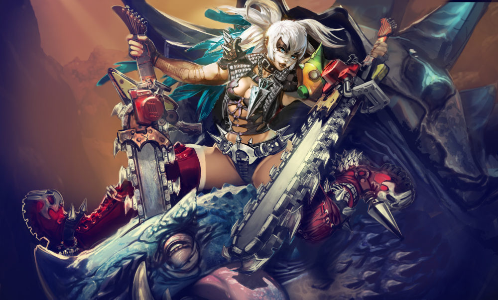
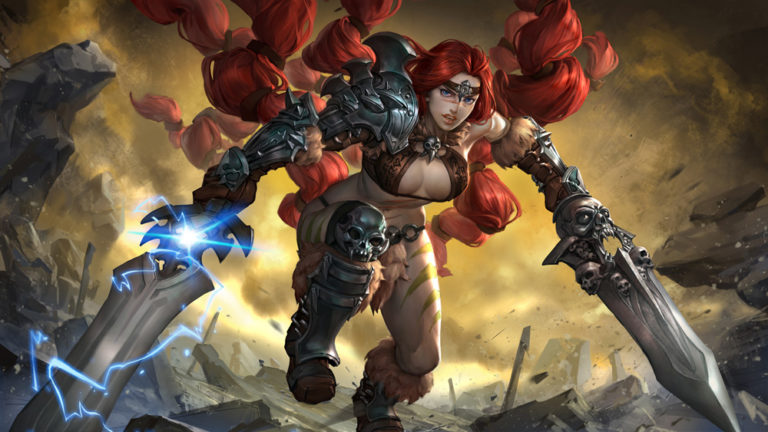

# Rona Lore

## 'A STORY FOR EVERYTHING'

The berserker dropped to the ground between the fire and the old druid, axes clinking at her belt, a caribou hock in one fist. Behind them, the others daubed the wattled longhouse walls with dung and straw where freezing wind whistled through.

“It’s explanation time, old man,” she demanded. She took a big bite of the meat, leaving strips dangling, and pointed the hock at the druid. “That’s the fifth earth tremor in an hour. It’s knocking holes out of the walls now. I know you have some old story for every little thing that happens.”

“There is a _truth_ for everything,” he corrected in a low drone. “Beneath us slumbers Gudmund, the giant elder, son of Gunnr the Great Oak, and brother of Gymir, his bitter rival.” His fingers danced like punctuation in the firelight. “The brothers’ war grew so violent that nothing could live among the ruins of their hatred, so Gunnr sang a song to make them dream, then buried them deep underground, one in each hemisphere of the world. Gudmund was banished to the northern half, and Gymir was banished to the south…”

“Wait. Gymir was the father?”

“Gymir is the brother of Gudmund and the son of Gunnr,” groaned the old druid. “Pay attention.”

_“I am.”_

“Gunnr transformed herself into the Great Oak that spears through the world, its branches growing on either side, its roots holding her sons captive. Where their breath seeps through to the surface, there are life-giving wells from which can be drawn great power.”

“I will find one of those!” the berserker announced, her mouth full. “The west people wouldn’t hunt at our borders if we had ancient power-breath.”

“The nearest well is at the center of a temple, guarded by the enormous Fortress, so that humankind will not kill itself with the power therein.”

The berserker gnawed at the meat, her brain clicking through calculations. “I could scale a fortress,” she mumbled.

The old druid chuckled. “Do not wander away with your mind. You must learn this story well, for it is you who will tell it after I’ve gone.”

The berserker snapped up her eyes to the old druid. “Where do you think you’re going?”

There was a long silence, during which the berserker did not breathe, until it was apparent that the old druid had nodded off into sleep. The berserker poked him in the shoulder; the old druid snorted and resumed: “Gudmund the Elder stirs. His breath comes stronger through the well. The ice has melted, and it is this elder’s breath that shakes the earth. I must go to the other side of the world to see to the wells of Gymir the Elder.”

“You? You cannot wander to the other half of the world. You are eight hundred years old.”

The old druid croaked, his version of a laugh. “I am not quite so helpless as you think. Not all battles are won with steel.”

“If this Gudmund man is causing the quakes with his bad dreams, I shall put him permanently to sleep. I will go down the well and bury my axe in his eye. I will fish him up by the nostrils and punish him before the people, at the Thing.” The berserker rose, holding up one axe, her voice rising. “I am not afraid of any man who can be held captive by a silly tree!”

The old druid rose with a groan and creak of joints, then patted her back. “It is difficult to see clearly through a blood-soaked helmet. No, this battle is not yours, nor mine. This is a terror from which we must run. You will lead our people as far from the well as you can, and I will pass through the womb of the Great Oak. I will not be alone.”

“Then who will…”

The earth shook again, stronger than before, rolling logs away from the fire. The berserker muttered to herself as she kicked them back into place with one boot heel. When she turned back, the old druid had already shuffled out of the longhouse.

In the distance, the howls of wolves sounded through the frozen air.

## 'THE DESTRUCTION OF THE TEMPLE'

A dire wolf raced out of the temple’s fourth circle, tongue lolled out to one side, panting, exhausted terror in his eyes, his thick fur matted with dried blood. His back legs were caked up to the stifles in red loamy mud; he’d kicked free in time to get bit in the muzzle by something venomous. He skidded to a stop where mud met ice, into the forelegs of the alpha, his eyes down, unsure whether to be more frightened of what he’d run from or what he’d run into. The ground rumbled, the ice cracking outward in long lines. The alpha’s hackles rose, ears twitching at the sound of his pack howling, whining and yipping in pain. He could name every one of those sounds: son, daughter, mate, packmate, friend.

After the first quake, the alpha had inspected the inner circles of the ancient temple, his nails tapping on the ice, his breath fogging in the frozen air. A foreign scent bothered at his nose. The tremors intensified, the scent grew stronger and the pack’s restless whines and tail-chasing had to be contained with barked orders. Within hours, the ice in the first circle melted into pools of water that the ground drank up with greedy thirst. The second and third circles, once ice and brick, became mud. The scent choked every inhale, and the constant shaking set the wolves to howling.

Then, the vines appeared.

They were like nothing the wolves had seen. They whipped out from the mud, piercing blind in all directions. They wrapped around the temple pillars, crumbling them to gravel. The pack tore them apart, but within minutes the thick stems grew anew. The well itself, once richly decorated with sculpture and carvings, became nothing but a dark hole in the ground leaking putrid air. The inner sanctums turned to rubble.

Eggs frozen for untold millennia bubbled up from the mud and broke open, spilling out long-toothed reptiles. The wolves went to battle, ears flat, snarling, leaping in fast and retreating in the way of the hunt until the blood of their prey dribbled out in thick clots that fed the carnivorous mud. But the creatures could not be contained – and the surviving reptile hatchlings grew larger than the wolves. Everything birthed in the fertile mud was bloodthirsty and more dangerous than anything the wolves had hunted before. The mud itself was an enemy, drinking the wolves into itself, forcing them farther and farther back from the well.

They might have fought back the horde if not for the insects. Clouds of bloodsucking mosquitoes and hives of venomous wasps burst upward. Crimson ants burrowed into the wolves’ fur and chomped into their belles. The pack snapped their teeth into the stinging swarms to no avail, bit into their own itchy hindquarters, limped on poisoned limbs.

The guarding of the Halcyon Well had been the alpha’s vocation since the temple had been built, from materials found nowhere near the frozen tundra, by a people whose lineage had died out before their story could be told. It was unthinkable to abandon it. Yet without a pack, an alpha commands nothing.

“Get the others out,” he snarled at the beaten-down wolf, who turned without protest and ran again into the doom. The alpha turned snout to the moon.

“Old friend,” he growled into the empty air, “I have need of you.”

Then, Fortress let loose a wild howl that carried for miles.

## 'THE GREAT OAK'

The old druid cut a formidable figure, antlers bursting from his headdress, ceremonial furs draping from shoulders to boots. Before him stood the enormous tree, her branches concealing the soupy-gray sky for one-hundred steps, her trunk so wide around that it took 10 men gripping hands to encircle it, the face of the Mother carved into it at eye-level with the druid.

“My pack has pulled your old bones on the sled through snowdrift these many days,” grumbled Fortress. “Why have you not yet opened the door in the tree? Have you forgotten how?”

“Patience, old dog. She is perplexing and must be appeased.”

“It has been far too many seasons since you appeased any woman,” growled Fortress.

The druid’s face wrinkled into a smile. “There is a saying among the people. The maiden requires a strong gaze, but the mother, a hungry stomach.” He dug through the snow at the base of the tree, producing a handful of green acorns. He rapped the shells off with his staff, then gnawed at the bitter nut meat. “Let us see what nourishment the Mother has for us,” he said, feeding one also to Fortress.

They waited in silence, side by side. Although he expected it, the ensuing stomach cramps bent the druid double. he leaned against the tree trunk, his head swimming. His vision blurred. The world darkened and peeled away. Fortress, too, fought the sick that threatened to overtake him. Sensation drained from him like water drops from an icicle until his spirit floated above, watching.

“Why has a child come so far from his home?”

The voice came from the tree. The druid looked for the Mother’s face and found it far above him, her stern eyes looking down.

“I have come to beg passage to the other side of the world, Mother,” he said, and his voice was high and breaking. He looked absurd in his ceremonial furs, which had grown to tent him. His beard vanished. Even the stag horns on his headdress shortened until they were the nubs of a fawn. Where the formidable druid had stood, Fortress saw a boy.

Branches stretched out from the trunk to touch the boy’s face. “It has been so long since I held a son,” crooned the voice within the tree. “Your companions may pass, but you will stay with me.”

“No!” Fortress tried to lunge forward but felt as if he were moving through mud.

The boy held out his arms to embrace the dire wolf, burying his face in Fortress’ furry neck, petting his nose and ears. “Go on, old dog. This is the only way.” Then, his body collapsed into the embrace of the branches.

A wolf whined, then another. Fortress backed away from his old friend. “Call out to the spirit of our fallen packmate,” he commanded, then craned his neck to the moon and let loose a mournful howl. The others followed, one after another wolf song ringing out as the Mother hugged the druid, wrapping her branches round and around him until he was pinned against the trunk.

The pack watched as the face of the Mother turned into a wide hollow. A thick, humid scent leaked from it, steaming the freezing air. Fortress moved closer, tentative, sniffing. Inside, a wooden staircase spiraled down into the dark.

## 'RONA VS. SKVADER'

Rona wriggled her nose to dislodge frozen boogers as she hiked along the wolf-drawn sled tracks, catching up to the old druid. Days behind her was her village, her hunting ground and her people, who had abandoned their homes to escape the Churn. Her mother and father had expected her to follow, but she’d never see them again.

She had never disobeyed a direct order from the druid before. His kind had civilized the tundra generations before Rona’s people arrived. They kept the secrets of mathematics and letters and stars. If the old druid had told Rona to jump to the sun, she’d have died leaping. But this, she could not abide.

She was crouched down, checking the freshness of the tracks, when the horned skvader attacked.

The white-furred monsters flew up from the snowdrifts, at least a score of them, wings spread, horns spiraling up between long ears, eye level with Rona’s knee.

Rona cursed, dropped her pack, unleashed the axes from her belt with practiced thumb flicks. “Always skvader,” she groaned, eyes flicking from opponent to opponent as they circled her, shrill squeaking sounding from between their mean, nasty, pointed teeth. “…or bears…” The frenzy of battle built up a drumming beat within her ribs. Her left axe swung out, sliced a jagged opening in one of the demon hares’ throats. The beast fell with a bubbling sound in time for two more to jump up. “…or reindeer or stink oxen.” Her arms crossed. The axe blades clashed together and sparked as she let loose a barbaric yawp; the noise scattered the skvader, but they rounded back on their long thumpers, running horn first straight at her goodies. One sailed up to her jugular and lost its head for its trouble. Another dug its front claws into her belly; she whirled, spinning up snow, shook it loose and opened up a hole for the creature’s guts to spill out.

“Same beasts all the time,” she griped as the others came at her. “And the old man thinks he’s going to the other side of the world without me?” Front, back, side, she whirled, axes slashing, spinning, her vision washed red with her fury. The skvader jumped and flanked, shrieking out their madness; Rona shrugged off her cloak and her skin steamed in the freeze.

“He thinks I’ll run from danger!” she cried. “Hide with the children!” She carved the snow back with her rear foot, shifted her weight low, swung wide with her left axe, hooking up three hares by their horns on the blade. “I never run!” she roared, and jumped into the center of the herd, spinning, axes flying, flinging away hooked skvader, dropping dead hares one after another with soft _foomph_ sounds into snowdrifts.

_“Never!”_

She whirled, hacking and slashing in wide arcs through the air, twisting too sharp at last so that she fell onto her butt in the midst of what had once been a herd of enraged skvader. Her breaths came fast and foggy; snow sizzled on her overheated skin. It took a good minute to realize the danger was over.

Groaning, she sheathed the axes and reviewed the damage. She’d taken a few scrapes. Some claw marks on her belly. New scars to join the old, and nothing needing stitches, so she drew on her cloak and pack and went about collecting bunny carcasses for the night’s dinner. Never a bad idea to bring a fresh, bloody present to a pack of wolves.

The tracks and spoor were fresh; she’d overtake the old druid within the hour.

## 'NORTH IS ALWAYS FORWARD'

Rona sniffed the air, searched the empty sled, dug into the fresh tracks, then peered into the tangles of The Great Oak. Buried in the winding branches, she caught the old druid’s eye.

She startled and skidded backward. Without the vision of the poisoned acorns, the druid appeared old as he’d been, but his eyes and complexion were empty and mealy gray.

“Oh, no.” Realization smacked into her. “No, no.” She dropped her pack and drew out her axes, War Screech and Whistle. She chopped at a branch that held the druid’s throat fast, then another, splitting through branch after branch while her eyes welled up. “No!” But green shoots burst out and turned into new hard branches that wrapped the old druid up all the tighter. “Stupid tree!” she shouted, tears freezing into icicles on her cheeks.

Rona glared at the tree, wiped her nose on her cloak and huffed out a resolute breath. “Welp,” she said to no one, “north is always forward.” She hooked her axes back on her belt and stuck her head into a gaping hollow in the tree. The spiraling dark yawned up.

“Hallo?” she called, and her greeting echoed back. There was nothing left to do but climb inside.

Down and down and down she went into the enveloping black, slipping on moss and jutting roots, butt-bumping down. Down into the heat, so that she threw away her cloak. Down into the thin air that made her drowsy, though she napped only a nightmarish hour at a time, stairs jutting into her sides and knees, before continuing down and down and down, until, somehow, she found she was going up. As bad as down had been, up was worse. She sweated and grumbled and drank the last of her waterskin. Up and up and up, she counted the steps to keep her mind on something.

Just before she would have gone mad, she saw a thin light high above. With a last great effort, she climbed toward it. The light came from another hollow, and she tumbled out of it into the other half of the world.

The jungle air felt like drowning to breathe. The sunlight was orange instead of the white-gray she had always known; the trees burst with colorful leaves and flowers. She climbed a set of stone steps, axes at the ready, her tongue sticking to the dry roof of her mouth, past crumbling stone statues and ancient architecture no longer loved. Echoing from somewhere unseen, a merchant called out his wares. At the top of the stairs, the stone path widened into a courtyard. In the middle, a great crystal hung suspended in the air over a glowing well. Her mouth opened and closed like a fish; she was so stunned that she almost missed the wolf pack that surrounded the well.

The alpha was almost as tall on all fours as she on two. She gripped her axes, glaring, but the alpha’s hackles didn’t rise. “Ah, good,” growled the alpha. “The druid hoped you would follow.”

War Screech and Whistle dropped loose in her fingers. “And who are you?”

“I am Fortress,” he replied.

“You are the fortress?”

“And you are Rona the Berserker.”

“I am,” she said, and as if he had reminded her of herself, she squared her shoulders.

“Then come with me,” said Fortress. “There is fighting to be done.”

## ALTERNATE FATES

### 'FURY' RONA

#### 'MAAAAAAGIE'

“Maggie! Maaaaggie!”

Rona picked through the junkheap of wormy old furniture and ripped up tires one careful step at a time. Infection was a concern, what with all the scrap metal that had been gobbled up and retched out rusted by mutants during the churn times. “I know you’re here, Maggie,” she crooned, plucking up a wrinkled old comic book that had been through a gullet. Pictures were nice, but nobody knew the words anymore. She flicked the book away and toed open an upended wooden cabinet. “Maggie!” she called into it, “you in there?” but only a few brown blattamites scuttled away from the light.

She moved on, plucking stuff up for keeps. Railroad spikes were always useful but this heap was near to the old Churnguard Industries, so sometimes you could find a Halcyon core with a drop of juice still in it, or pre-war M.A.C. parts, or tools. Tools you could trade for infused crystal, there being no way to make them. “Mags,” she called again, this time sweet. She climbed up on a rat rod rolled on its side and laid flat to squint into the dark driver’s seat. “Maggie? Heeeere Maggie-Maggie-Maggie.” Reaching into the dark, feeling around for the gear shift, she grabbed something prickly and pulled it into the light. It was a pretty-faced dolly, just the head now, the body lost to history, the hair shorn nearly off. She’d never owned such a splendid thing.

“Well!” she giggled, “what a lovely day this is.”

“BAAAH!” came the war scream from inside the rat rod. The door opposite opened downward into the tunnels under the junkheap, and a big gun barrel poked up into her face.

Rona jumped to her feet, heavy boots slamming dents into the body of the rat rod, and clipped the dolly head to her belt. Out came her machetes, one for each fist. She banged them onto the metal, making sparks and noise. “Come out Magpie! Don’t you want to fight? Do I have to call you ugly?”

The first shell exploded out of the barrel in a white heat that passed an inch from her eyes and left her ears ringing.

“Ugly, then! Let me see your ugly piggy face, Maggie!” She turned up her nose and oink-oink-oinked, laughing as she hopped off the rat rod and scrambled up a junk pile for a higher vantage point. The gun barrel rose and rose and then there was a hairy hand holding the grip, then a greasy bit of muscle, then the flat-nosed face of The Magpie, boss of the Churnguard Junkheap.

### 'PEACEKEEPER' RONA

#### 'A NEW SHERIFF IN TOWN'

“Gimme some love, Maggie” whispered Rona through tight-grit teeth, eyes narrowed at the wide grub-face staring her down from the smashed-out rat rod window. It was the Heap Boss himself, dressed in his trademark law uniform, badge shining on his lapel, fat gun propped in his meaty fists and Rona’s scary toothful grin reflected in his aviators. Under her right foot, a melted tire wiggled; she hunkered down, every muscle in her legs taut. Magpie’s beefy finger squeezed the trigger. She stared at his hairy bicep inflating past the torn confines of his starchy dress blues ’til the trigger clicked. Rona jumped over the blast, belly front, the shell leaving a burning kiss on her left thigh. She landed with a slam on the roof of the rat rod, machetes piercing straight down through rust, upholstery, skin and skull.

Magpie’s people poked up their makeshift helmets from the rubble, rifles nestled in shoulders, rocks in slingshots, hard grips on knives while their boss burbled out his last. No sounds but birds chirping while Rona pulled the machetes back up with a metal-on-metal _squeeeeeeeeeee_. Standing straight, grinning that scary toothful way, brains dribbling off her blades to splat on her boots, she surveyed the Churnguard Junkheap.

“Hallo popinjays,” she sang out. What had been Magpie’s lackeys looked at one another, then back at her. They had a good lock on her, could’ve got her down in a half-breath, but Rona screamed, “Maggie’s found his final slumber-place at the busy end of my machetes. Rules are rules. You’re my psycho-fants now!” She grabbed the badge from Magpie’s lapel and showed it around. “Your daddy was happy hoarding rubbish, but I’m gonna pretty this club up! There’s gonna be inculcations! There’s gonna be organizations! There’s gonna be spankings! We’re not gonna be satisfied with the Junkheap. We’re gonna take over Churnguard Industries!” One machete swung out sideways, pointing far off to the barbed wire-surrounded ruins of the military complex. “Witness!”

“Boss Mom!” cried one of them as Magpie’s bulk crumpled and bled out the rat rod door. “Boss Mom!” cried another, and then a hundred voices yelled out for the new Heap Boss as they crowded in close, spiriting her down the tunnels to the Club.

### 'CHURNGUARD' RONA

#### 'FINDER'S KEEPERS'

“So what if the Bird Man has ownt it since forever?” sang Rona, way loud. The People crowded shoulder-to-shoulder, Cutters crouched by the chain-link fence chip-chopping away at it bottom-up, leaping back when they got buzzed. Beyond, Churnguard Industries was a shiny, chrome-shuttered fortress, the only thing that’d been fixed up after the Churn Times. “What’s our motto?”

“Finder’s keepers!” cried The People jammed up by the gate, holding whatever spiky-blasty-bangy-fireball weapons they’d created themselves in the Junkheap. Rat Rods idled at the fore, reinforced and decorated all over with spikes and scrap and superglued toys. Rona paced back and forth, a chainsaw in each hand. “Rumor is, the Bird Man has a buncha grunts to do his fighting for him. Boss Mom would never sit back and watch The People fight!” She yanked down both arms, hitching the triggers of the chainsaws; the ignitions lit and the rusty chains spun loud and the thick oily fuel fumes mixed up with the Rat Rod exhaust to wash over The People like a foul baptism.

“Finders keepers!” screamed Rona as the fences curled up to the coiled barbed wire above. She stomped her spiked boots through the nearest gate hole and ran into the yard, face contorted with joyful rage, tongue out. The Rat Rods bashed through the gate on either side of her.

A shell blasted through the windshield of one, blew it to smithereens.

One of the compound’s shiny garage doors was open. Square in the middle was a big grunt of a guy, all camo and muscle, wearing a pre-Churn soldier uniform and mask, big enough to hold a squad automatic weapon loaded with explosive shells on his shoulder.

_BLAM!_ The weapon fired off again, took out another Rod. The grunt took the massive kickback with a little bend of the back knee. “Gotcher breakfast, love,” he crowed.

Rona sprinted, head-down-eyes-up, then jumped belly-first, smoking chainsaws making bright sparking arcs. She slammed full-body into the grunt, his gun held up under her arm. “Gotcher ego, darling,” she cooed in his ear. The gun coughed out its shells all worthless behind her. She kicked him down and sliced off his trigger arm.

Boss Mom wasn’t often given to quiet moments of contemplation but she paused over the downed grunt, staring at the metal and wire poking out of what should’ve been a mangled-up rotator cuff. Rona squatted way down, ripped off the grunt’s mask and squinted at the grunt’s blinking red and black eyes.

Another grunt, identical to the first, came out into the light. Another appeared, then another, all with big freaking guns on their shoulders, surrounding the Boss Mom with faces obscured behind uniform masks.

The People raced into position around the Rods that had made it through the shell bursts, clubs and guns and cannons and super-sharps aimed.

Rona wiggled her brows. “You robot boys have a new mama now!” she screeched, and behind her The People growled and cheered and spat loogies. “Finders keepers, popinjays!” screamed the Boss Mom, and she leaned back, spun like a nightmare ballerina, a joyful flurry of pain, the chainsaws held out wide, saw blades splitting the robots right down the middle. The grunts opened fire, blew each other apart across their circle.

“Boss Mom! Boss Mom!” chanted the front line as they jammed and stomped each other to get at the action, battering and slicing at grunt bot after grunt bot as they poured out from the Churnguard hangar. The air was an eardrum-ruining cacophony of bullet blasts and Rod engine revs and squad automatic weapon coughing, smoke stinging the eyeballs and torches lighting up spray paint in every murderous color of the rainbow until the grunts stopped coming.

Rona climbed the pile of half-metal, half-bloody bits that had been the Churnguard army and screamed at the sky. “Come out, Bird Man! This is _mine_ now! _I’m_ Churnguard Boss! I’m gonna sip tea from your skull and wear your pretty-pretty feathers in my hair!”

Another shiny chrome garage door opened, nice and slow, and The People cheered.

### 'RED' RONA

#### 'THE TEMPORARY VICTORY OF THE BERSERKER'

The berserker opened one eye and took to piecing together how she’d come to be in the mud, not dead, her legs twitching. Hitting the ground she remembered; the fighting part was always a red-misted blur, but somewhere in there she’d taken an axe in the shoulder. She remembered the _thunk_ sound, and her arm quitting, and pain.

But there was no pain now. A good thing, if temporary. She was still alive, another temporary good thing; her arm worked again too, and she still had both swords. She spat mud and slid up onto one twitchy knee, thumped her thigh with the flat of one fist. “Stoppit,” she mumbled at her jittery legs.

Wasn’t until then that she remembered the valkyrie.

Then it all came back: the bargain, the deafening crack from the sky, her spine bent backward, the scream she couldn’t release, the twitching.

The valkyrie stood nearby with a giant hammer in both hands, still and cold as winter. Waiting.

“Ready?” asked the valkyrie.

“Fair fight?” asked the berserker, finding her feet.

“Fair f –”

The berserker leaped, belly first, spine arched. Best thing, she’d always said, was hit first. She slammed into the ground a sword’s reach away from the valkyrie, her blades sunk downward, shaking the ground with death-shadow and lightning, landing ducked down so that that the warhammer whizzed just over her skull. Would’ve been a bad end, that, her head several paces from the rest of her, but the berserker wasn’t one to dwell.

She waited until the warhammer swept low, then flipped, spinning mid-air, landing with her death-sword vibrating deep inside a shield of light. She yanked the sword free, growled, and arced her light-sword upward, slicing through the shield and sending electric surges through the valkyrie’s breastplate.

The valkyrie returned with a low sweep of her warhammer that forced the berserker to jump. Behind her circling light shield, she mirrored the berserker’s lunges and ducked under her leaps, matching her one heavy hammer strike to every several sword sweeps. The world around the battling pair erupted in lightning cracks and swirling violet shadow, the ground fractured and spilling violent light beneath their boots.

Under the berserker’s tongue was the acrid taste of fear and hatred.She whirled and struck, faster, faster, striking an inch away from her ancient target and then clanging up against eternal shields, lightning twisting around lightning. The hammer circled and slammed against her leg, shattering one greave.

Her rage boiled, rose, steamed into an eye-stinging sweat, released in a scream. The valkyrie paused, hammer forward in defense. The other valkyries leaned forward on their mounts, imagining this insane beast of a woman battling on their glade. They saw, in that moment, their foes vanquished, their enemies trembling.

But it was not the fate of Rona the Berserker that day to retreat to the Nether on the mount of Grace the Valkyrie, for her swords slashed and sliced too fast for the eye to follow, and the light shields shattered, and the hammer splintered, and it was all the valkyrie could manage to keep her limbs attached to her body under the berserker’s manic rage. When the red mist had subsided, the two women stopped, breathing hard, staring one another down. An electrocuted crow fell to the ground between them and croaked its last.

“I surrender,” said Grace the Valkyrie without shame. “Stay among the living with my blessing, Berserker, and hone your skills, for one day you will feast and fight among your foremothers in the glade.”

“Not a minute before I want to,” huffed the berserker. She watched as the valkyries retreated from the battlefield, and only lowered her swords when the last of them had disappeared over the hedge into the Netherworld.

