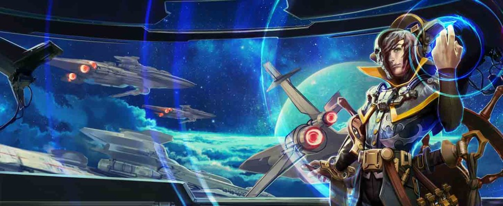
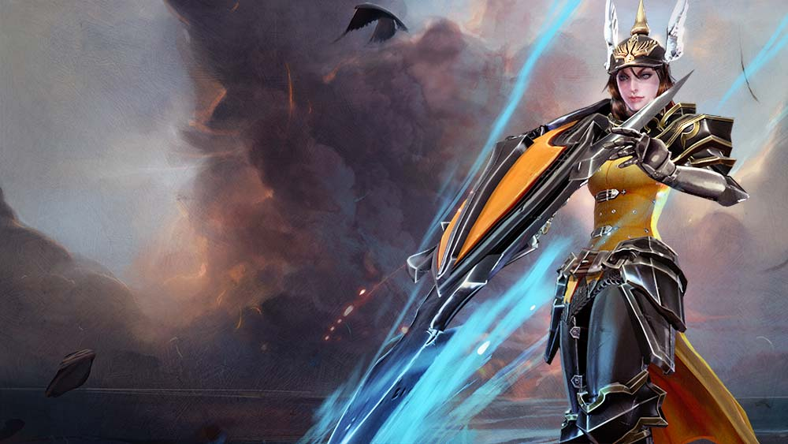
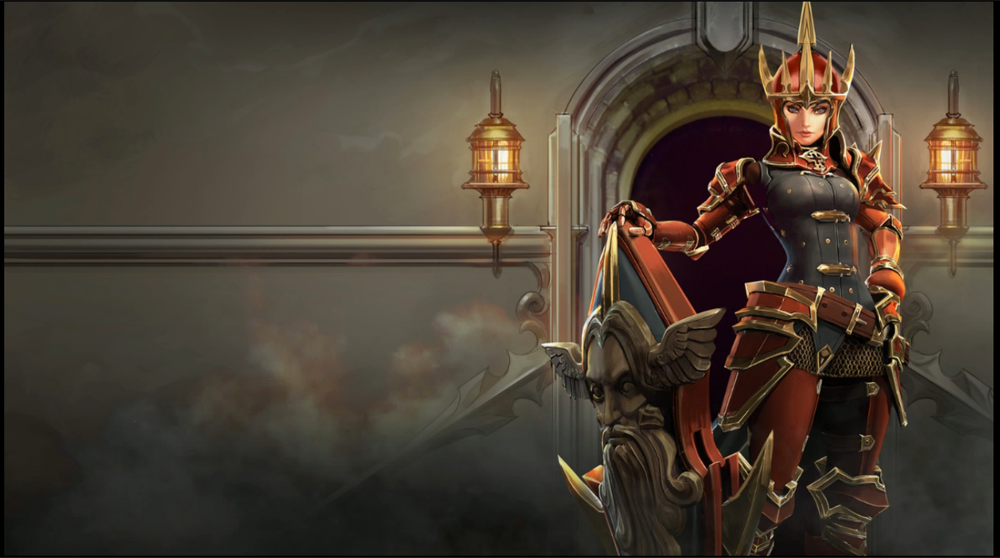
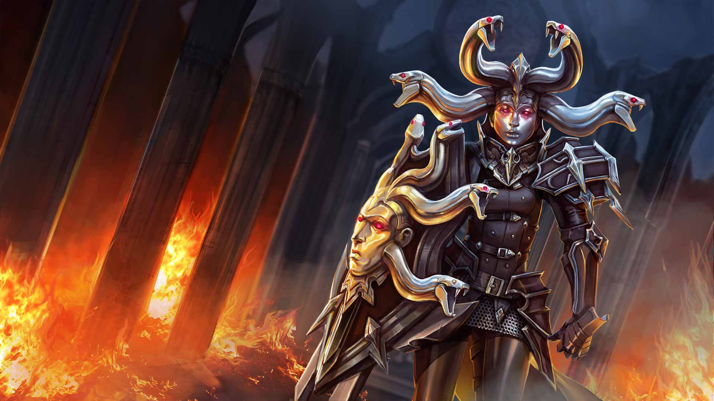
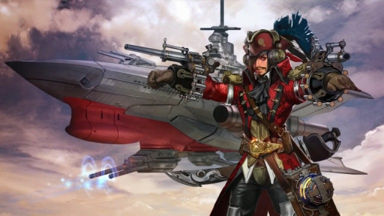

# The Rise Of The Star Queen Saga

## 'THE STAR QUEEN'S NAVY'

A sprite named Loo stole Vox while the others slept. Celeste, being the girl, was the only one with any privacy; Vox was stuffed in a barracks with the Gythians and his snoring father. Ultimately it was a case of mistaken identity, for the sprite was nearsighted and panicky on account of The Audacity’s captain was missing. So she sped in through the high window and tugged at Vox’s nose with both her tiny hands and shouted her squeaks into his ear, which was half her size. “Captain, Captain! There’s a fight about!”

Vox swatted her away in his sleep as if she were a giant mosquito, which enraged her, so she yanked up his eyelid with a fistful of his lashes and poked his eyeball. Of course then she had to pinch his lips shut so he wouldn’t wake the others in the room with his howls, and when he resisted jumping out of the high window with her, she sneezed sprite dust on him to make him float and towed him along after her like a big ship after a tugboat.

And that is how Vox became the captain of the great airship The Audacity, for its original captain never returned from wherever he had gotten to.

Since it had not been the first time that Vox’s life had gone topsily-turvily, he took on his new duties with grace. He fought the Battle of the Sky Captains, which of course you know all about, and emerged victorious. Two fleets of enemy airships became his rightful property, and their crews pledged their fealty to him. He installed speakers and amplifiers on the decks and used sound to defeat his adversaries and throw grand parties.

Life was so fun in the world of flying corsairs and pixie dust that Vox forgot to miss his family for a long time, but one night, Loo demanded a bedtime story. Vox told her the tale of Celeste and her own very important adventure, and the telling made him ache.

The next morning, The Audacity soared over the Halcyon Fold and hovered over Celeste’s little party of rebels. Vox straddled the gangplank and grinned like a rogue as the fleet he’d won sank through the clouds, a hundred airships at least, from schooners to coracles, all flying Celeste’s flag. “I’ve brought you a navy!” he sang out. And the rebellion began.

## 'THE GLASS CHAMBER’

White-uniformed guards melted into shadows without so much as a cry to halt as Ardan stomped toward the queen’s chambers. The door gave way to his armored kick too easily; it hadn’t been bolted.

“I am glad you have come.”

The Storm Queen stood at the far end of the stark white room, a raven perched on her shoulder, drawing a fingertip along a glass case. The room, unlike the rest of her palace, was freezing cold; Ardan’s breath fogged as he took a heavy, cautious step forward. “Because you want to die?”

“I want what you want.” The Storm Queen stepped aside in a swirl of obsidian robes, turning her scarred, sightless face toward Ardan, revealing the glass chamber in which the body of Julia laid. “Revenge.”

The raven’s eyes twitched as Ardan’s power fist dropped. He crossed the distance and glared through the glass into his wife’s frozen face. The fingers of his bare hand spread over the glass.

“I did not give the order. Catherine acted on her own,” the queen whispered. “Join me. Punish the deserter who murdered my sister.”

## 'MERCY IS GRANTED’

One at a time they knelt before the queen, each wearing a pure white subarmalis, and swore their fealty. The queen named the new knight as she tapped the flat of the ceremonial sword blade on each of the knight’s shoulders, the golden armor and weapons bearing the insignia of the queen were presented to the knight, the crowd cheered and the ceremony repeated.

As the last knight basked in the applause, her squire trailing behind with arms full of heavy plate armor, the door opened. Sunlight poured in, so that the cloaked and hooded figure in the doorway stood in shadow. The room went silent as the figure stepped down the aisle, past the knight and her squire, past the audience with their finery, to the dais where the queen stood, dressed and veiled in black, sword in hand, Vyn perched on her shoulder.

The hooded figure dropped to the floor, palms down, head bowed as if for execution.

“I swear fealty to the queen,” vowed the penitent figure. “I swear to honor and defend my queen against all enemies. I will enshrine in my heart my love of my queen. I will dedicate my life to the greater glory of her crown.”

Whispers sounded in the crowd. The new knights gripped their weapons, eyeing one another. But the queen neither moved nor spoke. Only Vyn turned his head to cock an eye at the figure on the floor.

The voice of the hooded figure broke. “I beg the mercy of the queen.”

All held their breath in the following silence. But then, from the windows and skylights above, from the open door, from behind the dais, ravens flew into the room. One, then another, then more, perched upon the figure on the ground, digging their talons into the cloak, then spread their wings and lifted it away, revealing Catherine on her knees, wearing the white subarmalis.

Gasps of rage sounded from the crowd. Such impudence! Swords and daggers sang, released from their scabbards. The subordinate traitor!

But the queen silenced them with a wave of her hand. She bent, taking Catherine’s chin in her palm. “You broke the law,” she said.

Catherine dropped her eyes, unable to meet Vyn’s glare. “My queen, you are the law.”

The queen lifted her veil, revealing her scars and her wicked smile. “So I am,” she said, then slapped Catherine’s right cheek with the back of her hand. “Mercy is granted,” she said, and kissed Catherine’s left cheek even as the right bloomed red. “Rise, Lady Catherine, and receive the shield and armor of your knighthood.”

Chaos erupted in the crowd as a squire approached with a golden shield bearing the insignia of the Storm Queen. Catherine turned to face the audience with her signature dispassionate gaze, and the queen’s hand closed on her shoulder, her mouth close to her ear. “I forgive you,” she whispered, “but you will never again leave my side.”

## ‘THE KEY’

The Stormlords held high office and presided over proceedings at court; they made laws and bickered with one another over the Storm Queen’s small favors, and they were discarded at the first sign of dissent or disloyalty. Only one Stormlord differed from the others. Rather than wear the lavish robes and jewels indicative of the Stormlords, Ardan wore power armor. He refused the offered apartment in the queen’s palace and instead kept a constant vigil outside of the queen’s chamber. For his devotion he was given some magic to keep him always awake, and the queen strung the key to her door around his neck with a silver chain. After that, he was called The Key, and the court forgot that he had been called anything else.

He had been a normal man, some whispered, a soldier, a father even. The magic twisted his mind, some said. Aged him from the core outward. There was gossip that the battery connected to his breastplate jolted power into his heart to keep him alive. He spoke to no one and cared for nothing, but they said he had once been capable of humanity. Capable of love. Handsome, the Queen’s Shield once said, her knuckles grazing his withered cheek. He knocked her to the ground for it and had to be restrained. His gray mouth opened to scream, but the effort produced only gasps and choking. That night he was fitted with a helmet to force breath into his decaying lungs, so if he despised the queen for forgiving the woman who had killed his wife, his expression gave away nothing. From that day until the end, the Queen’s Shield allowed him a wide berth.

For love he remained, for the few moments the queen granted him with Julia, frozen as he’d known her behind glass. It was Julia, and not the queen, whom he guarded without slumber. For those brief moments, The Key kept his grim vigil in silence.

## 'THE PACIFICATION OF LIONNE’

“I’ve always loved Lionne. I wintered here as a child. My sister and I used to sled down that hill when it snowed.”

Catherine led the Storm Queen past the grand park toward the city’s main square, her crimson plate armor reflecting blood red on the cobbled promenade. It was a lovely city — or it had been, before the uprising. Small family shops stood dark and empty at midday. Glass shards littered the street. Ash from burning homes dusted every surface. Ravens circled overhead or picked at the bodies strewn everywhere. The gray sky crackled with magic. In the distance were the enraged and pained shouts of battle.

“I will see this city’s beauty restored, once it is pacified,” said the queen.

“Pacified?”

The queen turned toward Catherine’s voice. “Would you use a different word?”

Catherine gripped her shield tighter. “Destroyed,” she said. “Burned, leveled, annihilated.”

“Pacification is a prettier word. The new governors will call it so.”

“And the old governors will be removed. Lionne’s ships will become royal ships, their trade royal trade. Heavily taxed, of course.”

“And why not?” mused the queen. The screams from the city square, the last vestiges of the rebellion, became louder as they approached. The queen enjoyed being present at the finales of revolutions. “Once the army surrenders, there will be peace here as long as I live. It is a tax well deserved.”

They came upon the edge of the town square. Catherine moved in front of the queen, whose scarred face showed no anxiety. The townspeople closed in around them. The queen’s archers sniped anything in a Lionne army uniform from the tall buildings; most of the rebels left were shaking citizens gripping farm tools and rusted swords. Only their insults held an edge, so the shouts followed the queen and her first knight as they walked, serene as if on a morning stroll, to the center of the square.

“People of Lionne!” called Catherine. “Lay down your arms and be at peace. Long live the Storm Queen!”

The shouting intensified. A tomato splatted against Catherine’s shield. The queen sighed as the crowd moved closer, pointing their pitchforks and kitchen scissors. “A man’s last breath is ever his most insistent.”

Catherine inhaled, her eyes closed, and called the thunder. Felt it pushing through her limbs, pressing against the tips of her fingers, imbuing her shield until it shook. Then she opened her eyes and slammed her shield into the ground.

The tremor pulsed through the street; cobbles broke apart and rolled under the unsure feet of the rebels who fell, frozen, their terrified eyes looking toward the paragon of the queen’s personal guard. The screams silenced, frozen in the throats of the crowd.

In the quiet that followed the thunderous blast, the\_kraa, kraa, kraa\_of the ravens echoed off of the ruins.

“Long live the Storm Queen,” Catherine said again, this time without raising her voice.

A woman’s voice from the crowd sounded out. She stood, shaking, holding a child in her arms. “Long live the Storm Queen!”

More followed, led by the mothers who would prefer taxes and peace to dissent and death, until even the proud farmers sang along.

“Long live the Storm Queen!”

The queen bowed her head in a political show of humility, but her smile was wry. The archers picked off the last of the Lionne army.

_While the queen slept, her first knight transcribed a coded message from Gythia by candlelight. “The successor gathers allies. Rebellion comes to Mont Lille.” Catherine fed the letter to the candle, her eyes unreadable. A revolution to be crushed … or supported._

## 'NO MORE FEAR!

_A holographic image burst out of the top of a small gift box that sat before the rebel future queen and her Gythian advisor. There was no sound, only the image of a battle. There sat the Storm Queen atop her horse; beyond was the queen’s army and her Stormguard flooding a green farmland with the blood of the locals, whose cavalry fell under the magical onslaught. The last image was that of Catherine, her war mask disguising her features._

_“The queen’s army is in Neruda,” whispered the Gythian._

_“They are a week’s ride from Mont Lille,” said the rebel queen. “Now is our chance to attack.”_

“Tell me we didn’t throw this party for nothing,” said Vox, tapping his foot.

Celeste leaned over the spar deck of_The Audacity_, peering down through Vox’s brass telescope at the Storm Queen’s uniformed soldiers positioned behind the fortified gate of Mont Lille. Celeste’s airship navy hovered in formation around them. Her hodgepodge army, made up of the unified fighting people of a half dozen of the Storm Queen’s occupied cities, waited on the road outside the gate.

A handful of Gythians, heavy in their polished armor, blades sharpened, eyes grim, made a half-circle behind Celeste. “It is time, your highness. You must give the command to fire,” said the war mage in his grand, old world accent.

“Look at the front lines,” she said, handing the telescope to Vox.

He held it to his eye and adjusted the focus. His shoulders slumped. “Kids,” he said.

“The Storm Queen’s child army.”

The Gythian struggled to control his tone. “You knew that the Storm Queen takes children at young ages to be trained for war.”

“That was to be our fate,” said Celeste. “I did not know she would go so far as to put them in the front lines of battle.”

“The queen is a pragmatist. She thinks you will not attack children.”

“That’s messed up,” said Vox.

“She is right,” murmured Celeste.

“We have come too far to turn back,” pleaded the war mage. “This plan has been in place since you were born. If you do not take Mont Lille while the queen is away…”

“I am the queen. Mont Lille is my city. These are my people. Shall I begin my reign by killing my own soldiers? By incinerating children? Does Gythia’s stake in this plan fall away at sunrise?” Celeste held the Gythian’s gaze until he backed away, then took the telescope back and squinted through it. “Vox? How loud can you make my voice?”

Vox laughed. “You wanna know if I can make noise?” He made a microphone with his fist and held it in front of her mouth.

Celeste’s mouth opened, then closed. She pushed down Vox’s hand and whispered, “Do good queens know the right thing to say?”

Vox grinned and put his hands back. “Good queens tell the truth.”

She looked over the mountainside city, every twinkling light representing a soul frightened by the enemy at its gate. The Storm Queen’s army buzzed and sparked with magic.

“My loving people!” she cried, and her voice carried over the gate, over the ground troops and the airships, over the city where her mother was born. “To fill the coffers of a dictator, you have engaged in a generation of war. You have sacrificed your liberty. You have surrendered your children to die in battle. I challenge you tonight to end this oppression. I have come to Mont Lille not to conquer, but to live and die as the rightful descendent to the throne, the Star Queen. My honor and my blood belongs to this land and to you all. I am here to fight, not against you, but alongside you against fear! No more fear!”

In the silence that followed, Vox draped an arm around his sister’s shoulder and they both stared down.

Then, there was a solitary shout from behind the gate. The voice of an adolescent boy.

“No more fear!”

“No more fear!” called another voice, and then another, and more, all of them the voices of child soldiers.

“No more fear!” The adults picked up the chant, and then the ragtag army on the ground with nothing in common but a hatred of the Storm Queen took it up, and then even Vox’s goblin crew burbled the words the best they could just to fit in. The handful of Gythians who had prepared for a bloody battle looked at one another, bewildered.

“The woman will overtake a capital city without a drop of blood spilled,” said the war mage, but the propellers picked up speed so that no one heard him. Vox steered\_The Audacity\_over the gate and landed in the city square, and the throngs surrounded the airship to welcome the Star Queen home.

## 'THE MIRRORED COURT'

The royal party traveled up the winding streets of Mont Lille, torches lighting their way. The going was slow; the crowds pressed into their new monarch, reaching to touch her hair and gown, chanting No more fear! and Liberté, égalité! At the summit of Mont Lille, past grottos and fountains and manicured topiary, they climbed a marble staircase to find the gem-encrusted gate of the Storm Queen’s palace wide open. There, Celeste bade her people to return home and remain vigilant, and the gate closed behind her.

Inside the heavy palace doors all was still; the rumors of révolution had spread through the mountain and those who supported the Storm Queen had made a swift exit along with all they could carry. Celeste, Vox, the Gythians and a ragtag assortment of pirates spilled into the Mirrored Court and stared.

“This was nothing more than a hunting lodge when I was here as a young man,” whispered Elizar the War Mage, turning in place to gape at the carved gilded windows, the black and white marble tile, the chandeliers blazing with hundreds of candles. Paintings portraying violent depictions of the Storm Queen’s triumphant battles spread over the ceiling. Bronze sculptures of faceless Stormguard posed throughout with their weapons. The mirrored walls jutted out at odd angles to give the disconcerting effect of hundreds of fractured reflections, giving the court its famous name.

“This is freaking me out,” said Vox, flinching as his echoed image leaped out and retreated in his periphery.

“It is meant to,” said Celeste, her staff clicking on the marble as she walked through the court. “She is the only one who does not see herself in her court.”

“Dignitaries, knights and nobles staring back at their own guilty eyes while the Storm Queen sits, pure in her blindness, upon the throne,” said Elizar.

Celeste stopped before the monolithic throne, carved from black stone, feeling all at once quite young. Its simplicity was stark in the ornate room; the only decoration on it was a high perch for the Queen’s ravens. “I don’t want to sit on that,” she said.

“Another shall be commissioned for you,” said Elizar, “but sit on one you shall.”

In contrast to the sobriety of the royal twins and the Gythians, Vox’s entourage amused themselves at the mirrors. Loo, the sprite, admired herself by all angles, brushing her hair with her fingers. The pirates pulled at their eyes and lips and giggled at the results. Behind the throne, one goblin argued with his reflection, thinking it a rival, and poked at his enemy’s eyes, activating a hidden switch in the wall that opened a cabinet. Vox investigated, yanking back the goblin by the fluff in its ear.

“Hey, Sis,” he called in his sing-song tone, “you should come look at this.”

Celeste joined him and her eyes grew wide, for displayed in the cabinet was a mage queen’s regalia: a star-shaped breastplate and gauntlets, a crown, and a staff capped with a crescent moon that bore the inscription: “Préserver la Paix.” Celeste ached from the magic pulling at her from the staff.

“Not the Storm Queen’s style, this,” muttered Elizar.

“No,” said Celeste, her fingers caressing the staff’s sharp tip. “This was made for me.”

Vox grabbed a gauntlet and inspected it. “She knew you were coming?”

“She couldn’t have known. We were cautious,” said the Gythian.

“She knew I would succeed her,” said Celeste.

“Under her tutelage,” said Elizar in a dry tone.

“Instead I am under yours,” replied Celeste with equal dryness. She took the staff in her fist and the crescent glowed, illuminating the old War Mage’s frown. “Let’s continue on. But I think …” Her eyes rose to the ceiling paintings. “… I think I shall have a skylight installed.”

## 'STAY WITH ME’

On the night of revolution, The Key stood on the Storm Queen’s balcony watching the crowd escort the royal party up the mountain. He had managed to keep the looters from the queen’s chamber, but he would not be able to stop a rebel party of soldiers and mages.

When the masses reached the palace gate, The Key returned to the queen’s chamber. Unlike the rest of the palace, it was plain, white and cold, like a hospital room. In the cryogenic coffin, his wife wore white too, a beaded and embroidered gown that made her look like a strange, perfect doll. He removed his helmet along with its breathing apparatus, yanked out the battery over his heart. He slammed his fist into the coffin’s lock, then again, again and again until the glass splintered and the coffin’s lid sprang open and the frozen air flooded out in a harsh blast that made him cough, gasp, and cough again.

Julia was lighter than he remembered, the way a leaf is lighter after it has fallen and dried. She rested in his arms as she had so many nights, her face in his neck.

He spent the next hours dying, his feeble breaths fogging. He thought he should say something more. Remind her about how they’d met, or apologize, but he’d only be comforting himself, and he didn’t deserve comfort. He had abandoned his daughter in the hot rage of revenge; he had broken his promises. His eyes closed and he let go.

_“He is a Stormlord, your highness.”_

_“Is he dead?”_

_“Lemme listen. … He’s breathing, but he’s checking out.”_

_“Who is this woman?”_

_“It looks like…”_

_“It’s her, Vox. It’s Mother. Is she …”_

_“I don’t hear her heartbeat.”_

_“Preserved in death all these years in her sister’s own room? This is sickening.”_

_“Celeste, look. It’s Dad. Dad! Dad, talk to me.”_

_“Dad?”_

“Dad!”

Torchlight flashed before his eyes as he opened them a sliver and groaned.

“Hey Dad! Talk to me! Wake up!”

Ardan forced his eyes open. “Ju…” he muttered. “Jul…”

“It’s me, Dad. It’s Celeste. Hold on, we’re going to help you.” She wrapped her arms around him, kissed his gray cheek. “Our mother’s gift is keeping him alive. Quick, get that apparatus. That mask, there, get it over his mouth.”

“He will not last the night, your highness. The battery in his armor that kept his heart beating is dead.” The War Mage held up the battery Ardan had removed, its broken wires dangling.

“Look, Dad.” She held up her hand and smiled as a purple orb appeared on her palm, small as a marble and glowing. “You saved me. Now I can save you. Watch this.” She placed it over the hole where his battery had been and his insides jolted to life. Blood rushed through his heart; his head cleared as air flooded his lungs. “She’s gone, Dad, but we are here, and we still need you. We are together again, Dad. Stay with me. Stay …”

## 'CONSPIRACY OF RAVENS’

Dawn erupted from behind the Nerudian hills. It was a good day for the conspiracy of ravens that ever followed the Storm Queen; they picked at the buffet of the dead as the queen and her shield looked out over the carnage from the former lord’s castle wall.

“Now that this cavalry belongs to me, we can reach ever farther,” mused the queen.

“It is unfortunate that we killed off half of it along with their riders.” Catherine’s voice was muffled and low behind her mask.

The queen never replied, for an upset stirred up the ravens. Vyn came screaming from the direction of Mont Lille and lit upon the queen’s shoulder. The queen listened to Vyn’s complaining, then clenched her fists.

“Rebels have taken Mont Lille,” she whispered, and Catherine’s war mask nodded. The birds became a well-fed cloud blackening the sky.

The Storm Queen and her company sat their horses on the trade road outside the fortified wall of Mont Lille, at the embarrassing disadvantage of having been locked out of her own capital city.

The rebels had invaded by airship while the Storm Queen was a week’s ride away, gloating over her latest conquest. Now, archers lined the battlements, wearing the mismatched and tattered uniforms of a dozen defeated territories. Despite their advantage, the archers trembled at the sight of the Storm Queen of legend and the Queen’s Shield beside her, a woman whose name had been forgotten during the long years of peace. None even remembered her face. She aged, or didn’t, behind the ceremonial mask of war. Stories of the Queen’s Shield had grown into fantastical legends. The serpents on her mask, it was said, came to life and snapped poisoned fangs into enemies; songs were sung of foes turning to stone after looking into the mask’s blank eyes.

The mask’s face was impassive as ever as the iron gate rose and three riders emerged flying the flag of parley. The Storm Queen rode forward with only her Shield. The rebel parley consisted of a Gythian war mage, an elderly general of Lionne and a golden-haired young lady carrying a staff.

“Today, you answer for your war crimes,” announced the war mage. “The true queen has taken the throne of Mont Lille.”

A raven shifted on the Storm Queen’s shoulder and cocked its head. “Ah,” sighed the queen, “she is the image of her mother at that age. And just as short-sighted. Years of Gythian spying and politicking has resulted in … this? A motherless girl-mage and a rag-tag band of rebels?” The ravens overhead circled and cried out their rage as dark clouds rolled like waves across the sun.

“A girl-mage who has taken Mont Lille,” said the lady. The horses whinnied and stamped in fear of the stormclouds; the wind whipped away the queen’s black veil.

“You may inherit my throne, as is your right by law, when I am dead. It is a pity that you will not outlive me!” cried the Storm Queen, and a crack of thunder punctuated her threat as the lightning blasted down, ravens diving down with it like living spears. A hundred bolts, a hundred murderous birds.

The Queen’s Shield seized the young lady ’round her waist, lifted her away from her horse and held her close as she summoned a Stormguard force field around them both. Tongues of electricity stabbed at the bubble and reflected, striking back at the queen who had summoned them. Arrows, too, rained down in the chaos of the storm, striking the force field only to return and pierce into the archers. Ravens smashed into the crimson surface, squawking, feathers exploding in all directions.

The Storm Queen tumbled from her horse and lay on the road, shivering with electric jolts. She could not even scream her pain, held rigid by the charge.

The Queen’s Shield released the rebel mage and dismounted, standing over the moaning queen. The younger woman’s eyes narrowed at the Shield’s mask. “I was right to trust you, Catherine. Your crimes … are forgiven.”

“I have one more to commit,” said the voice behind the mask.

“But you are my Shield,” gasped the electrocuted woman.

“No,” said Catherine. “I am the Shield of theQueen.” The blade shot out from the arc shield, cleaving bone, rending in two the ruler’s cold heart.

“Long live the queen,” she whispered, and if she wept, no one knew.

Flames licked away the morning mist above the pyre. Catherine stood at the center in black robes, a veil over her face. She had delivered the Storm Queen to her death and, against the advice of the Gythians, to her funeral; she had made sure that the dead queen was laid to rest in full regalia as was proper for her station.

“I would have preferred that this be done quietly,” mused the new queen, who stood to Catherine’s left. Behind them, and all the way back to the gates of the mountainside city, the people of Mont Lille crowded to see the Storm Queen burn.

“You will have to get used to grand gestures, your highness.”

“Like the murder of my mother?”

“That was statecraft. You will get used to that, too.”

“That does not sound like an apology, Catherine.” The queen’s voice was even as always, her emotions well hidden behind its pleasant lilt.

“Because it is not.”

There were no more words between them that day. They turned as one and stepped together through the path lined with guards that led back to the city gates.

## 'LIONNE'S REVENGE'

With a roar of engines and propellers and the snap of sails, the Star Queen’s navy of airships rose like dark moons over the gates of Mont Lille. Captain Vox stood on the deck of _The Audacity_, a grin spread under his posh mustache. Loo the sprite stood atop his head in an epic battle pose, holding a lock of his hair in one little fist, a tiny saber in the other. Goblins manned the sound cannons. The Bloodless Revolution night had been a bore for the war-wild pirates, but Lionne’s Revenge against the capital city had proved quite the romp. The same people who had marched against the Storm Queen had, once given their independence, marched against her successor, demanding retribution for their fallen city in destruction and blood.

In the deep dark, splashes of fire erupting from the long throats of cannons cast strobe lighting on the enemy trenches. The gate slammed with great metallic crashes from a battering ram shouldered by beefy soldiers. Behind the trenches, soldiers and villagers alike waited with burning torches, cursing the old and new queen alike, demanding vengeance for the destruction of Lionne years before.

“_Now_ it’s a party!” cried Vox. Loo squeaked a string of profanities and the goblins cheered as _The Audacity’s_ cannons roared out sonic pulses that blew the Lionnais gunners back into their trenches and shattered the ram into splinters. Pulses met cannonballs midair, dissolving them into shrapnel that hailed down onto their gunners. The night air blistered with heat and gunpowder and pounded with discordant sounds. An ultrasonic wave burst from Vox’s palms, rupturing the enemy cannons just as a last chain shot blasted home in _The Audacity’s_ engine room.

Aground, the Stormlord turned to watch _The Audacity_ blow.

_Damnit, Vox!_

Dodging the huge jagged pieces of the great airship as they slammed down, he ran to where what was left of his son floated down, meandering as a feather, ensconced in a cloud of sprite dust.

## 'I MADE THESE FOR YOU'

_…your mother and I when we were young. I should not have done it. I live with the regret of it to this day, not that my guilt could bring her back. I don’t know if you can hear this; perhaps it’s better if you don’t. All I can do now is protect Celeste, as well as she will allow…_

Vox woke in a white room with two chairs. His father sat opposite him, elbows on his knees, hands clasped. Ardan looked nothing like the Stormlord he’d become. He looked like he had before the Masker Rage, before the Gythians and the Halcyon Fold, before Loo the sprite and the goblin pirates, before _The Audacity_, before the Bloodless Revolution, before … before …

“You’re dreaming,” said Ardan, his voice gentle. “You were hurt in an accident. You’ve been unconscious for months. It would be too much of a shock for your mind to wake up right away. I have simulated this dream to guide you.” The room around them changed top to bottom, the ceiling, then the walls, then the floors and furniture becoming Vox’s old bedroom in Taizen Gate.

Vox clapped his hands over his chest, rubbed his head, peered down at himself. “Hurt how? Where?”

“In this dream, you are as you were before.”

“So I can be whatever in this dream?”

“The simulation can be edited how…”

“Can I be a dragon?”

“Focus, Vox.” A smile twitched at Ardan’s mouth as his son slumped down in his chair. “_The Audacity_ was shot down. You lost a leg and both of your arms, but we had the technology to rebuild you.” The simulation changed again, but this time it was Vox who morphed, head to toes, his arms and one leg becoming twisting, molded, jointed steel.

“Whoa,” whispered Vox. He leapt to his feet, closing and opening his fists, bending his mechanical knee.

“The doctors say that you should take some time to mourn the loss of your…”

“I look … _so cool!_” Vox twisted to look at himself in a mirror. “I bet I’m _hella_ fast now!”

“Listen to me, Vox. The sound-magic. You used to use your hands.”

Vox looked down at his palms, realization draining the color from his face. “Did I … did I lose it?”

“The magic current does not flow down the mechanical arms. I made these for you.” Technological equipment materialized on Vox’s back, head and hips: halos that throbbed to life with a thrumming beat.

“Wow!” Vox plucked up a disc of sound from his hip holster and spun it around a mechanical finger. “Can I try it out?”

“Are you sure you wouldn’t like to process your feelings about…” But Ardan was interrupted when, with a pro wrist flick, Vox sent the disc flying into the wall. The simulated room exploded into pixels that scattered and fell away.

“Oh man, Dad, this is the most awesome thing that’s ever happened to me.” Vox jumped at Ardan, squeezing him into a hug. “Thank you.”

Ardan swallowed hard and patted Vox on the back. “I guess… ah, we can wake you. In a minute.” Before he returned to the real world, where he lived inside power armor with the help of his daughter’s star, where his daughter ruled a tumultuous continent, where Vox would go off on more adventures with his sprite and goblin crew, Ardan took a moment to hold his son.

## 'THE RISE OF THE STAR QUEEN'

Outside the palace and all along the continent, the independent kingdoms that had once all been the purview of the Storm Queen raged at war. Nobles took up arms against one another; commonfolk rose up against the nobles whose battles burned their farms. The Captain of the Navy laid in convalescence and the Star Queen remained palace-bound for her safety.

One night, as she pored alone over war maps for the thousandth time, she heard whispers echoing her name. She followed the sounds through twisting hallways to an ornate locked door.

_Try your key_, she heard from the other side of the door, and so she slid the key to the queen’s chambers into the lock, and the door swung open wide.

The aviary was a narrow, tall courtyard around which the rest of the palace had been built. It was open to the sky, and perches covered in ravens’ nests protruded from the walls. She walked out into a garden, her bare feet sinking in wild grass and flowers, her neck craned up as the ravens glided down in wide circles to light on stone fountains and benches and on her shoulders too, and when she held out her fingers one of them curled his talons around them. She should have been afraid but she smiled, delighted at the hefty weight of them, at their majestic size.

_The queen is dead_, came a whisper from one shoulder.

_Long live the queen_, whispered the one on her hand.

“Why can I hear you?” she asked, turning to look at the hundreds of dark birds gathered to greet her.

_The queen can hear us_, said one behind her.

_You are the queen_, reminded another.

“And who are you?” she asked.

_I am Vyn_, said one.

_I am Vyn_, said another.

_We are Vyn_, said a chorus of them.

“Very well, Vyn” she said, running a thumb over the head of the raven on her fingers, soothing his eyes closed. “You beauties are free now.”

_We belong to the queen_, whispered one.

_You are the queen_, repeated another.

_If you wish, you may have our eyes_, came a whisper from her hand._I will show you_. And Celeste’s vision blurred, then went black, and she felt herself flying high over a golden Gythian tower. She saw the glint of it, then the wear in the ancient construction. She circled, her wings spread, weightless atop the warm breeze; it was a dream of flying but better, for she had never seen the world in such vivid, bright color. Into a high window she flew, perching high on the molding near a ceiling fresco. She poked her beak at an itch under her wing until she heard voices far below. A group of people in pretty robes gathered over a map and argued.

“Ah, it is my advisor,” she said in her trance. “Elizar!” But her voice came out in a raspy caw that the people below did not hear.

“… successor has been found in Taizen Gate, and we are sending you, Elizar,” said a woman.

“I’m too old for this, and so is Gythia,” said Elizar. “Let the Storm Queen, or whatever it is Louisa is calling herself these days, deal with her lands as she sees fit.”

“Her ravens’ eyes turn toward us and her army has never been stronger. There is none better than you at raising people to power with Gythia’s best interests at the fore. Advise her to give independence to her neighboring kingdoms. They will turn on one another and collapse, and we shall have a necessary foothold on the continent.”

Celeste snapped herself away from the ravens’ dream. Her lips pursed and the ravens cackled. “Is this vision true?” she asked in a measured tone.

It is a memory, said one.

A story we can tell of what we saw, said another.

“I trusted him,” she said, her jaw tight. “He lied.”

_Everybody lies._

_But you can know when they lie._

_You can see our colors._

_There is nowhere you cannot fly._

Pay the price, hissed one.

_Let us take them, and we will be your eyes._

_Give us your eyes._

“So the queen before me was not so blind after all.” Celeste petted the head of the raven, one long stroke after another. She nodded up at the stars, the last thing she saw with her own eyes. “I must know the truth if I am to rule,” she said. “Take them.”

The ravens descended, screaming.

