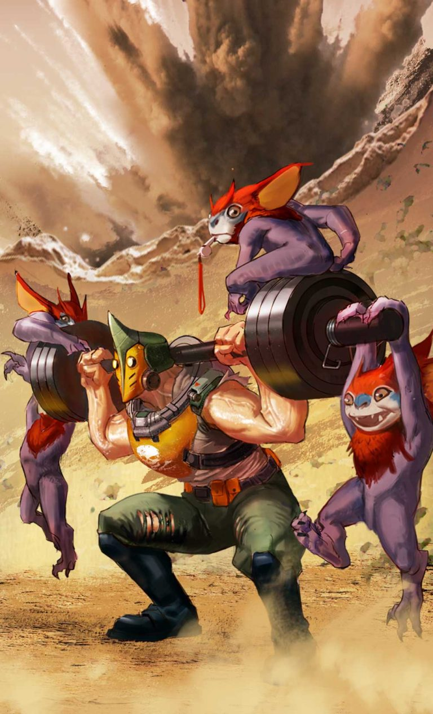
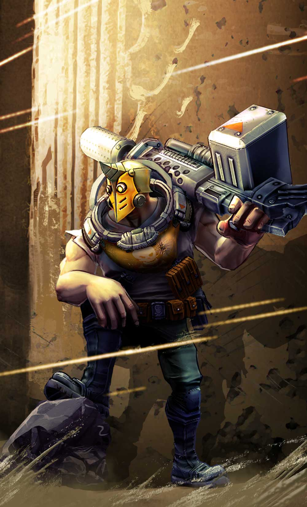
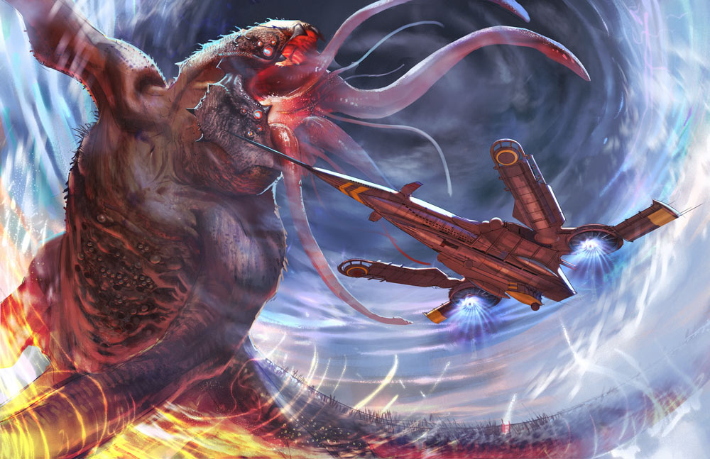
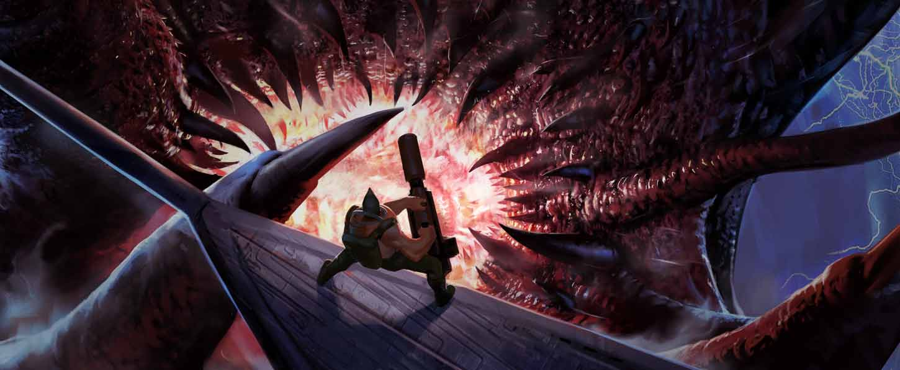
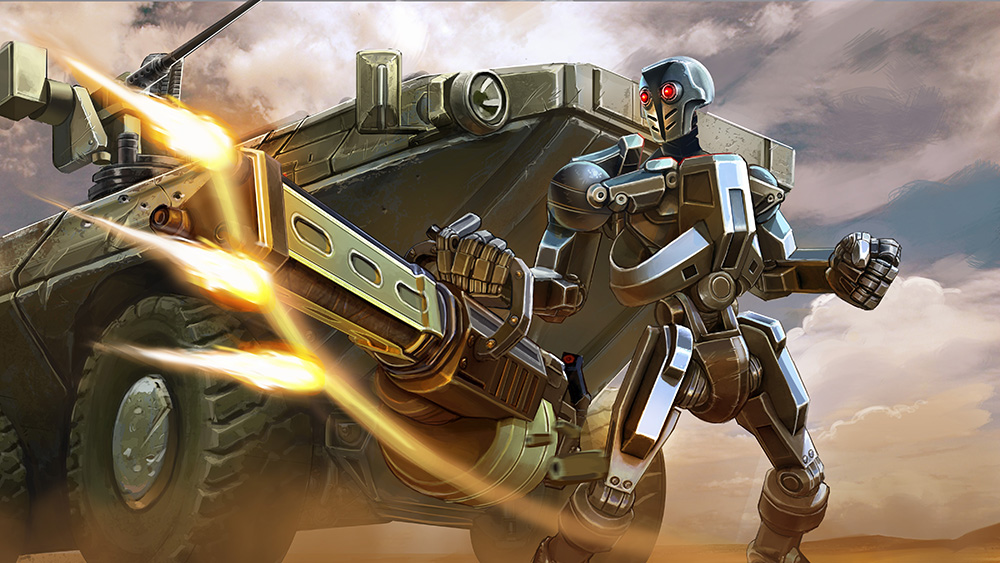
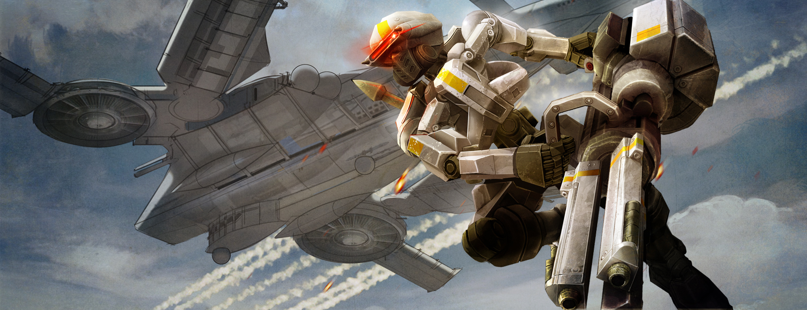
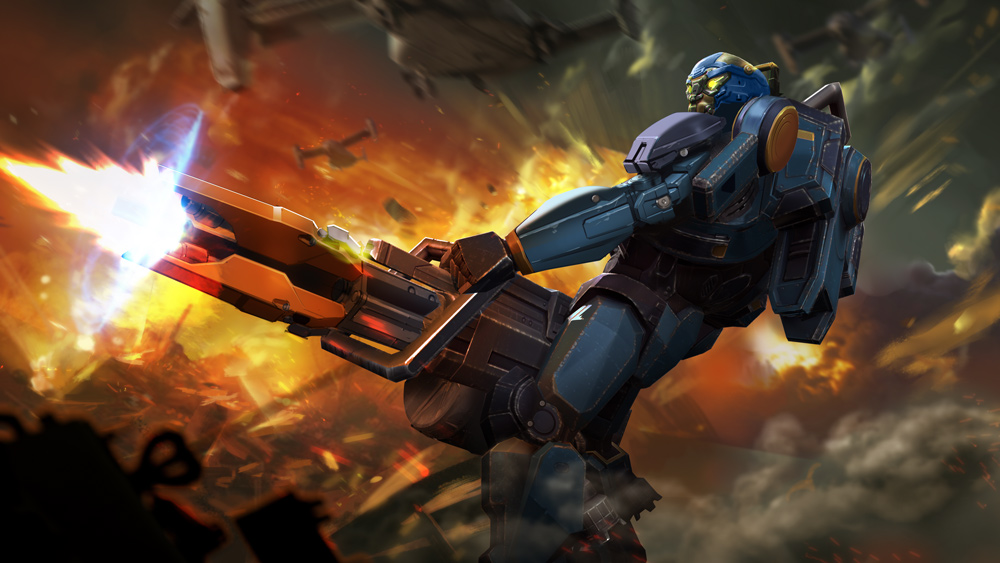

# SAW Lore

## 'SAW'S FIELD TRAINING REGIMEN'

 Staying in shape while out in the field is a simple matter of discipline. Here’s how SAW stays shredded even while deployed out in the jungle.

#### DO YOU EVEN LIFT?

 Fill ammo cans with sand to get your curls, rows, and bench press. Do pullups off the turret guns. Military press your weapon.

 Living in the field is no excuse for skipping leg day. Carry the ammo cans during walking lunges and step-ups. Knock down jungle trees, sit beautiful women on both ends, hold on shoulders and squat.

#### TURRET DRAG AND PUSH

 Tie a rope around the base of a turret. Tie the rope around your waist and drag the turret. Drag it forward for 50 meters, then untie the rope from your waist, turn around, and drag the turret backward with your hands for another 50 meters. Move to the other side of the turret and push forward the last 50 meters. Turn around and repeat.

 \(Note: if you’re a wimp beginner, start with a large tire.\)

#### MINION CATCH, CARRY SLAM AND TOSS

 Just holding these squirrely buggers is a core workout! Catch one big minion or two small ones; for High Intensity Interval Training, farmer-carry them back to HQ. Press overhead, keeping elbows out, knees slightly bent, then use the whole body to slam them onto the ground at your feet.

 Pick up and repeat until they no longer wiggle, then get new ones. For ever more explosive power, throw the minions from the overhead position, sprint to them, pick up and throw again.

 Keep this up and you too can achieve SAW’s ripped physique even while deployed!



## 'SAW: THE BRIDGE BURNER'

 

Look at that, Mister Mayor, we seem to have drawn a crowd with this misunderstanding between us. Allow me to explain again: My mission was to eliminate a monster that had been tearing up your jungle treehouse town, here. You said it’d be a simple setup. One-day operation: I pick up the target’s trail, run it down and bounce back across the border before anyone knows I’m there.  


 I fixed on the target’s position thirty klicks outside town. It used the trees. Jumped out at me from 10 meters up, dug into my back. The enemy appeared to be some kind of female human-cat hybrid moving on all fours, with steel claws on her feet and hands. I engaged her in combat, but she pinned me down, ripped the arms clean off my shirt, jumped on my weapon, got herself a mean brass hickey on her foot and howled. I popped smoke before she could give me a free appendectomy, hunkered down into a secure position 50 meters off and laid suppressive fire on the area. I blew the leaves off every tree for 100 meters and couldn’t find a thing. Not a trace. No blood, no body. I hit nothing.

 That’s why I loaded Gracie here with explosive shells and lit up the enemy’s base of operation. Nothing could’ve lived. Not at that range. I understand that the ensuing smoke and the destruction of the roads has made business difficult for your citizens, but no one said it was a hush operation. The beast in question has not surfaced in 72 hours, so she is presumed dead and my mission is accomplished. And that, Mister Mayor, is why you are in a choke hold pending payment to me in the amount of 500 gold or equivalent crystal.



## 'SAW & THE LEVIATHAN'



 Before it surfaced, the ground rumbled intermittently for hours, tearing cracks in the walls and streets of the city, and from these cracks leaked foul-smelling steam. There was a great rhythmic pounding the last hour of sunset, so powerful that the people’s hearts beat along with it.

 The soldier stood in an alley outside the city walls, just hours away from retirement, one palm on the wall, relieving himself. He’d rolled everything he owned into his rucksack, including his paltry final payment. If the ground opened up and took that ruck he wouldn’t miss it, and no one would miss him. His platoon was down south, fighting without him, and at midnight he’d be a civilian for the first time in his adult life. His paperwork had been submitted and filed, his weapons and armor turned in. The night the churn monster punched its powerful limbs through the surface of the sea, the soldier’s military tattoos were well faded.

 He was only there at the harbor long enough to catch a ship home – though he had no one to go home to – but the earthquakes had caused rogue waves that anchored the ships. People had been screaming for hours, their houses falling down around them, fires bursting out, loved ones falling into the places where the ground opened up. Not his problem. If he managed to get out of there, it would be the first time he’d escaped from a burning city he hadn’t lit up himself.

 When the wall shook under his hand and crumbled, he sighed. A deafening crack sounded from inside the building, then the roof caved in. Toward the harbor, a bonfire burned out the stars. Seemed getting out of this town would take some doing. Abandoning his ruck, he walked toward the burning like he’d been trained to do. He didn’t have anywhere else to be.

 People panicked, trampled one another to get away from the sea. He dodged civilians, then he shouldered past guards who had fled their posts at the wall. The closer to the burning he got, the more he had to climb over debris and wounded people. Smoke clogged his throat and eyes. He breathed easier after taking the mask from some unlucky local peacekeeper who’d fallen off the wall.

 When a whale came flying over the wall, landing in a wet, bloody slam on the street behind him, he knew this was more than seismic activity. Earthquakes don’t throw whales.

 The soldier climbed high as he could on what was left of the abandoned wall and surveyed the scene. Whatever remained on dry land burned. The harbor had split in half and the sea poured through the new fissure, lapping its tongues against the wall. Water sucked downward in the places where the sea floor had cracked, and from those cracks came… arms? tentacles?

 Visibility was minimal through the smoke. The limbs coiled around cannons from a nearby ship’s broadside gun deck, pried them loose and threw them at the city.

 Looking down, swaying in the wind, the soldier saw the sea dump downward in the middle of those tentacles, and from it emerged the head of something giant and angry.  


~~~~~~~~~~~~~~~~~~~~~~~~~~~~~~~~~~~~~~~~~~~~~~~~~~~~~~~~~~~~~~~~~~~~

 The night sky roiled with smoke from above. A fleet of airships hovered low, dropping everything they had on the monster. Bombs exploded on the thing’s face and it sank under the sea, roaring in the low-pitched sound of nightmares. It soon resurfaced with a vengeance. A tentacle burst skyward, coiled around the stabilizer spar of the nearest airship and brought it down. The doomed ship fell with the same trajectory as the whale had, crashed nose-first on what had once been a thriving harbor, and burned.

 The airship’s survivors rolled out onto the shambles of the harbor, extinguishing the fire from their uniforms, dangling broken limbs. The masked soldier tripped and fumbled down the harbor side of the wall, loose bits of it rolling under his boots, then ducked a flaming projectile. A worthless propeller continued to spin as he raced through the wreckage toward the mounted squad automatic weapons on deck. There was only one not cracked in half or on fire. He kicked the mount loose, yanked the weapon free, hauled it up over his shoulder and sidestepped across the narrow gangway to a topmost vantage point.

There, he found himself eye to eye with the churn beast. The largest eye was as big as the soldier was tall. Its mouth yawned open, fish flopping over its seaweed-wrapped tongue.

The soldier had never stared down a creature like this, but danger was danger – and all danger required running or fighting. With the airship burning away below him, there was no escape.

He aimed the weapon down into the gullet of the leviathan and fired the explosive shells. The kickback near knocked his shoulder out of its socket. The beast spasmed, whined, retreated under the steaming water, then exploded upward with a roar. There was nothing to do but fire… and fire… and fire fire fire until all the shells had been deposited into the belly of the beast.



The airship’s flames licked at his boots as the shells exploded in the throat of the monster, cutting off its roars. Underwater booms melded with the sounds of airship propellers and wood cracking under the threat of fire. The monster twisted, whined, retreated and flopped its tentacles onto the water, sending seawater spraying.

So his last moments alive would be like this. Wasn’t a bad way to go, all things considered. Holding a big freaking gun. Maybe the smoke would choke him out before the pain got too bad.

That’s when he saw the rope coming out of the haze by his face, dangling from one of the airships above.

He laughed. So the world wasn’t done with him yet. SAW rested his new weapon over his shoulder, grabbed onto the rope with the other fist and let the ship pull him up while the rubber of his boots melted in the flames and the monster disappeared, sinking into the deep.

## ALTERNATE FATES

### 'SAWBORG'



Intercepted classified government transmission:

```
TRACKING: Please wait ...
Target: S.A.W. tracked to Halcyon Fold.
SCANNING TERRAIN: Please wait... Obscuring vegetation eliminated via combustion.
VISUAL ANALYSIS: Limited. Rapid pyrolysis.
Thermography: Initiated.
Target: Detected.
Target: Engaged with direct force.
Target: Eliminated.
Remains salvaged for replication. Replication sequence initiated … Please wait.
Applying updated identity: S.A.W
```



~~~~~~~~~~~~~~~~~~~~~~~~~~~~~~~~~~~~~~~~~~~~~~~~~~~~~~~~~~~~~~~~~~~~

 “Frankie? I don’t know a Frankie.”

 The dwarf’s face peered out through the window in the thick metal door at the end of a dark and labyrinthine series of underground sewer tunnels. SAW reached inside and grabbed the dwarf by his throat.

 “I got machine men hunting me down. I had to fake my death to escape. I don’t have time to guess at you sewer rats’ secret passwords. Get me Frankie.”

 The dwarf’s eyes lit up. “I heard there were bots roaming aboveground. Real high-tech stuff,” he choked. “If those things are after you, I’m Frankie.”

 “The Frankie who can build anything?” SAW’s fingers loosened from the dwarf’s jugular, and a bolt slid unlocked.

 “I can engineer anything.” The heavy door slid open. “Follow me. The garage is back here.”

 Inside, orange lights hung from high ceilings. Bad couches held together with duct tape encircled a good, if short, pool table. On those couches other dwarves sat, poking at holographic screens upon which lines of code scrolled. A knee-high robot full of coffee wheeled around, spitting steam out of its hinged top. “Hey guys,” called Frankie, “this giant guy just tried to kill me and now I’m taking him to the garage.”

 “Okay,” muttered the others.

 SAW trailed after Frankie, trying to decide how many dwarves he could take on at once. They were built low to the ground but there were a good bunch of them, some with mighty beards. “So. Can you can help me?”

 “Probably not. Those bots?” Frankie pulled up a rolling door and flipped a switch that flooded an echoing garage with white light. “They’re way more advanced than anything I’ve engineered. Any idea why they’re hunting you?”

 SAW whistled through his teeth at the artillery inside. Weapons and armor from everywhere he’d been, and many places he hadn’t. Actuators, anti-material rifles, a sentry turret. There was even a tank in the back, blown half apart and still crackling with something that glowed purple. He picked up a rocket-propelled grenade from a shelf stacked with them, hoisted it onto his shoulder. “I’ve made enemies in militaries all ’round the world.”

 Frankie’s laugh sounded like marbles rattling in a coffee cup. “Took six years of bureaucracy for the local military to upgrade the 8002 to the 9000. They’re still tinkering with exosuits! Ha! I think on another level, big guy. I’m thinking about the future. I got a gizmo in the closet that’ll move things through time … but that’s not what you’re here for. You’re here for this.” He yanked a tarp away from a jumble of metal armor.

 SAW set the RPG back where he’d found it. “I’m not much of a knight.”

 “This is ablative plate. Nothing gets through it. It can’t be chipped, scratched, shot or vaporized. You could wear this armor in space.” Frankie hefted up a breastplate as big as his body with surprising strength. “I mean, your chances of winning are very low. Five, ten percent at best. The artificial intelligence hunting you is fully automated. Unkillable.”

 SAW held up the helmet and stared into its eyes. “Machines are only as smart as whatever makes ‘em.”

 “Whatever made these is smarter than you.”

 “Robots can’t be tricky. Humans can get lucky.” SAW fit the helmet over his head. His voice came out muffled. “What do you want for all this?”

 “If you manage to survive – which, I can’t stress enough, is a doubtful outcome – bring me back the pieces of the robots so I can see how they work.”

 “You wanna make one of these things?”

 “I’m an engineer. I want to make everything.”

 SAW grabbed the breastplate from Frankie’s arms. “Deal.”


### 'Elite Force SAW'

#### PUCKER FACTOR 10

 While the rest of the tech alliance peered at their flashing monitors and beeping accessories, SAW sidestepped, stomped and stretched trying to scratch an itch on his bum. The rope he’d attached to the scout skittered and swayed around the mouth of the Halcyon Well.

 “Do you have a malfunction?” The commander’s visor opened to reveal his stern scowl.

 “New armor’s working as intended, sir.” He punched his fist into the overlapping metal of his back armor to no avail; the itch only burned worse.

 “Watch the rope.” The commander’s visor locked back down.

 “Yeah, alright.” SAW cranked the winch according to the rope signals. By the time the rope pulled twice, the itch had traveled up his spine. “All’s well,” he said. “Guess that’s your cue.” While the others watched the commander descend into the well, SAW wedged the handle of his tomahawk between his backplate and hip, trying to scratch, the rope forgotten as it yanked and yanked.

 “Hey, merc,” called one of the techies, “isn’t that one of the signals?”

 “I’ll tell you when there’s a …” began SAW, but then the ground shook. The techies stumbled and fell. Fog blasted high out of the well. With the tomahawk sticking out at an awkward angle from his hip, SAW lunged at the winch and cranked hard and fast.

 The scorched hook emerged from the well without the scout attached.

 “Well,” said SAW, hooking the rope to his own waist and grabbing his coilgun, “I’m going to go shoot at whatever they’re shooting at.”

 It took three techies working the winch to lower him and his artillery into the blind foggy well. He descended fast, breaking through the fog and getting only a glimpse of the crystal cave before falling straight into the gummy, toothless jaw of the Churn worms’ giant roaring mother.

 The worm gulped, and everything went dark.

 His coilgun was stuck, wedged tight between the undulating muscles of the beast’s throat. The itch on his bum came back with a vengeance.

 “Commander!” he screamed into his radio. “What’s your position!” He punched the beast’s inner flesh as it lunged and spat. “Commander, I need to lay down some fire and if you don’t clear out, you could catch it. Do you copy?”

 Only static answered.

 “Alright,” he grumbled, yanking the tomahawk free of his hip. He hacked at the squishy fleshy folds, worm blood spattering, holding his position with all his strength as the beast twisted and struggled, until crystal blue light leaked through. He put his head through the hole just in time to almost get it cut off by the chakram flying past.

 “Clear out!” he yelled, and pulled back inside, sliding the muzzle of the coilgun through the hole and aiming upward.

 The explosive shells burst from the rotary coilgun accelerator. He braced himself against the beast’s contracting muscle, shooting blind, one after another rocking the screaming worm, until he was out of shells.

 The beast whined, yawned, and fell with a sickening thump.

 He hacked his way out of the dead animal and caught his breath, dripping with goo. He kicked at the worm’s blown-open head, then surveyed the baby worms laying in coiled, bloody death on the sand. He cracked his neck.

 The scout and the commander stared at him as he tucked the tomahawk back in place. “Bloody hell! Pucker factor of ten, this,” he said.

 “Well done, mercenary,” said the commander.

 “Indeed,” said the scout. “That was astounding.”

 “Yeah, sure.” SAW picked up a Shatterglass from the sand and tossed it to Idris. “Grab up what you came for and let’s move out. I have an itch on my bum.”



### 'SUMMER PARTY SAW'

#### **SHARKS DON’T HAVE BICEPS**

 I saw the whole thing from shore while I was overhead pressing beach volleyball players. Someone yelled “Shark!” and I snapped to attention. Was a megalodon, sixty footer. Know how you can tell that? You look from the dorsal to the tail. What I didn’t know was, the lifeguards ran. Didn’t even send up a distress signal. So I yelled, “Hold up now!” and everything went real quiet, the people being more scared of me than the shark. All I’m saying is, sharks don’t have biceps.

 When that shark came up teeth first for lunch, it looked right at me. Right into my eyes. Had lifeless eyes. Black eyes, like a doll’s eyes, that rolled over white, and then came that high-pitched screaming.

 I dropped the ladies and grabbed up Gracie, planted her square on my shoulder and took aim for those dolly eyes. Right at the moment when they rolled over white, I fired right into them, gave that shark some serious irritation. It clamped down on some surfer dude’s board. There was an unnecessary tussle between them while I ran into the surf and slammed water balloons into its fin.

 It was dollar taco day. That’s why I remember so well.


