# Taka Lore

## 'BLADE IN SHADOW'

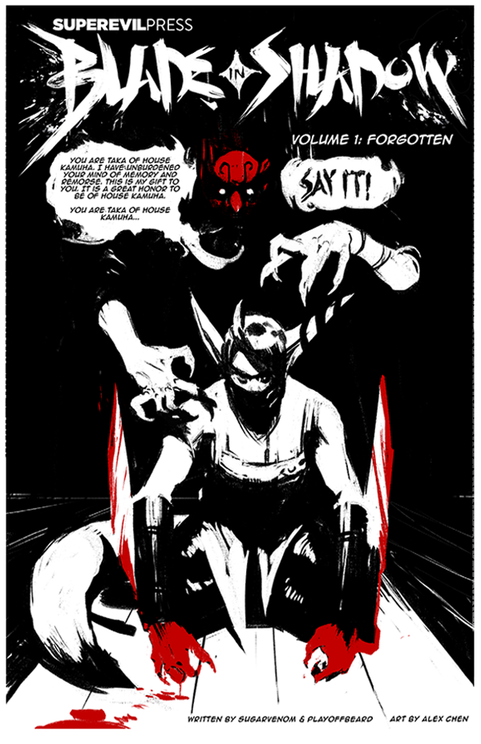

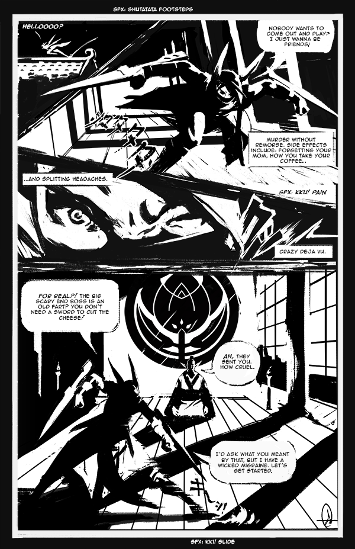

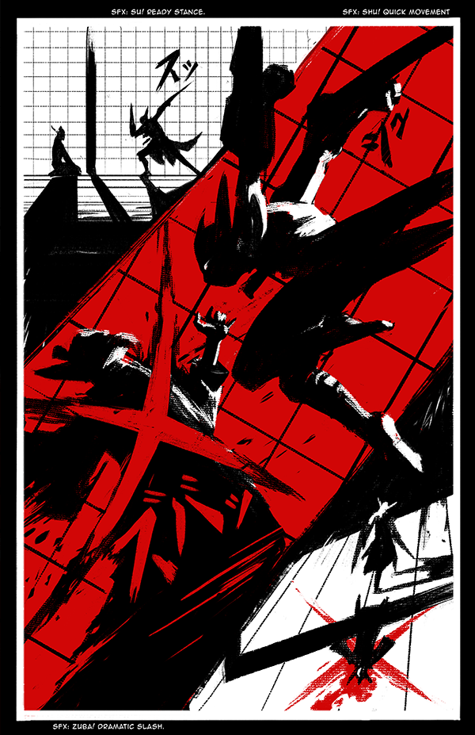

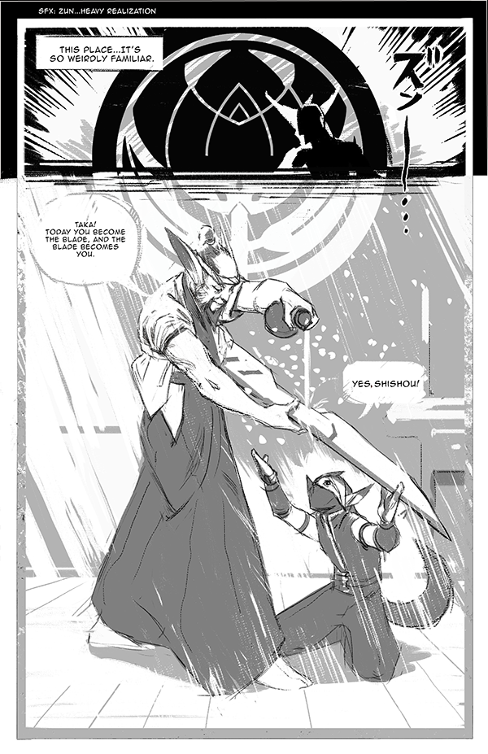

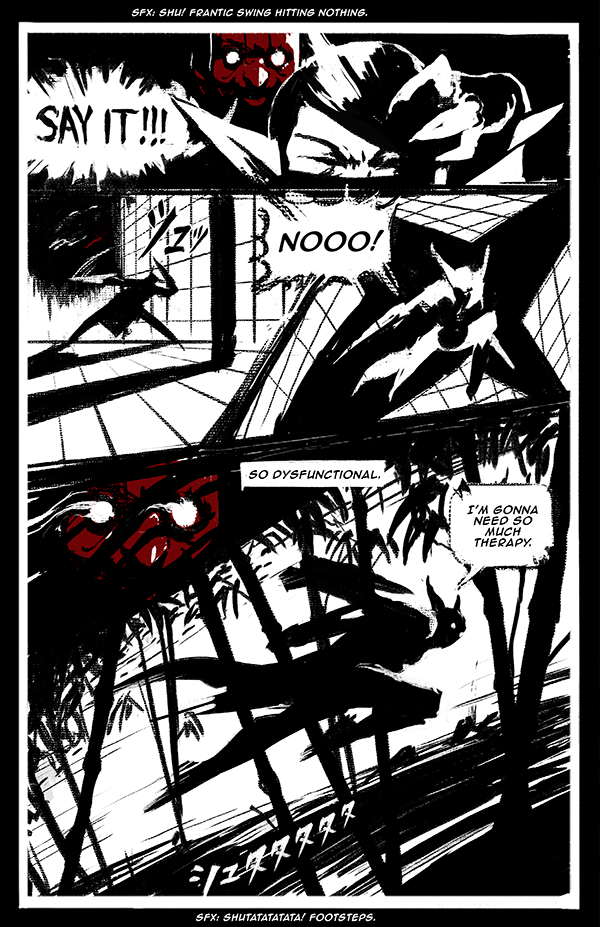

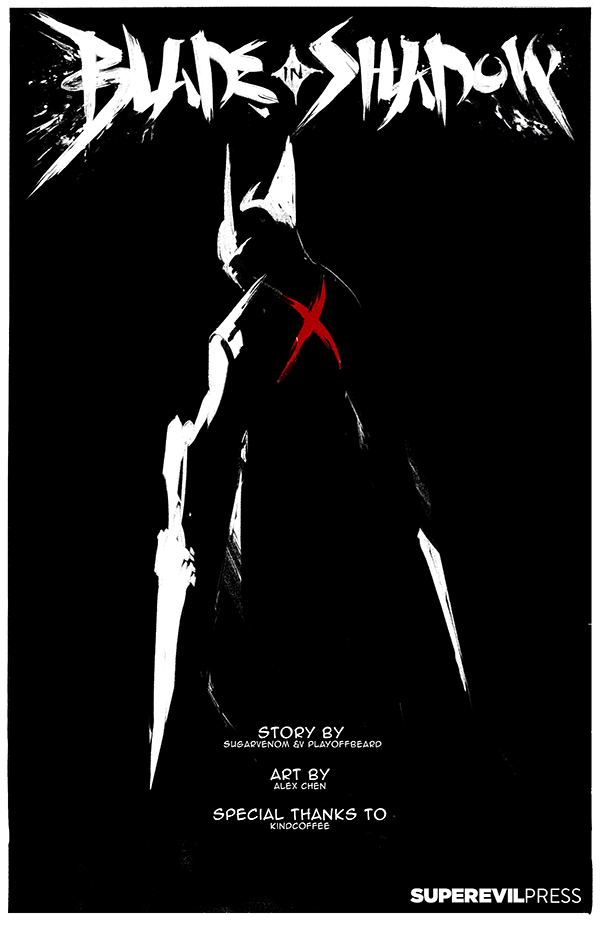

## 'GUNS AND SUNS'

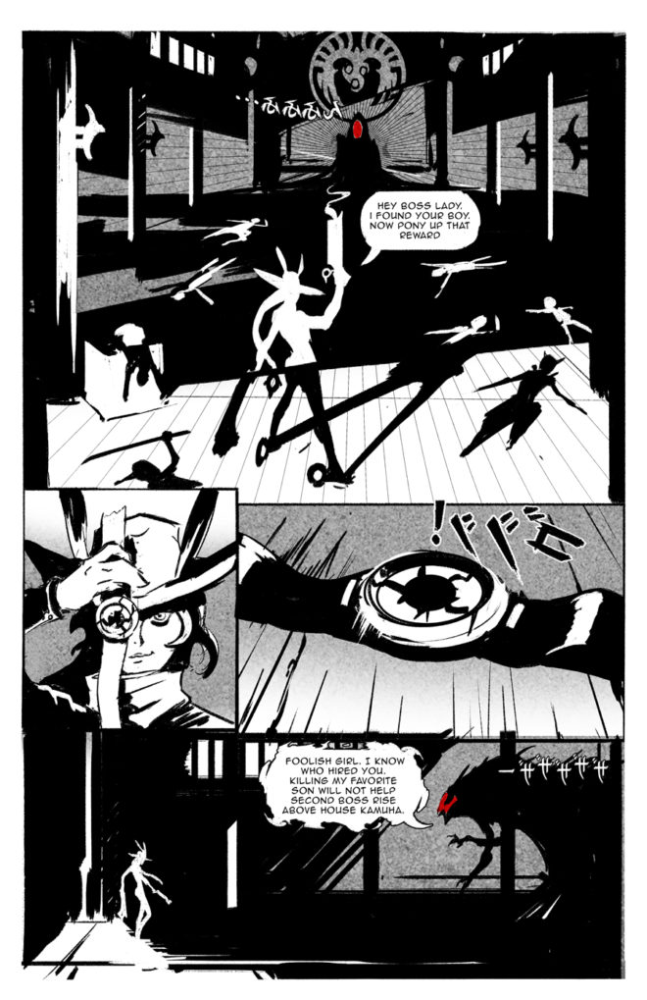

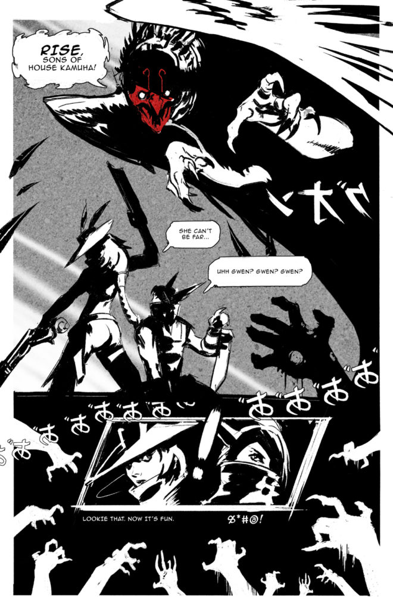

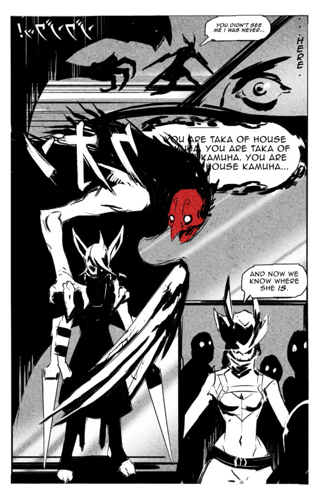

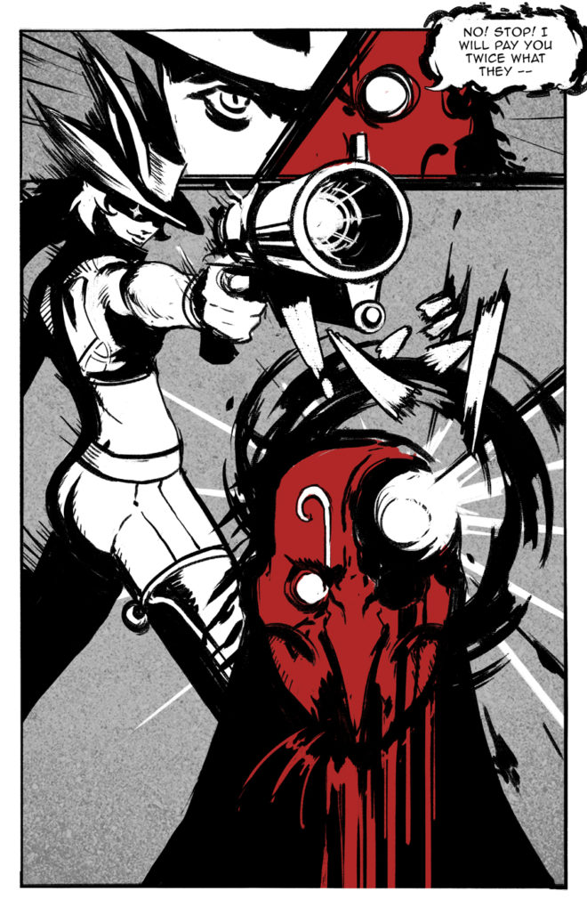

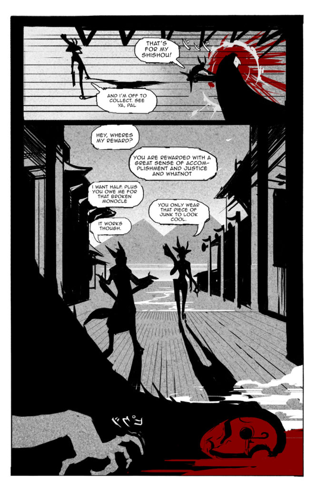

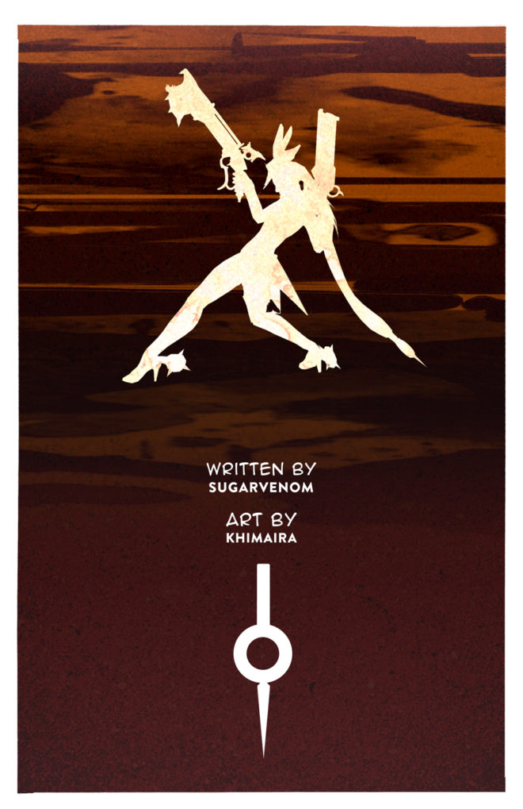

## ALTERNATE FATES

### 'LITTLE FOX' TAKA

#### 'THE GROTESQUE GRIN'

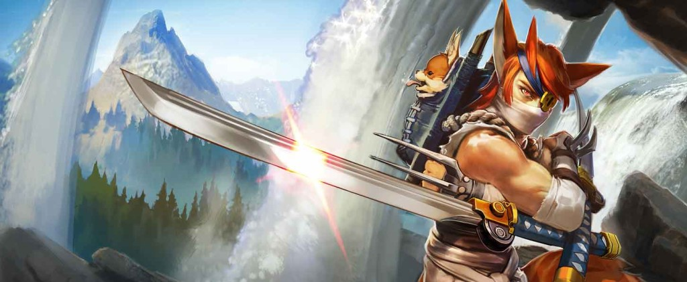

Maza bent to peer into the ornate wooden box at her feet. It had been delivered to House Kamuha in the night without catching a single guard’s attention. A face grinned up at her from within the box, its mouth forced with twine into a grotesque grin.

“It is Ryota.” Maza knelt by the box, running her claw-like hands over its carvings. “I sent him to collect this year’s contributions from the mountain villages.”

“Rumors spread through the villages of a Shiro Kage who has come to free the people from the mandatory contributions. He killed Hibiki, and now Ryota, and we lost Taka in the spring,” grumbled Isshin.

“Tch. Shadows cease to exist when light is shined upon them.” Maza closed the lid of the box. “What do we know about this Shiro Kage? He is deadly. He has a youthful morality, but indecent humor. He seeks to right the wrongs of House Kamuha. Who fits that description, my son?”

“Only one,” whispered Isshin. “But how can it be?”

“Find Taka. Do not underestimate him.” 

### 'WHITE GHOST' TAKA

#### 'THE UNLOVED DEAD'

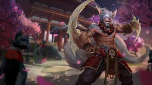

The legend of the _Shiro Kage_ grew as winter settled upon House Kamuha. Maza sent her best assassins after the shadow that plagued her, but only their heads returned. She hired bounty hunters, but the enemy had been tracked to the Tangled Wood, and everyone feared the unloved dead who lived there. The rumor grew that the _Shiro Kage_ was a vengeful ghost.

At last, Maza alone remained at House Kamuha. She had no more assassin sons, no more prestige in the village. Snow coated the skeletons of the cherry trees and the koi kissed the thin ice covering the pond. Maza felt the pain of winter deep in her old bones. She settled on her meditation mat and waited.

After nightfall, she heard the barking of foxes echoing through the courtyard. She remained still, for foxes are tricksters and cannot be trusted. Even when dozens of foxes burst through the paper sliding walls, yipping and growling, Maza remained still on her mat. With a powerful exhale, she released the illusions: seven copies of her, indistinguishable from reality, chanting their hypnotic magic in tandem.

The barking stopped, and Maza opened her eyes, believing she had triumphed. But instead of a skulk of hypnotized foxes, the room was littered with _tanuki_ statues. Her chanting stumbled; she had never been out-tricked before.

“The souls of your sons have been reborn. You can’t control them anymore.”

Through the torn screens walked the _Shiro Kage_. The Tangled Wood had changed him. His fur had grown bushy and winter-white. Instead of switchblades, he wielded blade-sharp bones that protruded from his arms.

“But you, my son, are not yet reborn,” whispered Maza through gritted teeth. Her clones made a tight circle around their mistress and took up their old chant:

_You are Taka of House Kamuha._  
_I have unburdened your mind of memory and remorse._  
_This is my gift to you._  
_It is a great honor to be of House Kamuha._

When Taka wavered, the _tanuki_ statues burst apart and foxes flooded the room, kits and vixens and tods. They barked, yipped and howled at top volume, drowning out the sound of the chanting. “Get… out… of my… mind!” screamed Taka, shaking his head.

The barking broke Maza’s focus, tearing Taka from the grasp of her power. The bladed bones slashed through a clone. The air wavered where she had been. Again the _Shiro Kage_struck, and again, his bladed bones crossed into an X, his anger building, his winter coat glowing as his _ki_ strengthened, one clone after another disappearing faster than Maza could create them anew. The last thing Maza saw in this life was Taka mid-flip overhead, awash in dark, furious flames, driving his blades straight down into her heart.

And that is how House Kamuha became House Kitsune, where the people bring gifts of sweet tofu to the wild foxes who live there. There are no other legends of the Shiro Kage, but it is said that he roams the Tangled Wood to this day, caring for orphaned animals and guiding unloved souls to their rest.

### 'SCHOOL DAYS' TAKA

#### 'KENDO CLUB MASTER'

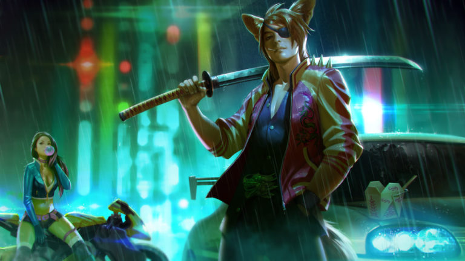

The class presidency isn’t all studying, campaigning, scheduling, scheming and partying. Teenagers get out of line. Every school has its low-level bullies, ditchers, spraycan outlaws, lunch money wranglers, name-callers and angry jilted lovers. It’s not their fault; they just need guidance.

And that’s where Taka comes in.

Taka is a personal success of mine. I found him running a black market ring of cheat sheets and plagiarized essays. I took that bad boy under my wing, made him head of the kendo club, and put him to work fighting the unscrupulous students he’d once rallied. He’s cute, in a furry-eared way, always with a big belt buckle and the perfect comeback.

He once popped out of the shadows in a poof of smoke right in front of someone ditching trig. The terrified kid ran back to class, got an A on a quiz, _and_ joined the math club just to be safe. Taka breaks up PDA with his one-eyed glare and one time, when a freshman had his lunch stolen, Taka burst out of the shadows and stabbed the lunchbox right out of the thief’s dirty hand. Sliced the PB&J inside right in half – _diagonally_. The school is so safe now that the principal had katana holders installed into all of Taka’s desks.

All he needed was a little direction. He barely remembers his mischievous former life.

### ''NIGHT SHADOW' TAKA

#### 'GYTHIAN WALL'

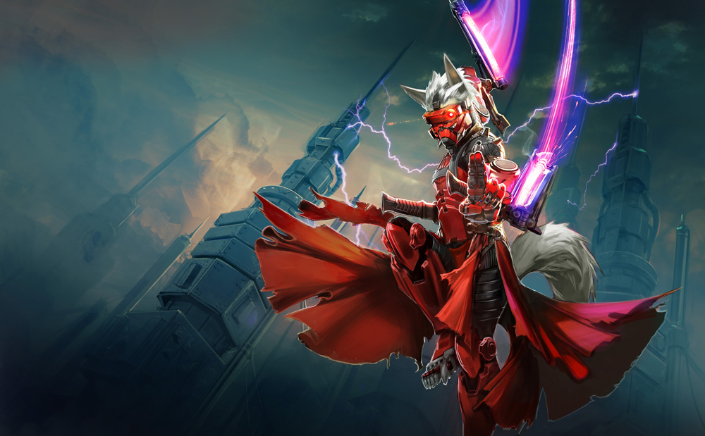

After two nights and days astride the wide-backed pangomoose, the slowest beast of burden imaginable, the courier can see Gythia’s twinkling lights in the dark distance. Home: just a steep, winding hike down the inside of the wall and an hour’s ferry away. His thighs ache from straddling the saddle; his temples throb with exhaustion; the thought of his mother’s squid ink pasta floods his mouth with saliva.

And he can’t get through the gate.

“No night shipments,” says a guard. “Post-war regulations.”

“This is a special delivery. I am expected,” insists the courier, pointing at the blue flag of the couriers that droops from the pangomoose’s saddle.

“Turn around, friend,” replies another guard, expressionless behind his helm.

Four meters above the gate, an assassin stands flat against one mirror-smooth obsidian glass spire of the Gythian Wall, the weapons in his fists emblazoned with the crest of House Kamuha, souvenirs from a lost time. He does not understand the conversation between the courier and the guards. In Gythian, the assassin knows these words:

I, You  
Hello, Goodbye  
Yes, No  
Yours, Mine  
Have, Be, Understand, Kill, Go  
Who, Where, What, When

He does not need anything else, especially _why_. _Why_ is not his problem. Where he goes, he learns these words and leaves _why _to the Employer.

_How _is his problem.

The courier pulls at his ear with annoyance. This is the Gythian Wall’s only opening, the section blasted out by the Technologist rebels during the civil war, now a legal trade entry to the city. There are other passages through the wall, littered with the bodies of explorers gone mad in the mirrored black maze. In the dark night, one misstep could cast him over the sheer cliff drop into Bladed Bay, where razor sharp spires protrude from dark waters.

“Please, this is a peculiar circumstance.” The courier rummages through the pack on the pangomoose’s rump, producing two blades; with the flick of a switch, the metal blazes alive, molten metal flashing and spitting. “I admit I am not a courier, but the Cartographers’ Guild expects this delivery by dawn.”

The Employer provided the assassin with a decade-old version of the guards’ armor, but his mask is all tech, with a power-cooled respirator mask and night-vision eyepiece. He does not need to understand the conversation. He understands those blades, flaming eerie green through the infrared lens.

Four guards, all rushing to open the gate. One over-armed wild card. One tired, underfed beast of burden.

His tongue sucks up onto the roof of his mouth. He slides his weapons back into their sheaths, silent, knees bending, anticipating the big spring, breath slow.

The assassin jumps, landing with the toes of one foot on the pangomoose’s head. Before the courier can react, the assassin has side flipped over him, his tail whipping in a spiral. He snatches the hilts of both blazing blades from the untrained hands of the courier, whose terrified face glows green.

“Mine,” says the assassin, and pushes one molten blade down between the courier’s left clavicle and shoulderblade, incinerating the man’s heart.

When the guards turn away from the gate, only a shadow remains behind the blank-eyed courier, who slides sideways off the pangomoose to a heap of burning flesh on the road. A shadow, and the one thing left in the courier’s pack: a leatherbound journal bearing the compass insignia of the Cartographers’ Guild.

