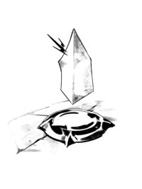

# Explore alone

#### 'EXPLORE ALONE'

“Look, Koshka.” You peel the girl from your back and she crouches, claws on the ground, just like a kitty. “Dragons went extinct a long time ago.”

“But…” she whines.

You sigh and pat her head. “Sorry. I have work to do.” You gather up your blueprints and point at them, making you look super professional, and walk off.

But the more you wander, the more you doubt yourself. There are some things up on this Rise that you’ve never heard of. Like trees with faces and glowing branches, and a giant toad who mumbles to himself while counting gold pieces.

“You want my gold, don’t you!” the toad cries, huffing his way over to you.

“Um.” You back up.

“You can’t have it! It’s mine!” The toad croaks and jumps, blocking your path. His long tongue whips out at you, leaving a smelly gross smear on your cheek. He’s coming at you, bobbing and weaving. You duck out of his way, shuffle to one side with your arms up, and let loose with a jab and right cross to his bulging neck. He coughs, wheezes, spins and falls in dramatic fashion, his gold stash clinking to the cobbles.

You look left. You look right. The toad gurgles.

“You’re gonna want that gold,” whispers a voice above you. “Grab it up and come see me.”

Startled, you look up and see a parachute floating through the air overhead, gripped by a tiny, almost invisible bug.

You scoop up as much gold as you can carry and chase after the parachute. By the time you catch up, the bug’s wares are floating close to the ground.

You don’t know what you expected from an insect’s trove, but it wasn’t _this_. Cool armor, weapons, a freaking Flare Loader, bits of charged crystal, and _whoa_… Teleport Boots. You’ve heard about this legendary footwear, developed by the kind of dwarves who refuse to sit with you at lunchtime, but you were never allowed to try them out.

Then again, you can also afford a sweet boost for your Scout Cam…

