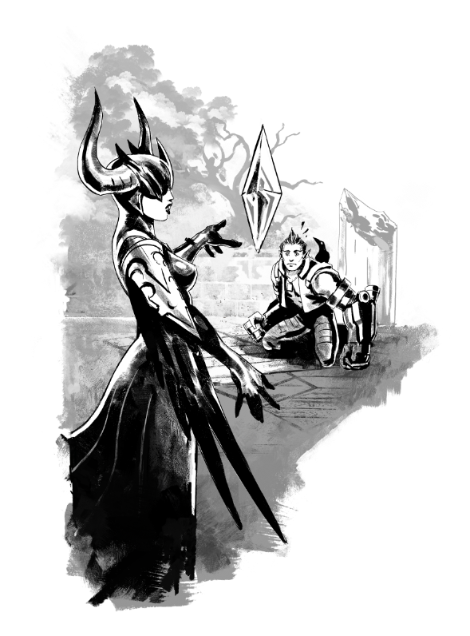

# Teleport to the center of the mountain

#### 'THE TRUTH'

You close your eyes and whisper, “I want to know what’s really going on inside this mountain.”

The Teleport Boots buzz, your stomach turns inside-out… and you’re in a narrow courtyard with tall walls and a zillion raven perches. “Wait. What?” you whisper. You meant to go inside the mountain. “Why…”

“Look who’s come to visit us, Vyn.”

You spin to face the voice, then fall to your knees before a woman dressed all in black, her face half-covered with a horned mask. Before you can respond, a raven swoops down onto your shoulder, its head turned, one eye staring into yours.

“Yuh… yuh… your highness,” you stutter. “Sorry. I didn’t mean to…”

“You have a question,” says the woman. On her cheeks, you can see the edges of brutal scars. “Ask it. If I don’t like it, I’ll give your eyes to Vyn for his dinner.”

The raven on your shoulder lets out a loud croak into your ear.

You squeeze your eyes shut and _will_ yourself away somewhere… anywhere! …but the overheated Teleport Boots need to cool down. You screw up your courage and ask.

“What… what’s the secret the dwarves are keeping inside this mountain?”

The Storm Queen smiles. “The secret inside this mountain,” she says, “Is a Well of Power.”

“So _that’s_ why we came,” you whisper. “And they won’t let me see it because they want to keep me _safe_. And -”

“You may go,” says the queen, and leaves you alone with the creepy bird.

The raven stares while you wave the smoke off of your boots. “I’m going, I’m going,” you grumble, then teleport back to the Rise.

**THE END**

