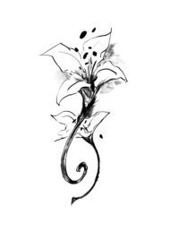

# Go with Koshka

#### 'GO WITH KOSHKA'

“There haven’t been dragons for a thousand years,” you tell Koshka.

“There’s _totally_ a dragon, and we’re gonna be his friend,” she says. “I just need help bopping it on the head.”

“You don’t wanna be _my_ friend, I hope,” you say.

“Look!” The girl points to the sky just as a whoosh of air from a giant wing blows your hairdo out of whack. It’s a _dragon_. A _real_ one, with real teeth and claws, with sparks trailing out of its real nostrils!

Koshka hops down and claps with glee. “It’s him! It’s Blackclaw!”

“That’s… great. I gotta go.”

“_C’mon_.” Koshka takes off.

