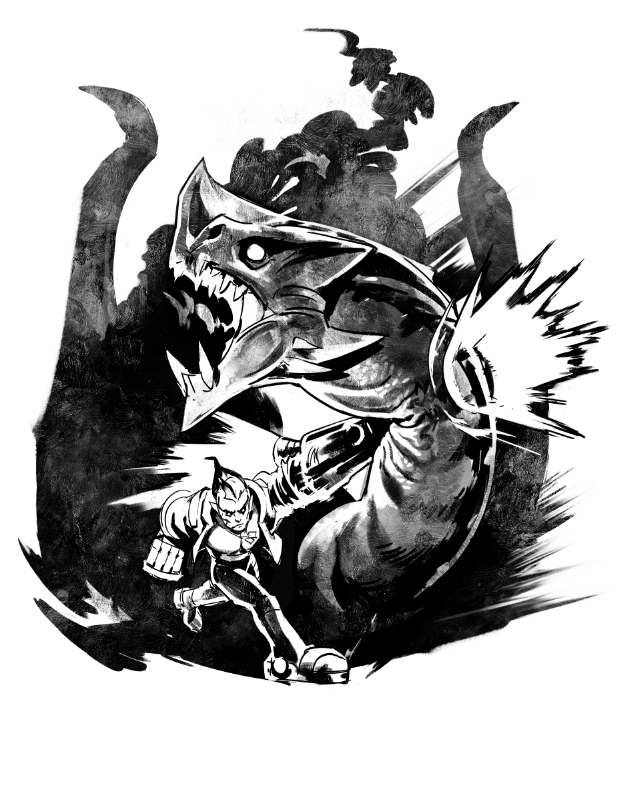

# Get away as fast as possible

#### 'GHOSTWING ATTACKS!'

Huge eggs mean _huge monster_s. You don’t mess with monsters! You run straight to the cave’s opening right as a giant, white, winged beast blasts through the clouds and flies straight at you.

You flank around to her side, duck under one pearly white wing, and swing up onto her back. Holding on for dear life, you soar through the air on the dragon’s back, too petrified to scream.

The dragon lands hard on Sovereign’s Rise and you tumble off right at the feet of a tall lady holding a big shield. Her cocked eyebrow makes you feel ashamed of your fright.

Three others are assembled behind the tall lady: a lady with a bow, a dashing blonde man with a sword and a huge river troll.

You roll your shoulders back. “I’ll finish off this dragon, my lady,” you announce.

“Is that so?” She smiles and leans on her shield. “We’ll watch from here.”

You take a deep breath, barrel forward and flail your power punchers into the dragon’s snout. She is not pleased. You stop, drop and roll away from the ensuing flame-ball but catch a swipe from her claw that slices up your tactical vest and leaves a long trail of blood on your chest. You crawl out coughing up noxious smoke.

“Point one for Ghostwing,” says the woman, lifting her shield. “Now we _all_ go.”

A bubble of magic forms around her as she sprints into the danger. Energy arrows fly into the smoke. The troll jumps, shaking the ground when he lands. The swordsman lunges into the fray with a glorious steel flash. You can’t just lay there! Get up!

You jump back in, twist, and slam a spinning backfist into Ghostwing’s face. Dragon scales fall to the ground as another barrage of fireballs explodes from her mighty jaws. With the dragon’s attention on the shield lady, the others pierce, shake and slash the rage out of the beast. You deliver a final uppercut to the dragon’s throat that makes it cough smoke. At last Ghostwing whines, lifts into the air, and escapes.

Victory never felt so good. You’re literally glowing! The cut on your chest seals right up.

“Let’s fight more things!” you yell.

The shield woman sighs and smiles. “Come. There are always more… things… to fight.”

**THE END**

