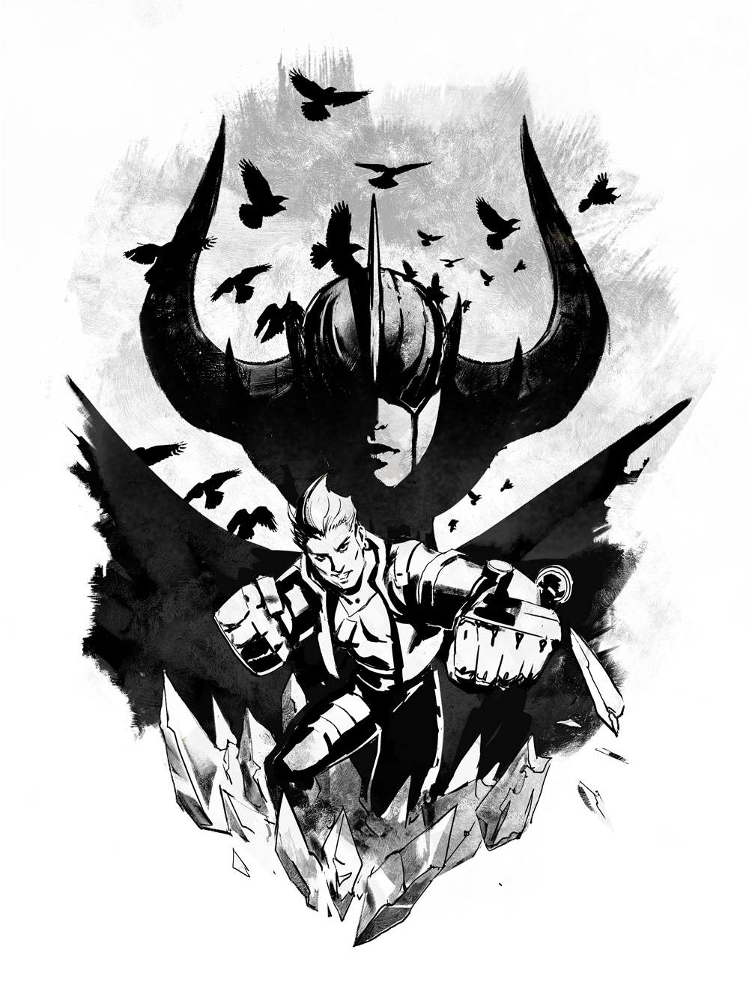

# Tony Lore

## 'THE BEGINNING'

It’s been months since your power punchers slammed through the last of the rock to Mont Lille’s hollow center, and yellow TOP SECRET tape still criss-crosses the opening. You poke your head into the dank-smelling darkness.

“No, Tony.” The head engineer grips the back of your neck.

“C’mon, Pippa. I wanna see what’s in there,” you whine.

“Don’t get too big for your cargo shorts. Entrust this part of the operation to the _smart_dwarves. Besides,” she says, poking at your chest with rolled-up blueprints, “we need a demolition dwarf up on the Rise, tunneling _down_.”

“_Sweet!_” Most dwarves are scared to go up that high, but _you’re_ adventurous. You hustle up to the surface, Pippa’s blueprints under your arm, and head straight for the the long, winding mountain trail leading to Sovereign’s Rise.

The hike takes all day, so you take a rest at the Sanctuary. Over the edge, you can see the Storm Queen’s palace and capital city. You hock up a loogie, spit it out, and watch it fall.

Well, time to get to work. There are three paths stretching away from the Sanctuary.

## ALTERNATE FATES

### 'STEAM KNIGHT' TONY

#### 'PRINCESS PINKERTON'

You pick up one of the eggs – careful with those power punchers! – and make your way to the cave’s bright entrance. Just in time, you duck away from a giant shadow passing over the peak. The flying figure cuts through a cloud. It can’t be, but it _is_. It’s a white dragon! With renewed awe, you stare at the egg in your arms. It’s pink and pretty… and it’s _yours_.

Avoiding the shadow, you hurry down the path and, after sunset, away from Mont Lille forever. You hide away in a wild forest where you make your home with your little dragon friend, Princess Pinkerton.

#### '**PROTECTING THE PRINCESS'**

From the moment your precious egg cracks, the royalty starts invading. Your pet dragon can’t even burp out a tiny forest fire without attracting local princes offering maidens in white dresses as sacrifice \(and they’re undeterred, even when you tell them that Princess Pinkerton prefers blueberries and cream to barbecued maidens\). Minor princesses and duchesses encroach upon your little hideaway too, demanding to be abducted by your rapidly growing dragon friend, and close behind them come the knights in shining armor, threatening to slay Princess Pinkerton for their honor and whatnot. Well, your darling pet won’t be a pawn in their silly aristocratic nonsense. You are a dwarf after all! Your steam-powered armor will help you defend Princess Pinkerton from those noble ninnies.

