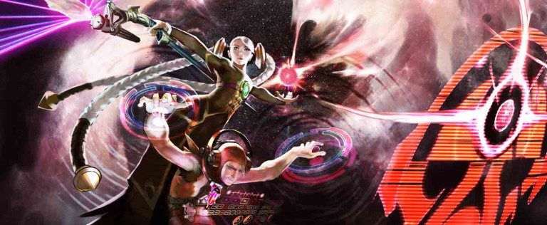
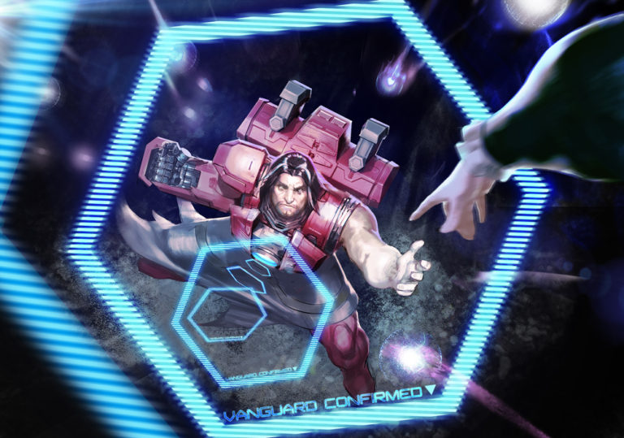
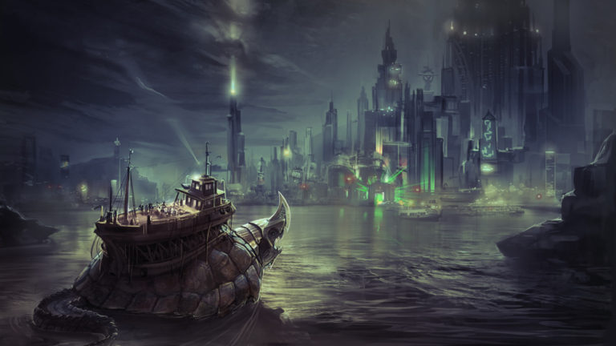
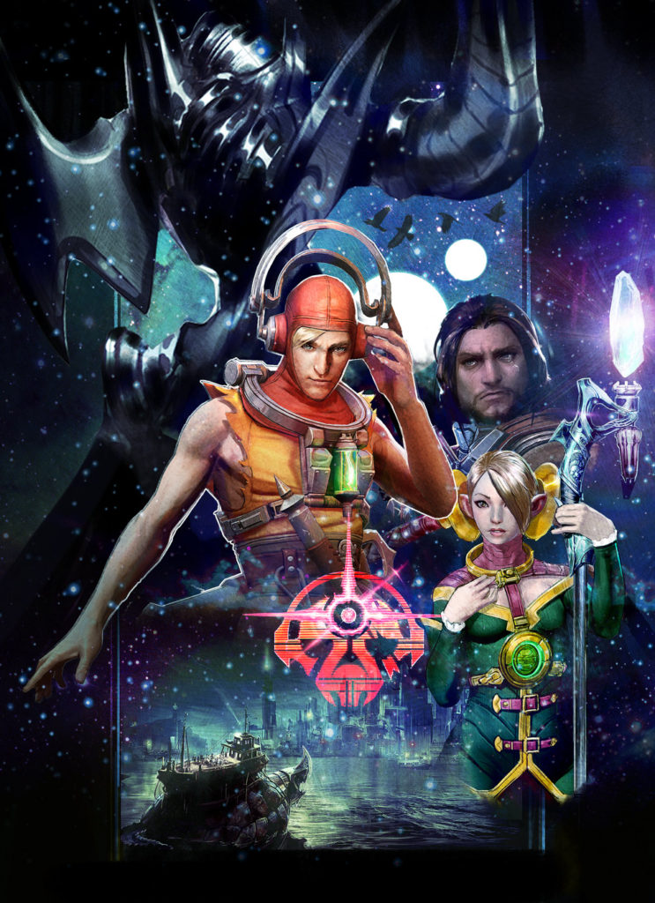
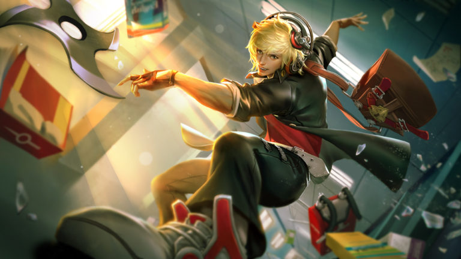

# Vox Lore

## 'IMPOSSIBLE DECISION'

“I do not need your permission to buy a goat,” Julia said. “Goat milk is delicious, and we can make cheese.”

They’d been arguing all evening. Ardan was hunched over his power gauntlet, sanding down the edges of a grill he’d removed to improve air flow. Outside in the yard, a goat shrieked into the moonless dark. “Goats stink and scream like fiends,” he grumped. “It hasn’t stopped for an hour. How will the twins sleep?”

“The kids need a pet. Are you dropping metal shavings on my divan?”

“And who will make this alleged cheese? When have you ever made cheese, your highness?”

“I could make cheese!” Julia shouted. She stomped out of the room and slammed the bedroom door behind her, the goat’s cries dramatizing her exit.

Celeste toddled out of her room, rubbing sleep from her eyes. “Dadda? Is Mamma alright?”

She had her mother’s accent. Ardan plucked up the toddler in his unarmored arm and kissed her cheeks. “Mamma is being ridiculous.”

“What is ridick oo luss?”

“It means she brought a goat home without talking to me about it.”

“I like goats.” This from Vox, who wandered in after his sister. He seated himself on his father’s foot, wrapped his arms around Ardan’s leg and rode along as Ardan took Celeste back to bed, staring out the window toward the screams.

“You like the idea of goats. None of us actually know how to care for a goat.”

“There’s a baby crying outside,” said Celeste, half asleep.

“It’s the stupid goat,” said Ardan, planting her back in her bed.

Vox uncurled himself from his father’s leg. “He’s afraid,” he said. “Maybe lonely.”

“It’s a she, Vox. At least I hope it is a she, or your mother’s dreams of cheese are –”

Ardan paused, turned toward the window.

The goat had stopped screaming.

His adrenaline spiked.

“Hide, both of you. Do not open the door.”

There was no time to make sure they obeyed him. He ran to his bedroom. “Julia,” he hissed at the bedroom door. “They’re here.”

Julia opened the door. Her face had gone white. “Now?”

“Outside.”

The armor stood in pieces around the front room in various states of renovation. Tools littered the floor. “Legs first,” he grumbled, stepping into the sabatons. Julia scrambled to her knees in her nightdress, a poor but necessary replacement for a proper battle squire. She pinched her fingers on the knee clamps, struggled under the weight of the chest pieces.

The button panel whirred and crackled with static, then burped out: “System. Offline.” Ardan slammed his left fist onto it. “Worthless damn power source on this model…”

“Shh.” Julia’s hands were black with oil, her face smudged as she attached the generator to his back and connected it to the power gauntlet. She stared out the door, into the hall. There was no sound. No disturbance. No goat. “Are you sure they’re…”

“System. Online.”

Glass broke. Ardan turned sideways in time for a metal arrow to slice a scratch through his breastplate, just under his chin, and thud home in the wall opposite the front window. Ardan cursed and squared up, the wood floor creaking under his armored weight. “I’ll watch the front door.”

“But your cannon arm!”

“It’s useless, unless you want me to blow up the house. Stay behind me.”

Julia closed her eyes, turned her palms upward. “I’ll protect you,” she murmured, her voice dreamy, green light forming in her hands.

Ardan winced away from the twisted-guts feeling that magic always gave him. “I can handle myself,” he grunted.

A forearm appeared over the window, decorated in an archer’s gauntlet, and then the archer herself swung inside. Another woman followed and drew her sword. More came in behind her, magicians and assassins, all wearing the same insignia.

“Stormguard!” he yelled, but Julia was lost inside her trance, eyes rolled back.

Ardan’s armor groaned and buzzed as he moved forward, painfully slow, but he was grateful for it when the Stormguard attacked. They moved in tandem, each with a weapon they’d held since childhood. He ran forward, energy buzzing through the armor, propelling him, heating the metal to burning, steel cracking against the breastplate. When he backhanded the archer across her face, he left a burn mark. She crumpled, her bow clattering to the floor.

The others raised shields of wood, metal and magic to counter Julia’s trance and Ardan’s assault. He stomped forward and plowed into them, knocked them from their feet, sent them flying in a crunch of bones to the wall. Their blood spattered the divan. They rolled in shattered glass, discarded weapons and their own knocked-out teeth. He could not resist every attack: Blades sliced through his unprotected arm and his cheeks; magic stung and froze him with deafening whipcrack sounds. But he was a wall between the enemy and his wife, and all the while, he felt warmth coming from her, a blanket that enveloped him, closed his wounds, melted the ice and gave him strength. It churned his insides, these unnatural talents, but he’d deal with the sick when his family was safe.

Then, the blast.

All went silent and cold. His teeth clamped shut. A shock pulsed up through his legs, his arms, his throat. He couldn’t scream. He couldn’t blink. Paintings slid from the wall and the bolts fell from the front door. He could hear the static noises from his armor display, the groans from the pile of wounded Stormguard, but he could not move. He could only watch as the front door opened and the last of the Stormguard stepped inside, as if invited. She surveyed the room, then snapped her fingers at two of the guard who were scrambling to their feet even as Ardan struggled to move. She pointed to the twins’ room and the two guards sprinted that way.

The woman walked from the door, past Ardan as if he didn’t exist, to Julia, who stood frozen in her nightdress and bare feet.

“Catherine,” gasped Julia.

“Such a shame,” whispered Catherine as she pressed her sword against Julia’s chest.

Ardan’s heart pounded out one beat. Another. Air filled his lungs and he coughed. To his right, the two Stormguard emerged carrying the twins, stunned as rigid as he. The other Stormguard rose, some shakily, some bleeding, all stone-eyed and with a firm grip on their weapons.

To his left, Julia stared into Catherine’s eyes.

His heart beat a third time.

In another heartbeat, his children or his wife would be dead, depending on which way he ran.

He ran.

The general’s sword, turned sideways, slid easily between Julia’s ribs. Her last breath was his name, and with it came the last otherworldly green swirl of her magic. It hit him, Julia’s last gift becoming part of him, wrapping around his insides, giving him the burst of strength he needed. Ardan wrapped the twins up in his arms and crashed out of the window. The two Stormguard who had taken the children lay unconscious. There hadn’t been time to kill them… or to hold his wife as she died.

He fled from the house into the dark, past the poor dead goat, whose screams had been silenced by one well-placed arrow through the throat. The children remained silent, in some lucky instinct, leaving the questions to the night owls in the trees.

## 'ABOVE BOILING BAY'

“Stop swinging.”

From the top car of the rusted-out Carnie Wheel in the abandoned amusement park, Celeste gazes down at the mismatched buildings and colorful blinking lights of Taizen Gate. Up there, she can almost forget what it’s like to bump through the crowds, her fingers curled up tight in her brother’s so as not to lose him. How the merchants shove dead fish and live chickens and beeping gadgets in her face in the markets. How she never sleeps well thanks to the MECHANIC sign over her father’s garage that pulses red through her curtains. How the few stars that appear above the bright city call to her.

Vox grins, not even holding on, shifting his weight back and forth hard. “What? Like_this_? Is this what’s scaring you?”

“I’m not scared.”

“Because if you’re scared, I’ll stop.”

“Shush.”

During the day, she keeps one hand buried in her pocket, a warm sphere of light like a marble clenched in her fist. Just to feel right.

“Admit you’re scared and I’ll stop.”

“When you fall, I’ll laugh.”

Above the noxious halcyon smog that burps its way out of Boiling Bay, the sun sets in dirty oranges and reds. Through the haze that roils a mile inland, giant churn cranes wander, their heads poking up above it to breathe, making swirling valleys that fold in on themselves and disappear. By nightfall, the ground will be packed with the Taizen teenaged underground, shoulder to shoulder, cheering through gas masks. Atop the Carnie Wheel, though, the twins breathe easy.

The amusement car creaks and moans as it swings. “Do you think they’ve found us?” asks Celeste. Everyone in the Taizen underground knows when “tourists” arrive. They try to be stealthy, but no matter how well they imitate the fashion, no matter how good their accent, when they start asking questions, locals spread the word. And when they have rune tattoos, or the sulphur-smelling snap of magic about them, the back tables of the tea rooms buzz with talk, none of it friendly.

“I hope so.” Vox shrugs. “Tired of hiding anyway. Let them come. I want to look in their eyes.”

“You want revenge for Mamma.”

“Don’t you?”

“I want us safe, same as Dad.”

“Safe is no fun.” Vox takes up the swinging with renewed violence. Celeste’s annoyed protests resound below the smog.

## 'THE MASKER RAGE'

00:00.05

_It takes five seconds to fall from the top of the Carnie Wheel._

_At first Celeste flails, her hands pinwheeling through empty air, the deafening squeal of metal rods shearing apart drown out the hammering beat of her heart._

_But then, falling through the bright burning magic of her own design, her eyes close. Her arms relax. In five seconds, every bone in her body will splinter and she will die. Her overprotective father has been right all along, and there’s nothing she can do. Time slows, loses meaning._

_Five seconds._

_Celeste’s mind wanders._

00:00:04

For years they braved the noxious-aired abandoned carnival to climb up the Carnie Wheel where they could be alone and play with magic. “Do the thing,” Vox said, then watched as a little swirl appeared in the air over Celeste’s outstretched palm. The air there became not-air, and her hand under it became not-a-hand, and what they stared at became not-a-thing, an absence of a thing, the end of a thing, the last dying breath of a tiny star, collapsing in on itself.

“My turn,” he said, and closed his eyes, raised up his hands. For a few seconds, nothing. Then, Celeste heard it. Sparrows that had been calling out of sync sang together, this little melody, and Vox hummed along. He sang little lyrics with it to crack Celeste up. “This is the Celeste song, I made up a Celeste song, everybody sing the Celeste song…”

00:00:03

_Stars slide between her fingers as she falls and falls and below, their eighteenth birthday rave churns with chaos, the desperate screams muted inside gas masks._

The Masker Rage began at nightfall, the smog layer blinking with the raver kids’ glimmering crystal necklaces and the glowing designs they’d painted on their skin. Carnies had cut open the security fences and charged admission; they snaked through the crowd selling drinks spiked with who-knows-what, their pickpocket kids cleaning up.

“Wait,” whispered Vox. Celeste’s hands radiated with heat. Vox nodded to a beat coming from inside of him, then inside her, then inside of everyone on the ground, their heartbeats pounding in tandem. His fingers snapped and the sound was a crack that scared the cranes. Their wide wings stirred up the smog, pulled it back like a stage curtain, revealing the twins’ faraway silhouettes to the crowd. “Okay. Do the thing,” sang Vox, so Celeste held out her palms and

let

go.

The stars above coiled, then their hot light fell, bursting into spirals. Vox sped up the beat, and from nowhere and everywhere there was music, and the ravers danced, wild with elation and anticipation and whatever was spiked into the Carnie drinks.

Stars shot through her and exploded from her hands into fountains and geometric patterns that danced along to the music, and inside of that blaze of light and sound the twins were free.

00:00:02

_The ground flies up to meet her, littered with the scattered bodies of ravers who’d gotten in the way_. They fell in clumps, trampled under swords and shields and blasts of blue magic. The tourists threw off their cloaks, revealing uniforms in Gythian gold and Stormguard white. The singing turned into panicked shrieks and Vox’s song became a march, music for unifying armies and terrifying enemies.

As the music mutated, the starlight moving through Celeste’s hands turned into searing drops that incinerated whatever they touched. Showers of pain. On the ground, puddles of starlight exploded. The fighters lunged out of the way of the spraying light. Sparks burst on one another, lighting up terrified people running toward the city.

“What’s happening?” Vox screamed, and the sound came out in song, another layer to the music.

Celeste tried to answer, but her tongue crackled with light, like popping candy sparklers, and below them, the ground under the Carnie Wheel became not-ground, the absence of ground, the death of the falling stars, just like the baby black holes she had always made to delight Vox, but big and churning, swallowing.

Vox clapped his hands once. “Celeste!” he cried,

“STOP!”

The world rumbled with Vox’s sonic boom, and an explosion of starlight blasted from below. Cracks splintered underground and the Carnie Wheel tilted hard, jerked out from under their feet.

00:00:01

_Celeste searches among the faces of the Stormguard for the one who killed her mother, but finds instead the red shapes of her father’s armor, scorched black in places, surrounded by charred, crumpled people. His hand reaches out. There’s a look on his face she’s seen before only once._

00:00:00

## ‘VANGUARD UP!’

Ardan slammed his fist into the armor’s control panel.

“Command?” responded the computer voice.

“Vanguard up!” he screamed.

\*

It hadn’t been enough, Ardan thought, running with sidewalk-splitting clomps toward the cracked, tilting Carnie Wheel, clutching the tattered Masker-Rage poster in his free fist. It hadn’t been enough to escape the Stormguard by the dead of night. It hadn’t been enough to use assumed names and hide every day for more than a decade. It hadn’t been enough for the kids to watch their mother die.

Had his rules been so impossible? Don’t draw attention to yourselves. Don’t let anyone see you playing with that magic stuff. Don’t tell anyone where you’re from. Don’t show anyone the curtained-off part of the garage where he modified the power armor after hours, adding generators and liquid coolants and boosters. He’d always known that his rules wouldn’t be enough.

And now, his children were falling.

_Don’t draw attention to yourselves.\_And they’d put up\_posters_.

\*

Breathing hard through his respirator, Ardan raced through piles of trash and wild churn cranes, knocked over a few fleeing raver kids and carnies and winced at the battle sounds he’d hoped never to hear again – pained screams, weapons clashing, explosions – but louder than that, the reverberation of a sonic boom that had cracked the wheel at its base. The boom echoed off every surrounding surface. They’d probably heard it at the other end of Taizen Gate.

_Damn it, Vox._

Getting close to the wheel meant dodging the sparking, falling stars that burned and exploded together. One flew past Ardan’s face, struck a burn mark onto his cheek.

_Celeste!_

Ardan roared, bursting through the soldiers gripping Gythian steel, men and women who wanted what Julia had wanted: Celeste on the throne of the Storm Queen.

_Over my dead…_

White-clothed Stormguard swarmed up the Carnie Wheel to escape a sickening nothing into which anything closeby sank. It had been more than ten years, and still the Storm Queen would risk her best soldiers to end his family.

Ardan squinted up through the falling starlight at the shadows plummeting toward him.

“Vanguard confirmed,” the control panel responded.

“Please, be enough,” whispered Ardan, as the holographic barriers crackled to life a few feet from the ground.

The barriers bent but held fast as the twins slammed into them.

Gythians closed in tight as the barriers dissipated and the twins rolled safely onto the pavement.

“We have to fall back, your highness!” cried a Gythian battle mage, blue electric currents moving up his arms. “Retreat!”

“Stay away from my children,” grunted Ardan, swallowing down the sob in his throat, grabbing Celeste’s elbow as the soldiers fled.

Celeste pulled away from him, trembling. “We can’t hide anymore, Dadda,” she said, and ran.

Ardan cursed, but Vox was running after his sister. Close behind, the Stormguard regrouped. Ardan followed, and together they dashed toward the bay, surrounded by what was left of the allied Gythians. Behind them, the Carnie Wheel continued to fall, rusted metal screeching, collapsing on itself, slow as a dream.

A single raven circled above them, camouflaged against the now-dark sky, watching.

## ‘ESCAPE TO THE FOLD PART I’

So we’re headed out of Boiling Bay at top speed, right? Carnie Wheel cars are coming unbolted and like

_BAM-CRUSH_

smashing to the left and right of us, and the Stormguard chase after us with these shields that make this

_ZAP-BZZT-ZAP-BZZT_

sound, and we’re taking fire over those shields, like magic bolts are slamming into people, and a fireball goes

_WHOOMSHHHHH_

through us and creates this freaking puddle of flame that we have to jump over. Dad’s armor is overheating, and this old Gythian war mage who’s doing all the talking is like, “We must escape to the barge!” and Dad’s like, “My daughter will have nothing to do with your old-world politics!” and I’m like, “Can we discuss this later when we aren’t, you know, about to

_die_

?”

We race down this old creaking dock toward the_RAAAAAHHHHHRRR\_of these titanbacks that pull the barges. While the soldiers yank on the ropes to float a beast close enough for us to board, the Stormguard march closer, singing a creepy war song. An arrow goes\_SHTOOMP\_into the spine of the guy next to me. What’s left of the first line of Gythian defense stabs at the shields like\_zzzppttt_–_zzppptt_, and Celeste holds my elbow and leans in.

“Do the thing,” she says. Then she smiles at me like everything isn’t chaos, like it’s just us on top of the world again.

So I gather up all the sound I feel. The titanback’s mouth yawns without a sound. The water doesn’t lap-lap-lap against the dock. This energy I’m gathering, it sucks up the Stormguard’s song. The flying arrows don’t whistle. The fireballs don’t crack. The Gythians yelling orders and instructions, they’re silenced. I grab it all, every sound I can find, and ball it all up into my hands. It feels like a beating heart.

I aim it, then I let it go.

It blasts in waves like\_WUB-WUB-WUB-WUB\_right at the line of Stormguard. Then the Gythians go to town on those dangerous dames, slice-n-dicing, and the Stormguard retreat, Gythians chasing after them.

I’m expecting accolades, like at\_least\_someone could act impressed? But the titanback burps out this big noise and the war mage is already trying to get Celeste onto the barge. Dad isn’t having it. He grabs Celeste back by her wrist. “She isn’t going,” he says.

The war mage goes on about how Celeste has to fulfill her destiny and take the throne blah blah blah, but Dad is having none of it. He even fakes a punch at the Gythian mage to make him flinch. Dad says the Storm Queen is threatening their dying civilization and they think throwing Sis at the problem will fix it. Celeste and I are like_whoa_. We learned about the tyrant queen in school, how her armies mow down and pillage other cities, killing dissenters and kidnapping talented kids to be raised as Stormguard soldiers.

It gets crazy-tense, and everyone’s talking about what’s best for Celeste. But it feels like my future’s being decided too. And I got a decision to make…

## ‘ESCAPE TO THE FOLD PART II’

“If there is a way to end her tyranny, shouldn’t I do it?” Celeste says in that calm way that always winds Dad up even worse.

“Your mother thought she could supplant the Storm Queen with technologist help, and look what happened to her.”

Wrong thing to say to Celeste. The girl is hella stubborn on the subject of Mom. “I love you, Dadda, but I won’t ask permission. They’re my people.”

“And you are going to save them, your highness?” Dad scoffs.

“Dad.” I put my hand on his arm. He shakes me off, so I put it back. “Listen.” And I let him hear.

An echo comes from all around us, a voice from a long time ago. It says,

_“The kids need a pet.”_

Dad spins around, staring all wild-eyed around the dock. “Where…”

_“Are you dropping metal shavings on my divan?”_

“Julia?” he whispers. It’s the first time I’ve heard him say her name since that night.

Then I play Dad’s voice from that night, the part where he’s yelling at Mom.

Dad freezes, his mouth a little open.

“Dad,” I say again. “Celeste is gonna go. This could be the last time you see her. You really want this to be the last conversation you two have?”

There’s this long awkward silent moment where it would be cool of him to say,_You’re right, Vox_, but no. He just gathers Celeste up into a big metal hug. “You’ll always have me,” he says. He’s the first on the barge, then he helps Celeste get on.

“You’ll always have me, too,” I say while hopping onto the barge, though no one hears me, it being such a weepy father-daughter moment, but whatevs.

I’m the only one who hears the last echo, just a whisper, as I’m following my family out of Boiling Bay:

_“Such a shame…”_

\*

There’s all these rumors and tales about how Celeste is gonna challenge the throne of the Storm Queen \(which is still weird for me\), and they’re all epic, about how the Gythians and the Stormguard found out where Dad was hiding her, and they battled it out, and the Gythians took us here to the Halcyon Fold to recruit heroes to her cause, and now she’s dropping stars and taking names. But they leave out all the cool stuff I did. At least now you know the full story… and it’s not the last you’ll hear from me.

## ALTERNATE FATES

### 'SKY CAPTAIN' VOX

#### 'THE STAR QUEEN'S NAVY'

A sprite named Loo stole Vox while the others slept. Celeste, being the girl, was the only one with any privacy; Vox was stuffed in a barracks with the Gythians and his snoring father. Ultimately it was a case of mistaken identity, for the sprite was nearsighted and panicky on account of The Audacity’s captain was missing. So she sped in through the high window and tugged at Vox’s nose with both her tiny hands and shouted her squeaks into his ear, which was half her size. “Captain, Captain! There’s a fight about!”

Vox swatted her away in his sleep as if she were a giant mosquito, which enraged her, so she yanked up his eyelid with a fistful of his lashes and poked his eyeball. Of course then she had to pinch his lips shut so he wouldn’t wake the others in the room with his howls, and when he resisted jumping out of the high window with her, she sneezed sprite dust on him to make him float and towed him along after her like a big ship after a tugboat.

And that is how Vox became the captain of the great airship The Audacity, for its original captain never returned from wherever he had gotten to.

Since it had not been the first time that Vox’s life had gone topsily-turvily, he took on his new duties with grace. He fought the Battle of the Sky Captains, which of course you know all about, and emerged victorious. Two fleets of enemy airships became his rightful property, and their crews pledged their fealty to him. He installed speakers and amplifiers on the decks and used sound to defeat his adversaries and throw grand parties.

Life was so fun in the world of flying corsairs and pixie dust that Vox forgot to miss his family for a long time, but one night, Loo demanded a bedtime story. Vox told her the tale of Celeste and her own very important adventure, and the telling made him ache.

The next morning, The Audacity soared over the Halcyon Fold and hovered over Celeste’s little party of rebels. Vox straddled the gangplank and grinned like a rogue as the fleet he’d won sank through the clouds, a hundred airships at least, from schooners to coracles, all flying Celeste’s flag. “I’ve brought you a navy!” he sang out. And the rebellion began.

### 'CLOUD RAIDER' VOX

#### 'LIONNE'S REVENGE'

With a roar of engines and propellers and the snap of sails, the Star Queen’s navy of airships rose like dark moons over the gates of Mont Lille. Captain Vox stood on the deck of _The Audacity_, a grin spread under his posh mustache. Loo the sprite stood atop his head in an epic battle pose, holding a lock of his hair in one little fist, a tiny saber in the other. Goblins manned the sound cannons. The Bloodless Revolution night had been a bore for the war-wild pirates, but Lionne’s Revenge against the capital city had proved quite the romp. The same people who had marched against the Storm Queen had, once given their independence, marched against her successor, demanding retribution for their fallen city in destruction and blood.

In the deep dark, splashes of fire erupting from the long throats of cannons cast strobe lighting on the enemy trenches. The gate slammed with great metallic crashes from a battering ram shouldered by beefy soldiers. Behind the trenches, soldiers and villagers alike waited with burning torches, cursing the old and new queen alike, demanding vengeance for the destruction of Lionne years before.

“_Now_ it’s a party!” cried Vox. Loo squeaked a string of profanities and the goblins cheered as _The Audacity’s_ cannons roared out sonic pulses that blew the Lionnais gunners back into their trenches and shattered the ram into splinters. Pulses met cannonballs midair, dissolving them into shrapnel that hailed down onto their gunners. The night air blistered with heat and gunpowder and pounded with discordant sounds. An ultrasonic wave burst from Vox’s palms, rupturing the enemy cannons just as a last chain shot blasted home in _The Audacity’s_ engine room.

Aground, the Stormlord turned to watch _The Audacity_ blow.

_Damnit, Vox!_

Dodging the huge jagged pieces of the great airship as they slammed down, he ran to where what was left of his son floated down, meandering as a feather, ensconced in a cloud of sprite dust.

### 'EVOLUTION' VOX

#### 'I MADE THESE FOR YOU'

_…your mother and I when we were young. I should not have done it. I live with the regret of it to this day, not that my guilt could bring her back. I don’t know if you can hear this; perhaps it’s better if you don’t. All I can do now is protect Celeste, as well as she will allow…_

Vox woke in a white room with two chairs. His father sat opposite him, elbows on his knees, hands clasped. Ardan looked nothing like the Stormlord he’d become. He looked like he had before the Masker Rage, before the Gythians and the Halcyon Fold, before Loo the sprite and the goblin pirates, before _The Audacity_, before the Bloodless Revolution, before … before …

“You’re dreaming,” said Ardan, his voice gentle. “You were hurt in an accident. You’ve been unconscious for months. It would be too much of a shock for your mind to wake up right away. I have simulated this dream to guide you.” The room around them changed top to bottom, the ceiling, then the walls, then the floors and furniture becoming Vox’s old bedroom in Taizen Gate.

Vox clapped his hands over his chest, rubbed his head, peered down at himself. “Hurt how? Where?”

“In this dream, you are as you were before.”

“So I can be whatever in this dream?”

“The simulation can be edited how…”

“Can I be a dragon?”

“Focus, Vox.” A smile twitched at Ardan’s mouth as his son slumped down in his chair. “_The Audacity_ was shot down. You lost a leg and both of your arms, but we had the technology to rebuild you.” The simulation changed again, but this time it was Vox who morphed, head to toes, his arms and one leg becoming twisting, molded, jointed steel.

“Whoa,” whispered Vox. He leapt to his feet, closing and opening his fists, bending his mechanical knee.

“The doctors say that you should take some time to mourn the loss of your…”

“I look … _so cool!_” Vox twisted to look at himself in a mirror. “I bet I’m _hella_ fast now!”

“Listen to me, Vox. The sound-magic. You used to use your hands.”

Vox looked down at his palms, realization draining the color from his face. “Did I … did I lose it?”

“The magic current does not flow down the mechanical arms. I made these for you.” Technological equipment materialized on Vox’s back, head and hips: halos that throbbed to life with a thrumming beat.

“Wow!” Vox plucked up a disc of sound from his hip holster and spun it around a mechanical finger. “Can I try it out?”

“Are you sure you wouldn’t like to process your feelings about…” But Ardan was interrupted when, with a pro wrist flick, Vox sent the disc flying into the wall. The simulated room exploded into pixels that scattered and fell away.

“Oh man, Dad, this is the most awesome thing that’s ever happened to me.” Vox jumped at Ardan, squeezing him into a hug. “Thank you.”

Ardan swallowed hard and patted Vox on the back. “I guess… ah, we can wake you. In a minute.” Before he returned to the real world, where he lived inside power armor with the help of his daughter’s star, where his daughter ruled a tumultuous continent, where Vox would go off on more adventures with his sprite and goblin crew, Ardan took a moment to hold his son.

### 'SCHOOL DAYS' VOX

#### LEADER OF THE BAND

If you’re in this game to be liked, back out now. No one is going to like you; what you want is their _fear_. But every tyrant needs a sweetheart who will say things like, _She’s super nice when you get to know her._ A charming, front-facing party guy.

Vox is that guy. Straight A’s, big grin, great style, hair flopped over one eye, one fist dug deep in his pocket, starts every conversation with “Huh?” while pulling headphones away from his ears, has no idea how good looking he is, always has the coolest tech, _the_ best dancer. Head of the DJ Club and band leader. Kids like him. Teachers like him. Pets like him. _Everyone_ likes him.

He turns streamers, a school gym and a punch bowl into a mindblowing homecoming dance, and he throws _all_ of my parties. He manages the guest list, he spins the remixes no one’s heard yet and he breaks up fights with calm words – or throwing stars and sonic zooms.

### 'VOX ON ICE'

#### THE WORLD'S MOST ELUSIVE CHAMPION

“You gonna eat that?”

Ten minutes before he skated his way to a first-place medal in the Worldwide Winter Championships in Trostan, the most elusive figure skater in the world plopped down in the chair opposite me, shrugged off his floor-length ice troll fur coat and grabbed up my sandwich before I could say a word.

That’s how I met Vox, a kid who erupted on the scene this year out of Taizen Gate, a hot island known more for its tech than its skating rinks. No one knew who he was when he first arrived on the scene, winning the invitationals in New Aullerium and then placing first in the ultra-competitive Seven Islands Regional Championship, wearing his trademark headphones.

For the world championships, his headphones were carved from ice, as were the shards protruding from his chest and deep blue costume. His fur coat, a nod to the local fauna, caused an uproar among troll rights activists. But Vox was no stranger to uproars. He stunned the world when, at the beginning of his first show, he shot a magic sonar energy from his hands that blasted apart the rink’s speakers.

“I’m not into the same old boring skating music,” he told me with his mouth full of my sandwich. “At my shows, the music comes from inside the audience. Their hearts beat together, their minds make the melody, and we’re all a part of the show.”

His raw athletic talent matched the musical phenomenon. Vox smashed records, landing strings of impossible jumps and leaps with solid technique. During this time of uneasy peace between the two empires, even the Storm Queen of the Eventides sent delegates to take a look. After winning the world championships, Vox astounded the world again by refusing to perform a private show for the queen herself. Only I was unsurprised.

“I don’t care about queens and stuff,” he told me when I asked if he was nervous to perform in front of some of the world’s most important people. “My dad’s a Gythian mechanic. My mom was… she was from the Eventides, I guess, but I’m a _Taizen_ kid. In Taizen Gate, everything’s a party, and I’m _always_ the one throwing the party.”

In all my years of sports reporting, I’d never seen an athlete so at ease before a performance. “But so much is on the line,” I said. “Don’t you care what happens?”

“I care desperately,” he said, and took a gulp of my hot chocolate. “This is just how I live my life. I grip it and rip it. I give everything my best shot.”

Vox disappeared in a shroud of mystery from the world stage after winning it all. Rumors abound, but even the most exhaustive search turns up only the occasional low-budget Taizen gathering, where a mysterious boy is said to throw raves using no speakers, microphones, or tech of any kind except his ever-present headphones.

The world of figure skating, everyone agrees, is a snooze without him. Vox, if you’re out there, we’re all eagerly awaiting your return to the rink.

