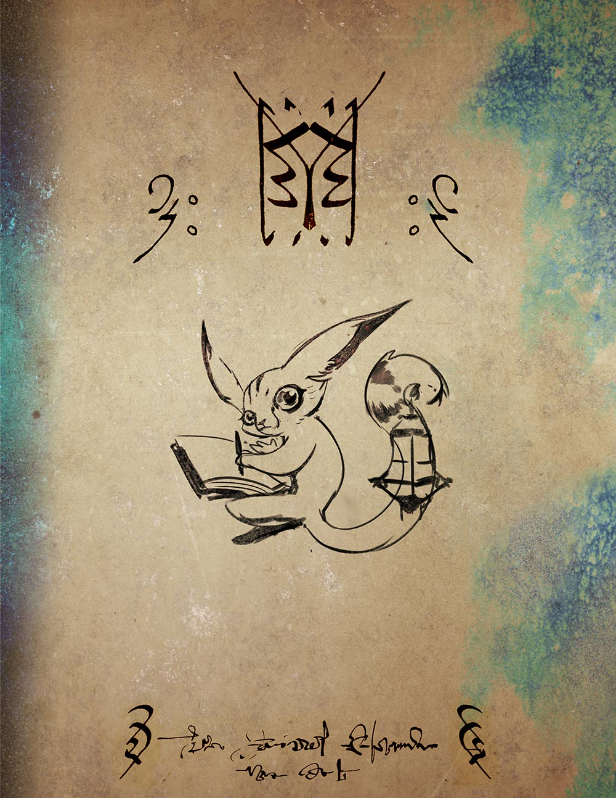
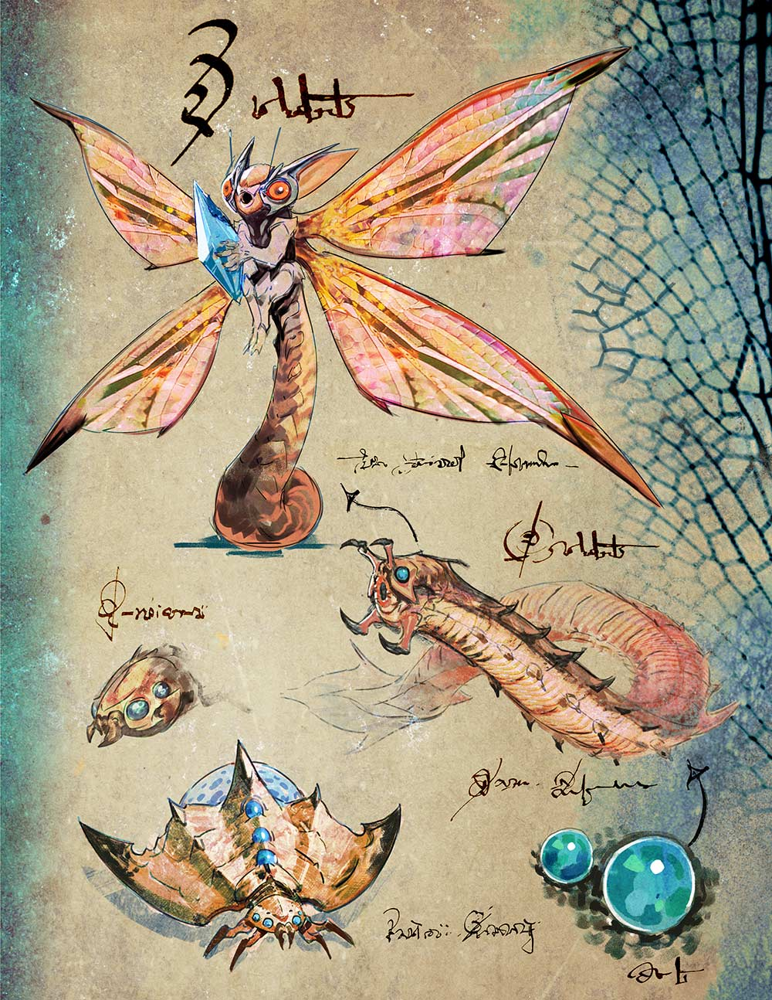
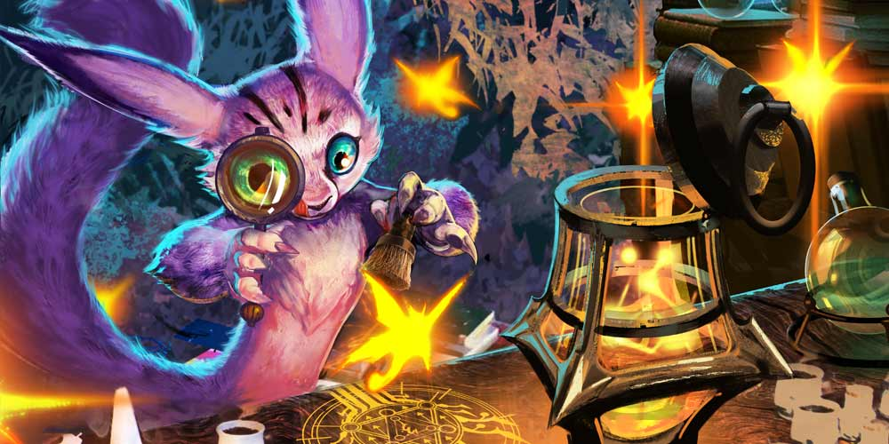
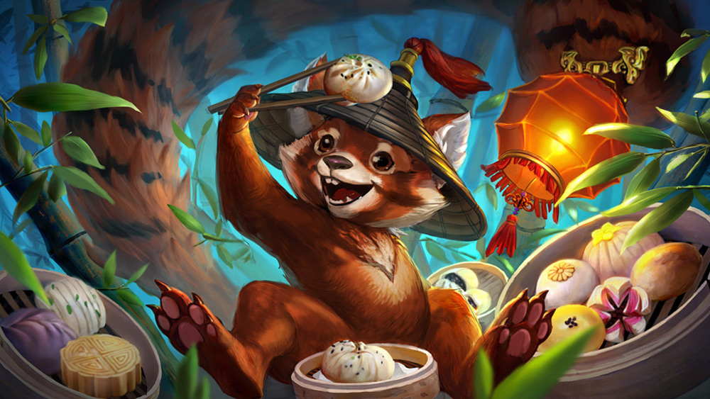
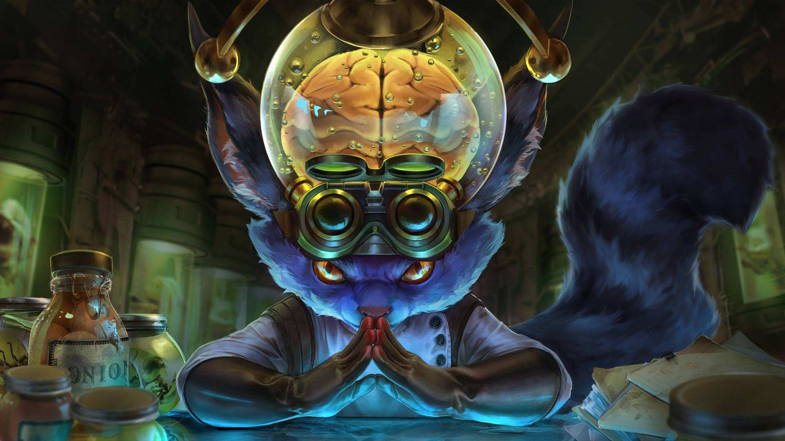

# Flicker Lore

## ‘BEHIND ENEMY LINES: FLICKER’S DISCOVERIES’

To His Highness King Gnottingham Catchfly III, Lord of Starlight, He of the Two Moons, Ruler of the Night Blossoms,

The Meekos territory expedition was an enormous success. Eighteen specimens of wild stinging and non-stinging fairy were collected and documented for the first time in their egg, larva, chrysalis and adult-life stages. I also gathered four interesting species of spiked scuttlers that I anticipate will interbreed well with our indigenous species in the laboratory \(ref. attached sketches\).

I hypothesized previous to this expedition that further research would result in stronger fighting fairies with venomous stings, but deep in the Meekos jungle I made a fascinating discovery: a radioactive crystal substance that causes unique metamorphoses in the local flora and fauna. Since the last expedition three years ago, the plant life has grown at an astounding rate, far faster than possible according to the laws of evolution, and more dangerous. The Meekos have used this powerful crystal to their militaristic advantage, growing an arsenal of poisonous spikes, sticky tanglers and exploding bulbs. It took one hundred generations to breed our giant beetle cavalry, but the uneducated Meekos have managed in a few short years to create plants sentient enough to serve as ludicrous bouncing vehicles. The fairies have taken to it as well, using crystal splinters and gems as decoration; their ongoing exposure to this substance and its radiation has affected the fairies in coloration, bioluminescence and increasing size. Further study and dissection may yet reveal many more variations.

The possibilities of this mysterious crystal are immeasurable. I’m afraid I quite overburdened my expedition with samples of it. With your highness’ permission 

\(

and generous funding

\)

, I shall proceed forthwith to my laboratory for intense experimentation for the practical application of this crystal. I believe another expedition shall soon be in order for the purposes of biomonitoring and mapping the limits of the expanding Meekos territory.

We lost several soldiers in minor scuffles with the Meekos savages, but we can all agree that is a small price to pay for science, yes?

My thanks for your continued patronage, my king.

Signed, your loyal subject,

Flitwick “Flicker” Stingsplatter IV, Doctor of Entomology

## ‘INTERSPECIES POLITICS’

“Shoo Ethel, _shoo_, you damnable ingrate,” lectured Flicker, swiping at one of his fuzzy ears.

Out of the ear flew a fairy. “I like it in there,” she whined. “It’s warm. Plus I’m _not_ an ingrate. I have a spine. That’s some science _you_ taught me.”

“_Ingrate_, I said, not invertebrate,” explained Flicker as he held a second fairy down on an examination table. “Ingrate means ungrateful, which you are, and if you do not stop your incessant ear tickling I shall lock you up with the others, or pin you to the board.” Flicker nodded his snout toward the shelves of stoppered jars. In the fairy laboratory were jarred fairies of all kinds: Majestic Violet Bottlewhispers and Heart-faced Bandyhoos glared at one another through the curved glass while a Spotted Dandywing napped with her toes in her mouth. Furious at her captivity, a Crystal-eyed Wiggler bonked her pink head against the cork stopper, her belly blinking green and gold light. A larger terrarium housed an air sprite named Loo who spent her days finger-combing her long hair and gazing at her reflection. Many more were posed and pinned to boards on the walls, sorted taxonomically, named and labeled with care by Flicker himself. There was another laboratory dedicated to termite mounds and a soundproof chamber where the noisiest crickets were stored; running along all the ceilings was a flat glass-walled ant farm; a sandy lab was full of burrowing scorpions; and smoke could be piped into the beehive yard to put them to sleep during comb examinations.

All available wall space was covered with Flicker’s drawings, notes and blueprints.

Ethel, a Bulbous-bottomed Gigglefly, stuck her tongue out at the captive fairies and floated to the beetles and scuttles, her fangs dug deep into a mealworm, her oversized golden wings battering the air with a buzz. Her bum squished down onto the hard back of a small beetle; it spun in circles with annoyance. Dozens more, displaying a rainbow of colors and sizes all the way up to the Bleekos’ mount size, scuttled around wire cages. Ethel petted her ride’s spikes and horns until its course straightened. “The new beetle eggs are way bigger than the old ones,” she said.

“An astute observation,” said Flicker. He bent over the Striped Whistler fairy, spread one of its wings out wide with a tweezer and swept a tiny brush across it. “I must breed mounts big enough for the new weaponry I’ve devised. With this crystalline material I discovered in the Meekos territory, years of breeding can be accomplished in a matter of days. _Days_, Ethel!”

Ethel rode her little beetle up a wall and along a blueprint, peering at it while crunching down on her worm. “What’s this gumball machine for?”

“That is not a gumball machine. It is a fairy launcher.” Fairy dust swirled away from Flicker’s brush, then burst into flame with a _puhhh_ sound, singeing the scientist’s cheek fur. He cursed and the fairy sneered at him. “You… you… Lucy, _darling_, you _must_stay still while I collect the dust and stop igniting it, or the Bleekos army shall not have the weaponry it needs for the border wars.”

“Why would you launch _fairies_?” cried Ethel.

“Fairies are quite useful weapons,” muttered Flicker. “The stinging, the choking dust and the hypnotic effect of the light patterns have destroyed many a malevolent Meekos.”

Ethel dismounted and flew back into Flicker’s ear, having forgotten all about his earlier threat. “Why are the Bleekos at war with the Meekos anyway?”

Flicker continued, with great concentration, to sweep Lucy’s wing dust into a test tube. “The Meekos are an abhorrent race of nefarious plant life. Creepy daytime creatures who use photosynthesis to abuse civilized, educated nocturnal life. Get _out_ of my ear.”

Ethel ignored him, pulling the sides of his ear around her like a cozy blanket. “But who started it?” she yawned.

“I don’t… Nobody knows really… What would _you_ know of the intricacies of interspecies politics? We are at war because we have always been at war, as the moon wars with the sun.”

But Ethel did not answer, and her snoring resounded around Flicker’s brain.

“Another expedition is what I need,” whispered Flicker, so as not to wake her. “I must have more crystal. Then the moonlight shall prevail.”

## ALTERNATE FATES

### 'RED LANTERN' FLICKER

#### **FLICKER’S BEST RED LANTERN FESTIVAL DUMPLING RECIPES**

 Be sure to raid the Meekos gardens for the freshest ingredients!

 **Boiled Hornworm Dumplings**

Steam your cabbage and mix with fresh ginger, garlic, sesame oil, salt and ground hornworms plucked straight from the tomato plants. Cut your dough into rounds – do not make your dough too thick! One must take care to create the perfect ratio of bug meat to carbohydrate.

Place a tablespoon of chilled filling into the center of your dough rounds and fold over one side to form a half-circle, pressing to adhere. Pleat a nice decoration along the edge, then boil your dumplings until the hornworms are cooked through, about three minutes or to taste.

Dip in a sauce of fermented rice juice, soy sauce, vinegar and fresh scallions ripped from the head of a Meekos.

#### **Jumil Dumpling with Chile-Sesame Sauce**

Heat oil in a skillet until shimmering. Add mushrooms, scallions, bok choy and carrot and stir-fry until tender. Add chile-garlic sauce and cook until the liquid evaporates, then chill. Fold wonton wrappers into triangles and keep them open and ready. Spoon the prepared filling and a few whole, live jumiles into the wrappers and quickly, before they can crawl out, seal the edges and press out any air trapped inside. Bake dumplings seam-sides up. The stink bugs have a pleasing bitter-cinnamon flavor that complements the chile sauce. If they survive the baking, they will wiggle in your mouth in the most pleasing fashion!

Serve with a sauce of black bean sauce, chiles, toasted sesame oil, and fresh ginger.

#### **Scorpion Dumpling Pancakes**

In a large bowl, mix together scorpions, scallions, finely chopped spicy fermented cabbage, two garlic cloves and three well beaten quail eggs. Brush gyoza wrappers with water and drop filling in the centers. Fold the wrappers to form half-moons and press the edges together. Fry in a skillet until golden on the bottom, then drizzle with a slurry of cornstarch and water. Cook until the slurry forms a thin crust.

Serve with a dipping mixture of soy sauce, vinegar, crushed red pepper, sesame seeds and sugar.

### 'DR. FRANKEN' FLICKER

#### '**EVIL LAUGHTER ENSUES'**

Here is the trouble with brains: they are encased in thick skulls where they cannot be properly stimulated except by brute and inaccurate force. In a feat of great brilliance, after several mostly-successful fairy brain removals, I have _detached my own brain_ from my body. Here it is! Look at it! Isn’t it beautiful?

With this ingenious battery pack that I developed, I poke electric current into my brain when I wish to enjoy a new clever idea. Behold!

_ZAP!_

Ah-ha! A self-propelled machine with two juxtaposed blade cutters, each associated with an electric motor…

_ZAP!_

…and an electronic system for controlling the forward movement of said machine…

_ZAP!_

…hehehe ho ho oh my dear no. I must have stimulated the ticklish bit that time. Hehehehe… let’s make it stop now…

_ZAP!_

…with a memorized algorithm for seeking botanical surfaces to be utterly – hahaha! – _mowed down._ I shall call it the_ Lawn Mower_. The Meekos won’t know what hit them! My genius astounds even me.

