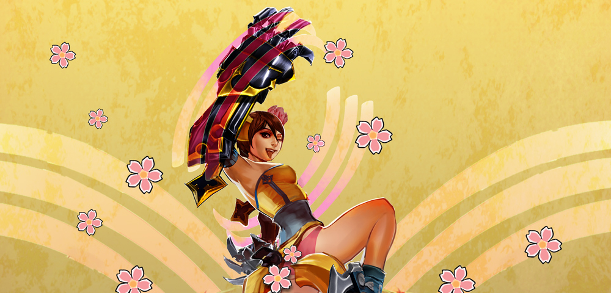
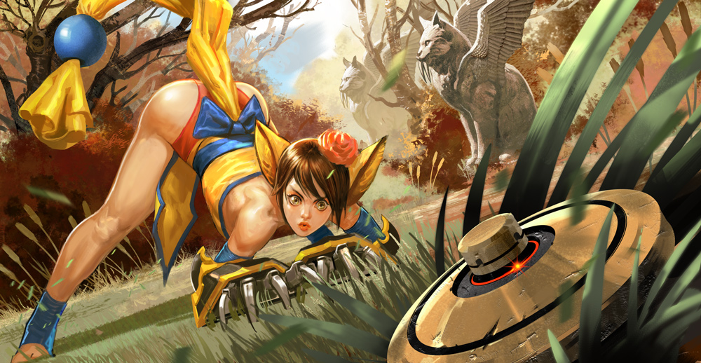
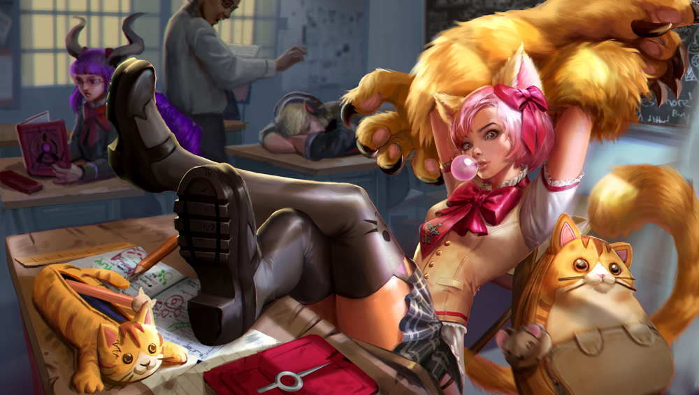
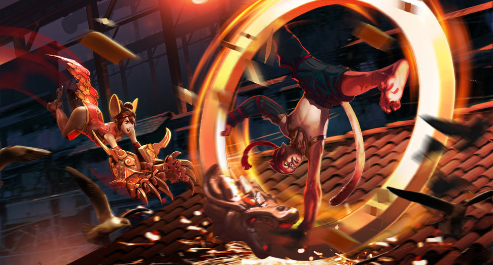

# Koshka Lore

## 'RAISING KOSHKA'

 Pathetic creatures, the humans. Ambition and cunning they have, but few survival instincts in the wild. The last time they made camp in Grangor territory, blasting holes in the hills in search of crystal, my family laid waste to all but the children. We kept the young in an effort to understand their kind, raised them like our own. I chose to mother one of the females, and I called her Koshka.

 As she was, she would never have survived in the wild – not even with my protection. She did not camouflage into the underbrush. Her nails and teeth were worth next to nothing. Our world was dangerously unsuited to her, but I formed a bond with the little scrap of a thing.

 She learned quickly, for a naturally incapable kind of creature. In the thick weeds she crouched, silent and invisible. She climbed the highest rattan and pounced down without fear. Once our metalworkers fashioned claws for her, she was a useful hunter. She thought ahead of her prey, cornering animals in the trees. She could trap a spider in a single eight-meter pounce.

 Her curiosity caused her to leave me. Perhaps she seeks her own kind. I see her seldom now, though stories of her travel into the mountains. They make me laugh: psychotic jungle cat fighting for one side and then the other at random. Truly, she has no foes: In her world, everything is play. Beware, stranger: She is ruthless with her toys.

## 'KOSHKA FINDS A SCOUT TRAP'

This is mine! I found it. I don’t know what it is, but finders keepers. It is very round. Round is a clue.

 You, in the flower! Your pets are cute! Do they like candy? This candy is for the minions but maybe your pets would like it. Hey! Do you know what this thing is? I found it over… hey, come back! Are we playing chase? Ha, caught you! I’m much faster than everyone, all the everyones. While I have you here on the ground, what do you think this thing is? Ow! Oof! Hey! That burns! Stoppit! Okay, okay, fine, I’ll ask someone else.

 Hello! I like your glowy sword. I have claws, see? You look grumpy. Let’s do our positive affirmations. I love and approve of myself. I replace my anger with understanding and compassion. Oh! I had a question. What is this thing I found? It is round and heavy and… ooh, it has a button! Should I push the… hey, where’d you go? Don’t go away, no, not you too!

 Hey! I like your wings! Did someone make those for you? I want to try them on! Why won’t they come off? Hey, hey, stop that! What’s with everyone and the burning things today? I just want to know what my new toy does. Wait… whoa, those wings make you all floaty. Are you running… I mean, floating away too?

 Fine then! I will just push this butto…

#### KABLAMMO!

 …oh. That’s what that thing does.

## ALTERNATE FATES

### 'KANDI TWIRL' KOSHKA

Soooo! There’s me at this super-awesome-yay party, everyone was groovy shaking and smile happy, totally the best. And then I saw these two humans hanging out way up there! One was making like, all the oontz oontz sounds, and I could feel all his wub-wubs shaking in my bones, and the other was making shooting stars join the party! And they’re up on top of this big ol metal wheel thing that’s taller than me, like taller than like, ten me’s standing on top of me … woo there’s Justine! Hallo Justine!

Anyways, I had with me three of my pack, Cue and Stephy and KelKel, and I had found some sugar tasties and KelKel had made me these five sparkle bits to wear, and I had on my painted back scratchers with all the right groove shaky colors, and we’re just groovy shaking and I gotta give hugs to everyone because they need them you know, but then this awesome berserk dance started on the floor that makes everyone yell really loud.

Look that’s Gem! Gem! Haallooo Gem, over here! Over h… she can’t hear me. Ow ow, these thud boxes are super loud. What was I… oh! Soooo these human ladies came out wearing these swank white costumes, and they had pointy steel thingabobs, and then these other humans with banners came out wearing shiny metal stuff shouting
 “CE-LESTE! CE-LESTE!” and they did this, like, crazy dance kind of groove shake! Then the human boy on the metal wheel made the air super angry with a sound that made my belly go woomp! And everyone had to stop and cover their ears and go whoaaa. But he made the sound to big, too scary big, cuz the ground thumped really hard and the metal wheel. fell. down. No, I mean the whole thing crashed, and it seemed like it took forever, and the boy and the star girl free fell all the way, and we had stood up and uncovered our ears by then and I was like, no way, they’re going all out for this — this party is better than super-yay, it’s all the way to super-awesome-yay.

And at the last minute, this metal machine man… no seriously, let me tell the story! …this machine man stomps clomp-clomp through the dancers and catches the two falling humans in these buzzing shield thingies. Best. Party. Ever. Wanna dance? …I said, WANNA DANCE?

### 'SCHOOL DAYS' KOSHKA

#### 'THE CAT LOVERS’ CLUB!

Aww c’mon, Lyra, lemme be vice president. I’m a great assistant, and I’m super good at telling people what to do for when you’re not around. Watch: YOU! Share your gum! YOU! No sleeping in class! YOU! Read books!

 …no? Okay, so I’m not bossy enough. I can be in the band. I can play EVERY instrument. I can’t make actual songs yet, but I can make them sound louder than anyone!

 …no? Aww. I wanna join the Kendo Club but it’s hard to hold the swords with my fuzzy paws. Whaddya mean, “Take them off?” They’re my _paws_. Would you take off your _hands_? Silly.

 FINE. I’ll make my OWN club. It’ll be the Cat Lovers’ Club, and EVERYONE will be allowed to join, and everyone will WANNA join because everyone loves cats. We’ll pet kitties and give them nicknames and train them to do tricks. We’ll begin and end every meeting with group hugs. So there! Wanna come?

### 'RED LANTERN' KOSHKA

#### 'THE RED LANTERN FESTIVAL'

“Wait up, Ozo!”

 Mad blue sparks flashed from Ozo’s ring as it bumped down the cobbles of the Undersprawl’s main avenue, Ozo in its center, Koshka dashing doubletime after him in her prettiest red party dress. Red lanterns cast a charming glow on the dingy neighborhood, and paper cutouts decorated the windows of even the roughest taverns. Ozo spun to a flourished stop by the minion pens at the city gate. “I win!” he cried. The minions clapped.

 Koshka caught up and gave Ozo’s nose a pinch. “It isn’t impressive if you ride in the ring!”

 Ozo hooted laughing, crouching among the fragrant kumquat trees that grew by the fence, his tail flicking. “Don’t be jealous that I’m faster. And can jump farther.”

 “You cannot,” said Koshka as she hopped the fence to the minion pen. “No one jumps farther than me. Come now, sweeties, it’s festival time!” she crooned at the minions.

 “Can too. I can jump this whole city in one leap. And I’m stronger than all these minions put together. My ring weighs more than two elly-fants. Just try.” He held his ring out over the fence.

 “What’s an elly-fant?” Koshka ignored the ring; the minions grunted and shoved their noses into her palms as she handed each a red envelope. “Don’t be rude,” she ordered, bopping one greedy beast on the noggin. “Open it over there.” The beasts crowded in a corner away from her, tearing open their envelopes. Two shiny gold coins dropped out of each. The minions tried to eat them.

 “I can transform into anything,” bragged Ozo. “Guess what I am!” He paced back and forth along the fence on all fours, meowing.

 Koshka giggled. “That’s nothing. I can pretend to be a girl.” She stood up on her two feet and pranced around the pen, her chin jutted up, and murmured in a breathy voice, “Look at me, I’m a princess. I like peanut butter.”

 “I can summon the wind!” cried Ozo, then puffed out a big breath at her.

 Koshka stumbled as if blown backward. “Whoa. Just for that, I’ll summon the rain.” She stuck out her tongue and blew a big zzzzrrrrbbbt at her monkey friend.

 Ozo jumped away right in time, throwing down his ring and standing in the middle. “Well I can cast a protective barrier. Nothing can get me in here!”

 Koshka wiggled her bum and shot forward on all fours right at him, leaping over the ring. “I’m way too strong for your dumb barriers!”

 “You’re powerful,” said Ozo, “But I bet I can fit more kumquats in my mouth than you can.”

 The pair dashed for the kumquat trees and jammed the fruit into their mouths, counting until the numbers were just muffled syllables. Koshka had to concede the victory to Ozo when her lumpy cheeks filled to bursting.

 “Okay, okay,” said Koshka, chewing up the last of her mouthful. “But I can do a magic thing.”

 “Nuh uh. You don’t know magic.”

 “I know a thing,” she said. “Watch.” She scooted up close to Ozo and looked at his face. Her fingers slipped behind one of his ears. “Look what I found!” she announced, and held up a melon candy.

 “Whoa,” whispered Ozo in awe, taking the candy. “You do know magic.”

 “Happy Red Lantern Festival,” she said, hugging his neck, and the two sat and ate candied fruit together, watching the lanterns glow red on the cobbles as the sun set.

