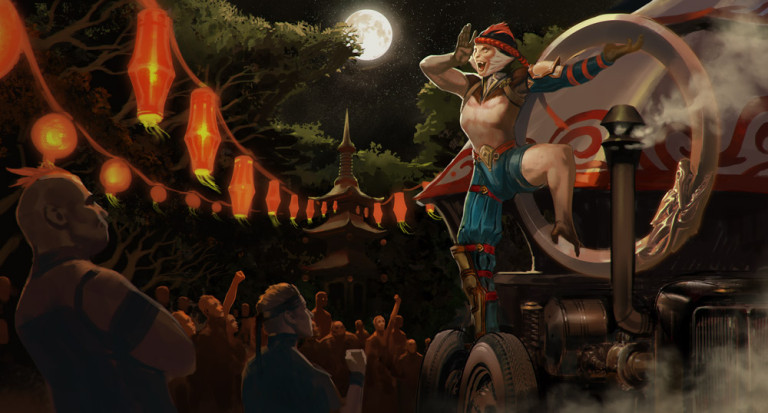
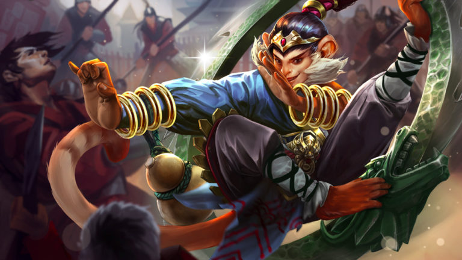

# Ozo Lore

## 'SHOWOFFIN'

Knuckles throws the townie kid outta the Mister’s wagon and us Carnie Kids, who know better than to bother the Mister, sit off aways chortlin.

“Stupid kid thinks he’s gonna join the carnival?”

“Maybe he’s a juggalah or a rope walkah?”

“He can’t do nothin.”

The townie’s just a scruff of a thing, skinny and short, ‘bout eight years old. He snorks his snot-nose and glares at us. “I can do stuff,” says him, and opens up his hand. Knuckles’ watch gleams on his palm.

Us kids consider deep the consequences of having Knuckles’ watch in our possessions.

“Aight,” says we, “you can do a showoff.”

We take the orphan over to the outskirts, the small tops and wagons with the geek displays. Us not in town selling townies firecrackers and lifting wallets are wrangling glo-glo-girls into the red lanterns that’ll be strung up for tomorrow’s Red Lantern Festival. Townies line up early at the gates cuz the carnies throw the best bash, plus out of town you can’t get nabbed law-wise for possessing explosives.

“Most important thing you gotta do to be a Carnie Kid,” we tell the orphan, “is showoffin.”

“Rules for showoffin are, don’t be boring, and all stories are true.” We nod along with the sacred words.

With a hella whoosh the ring rolls in, our boss danglin in the center by his tail, eye level with the little townie, us kids hollerin his arrival: Oz-O! Oz-O! Oz-O!

“One time I got hungry!” yells Ozo in the townie’s face. “So hungry, the sun looked like a delicious peach. So I bounced so high that I grabbed it right out of the sky. But everything went dark, so I threw it all the way back up!” He kicks off and hunches down by the townie kid while his ring settles. “Your turn.”

The townie kid sucks on his lip. “I … uh … well … I stole a … a …”

“Boooooring,” calls one of us, then more, then the whole choir. We don’t have time for stutterererers. “Boooooring!”

“My parents were giants,” says Ozo. We all hush and lean in, ’cause not no one showoffs like Ozo. “Bigger than the big top. I was the giantest monkey baby in the world. But one morning, Dad ripped a fart that blew away a whole village.” He pauses while we giggle. “Unlucky for us, a wizard-woman in that village was so mad, she cast a spell that shrank me all the way down to this. Momma couldn’t take care of me no more without crushing me, so she gave me to the carnival.” Ozo’s fuzzy head shakes so sad that we are all sad too. “But she left me her wedding ring,” whispers Ozo, and holds up his ring.

“Daaaang,” says we, clappin.

“My dad ran off,” blurts the townie orphan, “and Mom cleans houses.”

“Oh yeah?” says Ozo, spinnin the ring under his palm at his long, long arm’s length. “Well my dad was the pet of a raja. The raja wanted a son sooo bad that the rana got pregnant with my dad, hoping the raja wouldn’t notice.”

We all bust up, but the townie kid’s got a sourpuss. “You said your parents were giants,” he sputters.

“Did I?” Ozo shrugs and looks up to the sky, starts hula hoopin so we’ll watch all mesmerized. “True story is, I never had no parents. I was born from a magic banana. Ate my way out and fell off the tree, all alone.”

“None of that’s true,” cries the newbie.

The townie gets shoved for that. “All stories are true, buttnugget!” we yell, and we’re about to riot, but Ozo throws his ring out, knockin the townie down flat on his snot face. Ozo hunkers down over the kid with his head cocked sideways and says something real quiet. The closest of us lean in.

“Wish I had a momma to sit home worried about me,” he says. “Go home.”

“Yeah, go home to your mommy!” we say, draggin the townie off to the gates.

Ozo stays back to watch the decorations go up from inside his ring, hanging on with fingers and toes, rollin so the lanterns spin round and round, becoming glowy red circles.

## 'THE RED LANTERN FESTIVAL'

Mad blue sparks flashed from Ozo’s ring as it bumped down the cobbles of the Undersprawl’s main avenue, Ozo in its center, Koshka dashing doubletime after him in her prettiest red party dress. Red lanterns cast a charming glow on the dingy neighborhood, and paper cutouts decorated the windows of even the roughest taverns. Ozo spun to a flourished stop by the minion pens at the city gate. “I win!” he cried. The minions clapped.

Koshka caught up and gave Ozo’s nose a pinch. “It isn’t impressive if you ride in the ring!”

Ozo hooted laughing, crouching among the fragrant kumquat trees that grew by the fence, his tail flicking. “Don’t be jealous that I’m faster. And can jump farther.”

“You cannot,” said Koshka as she hopped the fence to the minion pen. “No one jumps farther than me. Come now, sweeties, it’s festival time!” she crooned at the minions.

“Can too. I can jump this whole city in one leap. And I’m stronger than all these minions put together. My ring weighs more than two elly-fants. Just try.” He held his ring out over the fence.

“What’s an elly-fant?” Koshka ignored the ring; the minions grunted and shoved their noses into her palms as she handed each a red envelope. “Don’t be rude,” she ordered, bopping one greedy beast on the noggin. “Open it over there.” The beasts crowded in a corner away from her, tearing open their envelopes. Two shiny gold coins dropped out of each. The minions tried to eat them.

“I can transform into anything,” bragged Ozo. “Guess what I am!” He paced back and forth along the fence on all fours, meowing.

Koshka giggled. “That’s nothing. I can pretend to be a girl.” She stood up on her two feet and pranced around the pen, her chin jutted up, and murmured in a breathy voice, “Look at me, I’m a princess. I like peanut butter.”

“I can summon the wind!” cried Ozo, then puffed out a big breath at her.

Koshka stumbled as if blown backward. “Whoa. Just for that, I’ll summon the rain.” She stuck out her tongue and blew a big zzzzrrrrbbbt at her monkey friend.

Ozo jumped away right in time, throwing down his ring and standing in the middle. “Well I can cast a protective barrier. Nothing can get me in here!”

Koshka wiggled her bum and shot forward on all fours right at him, leaping over the ring. “I’m way too strong for your dumb barriers!”

“You’re powerful,” said Ozo, “But I bet I can fit more kumquats in my mouth than you can.”

The pair dashed for the kumquat trees and jammed the fruit into their mouths, counting until the numbers were just muffled syllables. Koshka had to concede the victory to Ozo when her lumpy cheeks filled to bursting.

“Okay, okay,” said Koshka, chewing up the last of her mouthful. “But I can do a magic thing.”

“Nuh uh. You don’t know magic.”

“I know a thing,” she said. “Watch.” She scooted up close to Ozo and looked at his face. Her fingers slipped behind one of his ears. “Look what I found!” she announced, and held up a melon candy.

“Whoa,” whispered Ozo in awe, taking the candy. “You do know magic.”

“Happy Red Lantern Festival,” she said, hugging his neck, and the two sat and ate candied fruit together, watching the lanterns glow red on the cobbles as the sun set.

## ALTERNATE FATES

### 'WUXIA' OZO

#### 'THE RING, THE GUN & THE GOURD'

High in the trees, Ozo sailed from branch to branch, his dragon-faced metal ring looped over one shoulder. From that height, the carnival was silent and far away.

In a quiet grove below, Ringo laid on his back, snoring. Ozo dropped, bouncing weightless from tree trunk to tree trunk until he landed without sound on the leafy jungle floor.

“So you ran from the carnival and lost your honor.” Ozo swung his ring and whapped Ringo’s cheek with its flat edge.

Ringo opened one eye as an angry red mark appeared on his face. “I didn’t lose anything I needed.” He pulled his gun.

Ozo’s eyes widened. “What happened to your other arm?”

Ringo pulled the hammer of his pistol back. “Lost the wrong bet, but I can still dance. You ready to die?”

“No. It would dishonor me to fight a one-armed man.” Ozo backed away.

“Easy win for me.” The shooter stood and stretched, his drinking gourd sloshing out a spiky-smelling brew as he found his feet. He shook his head hard to loosen up the cobwebs before taking aim, one eye shut. The jungle erupted into screeching birds as the shot rang out, but Ozo leaped just in time to another tree, striking Ringo’s other cheek on his way.

“So the great Ringo, Coin Toss Champion, Star of the Big Top, is a disgrace!” Ozo cried, leaping from the tree to land a hard double-foot kick to Ringo’s belly.

“Oof,” gurgled Ringo, wavering on his feet.

Ozo bounced out of reach. “You used to be my hero.”

Ringo sighed and took aim again. “Nobody comes to the carnival to watch a one-armed shooter.”

Ozo flipped away as the bullet whizzed past his shoulder. He jumped to catch a branch and swung away as Ringo shot again. “You left the carnival because you’re ashamed.” The monkey boy bounded off of tree trunks, flying like a terrifying acrobat. “You were the best, and now you can’t even defeat a _kid_.”

Ringo’s bullets ping-ping-pinged off the ring as Ozo leaped, flipped and rolled on the ground, kicking up leaves, the razor-edged blades of the dragon ring turning end-over-end toward the former carnival star. The shooter caught the full force of Ozo’s tumbling bangarang ring charge. He flew back and landed hard, his gourd and pistol tumbling out of reach.

“You could be the greatest one-armed shooter in the world. Come back and prove yourself!” Ozo circled around in his ring, scooped up the sloshing gourd, and rolled away into the jungle.

“Hey… Hey! Get back here with my brew!” Ringo grasped for his gun and gave chase.

