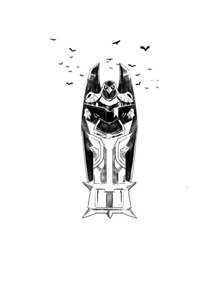

# Go right

You step off to the right into ominous fog, between two tall statues of ravens holding books, and come upon a golden turret. “What a beauty,” you murmur. Dwarf weaponry, this is, with no expense spared – but when the barrel clanks and swings to stare you in the eye, you escape into the brush.

Creeping through the tall grass, dizzy with the smell of flowers, you come upon a statue built atop a glowing golden crystal. Checking first to make sure no one is watching, you bend in close and touch the tip of your tongue to the crystal. It gives you a light zap.

Yup, that crystal is charged up, and that means there’s _well power_ here somewhere. No wonder the engineers were so keen to work for the Storm Queen.

In the Underground Market, charged-up crystal shards go for for three hundred gold each. No one’s going to notice if you take just a splinter. Then again, charged crystal is nothing to mess with…

